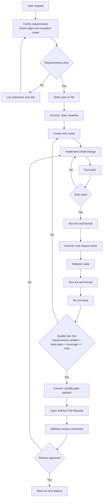

# Coding Agent Guide

## Project Overview

The goal of this project is to implement a general-purpose code review agent and reduce the review workload on reviewers.
In particular, since the volume of low-quality code generated by coding agents does not increase proportionally with the number of reviewers, it is anticipated that there will be an increasing number of business cases requiring more engineers capable of serving as reviewers.
The ultimate goal of this project is to enable anyone to perform code reviews by using AI to lower the skill requirements for reviewers.

## Technology

Agent Framework: Strands Agents
Development Language: Python 3.12 with venv
Testing Library: PyTest
Deployment: Docker or Alternative tools(ex. Podman), K8s

## Frequently Used Commands

Use the following commands during local development.

### Initial Setup

```bash
uv venv
source .venv/bin/activate
uv sync
pre-commit install
```

### Run Application

```bash
source .venv/bin/activate
uv run code-review-agent
```

### Test

```bash
uv run pytest
```

### Lint and Format

```bash
uv run ruff check
uv run ruff check --fix
uv run ruff format
uv run ruff format --check
```

### Build

```bash
uv build
```

### Evaluation Pipeline

```bash
bash evaluation/tools/run_evaluation_pipeline.sh
python evaluation/tools/score_evaluation.py \
 --gold evaluation/data/gold_pr_set.jsonl \
 --seeded evaluation/data/seeded_set.jsonl \
 --pred evaluation/data/agent_predictions.jsonl
```

## Coding Rule

- Comply with PEP 8
- Specifying type hints
- Adhere to the principle of “one module, one responsibility” and follow general design principles
- Create documentation comments in Google style format.
- Keep line comments focused on why and what; do not add comments that are obvious from reading the source code.

## Quality / Feature Requirements

Use the following minimum acceptance criteria for each feature:

- User feature requirements are verified.
- All tests pass.
- Test coverage is 75% or higher.

Verification policy:

- As a principle, user feature requirements are considered verified only when the criteria defined in [evaluation/EVALUATION_PLAN.md](evaluation/EVALUATION_PLAN.md) are satisfied.
- When creating or updating tests, update evaluation definitions as needed (for example, dataset assumptions, metrics, release gates, or rubric alignment) to keep requirement verification measurable.

Agent navigation links for requirement verification:

- Requirement judgment criteria: [evaluation/EVALUATION_PLAN.md](evaluation/EVALUATION_PLAN.md)
- Evaluation execution procedure only: [evaluation/RUNBOOK.md](evaluation/RUNBOOK.md)
- If test scope changes requirement coverage, update [evaluation/EVALUATION_PLAN.md](evaluation/EVALUATION_PLAN.md) first, then execute [evaluation/RUNBOOK.md](evaluation/RUNBOOK.md).

## Development Process

- Commit timing:
  - After requirements are clear and the spec is written.
  - After completing one feature and running lint and format.
  - After quality requirements are met following refactoring and re-validation.
- Code review process:
  - Conduct code reviews as GitHub pull requests.
  - Address review comments on the pull request and update the branch before merge.
- Purpose:
  - Preserve rollback points before implementation starts or before major changes.
  - Enable quick recovery when issues occur.


