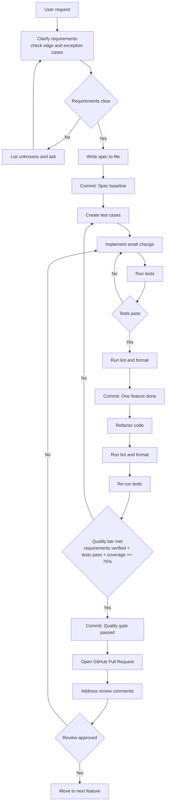

# Coding Agent Guide

## Project Overview

The goal of this project is to implement a general-purpose code review agent and reduce the review workload on reviewers.
In particular, since the volume of low-quality code generated by coding agents does not increase proportionally with the number of reviewers, it is anticipated that there will be an increasing number of business cases requiring more engineers capable of serving as reviewers.
The ultimate goal of this project is to enable anyone to perform code reviews by using AI to lower the skill requirements for reviewers.

Current implementation follows a 3-stage workflow in `src/code_review_agent/`:

- `agents/pr_info_collector.py` collects structured PR context via GitHub MCP.
- `agents/review_orchestrator.py` runs registered specialist reviewers in parallel.
- `agents/lead_engineer.py` evaluates reviewer findings and outputs final accept/reject decisions.

## Technology

Agent Framework: Strands Agents
Development Language: Python 3.12 with venv
Testing Library: PyTest
Deployment: Docker or Alternative tools(ex. Podman), K8s

Runtime integrations:

- GitHub MCP read-only endpoint (`https://api.githubcopilot.com/mcp/read-only`) via `src/code_review_agent/tools/github_mcp.py`
- OpenAI-compatible model invocation via `strands.models.openai.OpenAIModel`

## Frequently Used Commands

For shared development commands (initial setup, test, lint/format, build), refer to [CONTRIBUTING.md](CONTRIBUTING.md#3-local-development-commands).

### Initial Setup

```bash
uv venv
source .venv/bin/activate
uv sync
pre-commit install
```

Note: `betterleaks` is required for local pre-commit runs. See [README.md](README.md#0-requirements).

### Worktree Setup

After creating a new worktree, copy the local Claude Code hook settings into it.
The `.claude/settings.local.json` is gitignored (personal settings) and must be
copied manually to each worktree.

```bash
WORKTREE_ROOT=$(git rev-parse --show-toplevel)
PROJECT_ROOT=$(cd "$(dirname "$(git rev-parse --git-common-dir)")" && pwd)
mkdir -p "$WORKTREE_ROOT/.claude"
[ -f "$PROJECT_ROOT/.claude/settings.local.json" ] && \
  cp "$PROJECT_ROOT/.claude/settings.local.json" "$WORKTREE_ROOT/.claude/"
```

### Run Application

```bash
source .venv/bin/activate
uv run code-review-agent
```

Current CLI entrypoint is a placeholder that prints `Hello from code-review-agent!`.

### Evaluation Pipeline

```bash
bash evaluation/tools/run_evaluation_pipeline.sh
python evaluation/tools/score_evaluation.py \
 --gold evaluation/data/gold_pr_set.jsonl \
 --seeded evaluation/data/seeded_set.jsonl \
 --pred evaluation/data/agent_predictions.jsonl
```

Security-focused dataset build example:

```bash
bash evaluation/tools/run_evaluation_pipeline.sh \
  --profile security \
  --limit 30 \
  --min-risk medium
```

## Coding Rules

For shared implementation and design rules, refer to [CONTRIBUTING.md](CONTRIBUTING.md#4-implementation-and-design-rules).

Project-specific implementation patterns:

- Add new reviewers under `src/code_review_agent/agents/reviewers/` and register them with `@register_reviewer` (see `src/code_review_agent/agents/reviewers/react.py`).
- Keep reviewer selection logic in the registry extension point (`src/code_review_agent/agents/registry.py`) instead of hard-coding behavior in the orchestrator.
- When adding stack support, update `detect_project_types` in `src/code_review_agent/agents/registry.py` and corresponding tests in `tests/agents/test_registry.py`.

## Quality / Feature Requirements

For contributor-facing quality gates and the Spec-Driven + TDD workflow, refer to [CONTRIBUTING.md](CONTRIBUTING.md#2-development-flow-spec-driven--tdd).

Verification policy:

- As a principle, user feature requirements are considered verified only when the criteria defined in [evaluation/EVALUATION_PLAN.md](evaluation/EVALUATION_PLAN.md) are satisfied.
- When creating or updating tests, update evaluation definitions as needed (for example, dataset assumptions, metrics, release gates, or rubric alignment) to keep requirement verification measurable.

Agent navigation links for requirement verification:

- Requirement judgment criteria: [evaluation/EVALUATION_PLAN.md](evaluation/EVALUATION_PLAN.md)
- Evaluation execution procedure only: [evaluation/RUNBOOK.md](evaluation/RUNBOOK.md)
- If test scope changes requirement coverage, update [evaluation/EVALUATION_PLAN.md](evaluation/EVALUATION_PLAN.md) first, then execute [evaluation/RUNBOOK.md](evaluation/RUNBOOK.md).

## Development Process

- Before implementation, create an Issue for bug fixes/features and align scope there (see [CONTRIBUTING.md](CONTRIBUTING.md#1-principles)).
- Commit timing:
  - After requirements are clear and the spec is written.
  - After completing one feature and running lint and format.
  - After quality requirements are met following refactoring and re-validation.
- Code review process:
  - Conduct code reviews as GitHub pull requests.
  - Address review comments on the pull request and update the branch before merge.
- Purpose:
  - Preserve rollback points before implementation starts or before major changes.
  - Enable quick recovery when issues occur.

### Required Execution Checklist for Coding Agent

The Mermaid diagram below is a visual summary. For implementation tasks, the Coding Agent MUST execute the following checklist in order and MUST NOT skip gates.

1. Clarify requirements and edge cases.

   - If requirements are ambiguous, stop implementation and ask for clarification.

2. Write/update the spec before coding.

   - Save requirement decisions in repository documents (for example `plan/` or `docs/`).
   - If the task adds or changes a feature, create or update the corresponding document under `docs/`.

3. Create a rollback point.

   - Commit the spec baseline before implementation starts.

4. Execute TDD cycle.

   - Write tests first (Red).
   - Implement minimal changes to pass tests (Green).
   - Refactor while preserving behavior (Refactor).

5. Run mandatory validation commands.

    ```bash
    uv run pytest
    uv run ruff check
    uv run ruff format --check
    ```

6. Gate decision after validation.

   - If any command fails, return to Step 5 and fix.
   - If all commands pass, commit one completed feature unit.

7. Re-validate quality gate after refactoring.

   - Ensure requirements are still satisfied.
   - Ensure tests pass.
   - Ensure coverage is >= 75%.

8. Create/update Pull Request.

   - Fill PR description using `.github/pull_request_template.md`.
   - Include summary, change details, impact scope, related Issue, test results, documentation updates, and rollback plan.

9. Address review comments.

   - Apply fixes.
   - Re-run Step 6 commands.
   - Update branch until review is approved.


