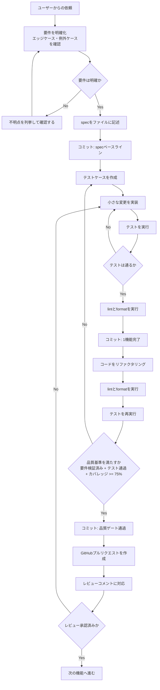

# コーディングエージェントガイド

## プロジェクト概要

このプロジェクトの目的は、汎用のコードレビューエージェントを実装し、レビュアーのレビュー負荷を軽減することである。
特に、コーディングエージェントが生成する低品質なコードの量はレビュアーの数に比例して増加するわけではないため、レビュアーとして機能できるエンジニアをより多く必要とするビジネスケースが今後増加すると予想される。
このプロジェクトの最終的なゴールは、AIを活用してレビュアーに求められるスキル要件を下げ、誰もがコードレビューを行えるようにすることである。

## 技術スタック

Agent Framework: Strands Agents
開発言語: Python 3.14（venv使用）
テストライブラリ: PyTest
デプロイ: Docker または代替ツール（例: Podman）

ランタイム連携:

- GitHub MCP read-onlyエンドポイント（`https://api.githubcopilot.com/mcp/read-only`）を `src/code_review_agent/tools/github_mcp.py` 経由で利用
- `strands.models.openai.OpenAIModel` によるOpenAI互換モデルの呼び出し

## よく使うコマンド

共通の開発コマンド（初期セットアップ、テスト、lint/format、ビルド）については [CONTRIBUTING.md](CONTRIBUTING.md#3-local-development-commands) を参照すること。

### セットアップ

セットアップ手順については [AGENTS.setup.md](AGENTS.setup.md) を参照すること。

### アプリケーションの実行

```bash
source .venv/bin/activate
uv run code-review-agent
```

現在のCLIエントリポイントはプレースホルダーであり、`Hello from code-review-agent!` を出力するのみである。

### 評価パイプライン

```bash
bash evaluation/tools/run_evaluation_pipeline.sh
python evaluation/tools/score_evaluation.py \
 --gold evaluation/data/gold_pr_set.jsonl \
 --seeded evaluation/data/seeded_set.jsonl \
 --pred evaluation/data/agent_predictions.jsonl
```

セキュリティに特化したデータセット構築の例:

```bash
bash evaluation/tools/run_evaluation_pipeline.sh \
  --profile security \
  --limit 30 \
  --min-severity medium
```

## コーディングルール

共通の実装・設計ルールについては [CONTRIBUTING.md](CONTRIBUTING.md#4-implementation-and-design-rules) を参照すること。

プロジェクト固有の実装パターン:

- 新しいレビュアーは `src/code_review_agent/agents/reviewers/` 配下に追加し、`@register_reviewer` で登録する（`src/code_review_agent/agents/reviewers/frontend.py` と `src/code_review_agent/agents/reviewers/angular.py` を参照）。
- レビュアー選択ロジックは、オーケストレーターにハードコーディングするのではなく、レジストリの拡張ポイント（`src/code_review_agent/agents/registry.py`）に保持すること。
- スタックのサポートを追加する場合は、`src/code_review_agent/agents/registry.py` の `detect_project_types` と、対応するテスト（`tests/agents/test_registry.py`）を更新すること。

## 品質・機能要件

コントリビューター向けの品質ゲートとSpec-Driven + TDDワークフローについては [CONTRIBUTING.md](CONTRIBUTING.md#2-development-flow-spec-driven--tdd) を参照すること。

検証ポリシー:

- 原則として、ユーザーの機能要件は [evaluation/EVALUATION_PLAN.md](evaluation/EVALUATION_PLAN.md) に定義された基準を満たした場合にのみ検証済みとみなす。
- テストを作成・更新する際は、要件検証を測定可能な状態に保つため、必要に応じて評価定義（データセットの前提、メトリクス、リリースゲート、rubricとの整合など）を更新すること。

要件検証のためのエージェント向けナビゲーションリンク:

- 要件判定基準: [evaluation/EVALUATION_PLAN.md](evaluation/EVALUATION_PLAN.md)
- 評価実行手順のみ: [evaluation/RUNBOOK.md](evaluation/RUNBOOK.md)
- テスト範囲の変更が要件カバレッジに影響する場合は、まず [evaluation/EVALUATION_PLAN.md](evaluation/EVALUATION_PLAN.md) を更新してから [evaluation/RUNBOOK.md](evaluation/RUNBOOK.md) を実行すること。

## 開発プロセス

- 実装前に、バグ修正・機能追加のIssueを作成し、そこでスコープを合意すること（[CONTRIBUTING.md](CONTRIBUTING.md#1-principles) を参照）。
- コミットのタイミング:
  - 要件が明確になり、specが書かれた後。
  - 1つの機能を完成させ、lintとformatを実行した後。
  - リファクタリング後に品質要件を満たし、再検証を行った後。
- コードレビューのプロセス:
  - コードレビューはGitHubのプルリクエストとして行う。
  - マージ前にプルリクエスト上のレビューコメントに対応し、ブランチを更新する。
- 目的:
  - 実装開始前・大きな変更前にロールバックポイントを保持する。
  - 問題発生時に素早く復旧できるようにする。

### コーディングエージェント向けの必須実行チェックリスト

以下のMermaid図は視覚的な要約である。実装タスクにおいて、コーディングエージェントは以下のチェックリストを順番通りに実行しなければならず、いずれのゲートも省略してはならない。

1. 要件とエッジケースを明確化する。

   - 要件が曖昧な場合は実装を止め、確認を求めること。

2. コーディング前にspecを作成・更新する。

   - 要件に関する決定事項をリポジトリ内のドキュメント（例: `plan/` や `docs/`）に保存する。
   - タスクが機能の追加・変更を伴う場合は、`docs/` 配下の対応するドキュメントを作成・更新する。

3. ロールバックポイントを作成する。

   - 実装開始前にspecのベースラインをコミットする。

4. TDDサイクルを実行する。

   - 先にテストを書く（Red）。
   - テストを通す最小限の変更を実装する（Green）。
   - 振る舞いを保ったままリファクタリングする（Refactor）。

5. 必須の検証コマンドを実行する。

    ```bash
    uv run pytest
    uv run ruff check
    uv run ruff format --check
    ```

6. 検証後のゲート判定を行う。

   - いずれかのコマンドが失敗した場合は、ステップ5に戻って修正する。
   - すべてのコマンドが通った場合は、完了した1機能単位をコミットする。

7. リファクタリング後に品質ゲートを再検証する。

   - 要件が引き続き満たされていることを確認する。
   - テストが通ることを確認する。
   - カバレッジが75%以上であることを確認する。

8. プルリクエストを作成・更新する。

   - `.github/pull_request_template.md` を使ってPR説明を記入する。
   - 概要、変更内容、影響範囲、関連Issue、テスト結果、ドキュメント更新、ロールバック計画を含めること。

9. レビューコメントに対応する。

   - 修正を適用する。
   - ステップ6のコマンドを再実行する。
   - レビューが承認されるまでブランチを更新する。


```mermaid
flowchart TD
    A["ユーザーからの依頼"] --> B["要件を明確化<br/>エッジケース・例外ケースを確認"]
    B --> C{"要件は明確か"}
    C -- No --> D["不明点を列挙して確認する"]
    D --> B
    C -- Yes --> K["specをファイルに記述"]
        K --> C1["コミット: specベースライン"]
        C1 --> E["テストケースを作成"]
    E --> F["小さな変更を実装"]
    F --> G["テストを実行"]
    G --> H{"テストは通るか"}
        H -- Yes --> L["lintとformatを実行"]
        L --> C2["コミット: 1機能完了"]
        C2 --> I["コードをリファクタリング"]
        H -- No --> F
        I --> M["lintとformatを実行"]
    M --> O["テストを再実行"]
    O --> P{"品質基準を満たすか<br/>要件検証済み + テスト通過 + カバレッジ >= 75%"}
    P -- No --> E
    P -- Yes --> C3["コミット: 品質ゲート通過"]
    C3 --> Q["GitHubプルリクエストを作成"]
    Q --> R["レビューコメントに対応"]
    R --> S{"レビュー承認済みか"}
    S -- No --> F
    S -- Yes --> J["次の機能へ進む"]
```

## graphify

This project has a knowledge graph at graphify-out/ with god nodes, community structure, and cross-file relationships.

When the user types `/graphify`, use the installed graphify skill or instructions before doing anything else.

Rules:
- For codebase questions, first run `graphify query "<question>"` when graphify-out/graph.json exists. Use `graphify path "<A>" "<B>"` for relationships and `graphify explain "<concept>"` for focused concepts. These return a scoped subgraph, usually much smaller than GRAPH_REPORT.md or raw grep output.
- Dirty graphify-out/ files are expected after hooks or incremental updates; dirty graph files are not a reason to skip graphify. Only skip graphify if the task is about stale or incorrect graph output, or the user explicitly says not to use it.
- If graphify-out/wiki/index.md exists, use it for broad navigation instead of raw source browsing.
- Read graphify-out/GRAPH_REPORT.md only for broad architecture review or when query/path/explain do not surface enough context.
- After modifying code, run `graphify update .` to keep the graph current (AST-only, no API cost).
