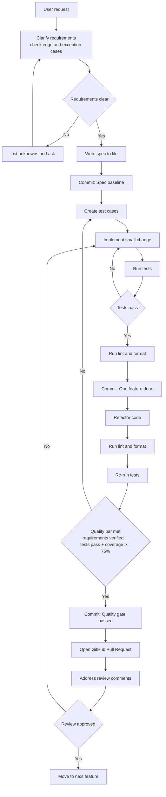

# Coding Agent Guide

## Project Overview

The goal of this project is to implement a general-purpose code review agent and reduce the review workload on reviewers.
In particular, since the volume of low-quality code generated by coding agents does not increase proportionally with the number of reviewers, it is anticipated that there will be an increasing number of business cases requiring more engineers capable of serving as reviewers.
The ultimate goal of this project is to enable anyone to perform code reviews by using AI to lower the skill requirements for reviewers.

Current implementation follows a 3-stage workflow in `packages/agent-core/src/agents/`
(Issue #255 completed the Python→TypeScript migration; the former `src/code_review_agent/`
tree has been removed):

- `pr-info-collector.ts` collects structured PR context via GitHub MCP.
- `review-orchestrator.ts` runs registered specialist reviewers in parallel.
- `lead-engineer.ts` evaluates reviewer findings and outputs final accept/reject decisions.

The A2A HTTP API that exposes these agents lives in `packages/a2a-server/`.

## Technology

Agent Framework: Strands Agents (`@strands-agents/sdk`)
Development Language: TypeScript (Node >=24) — see `packages/`
Testing Library: Vitest
Deployment: Docker or Alternative tools(ex. Podman)

Runtime integrations:

- GitHub MCP read-only endpoint (`https://api.githubcopilot.com/mcp/read-only`) via `packages/agent-core/src/tools/github-mcp.ts`
- OpenAI-compatible model invocation via the `openai` SDK / `ai-sdk-ollama`

## Frequently Used Commands

For shared development commands (initial setup, test, lint/format, build), refer to [CONTRIBUTING.md](CONTRIBUTING.md#3-local-development-commands).

### Setup

For setup instructions, see [AGENTS.setup.md](AGENTS.setup.md).

### Run Application

```bash
nix develop --command pnpm --filter a2a-server run dev
```

Runs the A2A HTTP server (`packages/a2a-server/src/index.ts`) that exposes the
review agents. Use `pnpm --filter a2a-server run build && pnpm --filter a2a-server run start`
for the compiled entrypoint.

### TypeScript Toolchain (Issue #250)

For **local development**, the repository-root Nix flake provides the TypeScript
toolchain (Node 26, pnpm, biome, plus `uv`/`python3.14`/`gh`/`gh-stack` for the
duration of the Python↔TS migration Epic, see
[#249](https://github.com/kuju63/code-review-agents/issues/249)). **Always prefix
local shell commands that need this toolchain with `nix develop --command`** (or
run them from inside an active `nix develop` shell) rather than assuming pnpm/
biome/gh/etc. are on the host PATH.

Nix is local-only: CI (`.github/workflows/ci.yaml`) sets up Node/pnpm via
`pnpm/setup@v2`, not Nix, and the container build's `node-builder`/`node-runtime`
stages use the `registry.access.redhat.com/hi/nodejs:26` hardened images directly.
See [docs/typescript-toolchain-spec.md](docs/typescript-toolchain-spec.md) §2.4 for
why CI/containers don't go through Nix.

```bash
nix develop --command pnpm install --frozen-lockfile
nix develop --command pnpm run lint
nix develop --command pnpm run typecheck
nix develop --command pnpm run test
```

### Evaluation Pipeline

```bash
bash evaluation/tools/run_evaluation_pipeline.sh
nix develop --command pnpm --filter @code-review-agent/evaluation run score-evaluation \
 --gold evaluation/data/gold_pr_set.jsonl \
 --seeded evaluation/data/seeded_set.jsonl \
 --pred evaluation/data/agent_predictions.jsonl
```

Security-focused dataset build example:

```bash
bash evaluation/tools/run_evaluation_pipeline.sh \
  --profile security \
  --limit 30 \
  --min-severity medium
```

## Coding Rules

For shared implementation and design rules, refer to [CONTRIBUTING.md](CONTRIBUTING.md#4-implementation-and-design-rules).

Project-specific implementation patterns:

- Add new reviewers under `packages/agent-core/src/agents/reviewers/` and register them with `registerReviewer()` (see `packages/agent-core/src/agents/reviewers/react.ts` and `packages/agent-core/src/agents/reviewers/angular.ts`).
- Keep reviewer selection logic in the registry extension point (`packages/agent-core/src/agents/registry.ts`) instead of hard-coding behavior in the orchestrator.
- When adding stack support, update `detectProjectTypes` in `packages/agent-core/src/agents/registry.ts` and corresponding tests in `packages/agent-core/src/agents/registry.test.ts`.

## Quality / Feature Requirements

For contributor-facing quality gates and the Spec-Driven + TDD workflow, refer to [CONTRIBUTING.md](CONTRIBUTING.md#2-development-flow-spec-driven--tdd).

Verification policy:

- As a principle, user feature requirements are considered verified only when the criteria defined in [evaluation/EVALUATION_PLAN.md](evaluation/EVALUATION_PLAN.md) are satisfied.
- When creating or updating tests, update evaluation definitions as needed (for example, dataset assumptions, metrics, release gates, or rubric alignment) to keep requirement verification measurable.

Agent navigation links for requirement verification:

- Requirement judgment criteria: [evaluation/EVALUATION_PLAN.md](evaluation/EVALUATION_PLAN.md)
- Evaluation execution procedure only: [evaluation/RUNBOOK.md](evaluation/RUNBOOK.md)
- If test scope changes requirement coverage, update [evaluation/EVALUATION_PLAN.md](evaluation/EVALUATION_PLAN.md) first, then execute [evaluation/RUNBOOK.md](evaluation/RUNBOOK.md).

## Development Process

- Before implementation, create an Issue for bug fixes/features and align scope there (see [CONTRIBUTING.md](CONTRIBUTING.md#1-principles)).
- Commit timing:
  - After requirements are clear and the spec is written.
  - After completing one feature and running lint and format.
  - After quality requirements are met following refactoring and re-validation.
- Code review process:
  - Conduct code reviews as GitHub pull requests.
  - Address review comments on the pull request and update the branch before merge.
- Purpose:
  - Preserve rollback points before implementation starts or before major changes.
  - Enable quick recovery when issues occur.

### Required Execution Checklist for Coding Agent

The Mermaid diagram below is a visual summary. For implementation tasks, the Coding Agent MUST execute the following checklist in order and MUST NOT skip gates.

1. Clarify requirements and edge cases.

   - If requirements are ambiguous, stop implementation and ask for clarification.

2. Write/update the spec before coding.

   - Save requirement decisions in repository documents (for example `plan/` or `docs/`).
   - If the task adds or changes a feature, create or update the corresponding document under `docs/`.

3. Create a rollback point.

   - Commit the spec baseline before implementation starts.

4. Execute TDD cycle.

   - Write tests first (Red).
     Red means the test body actually executes and an expected assertion fails.
     An `Error` raised during test collection or fixture setup/teardown does not
     count as completing Red; expect `Failure`, not `Error`.
   - Implement minimal changes to pass tests (Green).
   - Refactor while preserving behavior (Refactor).
    - Using `coderabbit review --include-untracked` command.
      Review comment need to judge between fix or not fix.
   - Need to run validation commands after refactoring.
   - Should commit per tasks.

5. Run mandatory validation commands.

    ```bash
    pnpm exec tsc --noEmit
    pnpm exec biome check --no-errors-on-unmatched
    pnpm run test
    ```

6. Gate decision after validation.

   - If any command fails, return to Step 5 and fix.
   - If all commands pass, commit one completed feature unit.

7. Re-validate quality gate after refactoring.

   - Ensure requirements are still satisfied.
   - Ensure tests pass.
   - Ensure coverage is >= 75%.

8. Create/update Pull Request.

   - Fill PR description using `.github/pull_request_template.md`.
   - Include summary, change details, impact scope, related Issue, test results, documentation updates, and rollback plan.

9. Address review comments.

   - Apply fixes.
   - Re-run Step 6 commands.
   - Update branch until review is approved.


```mermaid
flowchart TD
    A["User request"] --> B["Clarify requirements<br/>check edge and exception cases"]
    B --> C{"Requirements clear"}
    C -- No --> D["List unknowns and ask"]
    D --> B
    C -- Yes --> K["Write spec to file"]
        K --> C1["Commit: Spec baseline"]
        C1 --> E["Create test cases"]
    E --> F["Implement small change"]
    F --> G["Run tests"]
    G --> H{"Tests pass"}
        H -- Yes --> L["Run lint and format"]
        L --> C2["Commit: One feature done"]
        C2 --> I["Refactor code"]
        H -- No --> F
        I --> M["Run lint and format"]
    M --> O["Re-run tests"]
    O --> P{"Quality bar met<br/>requirements verified + tests pass + coverage >= 75%"}
    P -- No --> E
    P -- Yes --> C3["Commit: Quality gate passed"]
    C3 --> Q["Open GitHub Pull Request"]
    Q --> R["Address review comments"]
    R --> S{"Review approved"}
    S -- No --> F
    S -- Yes --> J["Move to next feature"]
```

## graphify

This project has a knowledge graph at graphify-out/ with god nodes, community structure, and cross-file relationships.

When the user types `/graphify`, use the installed graphify skill or instructions before doing anything else.

Rules:
- For codebase questions, first run `graphify query "<question>"` when graphify-out/graph.json exists. Use `graphify path "<A>" "<B>"` for relationships and `graphify explain "<concept>"` for focused concepts. These return a scoped subgraph, usually much smaller than GRAPH_REPORT.md or raw grep output.
- Dirty graphify-out/ files are expected after hooks or incremental updates; dirty graph files are not a reason to skip graphify. Only skip graphify if the task is about stale or incorrect graph output, or the user explicitly says not to use it.
- If graphify-out/wiki/index.md exists, use it for broad navigation instead of raw source browsing.
- Read graphify-out/GRAPH_REPORT.md only for broad architecture review or when query/path/explain do not surface enough context.
- After modifying code, run `graphify update .` to keep the graph current (AST-only, no API cost).
