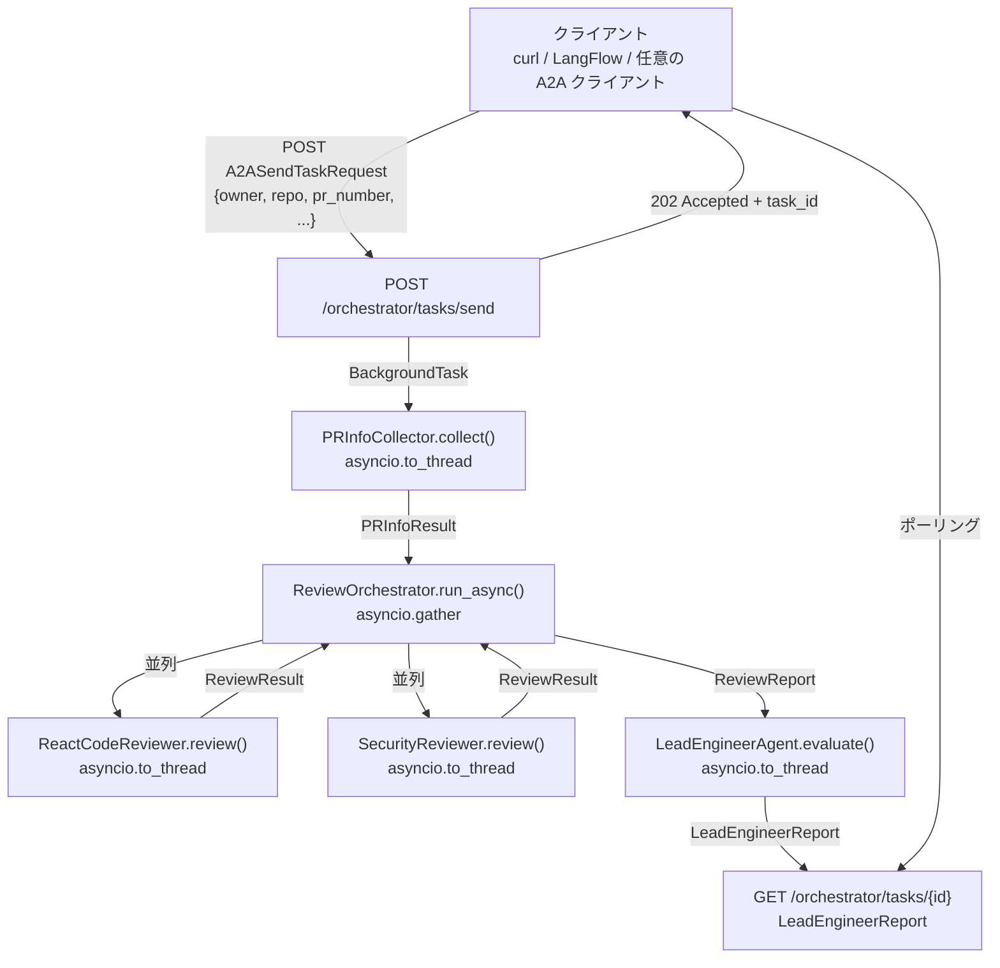

# A2A API 設計ドキュメント

LangFlow ワークフロー `Review-Agent.json` をベースに、各 Agent を A2A（Agent-to-Agent）プロトコルに準拠した HTTP API として公開するための設計を定義します。

---

## 1. 概要

### 1.1 目的

- 各 Agent（PR Info Collector / React Code Reviewer / Security Reviewer / Lead Engineer）を Google A2A プロトコル準拠の HTTP エンドポイントとして公開する
- LangFlow ワークフローのフロー（`PR Info Collector → 並列レビュー → Lead Engineer`）を API コールとして実現する
- OpenAI API 互換プロバイダー（Ollama / LM Studio / OpenRouter 等）を環境変数で切り替え可能にする

### 1.2 採用プロトコル

Google A2A（Agent-to-Agent）プロトコルを採用します。

各 Agent は以下の 3 エンドポイントを提供します:

| エンドポイント | メソッド | 説明 |
|---|---|---|
| `/{agent}/.well-known/agent.json` | GET | AgentCard — Agent の能力・スキーマ・URL を公開 |
| `/{agent}/tasks/send` | POST | タスク投入（202 Accepted + task_id を即時返却） |
| `/{agent}/tasks/{task_id}` | GET | タスク状態確認（ポーリング） |

**タスク状態遷移**: `submitted → working → completed / failed`

### 1.3 デプロイ構成

単一 FastAPI サービス（モノリス）として全 Agent を一つのプロセスで動作させます。AgentCard の URL は環境変数で差し替え可能なため、将来のマイクロサービス分割に対応できます。

```text
http://localhost:8000/
├── /pr-info-collector/...
├── /react-reviewer/...
├── /security-reviewer/...
├── /lead-engineer/...
└── /orchestrator/...        ← LangFlow フロー相当のフルワークフロー
```

---

## 2. A2A プロトコル実装仕様

### 2.1 Pydantic モデル（`src/code_review_agent/a2a/models.py`）

```python
from __future__ import annotations
from enum import StrEnum
from typing import Any, Literal
from pydantic import BaseModel


class A2ATaskStatus(StrEnum):
    SUBMITTED = "submitted"
    WORKING = "working"
    COMPLETED = "completed"
    FAILED = "failed"


class A2ATextPart(BaseModel):
    kind: Literal["text"] = "text"
    text: str


class A2ADataPart(BaseModel):
    kind: Literal["data"] = "data"
    data: dict[str, Any]


A2APart = A2ATextPart | A2ADataPart


class A2AMessage(BaseModel):
    role: Literal["user", "agent"]
    parts: list[A2APart]


class A2ATask(BaseModel):
    id: str
    status: A2ATaskStatus
    message: A2AMessage | None = None
    error: str | None = None


class A2ASendTaskRequest(BaseModel):
    message: A2AMessage


class A2ASendTaskResponse(BaseModel):
    task: A2ATask


class AgentCapability(BaseModel):
    streaming: bool = False
    pushNotifications: bool = False
    stateTransitionHistory: bool = False


class AgentSkill(BaseModel):
    id: str
    name: str
    description: str
    inputSchema: dict[str, Any]
    outputSchema: dict[str, Any]


class AgentCard(BaseModel):
    name: str
    description: str
    url: str
    version: str = "1.0.0"
    capabilities: AgentCapability = AgentCapability()
    inputModes: list[str] = ["data"]
    outputModes: list[str] = ["data"]
    skills: list[AgentSkill]
```

### 2.2 TaskStore（`src/code_review_agent/a2a/task_store.py`）

インメモリ実装。将来の Redis 等への差し替えに備え、`TaskStore` プロトコルを定義します。

```python
import asyncio
from uuid import uuid4
from .models import A2ATask, A2ATaskStatus, A2AMessage


class TaskStore:
    """インメモリ TaskStore。サービス再起動でリセットされる。"""

    def __init__(self) -> None:
        self._store: dict[str, A2ATask] = {}
        self._lock = asyncio.Lock()

    async def create(self) -> A2ATask:
        task = A2ATask(id=str(uuid4()), status=A2ATaskStatus.SUBMITTED)
        async with self._lock:
            self._store[task.id] = task
        return task

    async def get(self, task_id: str) -> A2ATask | None:
        async with self._lock:
            return self._store.get(task_id)

    async def set_working(self, task_id: str) -> None:
        async with self._lock:
            if task := self._store.get(task_id):
                self._store[task_id] = task.model_copy(
                    update={"status": A2ATaskStatus.WORKING}
                )

    async def set_completed(self, task_id: str, parts: list) -> None:
        async with self._lock:
            if task := self._store.get(task_id):
                self._store[task_id] = task.model_copy(update={
                    "status": A2ATaskStatus.COMPLETED,
                    "message": A2AMessage(role="agent", parts=parts),
                })

    async def set_failed(self, task_id: str, error: str) -> None:
        async with self._lock:
            if task := self._store.get(task_id):
                self._store[task_id] = task.model_copy(update={
                    "status": A2ATaskStatus.FAILED,
                    "error": error,
                })
```

---

## 3. 全体アーキテクチャ

### 3.1 LangFlow ワークフロー → A2A API マッピング

LangFlow の `Review-Agent.json` が定義する 3 段フローを、`/orchestrator/tasks/send` 内で HTTP 内部コールとして実現します。



### 3.2 ディレクトリ構造（新規追加分）

```text
src/code_review_agent/
├── a2a/                              # A2A プロトコル基盤（新規）
│   ├── __init__.py
│   ├── models.py                     # AgentCard / Task / Message の Pydantic モデル
│   └── task_store.py                 # インメモリ TaskStore
│
└── api/                              # FastAPI アプリケーション（新規）
    ├── __init__.py
    ├── app.py                        # FastAPI インスタンス生成・ルーター登録
    ├── config.py                     # 環境変数設定（pydantic-settings）
    └── agents/
        ├── __init__.py
        ├── pr_info_collector.py      # PRInfoCollector の A2A API
        ├── react_reviewer.py         # ReactCodeReviewer の A2A API
        ├── security_reviewer.py      # SecurityReviewer の A2A API
        ├── lead_engineer.py          # LeadEngineerAgent の A2A API
        └── orchestrator.py           # フルワークフロー A2A API
```

**既存コードへの変更**:

- `src/code_review_agent/__init__.py`: `main()` を uvicorn 起動に変更
- `src/code_review_agent/agents/base_reviewer.py` 等: `ReviewerConfig` に `llm_base_url` フィールドを追加
- `pyproject.toml`: `pydantic-settings>=2.0` を依存追加

---

## 4. 各エージェントの AgentCard 定義

### 4.1 PR Info Collector

**URL プレフィックス**: `/pr-info-collector`

```json
{
  "name": "PR Info Collector",
  "description": "Collects pull request information from GitHub and returns structured data for downstream review agents.",
  "url": "{CODE_REVIEW_AGENT_BASE_URL}/pr-info-collector",
  "version": "1.0.0",
  "capabilities": {
    "streaming": false,
    "pushNotifications": false
  },
  "skills": [
    {
      "id": "collect_pr_info",
      "name": "Collect PR Information",
      "description": "Fetches PR metadata, file changes, and project summary from GitHub using MCP.",
      "inputSchema": {
        "type": "object",
        "properties": {
          "owner":        { "type": "string",  "description": "GitHub リポジトリオーナー名" },
          "repo":         { "type": "string",  "description": "リポジトリ名" },
          "pr_number":    { "type": "integer", "description": "プルリクエスト番号" },
          "github_token": { "type": "string",  "description": "GitHub PAT（read:repo スコープ必要）" },
          "model_id":     { "type": "string",  "default": "gpt-4o" }
        },
        "required": ["owner", "repo", "pr_number", "github_token"]
      },
      "outputSchema": {
        "$ref": "#/components/schemas/PRInfoResult"
      }
    }
  ]
}
```

**タスク処理**:

```python
async def _run(task_id: str, data: dict, store: TaskStore) -> None:
    await store.set_working(task_id)
    try:
        config = ReviewerConfig(
            github_token=data["github_token"],
            model_id=data.get("model_id", "gpt-4o"),
            llm_base_url=data.get("llm_base_url"),
        )
        collector = PRInfoCollector(
            github_token=config.github_token,
            model_id=config.model_id,
        )
        result: PRInfoResult = await asyncio.to_thread(
            collector.collect, data["owner"], data["repo"], data["pr_number"]
        )
        await store.set_completed(task_id, [
            A2ADataPart(data=result.model_dump()),
        ])
    except Exception as exc:
        await store.set_failed(task_id, str(exc))
```

---

### 4.2 React Code Reviewer

**URL プレフィックス**: `/react-reviewer`

```json
{
  "name": "React Code Reviewer",
  "description": "Reviews React/TypeScript code from a technical perspective, following React best practices.",
  "skills": [
    {
      "id": "review_react_code",
      "name": "Review React Code",
      "inputSchema": {
        "type": "object",
        "properties": {
          "pr_info_result": { "$ref": "#/components/schemas/PRInfoResult" },
          "github_token":   { "type": "string" },
          "model_id":       { "type": "string", "default": "gpt-4o" }
        },
        "required": ["pr_info_result", "github_token"]
      },
      "outputSchema": {
        "$ref": "#/components/schemas/ReviewResult"
      }
    }
  ]
}
```

**タスク処理**:

```python
async def _run(task_id: str, data: dict, store: TaskStore) -> None:
    await store.set_working(task_id)
    try:
        config = ReviewerConfig(
            github_token=data["github_token"],
            model_id=data.get("model_id", "gpt-4o"),
            llm_base_url=data.get("llm_base_url"),
        )
        pr_info = PRInfoResult.model_validate(data["pr_info_result"])
        context = ReviewContext(pr_info=pr_info)
        reviewer = ReactCodeReviewer(config)
        result: ReviewResult = await asyncio.to_thread(
            reviewer.review, context, ProjectType.REACT_TS
        )
        await store.set_completed(task_id, [
            A2ADataPart(data=result.model_dump()),
        ])
    except Exception as exc:
        await store.set_failed(task_id, str(exc))
```

---

### 4.3 Security Reviewer

**URL プレフィックス**: `/security-reviewer`

React Code Reviewer と同一パターン。入出力スキーマが同一でクラスのみ異なります。

```json
{
  "name": "Security Reviewer",
  "description": "Reviews code from a security perspective based on OWASP Top 10, XSS, and session hijacking risks.",
  "skills": [
    {
      "id": "review_security",
      "name": "Security Review",
      "inputSchema": {
        "type": "object",
        "properties": {
          "pr_info_result": { "$ref": "#/components/schemas/PRInfoResult" },
          "github_token":   { "type": "string" },
          "model_id":       { "type": "string", "default": "gpt-4o" }
        },
        "required": ["pr_info_result", "github_token"]
      },
      "outputSchema": {
        "$ref": "#/components/schemas/ReviewResult"
      }
    }
  ]
}
```

---

### 4.4 Lead Engineer

**URL プレフィックス**: `/lead-engineer`

```json
{
  "name": "Lead Engineer",
  "description": "Evaluates review results from all reviewers and produces final accept/reject decisions with priorities.",
  "skills": [
    {
      "id": "evaluate_reviews",
      "name": "Evaluate Reviews",
      "inputSchema": {
        "type": "object",
        "properties": {
          "review_report": { "$ref": "#/components/schemas/ReviewReport" },
          "model_id":      { "type": "string", "default": "gpt-4o" }
        },
        "required": ["review_report"]
      },
      "outputSchema": {
        "$ref": "#/components/schemas/LeadEngineerReport"
      }
    }
  ]
}
```

**タスク処理**:

```python
async def _run(task_id: str, data: dict, store: TaskStore) -> None:
    await store.set_working(task_id)
    try:
        config = ReviewerConfig(
            github_token="",  # Lead Engineer はGitHub MCPを使用しない
            model_id=data.get("model_id", "gpt-4o"),
            llm_base_url=data.get("llm_base_url"),
        )
        review_report = ReviewReport.model_validate(data["review_report"])
        lead = LeadEngineerAgent(config)
        final_report: LeadEngineerReport = await asyncio.to_thread(
            lead.evaluate, review_report
        )
        await store.set_completed(task_id, [
            A2ATextPart(text=final_report.to_markdown()),
            A2ADataPart(data=final_report.model_dump()),
        ])
    except Exception as exc:
        await store.set_failed(task_id, str(exc))
```

---

### 4.5 Orchestrator（フルワークフロー）

**URL プレフィックス**: `/orchestrator`

LangFlow ワークフロー `Review-Agent.json` 相当のフルフローを単一タスクとして実行します。

```json
{
  "name": "Code Review Orchestrator",
  "description": "Full review workflow: PR Info Collection → Parallel Review (React + Security) → Lead Engineer synthesis.",
  "skills": [
    {
      "id": "run_full_review",
      "name": "Run Full Code Review",
      "inputSchema": {
        "type": "object",
        "properties": {
          "owner":        { "type": "string",  "description": "GitHub リポジトリオーナー名" },
          "repo":         { "type": "string",  "description": "リポジトリ名" },
          "pr_number":    { "type": "integer", "description": "プルリクエスト番号" },
          "github_token": { "type": "string",  "description": "GitHub PAT（read:repo スコープ必要）" },
          "model_id":     { "type": "string",  "default": "gpt-4o",
                            "description": "LLM モデル ID（プロバイダーごとのモデル名）" },
          "llm_base_url": { "type": "string",
                            "description": "OpenAI API 互換エンドポイントの Base URL（省略時は OpenAI 使用）" }
        },
        "required": ["owner", "repo", "pr_number", "github_token"]
      },
      "outputSchema": {
        "$ref": "#/components/schemas/LeadEngineerReport"
      }
    }
  ]
}
```

**タスク処理（`orchestrator.py`）**:

```python
async def _run_full_workflow(task_id: str, data: dict, store: TaskStore) -> None:
    """LangFlow Review-Agent.json ワークフロー相当の 3 段処理。"""
    await store.set_working(task_id)
    try:
        config = ReviewerConfig(
            github_token=data["github_token"],
            model_id=data.get("model_id", "gpt-4o"),
            llm_base_url=data.get("llm_base_url"),
        )

        # Stage 1: PR Info Collector（LangFlow: Agent-IaFfm）
        collector = PRInfoCollector(
            github_token=config.github_token,
            model_id=config.model_id,
        )
        pr_info: PRInfoResult = await asyncio.to_thread(
            collector.collect,
            data["owner"],
            data["repo"],
            data["pr_number"],
        )

        # Stage 2: 並列レビュー（LangFlow: Agent-9uqpG ∥ Agent-jnFVH）
        # ReviewOrchestrator.run_async() が asyncio.gather(asyncio.to_thread(...)) で並列実行
        context = ReviewContext(pr_info=pr_info)
        review_orchestrator = ReviewOrchestrator(config)
        review_report: ReviewReport = await review_orchestrator.run_async(context)

        # Stage 3: Lead Engineer 合成（LangFlow: Agent-5oeZS）
        lead = LeadEngineerAgent(config)
        final_report: LeadEngineerReport = await asyncio.to_thread(
            lead.evaluate, review_report
        )

        await store.set_completed(task_id, [
            A2ATextPart(text=final_report.to_markdown()),
            A2ADataPart(data=final_report.model_dump()),
        ])
    except Exception as exc:
        await store.set_failed(task_id, str(exc))
```

---

## 5. FastAPI アプリケーション構成

### 5.1 `api/app.py`

```python
from fastapi import FastAPI
from .config import Settings
from .agents import (
    pr_info_collector_router,
    react_reviewer_router,
    security_reviewer_router,
    lead_engineer_router,
    orchestrator_router,
)
from ..a2a.task_store import TaskStore


def create_app(settings: Settings) -> FastAPI:
    app = FastAPI(
        title="Code Review Agent A2A API",
        description="A2A protocol compliant API for code review agents.",
        version="1.0.0",
    )

    # シングルトン TaskStore を DI で全ルーターに共有
    task_store = TaskStore()

    app.include_router(
        pr_info_collector_router(settings, task_store),
        prefix="/pr-info-collector",
        tags=["PR Info Collector"],
    )
    app.include_router(
        react_reviewer_router(settings, task_store),
        prefix="/react-reviewer",
        tags=["React Code Reviewer"],
    )
    app.include_router(
        security_reviewer_router(settings, task_store),
        prefix="/security-reviewer",
        tags=["Security Reviewer"],
    )
    app.include_router(
        lead_engineer_router(settings, task_store),
        prefix="/lead-engineer",
        tags=["Lead Engineer"],
    )
    app.include_router(
        orchestrator_router(settings, task_store),
        prefix="/orchestrator",
        tags=["Orchestrator"],
    )

    return app
```

### 5.2 エンドポイント共通テンプレート

全エージェントで同一パターンの 3 ルートを持ちます。

```python
from fastapi import APIRouter, BackgroundTasks, HTTPException
from ...a2a.models import (
    AgentCard, A2ASendTaskRequest, A2ASendTaskResponse, A2ATask,
)
from ...a2a.task_store import TaskStore
from ..config import Settings


def create_router(settings: Settings, store: TaskStore) -> APIRouter:
    router = APIRouter()

    @router.get("/.well-known/agent.json", response_model=AgentCard)
    async def get_agent_card() -> AgentCard:
        base = settings.agent_base_url
        url = settings.agent_pr_info_collector_url or f"{base}/pr-info-collector"
        return AgentCard(name="PR Info Collector", url=url, skills=[...])

    @router.post("/tasks/send", response_model=A2ASendTaskResponse, status_code=202)
    async def send_task(
        req: A2ASendTaskRequest,
        background_tasks: BackgroundTasks,
    ) -> A2ASendTaskResponse:
        task = await store.create()
        data = _extract_data(req.message)
        background_tasks.add_task(_run, task.id, data, store)
        return A2ASendTaskResponse(task=task)

    @router.get("/tasks/{task_id}", response_model=A2ATask)
    async def get_task(task_id: str) -> A2ATask:
        task = await store.get(task_id)
        if task is None:
            raise HTTPException(status_code=404, detail="Task not found")
        return task

    return router
```

### 5.3 `__init__.py` の `main()` 変更

```python
def main() -> None:
    """FastAPI + Uvicorn で A2A 準拠 API サーバーを起動する。"""
    import uvicorn
    from .api.app import create_app
    from .api.config import Settings

    settings = Settings()
    app = create_app(settings)
    uvicorn.run(app, host=settings.host, port=settings.port, log_level=settings.log_level)
```

---

## 6. 環境変数リファレンス

### 6.1 必須環境変数

| 環境変数 | 説明 | 例 |
|---|---|---|
| `OPENAI_API_KEY` | LLM プロバイダーの API キー。Ollama 等でキー不要な場合はダミー値を設定 | `sk-...` |
| `GITHUB_TOKEN` | GitHub PAT（`read:repo` スコープが必要） | `ghp_...` |

### 6.2 サービス設定（任意・デフォルト値あり）

| 環境変数 | デフォルト | 説明 |
|---|---|---|
| `CODE_REVIEW_HOST` | `0.0.0.0` | FastAPI サーバーのバインドアドレス |
| `CODE_REVIEW_PORT` | `8000` | FastAPI サーバーのポート番号 |
| `CODE_REVIEW_LOG_LEVEL` | `info` | Uvicorn のログレベル（`debug` / `info` / `warning` / `error`） |

### 6.3 LLM プロバイダー・モデル設定（任意）

`CODE_REVIEW_LLM_BASE_URL` を設定するだけで、OpenAI API 互換のあらゆるプロバイダーに切り替えられます。

| 環境変数 | デフォルト | 説明 |
|---|---|---|
| `CODE_REVIEW_MODEL_ID` | `gpt-4o` | 使用するモデル ID（プロバイダーごとのモデル名を指定） |
| `CODE_REVIEW_LLM_BASE_URL` | `None`（OpenAI デフォルト使用） | OpenAI API 互換エンドポイントの Base URL |

**プロバイダー別設定一覧**:

| プロバイダー | `CODE_REVIEW_LLM_BASE_URL` | `CODE_REVIEW_MODEL_ID` | `OPENAI_API_KEY` |
|---|---|---|---|
| OpenAI（デフォルト） | 設定不要 | `gpt-4o` | `sk-...` |
| Ollama（ローカル） | `http://localhost:11434/v1` | `gemma4:e4b` | `ollama`（ダミー） |
| LM Studio（ローカル） | `http://localhost:1234/v1` | `lmstudio-community/...` | `lm-studio`（ダミー） |
| OpenRouter | `https://openrouter.ai/api/v1` | `openai/gpt-4o` | `sk-or-...` |

**Strands Agents への渡し方**（`ReviewerConfig` 拡張後のイメージ）:

```python
from strands.models.openai import OpenAIModel

model = OpenAIModel(
    model_id=config.model_id,
    **({"base_url": config.llm_base_url} if config.llm_base_url else {}),
)
```

### 6.4 AgentCard URL 設定（任意・モノリス構成では設定不要）

マイクロサービス分割時に各エージェントの公開 URL を指定します。未設定時は `CODE_REVIEW_AGENT_BASE_URL` からフォールバックします。

| 環境変数 | デフォルト | 説明 |
|---|---|---|
| `CODE_REVIEW_AGENT_BASE_URL` | `http://localhost:8000` | AgentCard URL のベース（モノリス時のフォールバック） |
| `CODE_REVIEW_AGENT_PR_INFO_COLLECTOR_URL` | `{base}/pr-info-collector` | PR Info Collector の公開 URL |
| `CODE_REVIEW_AGENT_REACT_REVIEWER_URL` | `{base}/react-reviewer` | React Code Reviewer の公開 URL |
| `CODE_REVIEW_AGENT_SECURITY_REVIEWER_URL` | `{base}/security-reviewer` | Security Reviewer の公開 URL |
| `CODE_REVIEW_AGENT_LEAD_ENGINEER_URL` | `{base}/lead-engineer` | Lead Engineer の公開 URL |
| `CODE_REVIEW_AGENT_ORCHESTRATOR_URL` | `{base}/orchestrator` | Orchestrator の公開 URL |

### 6.5 GitHub MCP エンドポイント（任意）

| 環境変数 | デフォルト | 説明 |
|---|---|---|
| `GITHUB_MCP_URL` | `https://api.githubcopilot.com/mcp/read-only` | GitHub MCP サーバーエンドポイント |

### 6.6 `.env` ファイル例（クイックスタート）

> **注意**: `.env` ファイルはリポジトリにコミットしないこと。

```bash
# .env

# ─── 必須 ───────────────────────────────────────────
OPENAI_API_KEY=sk-...          # OpenAI 使用時。Ollama 等では "ollama" 等のダミー値でも可
GITHUB_TOKEN=ghp_...           # GitHub PAT（read:repo スコープ）

# ─── LLM プロバイダー設定（1 つのみ有効にする）──────────
# --- OpenAI（デフォルト、設定不要） ---
CODE_REVIEW_MODEL_ID=gpt-4o

# --- Ollama（ローカル）を使う場合 ---
# CODE_REVIEW_LLM_BASE_URL=http://localhost:11434/v1
# CODE_REVIEW_MODEL_ID=gemma4:e4b
# OPENAI_API_KEY=ollama

# --- LM Studio（ローカル）を使う場合 ---
# CODE_REVIEW_LLM_BASE_URL=http://localhost:1234/v1
# CODE_REVIEW_MODEL_ID=lmstudio-community/gemma-3-4b-it-GGUF
# OPENAI_API_KEY=lm-studio

# --- OpenRouter を使う場合 ---
# CODE_REVIEW_LLM_BASE_URL=https://openrouter.ai/api/v1
# CODE_REVIEW_MODEL_ID=openai/gpt-4o
# OPENAI_API_KEY=sk-or-...

# ─── サービス設定（任意）────────────────────────────────
CODE_REVIEW_HOST=0.0.0.0
CODE_REVIEW_PORT=8000
CODE_REVIEW_LOG_LEVEL=info

# ─── AgentCard URL（モノリス構成では設定不要）───────────
# CODE_REVIEW_AGENT_BASE_URL=http://localhost:8000
```

---

## 7. `api/config.py` 実装仕様

```python
from pydantic_settings import BaseSettings, SettingsConfigDict


class Settings(BaseSettings):
    model_config = SettingsConfigDict(env_prefix="CODE_REVIEW_")

    # サーバー設定
    host: str = "0.0.0.0"
    port: int = 8000
    log_level: str = "info"

    # LLM プロバイダー設定
    model_id: str = "gpt-4o"
    llm_base_url: str | None = None   # None = OpenAI デフォルト

    # AgentCard URL（None の場合 agent_base_url/{prefix} にフォールバック）
    agent_base_url: str = "http://localhost:8000"
    agent_pr_info_collector_url: str | None = None
    agent_react_reviewer_url: str | None = None
    agent_security_reviewer_url: str | None = None
    agent_lead_engineer_url: str | None = None
    agent_orchestrator_url: str | None = None

    def resolve_agent_url(self, prefix: str, override: str | None) -> str:
        """AgentCard URL を解決する。override が None なら base_url を使用。"""
        return override or f"{self.agent_base_url}/{prefix}"
```

---

## 8. 依存関係の変更（`pyproject.toml`）

```toml
dependencies = [
    "fastapi>=0.136.3",
    "pydantic>=2.13.4",
    "pydantic-settings>=2.0",    # 追加
    "strands-agents[openai]>=1.41.0",
    "uvicorn[standard]>=0.48.0",
]
```

---

## 9. 既存コードの変更点

### 9.1 `ReviewerConfig` の拡張

```python
# src/code_review_agent/agents/base_reviewer.py

class ReviewerConfig(BaseModel):
    github_token: str
    model_id: str = "gpt-4o"
    mcp_url: str = GITHUB_MCP_URL
    llm_base_url: str | None = None    # 追加: OpenAI 互換 Base URL
```

### 9.2 `OpenAIModel` 生成部の変更（`LLMReviewAgent`, `PRInfoCollector`, `LeadEngineerAgent`）

```python
# 変更前
model = OpenAIModel(model_id=self._config.model_id)

# 変更後
model = OpenAIModel(
    model_id=self._config.model_id,
    **({"base_url": self._config.llm_base_url} if self._config.llm_base_url else {}),
)
```

---

## 10. 検証手順

### 10.1 ローカル起動

```bash
# 依存インストール
uv sync

# 環境変数設定（.env ファイルまたはシェル）
export OPENAI_API_KEY="sk-..."
export GITHUB_TOKEN="ghp_..."

# サーバー起動
uv run code-review-agent

# Swagger UI で全エンドポイント確認
open http://localhost:8000/docs
```

### 10.2 AgentCard 確認

```bash
for agent in pr-info-collector react-reviewer security-reviewer lead-engineer orchestrator; do
  echo "=== $agent ==="
  curl -s "http://localhost:8000/$agent/.well-known/agent.json" | jq '{name, url, version}'
done
```

### 10.3 フルワークフロー（Orchestrator）の検証

```bash
# タスク投入
RESP=$(curl -s -X POST http://localhost:8000/orchestrator/tasks/send \
  -H "Content-Type: application/json" \
  -d '{
    "message": {
      "role": "user",
      "parts": [{
        "kind": "data",
        "data": {
          "owner": "<OWNER>",
          "repo": "<REPO>",
          "pr_number": <PR_NUMBER>,
          "github_token": "'"$GITHUB_TOKEN"'"
        }
      }]
    }
  }')

TASK_ID=$(echo "$RESP" | jq -r '.task.id')
echo "Task ID: $TASK_ID"

# ポーリングで状態確認（completed になるまで待つ）
while true; do
  STATUS=$(curl -s "http://localhost:8000/orchestrator/tasks/$TASK_ID" | jq -r '.status')
  echo "Status: $STATUS"
  [ "$STATUS" = "completed" ] || [ "$STATUS" = "failed" ] && break
  sleep 10
done

# 結果取得（Markdown テキスト）
curl -s "http://localhost:8000/orchestrator/tasks/$TASK_ID" \
  | jq -r '.message.parts[] | select(.kind == "text") | .text'
```

### 10.4 Ollama 切り替えテスト

```bash
export CODE_REVIEW_LLM_BASE_URL="http://localhost:11434/v1"
export CODE_REVIEW_MODEL_ID="gemma4:e4b"
export OPENAI_API_KEY="ollama"

uv run code-review-agent
# → 上記と同じ手順で動作確認
```

### 10.5 既存テストの通過確認

```bash
uv run pytest --cov=src/code_review_agent --cov-report=term-missing
# カバレッジ 75% 以上を確認
```

---

## 11. 関連ドキュメント

- LangFlow ワークフロー仕様（由来の記録）: [docs/review-agent-workflow-spec.md](review-agent-workflow-spec.md)
- 並列レビュー段設計: [docs/review-agents-design.md](review-agents-design.md)
- Lead Engineer 設計: [docs/lead-engineer-agent-design.md](lead-engineer-agent-design.md)
- 要件検証基準: [evaluation/EVALUATION_PLAN.md](../evaluation/EVALUATION_PLAN.md)
