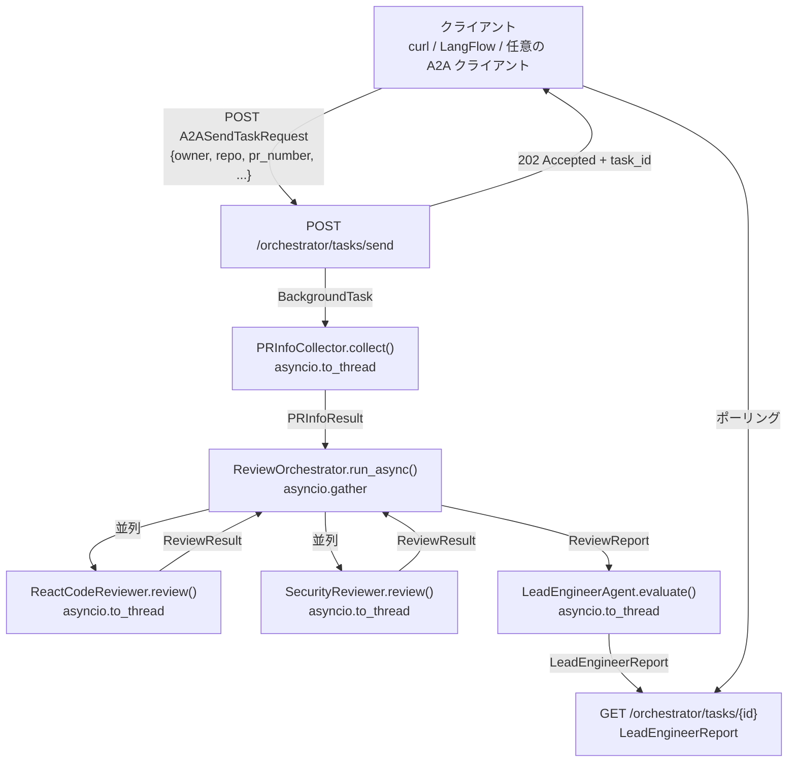

# A2A API 設計ドキュメント

LangFlow ワークフロー `Review-Agent.json` をベースに、各 Agent を A2A（Agent-to-Agent）プロトコルに準拠した HTTP API として公開するための設計を定義します。

---

## 1. 概要

### 1.1 目的

- 各 Agent（PR Info Collector / React Code Reviewer / Security Reviewer / Lead Engineer）を Google A2A プロトコル準拠の HTTP エンドポイントとして公開する
- LangFlow ワークフローのフロー（`PR Info Collector → 並列レビュー → Lead Engineer`）を API コールとして実現する
- OpenAI API 互換プロバイダー（Ollama / LM Studio / OpenRouter 等）を環境変数で切り替え可能にする

### 1.2 採用プロトコル

Google A2A（Agent-to-Agent）プロトコルを採用します。

各 Agent は以下の 3 エンドポイントを提供します:

| エンドポイント | メソッド | 説明 |
|---|---|---|
| `/{agent}/.well-known/agent.json` | GET | AgentCard — Agent の能力・スキーマ・URL を公開 |
| `/{agent}/tasks/send` | POST | タスク投入（202 Accepted + task_id を即時返却） |
| `/{agent}/tasks/{task_id}` | GET | 認証済み作成者によるタスク状態確認（ポーリング） |

タスク投入と取得には同じ GitHub アカウントの `Authorization: Bearer <token>` が必要です。取得時はタスク作成時に保存した GitHub user ID と照合し、別アカウントのタスクは `404` として扱います。

**タスク状態遷移**: `submitted → working → completed / failed`

### 1.3 デプロイ構成

単一 FastAPI サービス（モノリス）として全 Agent を一つのプロセスで動作させます。AgentCard の URL は環境変数で差し替え可能なため、将来のマイクロサービス分割に対応できます。

```text
http://localhost:8000/
├── /pr-info-collector/...
├── /react-reviewer/...
├── /security-reviewer/...
├── /lead-engineer/...
└── /orchestrator/...        ← LangFlow フロー相当のフルワークフロー
```

> **本番環境の TLS 要件**: 本 API は `Authorization: Bearer <token>` ヘッダーで認証情報を送受信するため、
> 本番環境では必ず TLS termination（リバースプロキシ、Kubernetes Ingress 等）を前段に配置し
> HTTPS を使用すること。`http://` での運用はトークンの平文送信につながるため禁止とする。
> 詳細は [§ 12. セキュリティ設計](#12-セキュリティ設計) を参照。

---

## 2. A2A プロトコル実装仕様

### 2.1 Pydantic モデル（`src/code_review_agent/a2a/models.py`）

```python
from __future__ import annotations
from enum import StrEnum
from typing import Any, Literal
from pydantic import BaseModel


class A2ATaskStatus(StrEnum):
    SUBMITTED = "submitted"
    WORKING = "working"
    COMPLETED = "completed"
    FAILED = "failed"


class A2ATextPart(BaseModel):
    kind: Literal["text"] = "text"
    text: str


class A2ADataPart(BaseModel):
    kind: Literal["data"] = "data"
    data: dict[str, Any]


A2APart = A2ATextPart | A2ADataPart


class A2AMessage(BaseModel):
    role: Literal["user", "agent"]
    parts: list[A2APart]


class A2ATask(BaseModel):
    id: str
    status: A2ATaskStatus
    message: A2AMessage | None = None
    error: str | None = None


class A2ASendTaskRequest(BaseModel):
    message: A2AMessage


class A2ASendTaskResponse(BaseModel):
    task: A2ATask


class AgentCapability(BaseModel):
    streaming: bool = False
    pushNotifications: bool = False
    stateTransitionHistory: bool = False


class AgentSkill(BaseModel):
    id: str
    name: str
    description: str
    inputSchema: dict[str, Any]
    outputSchema: dict[str, Any]


class AgentCard(BaseModel):
    name: str
    description: str
    url: str
    version: str = "1.0.0"
    capabilities: AgentCapability = AgentCapability()
    inputModes: list[str] = ["data"]
    outputModes: list[str] = ["data"]  # Lead Engineer / Orchestrator は ["text", "data"] に上書きする
    skills: list[AgentSkill]
```

### 2.2 TaskStore（`src/code_review_agent/a2a/task_store.py`）

インメモリ実装。将来の Redis 等への差し替えに備え、`TaskStore` プロトコルを定義します。

**TTL 設計**: タスク完了・失敗後 30 分で自動削除する。タスク結果には大量のコードスニペットが含まれるため
長期保持はメモリリスクにつながる。ポーリング猶予として 30 分は十分であり、Redis 等の外部ストアへの
移行コストを避けつつメモリ上限を抑制できる（設計判断の詳細は [§ 12.5](#125-taskstore-ttl) を参照）。

```python
import asyncio
from uuid import uuid4
from .models import A2ATask, A2ATaskStatus, A2AMessage

TASK_TTL_SECONDS = 1800  # 完了/失敗後 30 分で自動削除


class TaskStore:
    """インメモリ TaskStore。サービス再起動でリセットされる。"""

    def __init__(self) -> None:
        self._store: dict[str, A2ATask] = {}
        self._lock = asyncio.Lock()

    async def _schedule_delete(self, task_id: str) -> None:
        await asyncio.sleep(TASK_TTL_SECONDS)
        async with self._lock:
            self._store.pop(task_id, None)

    async def create(self) -> A2ATask:
        task = A2ATask(id=str(uuid4()), status=A2ATaskStatus.SUBMITTED)
        async with self._lock:
            self._store[task.id] = task
        return task

    async def get(self, task_id: str) -> A2ATask | None:
        async with self._lock:
            return self._store.get(task_id)

    async def set_working(self, task_id: str) -> None:
        async with self._lock:
            if task := self._store.get(task_id):
                self._store[task_id] = task.model_copy(
                    update={"status": A2ATaskStatus.WORKING}
                )

    async def set_completed(self, task_id: str, parts: list) -> None:
        async with self._lock:
            if task := self._store.get(task_id):
                self._store[task_id] = task.model_copy(update={
                    "status": A2ATaskStatus.COMPLETED,
                    "message": A2AMessage(role="agent", parts=parts),
                })
        asyncio.create_task(self._schedule_delete(task_id))

    async def set_failed(self, task_id: str, error: str) -> None:
        async with self._lock:
            if task := self._store.get(task_id):
                self._store[task_id] = task.model_copy(update={
                    "status": A2ATaskStatus.FAILED,
                    "error": error,
                })
        asyncio.create_task(self._schedule_delete(task_id))
```

---

## 3. 全体アーキテクチャ

### 3.1 LangFlow ワークフロー → A2A API マッピング

LangFlow の `Review-Agent.json` が定義する 3 段フローを、`/orchestrator/tasks/send` 内で HTTP 内部コールとして実現します。


```mermaid
flowchart TD
    Client["クライアント\ncurl / LangFlow / 任意の A2A クライアント"]
    ORC["POST /orchestrator/tasks/send"]
    PIC["PRInfoCollector.collect()\nasyncio.to_thread"]
    ROC["ReviewOrchestrator.run_async()\nasyncio.gather"]
    RC["ReactCodeReviewer.review()\nasyncio.to_thread"]
    SC["SecurityReviewer.review()\nasyncio.to_thread"]
    LE["LeadEngineerAgent.evaluate()\nasyncio.to_thread"]
    Result["GET /orchestrator/tasks/{id}\nLeadEngineerReport"]

    Client -->|"POST A2ASendTaskRequest\n{owner, repo, pr_number, ...}"| ORC
    ORC -->|"202 Accepted + task_id"| Client
    ORC -->|"BackgroundTask"| PIC
    PIC -->|"PRInfoResult"| ROC
    ROC -->|"並列"| RC
    ROC -->|"並列"| SC
    RC -->|"ReviewResult"| ROC
    SC -->|"ReviewResult"| ROC
    ROC -->|"ReviewReport"| LE
    LE -->|"LeadEngineerReport"| Result
    Client -->|"ポーリング"| Result
```

### 3.2 ディレクトリ構造（新規追加分）

```text
src/code_review_agent/
├── a2a/                              # A2A プロトコル基盤（新規）
│   ├── __init__.py
│   ├── models.py                     # AgentCard / Task / Message の Pydantic モデル
│   └── task_store.py                 # インメモリ TaskStore
│
└── api/                              # FastAPI アプリケーション（新規）
    ├── __init__.py
    ├── app.py                        # FastAPI インスタンス生成・ルーター登録
    ├── config.py                     # 環境変数設定（pydantic-settings）
    └── agents/
        ├── __init__.py
        ├── pr_info_collector.py      # PRInfoCollector の A2A API
        ├── react_reviewer.py         # ReactCodeReviewer の A2A API
        ├── security_reviewer.py      # SecurityReviewer の A2A API
        ├── lead_engineer.py          # LeadEngineerAgent の A2A API
        └── orchestrator.py           # フルワークフロー A2A API
```

**既存コードへの変更**:

- `src/code_review_agent/__init__.py`: `main()` を uvicorn 起動に変更
- `src/code_review_agent/agents/base_reviewer.py` 等: `ReviewerConfig` に `llm_base_url` フィールドを追加
- `pyproject.toml`: `pydantic-settings>=2.0` を依存追加

---

## 4. 各エージェントの AgentCard 定義

> **スキーマ表現に関する設計判断（`inputSchema` / `outputSchema`）**
>
> 本節の JSON 例では可読性のため `{"$ref": "#/components/schemas/X"}` 表記を用いるが、
> **実装では各 skill の `inputSchema` / `outputSchema` に自己完結した JSON Schema を埋め込む**
> （Pydantic の `Model.model_json_schema()` を使用、内部参照は `#/$defs/...`）。
>
> | 選択肢 | 内容 | 採否 | 理由 |
> |---|---|---|---|
> | A: `model_json_schema()` 埋め込み | 参照先モデルの完全スキーマ（`$defs` 自己完結）を埋め込む | **採用** | AgentCard は `/.well-known/agent.json` で agent 単位に配信され、各 skill スキーマは単体で解決可能であるべき。モデル変更に自動追従し、A2A クライアントが検証可能 |
> | B: `components.schemas` を AgentCard に追加 | ルートに `components` を持たせ `#/components/...` 参照を維持 | 却下 | `#/components` は OpenAPI 固有の記法で、標準 JSON Schema 文書としては非自己完結。AgentCard モデルに非標準フィールドが必要 |
> | C: `{"type": "object"}` 等の緩いスキーマ | 参照を捨て型情報を最小化 | 却下 | 検証価値を失い、A2A クライアントが入出力を検証できない |
>
> 却下案 B の問題（`components` セクション不在による解決不能な `$ref`）は実 PR レビューでも指摘され、案 A で解消した。
> 回帰防止として、全 AgentCard に `#/components/` 参照が現れないことをテストで担保する（`tests/api/test_app.py`）。

### 4.1 PR Info Collector

**URL プレフィックス**: `/pr-info-collector`

```json
{
  "name": "PR Info Collector",
  "description": "Collects pull request information from GitHub and returns structured data for downstream review agents.",
  "url": "{CODE_REVIEW_AGENT_BASE_URL}/pr-info-collector",
  "version": "1.0.0",
  "capabilities": {
    "streaming": false,
    "pushNotifications": false
  },
  "skills": [
    {
      "id": "collect_pr_info",
      "name": "Collect PR Information",
      "description": "Fetches PR metadata, file changes, and project summary from GitHub using MCP.",
      "inputSchema": {
        "type": "object",
        "properties": {
          "owner":     { "type": "string",  "description": "GitHub リポジトリオーナー名" },
          "repo":      { "type": "string",  "description": "リポジトリ名" },
          "pr_number": { "type": "integer", "description": "プルリクエスト番号" },
          "model_id":  { "type": "string",  "default": "gpt-4o" }
        },
        "required": ["owner", "repo", "pr_number"]
      },
        "_securityNote": "github_token はリクエストボディから除外。Authorization: Bearer ヘッダーで受け取り、FastAPI Dependency が各 Agent に注入する（§ 12.1 / § 12.3 参照）。llm_base_url はサーバー環境変数のみ（§ 12.2 参照）。",
        "outputSchema": {
          "$ref": "#/components/schemas/PRInfoResult"
        }
      }
    ]
  }
  ```

TypeScript移行版では、HTTP route は validation・middleware適用・service結果のHTTPレスポンス整形だけを担当し、AgentCard生成・task生成/更新・背景実行・poll判定はserviceへ切り出す。Authorizationヘッダー検証とGitHub token注入は全Agent共通のmiddlewareとして実装し、serviceには検証済みtokenだけを渡す。

**タスク処理**:

```python
async def _run(task_id: str, data: dict, store: TaskStore) -> None:
    await store.set_working(task_id)
    try:
        config = ReviewerConfig(
            github_token=data["github_token"],  # Authorization ヘッダーから注入済み
            model_id=data.get("model_id", "gpt-4o"),
            # llm_base_url はリクエストから受け取らず Settings 経由で注入する
        )
        collector = PRInfoCollector(
            github_token=config.github_token,
            model_id=config.model_id,
        )
        result: PRInfoResult = await asyncio.to_thread(
            collector.collect, data["owner"], data["repo"], data["pr_number"]
        )
        await store.set_completed(task_id, [
            A2ADataPart(data=result.model_dump()),
        ])
    except Exception as exc:
        await store.set_failed(task_id, sanitize_error(exc))  # § 12.4 参照
```

---

### 4.2 React Code Reviewer

**URL プレフィックス**: `/react-reviewer`

```json
{
  "name": "React Code Reviewer",
  "description": "Reviews React/TypeScript code from a technical perspective, following React best practices.",
  "skills": [
    {
      "id": "review_react_code",
      "name": "Review React Code",
      "inputSchema": {
        "type": "object",
        "properties": {
          "pr_info_result": { "$ref": "#/components/schemas/PRInfoResult" },
          "model_id":       { "type": "string", "default": "gpt-4o" }
        },
        "required": ["pr_info_result"]
      },
      "_securityNote": "github_token は Authorization ヘッダーから注入（§ 12.1 / § 12.3 参照）。",
      "outputSchema": {
        "$ref": "#/components/schemas/ReviewResult"
      }
    }
  ]
}
```

**タスク処理**:

```python
async def _run(task_id: str, data: dict, store: TaskStore) -> None:
    await store.set_working(task_id)
    try:
        config = ReviewerConfig(
            github_token=data["github_token"],  # Authorization ヘッダーから注入済み
            model_id=data.get("model_id", "gpt-4o"),
        )
        pr_info = PRInfoResult.model_validate(data["pr_info_result"])
        context = ReviewContext(pr_info=pr_info)
        reviewer = ReactCodeReviewer(config)
        result: ReviewResult = await asyncio.to_thread(
            reviewer.review, context, ProjectType.REACT_TS
        )
        await store.set_completed(task_id, [
            A2ADataPart(data=result.model_dump()),
        ])
    except Exception as exc:
        await store.set_failed(task_id, sanitize_error(exc))  # § 12.4 参照
```

---

### 4.3 Security Reviewer

**URL プレフィックス**: `/security-reviewer`

React Code Reviewer と同一パターン。入出力スキーマが同一でクラスのみ異なります。

```json
{
  "name": "Security Reviewer",
  "description": "Reviews code from a security perspective based on OWASP Top 10, XSS, and session hijacking risks.",
  "skills": [
    {
      "id": "review_security",
      "name": "Security Review",
      "inputSchema": {
        "type": "object",
        "properties": {
          "pr_info_result": { "$ref": "#/components/schemas/PRInfoResult" },
          "model_id":       { "type": "string", "default": "gpt-4o" }
        },
        "required": ["pr_info_result"]
      },
      "_securityNote": "github_token は Authorization ヘッダーから注入（§ 12.1 / § 12.3 参照）。",
      "outputSchema": {
        "$ref": "#/components/schemas/ReviewResult"
      }
    }
  ]
}
```

---

### 4.4 Lead Engineer

**URL プレフィックス**: `/lead-engineer`

```json
{
  "name": "Lead Engineer",
  "description": "Evaluates review results from all reviewers and produces final accept/reject decisions with priorities.",
  "outputModes": ["text", "data"],
  "skills": [
    {
      "id": "evaluate_reviews",
      "name": "Evaluate Reviews",
      "inputSchema": {
        "type": "object",
        "properties": {
          "review_report": { "$ref": "#/components/schemas/ReviewReport" },
          "model_id":      { "type": "string", "default": "gpt-4o" }
        },
        "required": ["review_report"]
      },
      "outputSchema": {
        "$ref": "#/components/schemas/LeadEngineerReport"
      }
    }
  ]
}
```

**タスク処理**:

```python
async def _run(task_id: str, data: dict, store: TaskStore) -> None:
    await store.set_working(task_id)
    try:
        config = ReviewerConfig(
            github_token="",  # Lead Engineer は GitHub MCP を使用しない
            model_id=data.get("model_id", "gpt-4o"),
            # llm_base_url はリクエストから受け取らず Settings 経由で注入する
        )
        review_report = ReviewReport.model_validate(data["review_report"])
        lead = LeadEngineerAgent(config)
        final_report: LeadEngineerReport = await asyncio.to_thread(
            lead.evaluate, review_report
        )
        await store.set_completed(task_id, [
            A2ATextPart(text=final_report.to_markdown()),
            A2ADataPart(data=final_report.model_dump()),
        ])
    except Exception as exc:
        await store.set_failed(task_id, sanitize_error(exc))  # § 12.4 参照
```

---

### 4.5 Orchestrator（フルワークフロー）

**URL プレフィックス**: `/orchestrator`

LangFlow ワークフロー `Review-Agent.json` 相当のフルフローを単一タスクとして実行します。

```json
{
  "name": "Code Review Orchestrator",
  "description": "Full review workflow: PR Info Collection → Parallel Review (React + Security) → Lead Engineer synthesis.",
  "outputModes": ["text", "data"],
  "skills": [
    {
      "id": "run_full_review",
      "name": "Run Full Code Review",
      "inputSchema": {
        "type": "object",
        "properties": {
          "owner":     { "type": "string",  "description": "GitHub リポジトリオーナー名" },
          "repo":      { "type": "string",  "description": "リポジトリ名" },
          "pr_number": { "type": "integer", "description": "プルリクエスト番号" },
          "model_id":  { "type": "string",  "default": "gpt-4o",
                         "description": "LLM モデル ID（プロバイダーごとのモデル名）" }
        },
        "required": ["owner", "repo", "pr_number"]
      },
      "_securityNote": "github_token は Authorization ヘッダーから注入（§ 12.1 / § 12.3 参照）。llm_base_url はサーバー環境変数のみ（§ 12.2 参照）。",
      "outputSchema": {
        "$ref": "#/components/schemas/LeadEngineerReport"
      }
    }
  ]
}
```

**タスク処理（`orchestrator.py`）**:

```python
async def _run_full_workflow(task_id: str, data: dict, store: TaskStore) -> None:
    """LangFlow Review-Agent.json ワークフロー相当の 3 段処理。"""
    await store.set_working(task_id)
    try:
        config = ReviewerConfig(
            github_token=data["github_token"],  # Authorization ヘッダーから注入済み
            model_id=data.get("model_id", "gpt-4o"),
            # llm_base_url はリクエストから受け取らず Settings 経由で注入する
        )

        # Stage 1: PR Info Collector（LangFlow: Agent-IaFfm）
        collector = PRInfoCollector(
            github_token=config.github_token,
            model_id=config.model_id,
        )
        pr_info: PRInfoResult = await asyncio.to_thread(
            collector.collect,
            data["owner"],
            data["repo"],
            data["pr_number"],
        )

        # Stage 2: 並列レビュー（LangFlow: Agent-9uqpG ∥ Agent-jnFVH）
        # ReviewOrchestrator.run_async() が asyncio.gather(asyncio.to_thread(...)) で並列実行
        context = ReviewContext(pr_info=pr_info)
        review_orchestrator = ReviewOrchestrator(config)
        review_report: ReviewReport = await review_orchestrator.run_async(context)

        # Stage 3: Lead Engineer 合成（LangFlow: Agent-5oeZS）
        lead = LeadEngineerAgent(config)
        final_report: LeadEngineerReport = await asyncio.to_thread(
            lead.evaluate, review_report
        )

        await store.set_completed(task_id, [
            A2ATextPart(text=final_report.to_markdown()),
            A2ADataPart(data=final_report.model_dump()),
        ])
    except Exception as exc:
        await store.set_failed(task_id, sanitize_error(exc))  # § 12.4 参照
```

TypeScript移行版では、§4.1 と同じく HTTP route（`orchestrator.route.ts`）は validation・middleware適用・service結果のHTTPレスポンス整形だけを担当し、AgentCard生成・task生成/更新・3段パイプラインの背景実行（PRInfoCollector → ReviewOrchestrator → LeadEngineerAgent）・poll判定は `orchestrator.service.ts` へ切り出す。3段が共有する `ReviewerConfig` は service が1つだけ生成し、`ReviewOrchestrator` と `LeadEngineerAgent` の双方に同一インスタンスを渡す（`PRInfoCollector` には MCP 起動リトライ等の該当設定のみを引き渡す）。エージェント3クラスはテスト時に差し替えられるよう service のオプションとして注入可能にする。

---

## 5. FastAPI アプリケーション構成

### 5.1 `api/app.py`

```python
from fastapi import FastAPI
from .config import Settings
from .agents import (
    pr_info_collector_router,
    react_reviewer_router,
    security_reviewer_router,
    lead_engineer_router,
    orchestrator_router,
)
from ..a2a.task_store import TaskStore


def create_app(settings: Settings) -> FastAPI:
    app = FastAPI(
        title="Code Review Agent A2A API",
        description="A2A protocol compliant API for code review agents.",
        version="1.0.0",
    )

    # シングルトン TaskStore を DI で全ルーターに共有
    task_store = TaskStore()

    app.include_router(
        pr_info_collector_router(settings, task_store),
        prefix="/pr-info-collector",
        tags=["PR Info Collector"],
    )
    app.include_router(
        react_reviewer_router(settings, task_store),
        prefix="/react-reviewer",
        tags=["React Code Reviewer"],
    )
    app.include_router(
        security_reviewer_router(settings, task_store),
        prefix="/security-reviewer",
        tags=["Security Reviewer"],
    )
    app.include_router(
        lead_engineer_router(settings, task_store),
        prefix="/lead-engineer",
        tags=["Lead Engineer"],
    )
    app.include_router(
        orchestrator_router(settings, task_store),
        prefix="/orchestrator",
        tags=["Orchestrator"],
    )

    return app
```

### 5.2 エンドポイント共通テンプレート

全エージェントで同一パターンの 3 ルートを持ちます。

**GitHub OAuth 認証 Dependency**: `Authorization: Bearer <github_oauth_token>` ヘッダーを検証し、
検証済みトークンをエンドポイント引数に注入します。これにより API 認証と `github_token` の
リクエストボディへの混入を同時に解決します（設計判断の詳細は [§ 12.1](#121-api-認証方式) を参照）。

```python
from fastapi import APIRouter, BackgroundTasks, Header, HTTPException, Depends
import httpx
from ...a2a.models import (
    AgentCard, A2ASendTaskRequest, A2ASendTaskResponse, A2ATask,
)
from ...a2a.task_store import TaskStore
from ..config import Settings


async def verify_github_token(
    authorization: str = Header(..., description="Bearer <github_oauth_token>"),
) -> tuple[str, str]:
    """GitHub OAuth トークンを /user API で検証し、トークンと user ID を返す。"""
    if not authorization.startswith("Bearer "):
        raise HTTPException(status_code=401, detail="Authorization header must be 'Bearer <token>'")
    token = authorization.removeprefix("Bearer ")
    async with httpx.AsyncClient() as client:
        resp = await client.get(
            "https://api.github.com/user",
            headers={"Authorization": f"Bearer {token}"},
            timeout=10.0,
        )
    if resp.status_code == 401:
        raise HTTPException(status_code=401, detail="Invalid GitHub token")
    if resp.status_code != 200:
        raise HTTPException(status_code=503, detail="GitHub authentication endpoint is temporarily unavailable")
    return token, str(resp.json()["id"])


def create_router(settings: Settings, store: TaskStore) -> APIRouter:
    router = APIRouter()

    @router.get("/.well-known/agent.json", response_model=AgentCard)
    async def get_agent_card() -> AgentCard:
        base = settings.agent_base_url
        url = settings.agent_pr_info_collector_url or f"{base}/pr-info-collector"
        return AgentCard(name="PR Info Collector", url=url, skills=[...])

    @router.post("/tasks/send", response_model=A2ASendTaskResponse, status_code=202)
    async def send_task(
        req: A2ASendTaskRequest,
        background_tasks: BackgroundTasks,
        auth: tuple[str, str] = Depends(verify_github_token),
    ) -> A2ASendTaskResponse:
        github_token, owner_principal_id = auth
        task = await store.create(owner_principal_id)
        data = _extract_data(req.message)
        data["github_token"] = github_token  # ヘッダーから取得したトークンを注入
        background_tasks.add_task(_run, task.id, data, store)
        return A2ASendTaskResponse(task=task)

    @router.get("/tasks/{task_id}", response_model=A2ATask)
    async def get_task(
        task_id: str,
        auth: tuple[str, str] = Depends(verify_github_token),
    ) -> A2ATask:
        _, owner_principal_id = auth
        task = await store.get(task_id, owner_principal_id)
        if task is None:
            raise HTTPException(status_code=404, detail="Task not found")
        return task

    return router
```

### 5.3 `__init__.py` の `main()` 変更

```python
def main() -> None:
    """FastAPI + Uvicorn で A2A 準拠 API サーバーを起動する。"""
    import uvicorn
    from dotenv import load_dotenv
    from .api.app import create_app
    from .api.config import Settings

    # LLM SDK は非プレフィックスの OPENAI_API_KEY を os.environ から直接読むため、
    # サーバープロセスに .env を読み込む。load_dotenv() は既存の環境変数を上書き
    # しないので、シェルで export した値が優先される。
    load_dotenv()

    settings = Settings()
    app = create_app(settings)
    uvicorn.run(app, host=settings.host, port=settings.port, log_level=settings.log_level)
```

> **補足:** `Settings`（pydantic-settings）は `CODE_REVIEW_` プレフィックス付き変数のみを
> 読み込み、`os.environ` には反映しない。一方 Strands の `OpenAIModel` は非プレフィックスの
> `OPENAI_API_KEY` を `os.environ` から直接参照する。`uv run` は `.env` を自動読込しないため、
> `main()` 冒頭で `load_dotenv()` を呼び、シェルへ export せずに `.env` から認証情報を供給する。

---

## 6. 環境変数リファレンス

### 6.1 必須環境変数

| 環境変数 | 説明 | 例 |
|---|---|---|
| `OPENAI_API_KEY` | `provider_type=openai` 時の API キー。OpenAI 互換プロバイダーでキー不要な場合はダミー値を設定。`provider_type=ollama`（ネイティブ）では不要 | `sk-...` |

### 6.1.1 `GITHUB_TOKEN` の扱いについて

GitHub PAT（classic PAT の `repo` スコープ、または fine-grained PAT の Contents / Pull requests Read 権限）が必要です。

**採用方式: `Authorization: Bearer` ヘッダー**

セキュリティ審査の結果、リクエストボディへのトークン混入リスクを排除するため、
`Authorization: Bearer <github_oauth_token>` ヘッダーで受け取る方式に統一しました。
FastAPI の `verify_github_token()` Dependency が GitHub `/user` API でトークンを検証し、
検証済みトークンを内部的に各 Agent の `github_token` として注入します（§ 5.2 参照）。

| 項目 | 内容 |
|---|---|
| **ヘッダー名** | `Authorization` |
| **フォーマット** | `Bearer <github_oauth_token>` |
| **検証方法** | `GET https://api.github.com/user` が 200 を返すことを確認 |
| **注入先** | `BackgroundTasks` クロージャーの `data["github_token"]` |

> **設計判断の記録**: 旧設計では「サーバー環境変数方式」と「クライアント提供方式（リクエストボディ）」の
> 2 択が検討されていました。リクエストボディ方式はアクセスログへのトークン記録リスクがあり、
> 環境変数方式はマルチユーザー対応が難しいため、`Authorization` ヘッダー + GitHub OAuth 検証
> という第 3 の方式に変更しました。詳細な比較は [§ 12.1](#121-api-認証方式) を参照してください。

### 6.2 サービス設定（任意・デフォルト値あり）

| 環境変数 | デフォルト | 説明 |
|---|---|---|
| `CODE_REVIEW_HOST` | `0.0.0.0` | FastAPI サーバーのバインドアドレス |
| `CODE_REVIEW_PORT` | `8000` | FastAPI サーバーのポート番号 |
| `CODE_REVIEW_LOG_LEVEL` | `info` | Uvicorn のログレベル（`debug` / `info` / `warning` / `error`） |

### 6.3 LLM プロバイダー・モデル設定（任意）

`CODE_REVIEW_PROVIDER_TYPE` でバックエンド（`openai` / `ollama`）を選択し、
`CODE_REVIEW_LLM_BASE_URL` でエンドポイントを切り替えます（Issue #214、
[docs/model-provider-factory-spec.md](model-provider-factory-spec.md) 参照）。
`provider_type=openai` の場合は OpenAI API 互換のあらゆるプロバイダー（LM Studio /
OpenRouter 等）に切り替えられ、`provider_type=ollama` の場合は Strands のネイティブ
`OllamaModel` を使用します。

> **セキュリティ上の注意**: `llm_base_url` はリクエストボディで受け付けません（SSRF リスクのため）。
> **サーバー環境変数のみ**で設定してください。設計判断の詳細は [§ 12.2](#122-llm_base_url-の扱いssrf-対策) を参照。
> `provider_type` も同様にリクエストボディでの上書きを許可しません
> （接続先/認証情報が意図せず切り替わるリスクを避けるため、デプロイ時に固定する設計）。

| 環境変数 | デフォルト | 説明 |
|---|---|---|
| `CODE_REVIEW_PROVIDER_TYPE` | `openai` | バックエンド種別（`openai` / `ollama`）。リクエスト単位のオーバーライド不可 |
| `CODE_REVIEW_MODEL_ID` | `gpt-4o` | 使用するモデル ID（プロバイダーごとのモデル名を指定） |
| `CODE_REVIEW_LLM_BASE_URL` | `None` | `provider_type=openai` 時は `None` で OpenAI 本家のデフォルトエンドポイントを使用。`provider_type=ollama` 時は `/v1` を含まない Ollama サーバーの素の URL を指定するが、`None`（未設定）の場合は `http://localhost:11434` にフォールバックする（`create_model_provider` 実装のデフォルト） |

**プロバイダー別設定一覧**:

| プロバイダー | `CODE_REVIEW_PROVIDER_TYPE` | `CODE_REVIEW_LLM_BASE_URL` | `CODE_REVIEW_MODEL_ID` | `OPENAI_API_KEY` |
|---|---|---|---|---|
| OpenAI（デフォルト） | 設定不要（`openai`） | 設定不要 | `gpt-4o` | `sk-...` |
| Ollama（ローカル・ネイティブ） | `ollama` | `http://localhost:11434`（`/v1` なし） | `gemma4:e4b` | 不要 |
| LM Studio（ローカル） | 設定不要（`openai`） | `http://localhost:1234/v1` | `lmstudio-community/...` | `lm-studio`（ダミー） |
| OpenRouter | 設定不要（`openai`） | `https://openrouter.ai/api/v1` | `openai/gpt-4o` | `sk-or-...` |

**Strands Agents への渡し方**（`ReviewerConfig.provider_type` 経由、実装は
`src/code_review_agent/agents/model_provider_factory.py::create_model_provider`）:

```python
from code_review_agent.agents.model_provider_factory import create_model_provider

model = create_model_provider(
    config.provider_type,
    config.model_id,
    llm_base_url=config.llm_base_url,
    temperature=0.1,
)
```

### 6.4 AgentCard URL 設定（任意・モノリス構成では設定不要）

マイクロサービス分割時に各エージェントの公開 URL を指定します。未設定時は `CODE_REVIEW_AGENT_BASE_URL` からフォールバックします。

| 環境変数 | デフォルト | 説明 |
|---|---|---|
| `CODE_REVIEW_AGENT_BASE_URL` | `http://localhost:8000` | AgentCard URL のベース（モノリス時のフォールバック） |
| `CODE_REVIEW_AGENT_PR_INFO_COLLECTOR_URL` | `{base}/pr-info-collector` | PR Info Collector の公開 URL |
| `CODE_REVIEW_AGENT_REACT_REVIEWER_URL` | `{base}/react-reviewer` | React Reviewer の公開 URL |
| `CODE_REVIEW_AGENT_VUE_REVIEWER_URL` | `{base}/vue-reviewer` | Vue Reviewer の公開 URL |
| `CODE_REVIEW_AGENT_ANGULAR_REVIEWER_URL` | `{base}/angular-reviewer` | Angular Reviewer の公開 URL |
| `CODE_REVIEW_AGENT_SVELTE_REVIEWER_URL` | `{base}/svelte-reviewer` | Svelte Reviewer の公開 URL |
| `CODE_REVIEW_AGENT_SECURITY_REVIEWER_URL` | `{base}/security-reviewer` | Security Reviewer の公開 URL |
| `CODE_REVIEW_AGENT_LEAD_ENGINEER_URL` | `{base}/lead-engineer` | Lead Engineer の公開 URL |
| `CODE_REVIEW_AGENT_ORCHESTRATOR_URL` | `{base}/orchestrator` | Orchestrator の公開 URL |

### 6.5 GitHub MCP エンドポイント（任意）

| 環境変数 | デフォルト | 説明 |
|---|---|---|
| `GITHUB_MCP_URL` | `https://api.githubcopilot.com/mcp/read-only` | GitHub MCP サーバーエンドポイント |

### 6.6 `.env` ファイル例（クイックスタート）

> **注意**: `.env` ファイルはリポジトリにコミットしないこと。

```bash
# .env

# ─── 必須 ───────────────────────────────────────────
OPENAI_API_KEY=sk-...          # OpenAI 使用時。Ollama 等では "ollama" 等のダミー値でも可
GITHUB_TOKEN=ghp_...           # GitHub PAT（classic PAT: repo スコープ / fine-grained PAT: Contents+PRs Read）

# ─── LLM プロバイダー設定（1 つのみ有効にする）──────────
# --- OpenAI（デフォルト、設定不要） ---
CODE_REVIEW_MODEL_ID=gpt-4o
# CODE_REVIEW_PROVIDER_TYPE=openai   # デフォルト。明示不要

# --- Ollama（ローカル・ネイティブ SDK 経由）を使う場合 ---
# CODE_REVIEW_PROVIDER_TYPE=ollama
# CODE_REVIEW_LLM_BASE_URL=http://localhost:11434   # /v1 を付けない
# CODE_REVIEW_MODEL_ID=gemma4:e4b
# OPENAI_API_KEY は provider_type=ollama では使用されない

# --- LM Studio（ローカル、OpenAI 互換のまま）を使う場合 ---
# CODE_REVIEW_PROVIDER_TYPE=openai
# CODE_REVIEW_LLM_BASE_URL=http://localhost:1234/v1
# CODE_REVIEW_MODEL_ID=lmstudio-community/gemma-3-4b-it-GGUF
# OPENAI_API_KEY=lm-studio

# --- OpenRouter（OpenAI 互換のまま）を使う場合 ---
# CODE_REVIEW_PROVIDER_TYPE=openai
# CODE_REVIEW_LLM_BASE_URL=https://openrouter.ai/api/v1
# CODE_REVIEW_MODEL_ID=openai/gpt-4o
# OPENAI_API_KEY=sk-or-...

# ─── サービス設定（任意）────────────────────────────────
CODE_REVIEW_HOST=0.0.0.0
CODE_REVIEW_PORT=8000
CODE_REVIEW_LOG_LEVEL=info

# ─── AgentCard URL（モノリス構成では設定不要）───────────
# CODE_REVIEW_AGENT_BASE_URL=http://localhost:8000
```

---

## 7. `api/config.py` 実装仕様

```python
from pydantic_settings import BaseSettings, SettingsConfigDict


class Settings(BaseSettings):
    model_config = SettingsConfigDict(env_prefix="CODE_REVIEW_")

    # サーバー設定
    host: str = "0.0.0.0"
    port: int = 8000
    log_level: str = "info"

    # LLM プロバイダー設定
    model_id: str = "gpt-4o"
    llm_base_url: str | None = None   # None = OpenAI デフォルト

    # AgentCard URL（None の場合 agent_base_url/{prefix} にフォールバック）
    agent_base_url: str = "http://localhost:8000"
    agent_pr_info_collector_url: str | None = None
    agent_react_reviewer_url: str | None = None
    agent_security_reviewer_url: str | None = None
    agent_lead_engineer_url: str | None = None
    agent_orchestrator_url: str | None = None

    def resolve_agent_url(self, prefix: str, override: str | None) -> str:
        """AgentCard URL を解決する。override が None なら base_url を使用。

        末尾スラッシュの有無を正規化し、二重スラッシュを防ぐ。
        """
        base = self.agent_base_url.rstrip("/")
        return override or f"{base}/{prefix.lstrip('/')}"
```

---

## 8. 依存関係の変更（`pyproject.toml`）

```toml
dependencies = [
    "fastapi>=0.136.3",
    "pydantic>=2.13.4",
    "pydantic-settings>=2.0",    # 追加
    "strands-agents[openai]>=1.41.0",
    "uvicorn[standard]>=0.48.0",
]
```

---

## 9. 既存コードの変更点

### 9.1 `ReviewerConfig` の拡張

```python
# src/code_review_agent/agents/base_reviewer.py
# 現行実装は @dataclass(frozen=True)。BaseModel ではない。

@dataclass(frozen=True)
class ReviewerConfig:
    github_token: str
    model_id: str = "gpt-4o"
    mcp_url: str = GITHUB_MCP_URL
    llm_base_url: str | None = None    # 追加: OpenAI 互換 Base URL
```

### 9.2 `OpenAIModel` 生成部の変更（`LLMReviewAgent`, `PRInfoCollector`, `LeadEngineerAgent`）

```python
# 変更前
model = OpenAIModel(model_id=self._config.model_id)

# 変更後
model = OpenAIModel(
    model_id=self._config.model_id,
    **({"base_url": self._config.llm_base_url} if self._config.llm_base_url else {}),
)
```

---

## 10. 検証手順

### 10.1 ローカル起動

```bash
# 依存インストール
uv sync

# 環境変数設定（.env ファイルまたはシェル）
export OPENAI_API_KEY="sk-..."
export GITHUB_TOKEN="ghp_..."

# サーバー起動
uv run code-review-agent

# Swagger UI で全エンドポイント確認
open http://localhost:8000/docs
```

### 10.2 AgentCard 確認

```bash
for agent in pr-info-collector react-reviewer security-reviewer lead-engineer orchestrator; do
  echo "=== $agent ==="
  curl -s "http://localhost:8000/$agent/.well-known/agent.json" | jq '{name, url, version}'
done
```

### 10.3 フルワークフロー（Orchestrator）の検証

```bash
# タスク投入
RESP=$(curl -s -X POST http://localhost:8000/orchestrator/tasks/send \
  -H "Content-Type: application/json" \
  -d '{
    "message": {
      "role": "user",
      "parts": [{
        "kind": "data",
        "data": {
          "owner": "<OWNER>",
          "repo": "<REPO>",
          "pr_number": <PR_NUMBER>,
          "github_token": "'"$GITHUB_TOKEN"'"
        }
      }]
    }
  }')

TASK_ID=$(echo "$RESP" | jq -r '.task.id')
echo "Task ID: $TASK_ID"

# ポーリングで状態確認（completed になるまで待つ）
while true; do
  STATUS=$(curl -s \
    -H "Authorization: Bearer ${GITHUB_TOKEN}" \
    "http://localhost:8000/orchestrator/tasks/$TASK_ID" | jq -r '.status')
  echo "Status: $STATUS"
  [ "$STATUS" = "completed" ] || [ "$STATUS" = "failed" ] && break
  sleep 10
done

# 結果取得（Markdown テキスト）
curl -s \
  -H "Authorization: Bearer ${GITHUB_TOKEN}" \
  "http://localhost:8000/orchestrator/tasks/$TASK_ID" \
  | jq -r '.message.parts[] | select(.kind == "text") | .text'
```

### 10.4 Ollama 切り替えテスト

Issue #214 により、Ollama は OpenAI 互換 `/v1` シムではなく Strands のネイティブ
`strands.models.ollama.OllamaModel` を経由するようになった（詳細は
[docs/model-provider-factory-spec.md](model-provider-factory-spec.md) 参照）。
`CODE_REVIEW_PROVIDER_TYPE=ollama` を指定すると `create_model_provider()` がこの
分岐を選択する。ホスト URL はネイティブ API 用の素の URL（`/v1` サフィックスなし）を渡す。

> **注意**: `main()` が呼ぶ `load_dotenv()` は既存の環境変数を上書きしない仕様のため、
> シェルで `unset OPENAI_API_KEY` するだけでは `.env` に書かれた値がそのまま読み込まれる。
> ネイティブ Ollama 経路が本当に API キーなしで動くことを確認するには、`.env` の
> `OPENAI_API_KEY` 行を一時的にコメントアウトしてから起動すること。

```bash
# --- ターミナル 1: サーバー起動 ---
export CODE_REVIEW_PROVIDER_TYPE="ollama"
export CODE_REVIEW_LLM_BASE_URL="http://localhost:11434"   # /v1 を付けない
export CODE_REVIEW_MODEL_ID="gemma4:e4b"                   # 例。手元で ollama pull 済みのモデルに置き換える
export GITHUB_TOKEN="ghp_..."
# OllamaModel はネイティブ SDK 経由のため OPENAI_API_KEY は不要
# （.env の OPENAI_API_KEY 行は上記注意のとおりコメントアウトしておく）

uv run code-review-agent
```

サーバー起動確認だけでなく、実際に Ollama 経由の推論まで検証する。別ターミナルから
Orchestrator に実タスクを投入し、`Authorization: Bearer` ヘッダーで GitHub トークンを
渡す（§ 6.1.1 の認証方式）：

```bash
# --- ターミナル 2: 実リクエスト ---
RESP=$(curl -s -X POST http://localhost:8000/orchestrator/tasks/send \
  -H "Content-Type: application/json" \
  -H "Authorization: Bearer $GITHUB_TOKEN" \
  -d '{
    "message": {
      "role": "user",
      "parts": [{
        "kind": "data",
        "data": {
          "owner": "<OWNER>",
          "repo": "<REPO>",
          "pr_number": <PR_NUMBER>
        }
      }]
    }
  }')

TASK_ID=$(echo "$RESP" | jq -r '.task.id')
echo "Task ID: $TASK_ID"

# ポーリングで状態確認（completed になるまで待つ。Ollama 実推論のため数分かかりうる）
while true; do
  STATUS=$(curl -s \
    -H "Authorization: Bearer ${GITHUB_TOKEN}" \
    "http://localhost:8000/orchestrator/tasks/$TASK_ID" | jq -r '.status')
  echo "Status: $STATUS"
  [ "$STATUS" = "completed" ] || [ "$STATUS" = "failed" ] && break
  sleep 10
done

# status が completed であること、Ollama 経由の実推論結果（レビュー本文）が
# 返っていることの両方を確認する
curl -s \
  -H "Authorization: Bearer ${GITHUB_TOKEN}" \
  "http://localhost:8000/orchestrator/tasks/$TASK_ID" \
  | jq -r '.message.parts[] | select(.kind == "text") | .text'
```

### 10.5 既存テストの通過確認

```bash
uv run pytest --cov=src/code_review_agent --cov-report=term-missing
# カバレッジ 75% 以上を確認
```

---

## 11. 関連ドキュメント

- LangFlow ワークフロー仕様（由来の記録）: [docs/review-agent-workflow-spec.md](review-agent-workflow-spec.md)
- 並列レビュー段設計: [docs/review-agents-design.md](review-agents-design.md)
- Lead Engineer 設計: [docs/lead-engineer-agent-design.md](lead-engineer-agent-design.md)
- 要件検証基準: [evaluation/EVALUATION_PLAN.md](../evaluation/EVALUATION_PLAN.md)

---

## 12. セキュリティ設計

実装前のセキュリティ審査（2026-06-08）で特定した問題と、各設計判断の記録です。

### 12.1 API 認証方式

**問題**: `/tasks/send` エンドポイントに認証機構がなく、同一ネットワーク内のすべてのクライアントが
無制限にタスクを投入できる状態だった。

**検討した選択肢**:

| 選択肢 | 概要 | 採用/却下の理由 |
|---|---|---|
| X-API-Key ヘッダー | `CODE_REVIEW_API_KEY` 環境変数でキーを管理 | API キーの独自管理（ローテーション・失効管理）コストが発生するため却下 |
| **GitHub OAuth / OIDC（採用）** | `Authorization: Bearer <github_access_token>` を `/user` API で検証 | GitHub アカウントは PR オーナーの前提として既に存在し、外部 IdP 依存ゼロ。認証と `github_token` 注入を同時に解決できる |
| Entra ID / Auth0 | JWT + JWKS 検証 | 追加の IdP 依存が増える。主要ユーザーは GitHub ユーザーのため過剰 |
| 認証なし（ネットワーク隔離） | K8s NetworkPolicy / VPC で制御 | ネットワーク設定ミスが全公開に直結するため却下 |

**採用方針**: GitHub OAuth / OIDC（§ 5.2 の `verify_github_token()` Dependency 参照）

---

### 12.2 `llm_base_url` の扱い（SSRF 対策）

**問題**: `llm_base_url` をリクエストボディで受け付ける設計では、攻撃者が
`http://169.254.169.254/latest/meta-data/`（AWS IMDSv1）等を指定した場合に
サーバーからクラウドメタデータサービスへリクエストが発行される（SSRF）。

**検討した選択肢**:

| 選択肢 | 概要 | 採用/却下の理由 |
|---|---|---|
| **サーバー環境変数のみ（採用）** | inputSchema から `llm_base_url` を削除し `CODE_REVIEW_LLM_BASE_URL` のみ受け付ける | LLM プロバイダー切り替えはデプロイ設定であり、リクエスト単位での変更は不要。SSRF を設計レベルで排除できる |
| URL バリデーション | https スキームのみ + プライベート IP ブロック | DNS リバインディングでバイパス可能。防御の抜け漏れが残る |
| 許可リスト（allowlist） | 事前定義 URL 一覧のみ許可 | 利用者が使うプロバイダーを予め列挙できないため柔軟性が低い |

**採用方針**: `llm_base_url` はサーバー環境変数 `CODE_REVIEW_LLM_BASE_URL` のみで設定する（§ 6.3 参照）。

---

### 12.3 `github_token` のリクエストボディへの混入

**問題**: `github_token` を JSON リクエストボディの `message.parts[].data` に含める設計では、
HTTP アクセスログ（リバースプロキシ等）にトークンが記録されるリスクがある。

**採用方針**: § 12.1 の GitHub OAuth 採用により、`Authorization: Bearer` ヘッダーから
取得したトークンを内部的に `github_token` として転用する。
`github_token` フィールドはすべての `inputSchema` の `required` / `properties` から削除済み。

---

### 12.4 例外メッセージへのトークン漏洩対策

**問題**: `await store.set_failed(task_id, str(exc))` で例外メッセージをそのまま保存していた。
GitHub MCP の HTTP クライアントが例外送出時に `Authorization: Bearer <token>` を
メッセージに含める場合、`GET /tasks/{task_id}` のレスポンスにトークンが露出する。
既存実装の `review_orchestrator.py:99` でも同様のパターンが確認された。

**検討した選択肢**:

| 選択肢 | 概要 | 採用/却下の理由 |
|---|---|---|
| **例外サニタイズ（採用）** | `Bearer <token>` / `ghp_*` / `github_pat_*` パターンを `[REDACTED]` に置換 | 既存ハンドラをラップするだけで全 Agent に適用可能 |
| `pydantic.SecretStr` 採用 | `ReviewerConfig.github_token` を `SecretStr` 型に変更 | `__str__` をマスクできるが、HTTP ライブラリの例外メッセージには無効。サニタイズとの併用が必要 |
| エラーメッセージを固定文言のみ | `str(exc)` を使わず汎用メッセージに置換 | デバッグ性が大幅に低下するため却下 |

**採用方針**: `sanitize_error()` ユーティリティを `src/code_review_agent/a2a/utils.py` に実装する。

```python
import re

_TOKEN_PATTERN = re.compile(r"(Bearer\s+|ghp_|github_pat_)[^\s\"']+", re.IGNORECASE)

def sanitize_error(exc: BaseException) -> str:
    """例外メッセージからトークンらしき文字列を除去する。"""
    return _TOKEN_PATTERN.sub("[REDACTED]", str(exc))
```

全 `_run()` 内の `set_failed(task_id, str(exc))` を `set_failed(task_id, sanitize_error(exc))` に変更する
（各 `_run()` のコードサンプルに反映済み）。`SecretStr` の採用は実装フェーズの判断に委ねる。

---

### 12.5 TaskStore TTL

**問題**: タスクが完了後もサービス再起動まで破棄されない（TTL なし）。タスク結果には
`PRInfoResult` 等の大量データが含まれるため、長期運用でメモリが増加し続ける。

**検討した選択肢**:

| 選択肢 | 概要 | 採用/却下の理由 |
|---|---|---|
| TTL なし（旧設計） | タスクをサービス再起動まで保持 | 長期運用でメモリリスクが高い。コードスニペットを含む大量データが残存し続ける |
| **完了後 30 分で自動削除（採用）** | `asyncio.create_task` で完了/失敗後 30 分で削除 | メモリリスクを制限できる。ポーリング猶予として 30 分は十分 |
| Redis 等の外部ストアへ移行 | TTL 付き外部 KV ストアを利用 | 現時点ではインフラ依存を増やさず、インメモリで十分 |

**採用方針**: `TaskStore.set_completed()` / `set_failed()` 内で `asyncio.create_task(self._schedule_delete(task_id))` を呼び出す（§ 2.2 のコードサンプルに反映済み）。

---

### 12.6 TLS（HTTPS）必須化

**問題**: 設計全体を通じて `http://localhost:8000` が例示に使われており、
本番での HTTPS 必須化が明記されていなかった。

**採用方針**: 本番環境では TLS termination（リバースプロキシ、Kubernetes Ingress 等）を
前段に配置し HTTPS を使用することを必須とする（§ 1.3 に注記済み）。

---

### 12.7 AgentCard によるサービストポロジーの公開（将来の対応事項）

**問題**: `/.well-known/agent.json` の `url` フィールドに内部サービスの URL が含まれ、
認証なしで公開される。マイクロサービス分割後は内部ネットワーク構成が外部から把握できる。

**現在の方針**: モノリス構成（§ 1.3）では許容範囲。
マイクロサービス分割時は内部 URL を AgentCard に含めず外部公開 URL のみにすること。

---

## 13. TypeScript/Zod モデル移行仕様

### 13.1 対象と配置

Issue #253 の A2A HTTP 契約を表す Zod スキーマと TypeScript 型を基盤とし、各機能の Hono routing、service、認証および TaskStore を段階的に実装する。未実装の `*.route.ts` は空の Hono router と TODO を維持し、実装済み route は service 呼び出しの制御と HTTP response の整形に責務を限定する。

モデルは `packages/a2a-server/src/modules/` 配下へ機能単位で配置する。

- `a2a/`: 全 Agent 共通の message、task、AgentCard、HTTP error
- `pr-info/`: PR Info Collector 固有の入力と出力
- `reviewers/`: React、Vue、Angular、Svelte、Security Reviewer 共通の入力と出力
- `lead-engineer/`: Lead Engineer 固有の入力と出力
- `orchestrator/`: Orchestrator 固有の入力と出力
- `health/`: health check のレスポンス

各機能は `request.model.ts` と `response.model.ts` に分割する。存在していた `reviiewers/` は誤記のため `reviewers/` に改める。

### 13.2 命名と互換性

URL パスは既存と同じ kebab-case を維持する。TypeScript API の JSON キーは TypeScript の慣習に合わせて camelCase とし、`pr_number`、`model_id`、`pr_info`、`review_report` はそれぞれ `prNumber`、`modelId`、`prInfo`、`reviewReport` とする。ドメイン出力は `@code-review-agent/agent-core` の既存 camelCase Zod スキーマを再利用し、同一モデルの二重定義を避ける。

共通 A2A envelope の `kind`、`role`、`parts`、`inputSchema`、`outputSchema`、`pushNotifications`、`stateTransitionHistory` は既存契約とTypeScript慣習が一致するため維持する。

### 13.3 検証境界

`POST /tasks/send` の HTTP request model は、原則として Python 実装と同様に共通 A2A envelope を検証し、各 Agent 固有の data payload schema は AgentCard の skill schema とバックグラウンド処理境界で利用する。PR Info Collector は GitHub API 呼び出しに必要な `owner`、`repo`、`prNumber` を HTTP 境界でも検証し、不正な入力を `400` で拒否する。

`POST /tasks/send` と `GET /tasks/{task_id}` は GitHub `/user` API で認証する。タスク作成時にはレスポンスへ露出しない内部所有者情報として GitHub の数値 user ID を保存し、取得時には同じ user ID の呼び出しだけを許可する。存在しないタスクと所有者が異なるタスクはいずれも `404` とし、タスクの存在を第三者へ開示しない。

HTTP 契約全体を表すため、成功レスポンスに加えて 400、401、404、422、503 のエラー body を Zod で定義する。FastAPI の validation error location は文字列または整数の配列として表現する。

### 13.4 Zod 規約

`docs/typescript-models-migration-spec.md` の規約を継承する。

- schema は `XxxSchema`、型は `z.infer<typeof XxxSchema>` とする
- enum は object 形式の `z.enum` とする
- Python の nullable default は `.nullable().default(null)` とする
- array/object default は `.default([])` / `.default({})` とする
- A2A part は `kind` を discriminator とする `z.discriminatedUnion` で表現する
- NodeNext import は `.js` 拡張子を使用する

### 13.5 テスト

Vitest で以下を検証する。

- task status と message part の discriminated union
- nullable/default を含む task、AgentCapability、AgentCard
- send task request/response の JSON 往復
- camelCase の各 Agent 固有 input と既存 agent-core output schema の再利用
- health と 401/404/422/503 error response
- 各 `*.route.ts` の実装段階に対応するルーティング契約

### 13.6 Health service と route の責務

health モジュールは、`HealthResponseSchema` で検証済みの `{ status: "ok" }` を返す service と、service 呼び出しおよび HTTP response の整形のみを担う route に分離する。route は依存注入可能な service を受け取り、`GET /` に対して service の返却値を status 200 で返す。

テストは service が既存 response model に適合すること、および route が service を呼び出して status 200 と同一 body を返すことを個別に検証する。ルートアプリケーションへの `/health` マウントは別スライスで扱う。

### 13.7 環境変数駆動の Provider 設定（Issue #297）

`index.ts` が各 `create*Route()` をオプションなしで呼び出していたため、`providerType` / `llmBaseUrl` / `maxTokens` / `frequencyPenalty` を外部から注入する経路が存在せず、各 service の `DEFAULT_*_SETTINGS`（`modelId: "gpt-4o"` のみ）に固定されていた。Python版 `src/code_review_agent/api/config.py` の `Settings`（`CODE_REVIEW_` プレフィックス付き環境変数）と同一の切り替えを可能にするため、`packages/a2a-server/src/config.ts` に環境変数読み込みを追加する。

**読み込む環境変数と対応（Python版 `Settings` フィールドとの対応）**:

| 環境変数 | 型 | 既定値 | Python版フィールド |
|---|---|---|---|
| `CODE_REVIEW_PROVIDER_TYPE` | `"openai" \| "ollama"` | `"openai"` | `provider_type` |
| `CODE_REVIEW_LLM_BASE_URL` | `string \| undefined` | `undefined` | `llm_base_url` |
| `CODE_REVIEW_MODEL_ID` | `string` | `"gpt-4o"` | `model_id` |
| `CODE_REVIEW_MAX_TOKENS` | `number \| undefined` | `undefined` | `max_tokens` |
| `CODE_REVIEW_FREQUENCY_PENALTY` | `number \| undefined` | `undefined` | `frequency_penalty` |

`CODE_REVIEW_PROVIDER_TYPE` に `"openai"`/`"ollama"` 以外の値が渡された場合、`CODE_REVIEW_MAX_TOKENS`/`CODE_REVIEW_FREQUENCY_PENALTY` が数値へパースできない場合は、Python版の pydantic バリデーションと同様に起動時（`loadServerSettingsFromEnv` 呼び出し時）に例外を送出しフェイルファストする。空文字列は未設定として扱う（`undefined` にフォールバック）。

**適用範囲**: `index.ts` が `loadServerSettingsFromEnv()` を1回呼び出し、その結果を `settings` として `createOrchestratorRoute` / `createLeadEngineerRoute` / 各 `create*ReviewerRoute` に渡す。`createPrInfoRoute` は Python版の `PRInfoCollector` 設定と同様 `maxTokens`/`frequencyPenalty` を持たないため、`providerType`/`llmBaseUrl`/`modelId` のみを渡す（渡すオブジェクトの型は各モジュールの設定型に対して構造的に広いスーパーセットであり、余剰フィールドは無視される）。

**Non-goals**（この変更のスコープ外。個別に Issue 化する）:

- Issue #296（未処理 `error` イベントによるプロセスクラッシュ）の修正
- `max_agent_turns` / `reviewer_timeout_seconds` / `patch_total_char_limit` / `patch_max_files` / `mcp_startup_retry_*` / `agent_base_url` 系の環境変数化（既存のハードコード値を維持する）
- `.env` ファイル自体の読み込み（dotenv 等）の追加。プロセス起動時の `process.env` のみを対象とし、`.env` の読み込みは呼び出し元（起動スクリプト等）の責務とする
