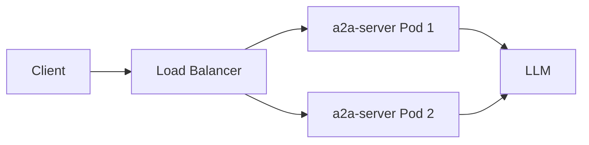
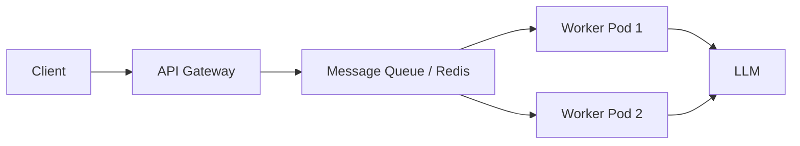
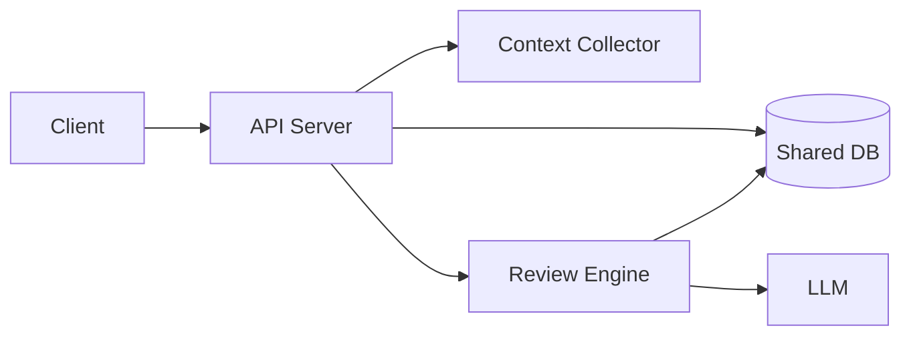

# 0007-Multi-Container-Architecture-for-Scalability

## 課題の内容・背景
現在、`code-review-agent` は単一のコンテナ（Pod）で動作する構成となっており、すべての機能（API公開、エージェントの実行、コンテキスト収集など）が同一プロセス内で処理されている。

**現状の課題:**
1. **流量制御の欠如（最優先課題）**: LLMによる推論処理は極めて計算リソースを消費するため、現在のWebAPI構成では同時に2リクエスト程度が限界である。リクエストの同時実行数を制御する仕組みがないため、急激なトラフィック増に対してサービスが不安定になる。
2. **スケーラビリティの欠如**: 単一コンテナではリソースの限界に達しやすく、水平スケール（Scale-out）が困難である。
3. **可用性の制約**: 単一コンテナがダウンするとサービス全体が停止する。
4. **拡張性の制限**: 今後予定している WebUI や CLI などのフロントエンド/クライアントインターフェースを統合する場合、認証・認可、レート制限、プロトコル変換などの責務を現状のコアロジックと分離する必要がある。
5. **デプロイ構成の制約**: 現在の `deploy/pod.yaml` では `hostPort` を使用しており、複数の Pod を起動してロードバランシングを行うための標準的なネットワーク経路が確保されていない。

**制約条件:**
- 既存の `packages/agent-core` および `packages/a2a-server` のロジックを維持しつつ、スケーラブルな構造へ移行する。
- **LLMの同時実行能力（Concurrency）を上限として、システム全体で流量を制御する。**
- 最終的には WebUI/CLI からのアクセスをサポートできる必要がある。

## 検討事項
本決定では、以下の論点を評価する。
- **流量制御と並列実行の管理**: クライアントからの同時要求をいかに制御し、バックエンドのLLM処理能力に合わせて平滑化するか。
- **コンポーネントの分離方針**: API Gateway（エントリポイント）と Worker（バックエンド処理）を分離し、Worker側でジョブの並列数を制御するか。
- **状態管理の設計**: コンテナを並列実行する際に、リクエストの状態やジョブの進捗をどこで共有するか。
- **ネットワーク・負荷分散**: ロードバランサーの導入方法と、内部コンポーネント間の通信プロトコル。
- **スケーリング戦略**: リクエストベースのスケールか、ジョブキューベースのスケールか。

## 検討内容

### 案A: 単純なコンテナ・レプリカ構成 (Monolithic Container Scale-out)
現状の `a2a-server` コンテナを複数起動し、前面にシンプルなロードバランサー（Nginx等）を置く構成。

**構成イメージ:**

**リクエストフロー:**
1. クライアントがリクエストを送信。
2. LBが空いている Pod に振り分ける。
3. Pod が LLM 呼び出しを開始。
4. **問題点**: Pod 全体の同時実行数が LLM 制限（例: 2並列）を超えると、リクエストがブロックされるか、Pod が過負荷でダウンする。

| メリット | デメリット |
| --- | --- |
| **実装の容易さ**: 現在のコードをほとんど変えずに移行可能。 | **流量制御が困難**: コンテナを増やすだけでは、全体の同時実行数の制御が難しく、LLMへの過負荷を防げない。 |
| **迅速な展開**: 短期間で現在の「単一コンテナ」の制約を突破できる。 | **リソース効率の低下**: 重いレビュー処理と軽いAPIレスポンスが同じリソースを奪い合う。 |
| | **状態の不整合**: 状態をメモリに持っている場合、リクエストが別コンテナに飛ぶと失敗する。 |

### 案B: API Gateway + Worker Queue 構成 (Asynchronous Task Processing)
API Gateway（WebUI/CLI用）と、メッセージキュー（Redis/RabbitMQ等）を介した Worker コンテナに分離する構成。**Worker側で最大並列数を制御する。**

**構成イメージ:**

**リクエストフロー:**
1. クライアントがリクエストを送信。
2. GW がリクエストを検証し、Queue にジョブとして投入。
3. GW は即座に「受付完了」レスポンスを返す。
4. Worker が Queue からジョブを順次取得。
5. **利点**: Worker の並列実行数を固定（例: 最大N並列）に制限することで、LLMへの流量を正確に制御できる。

| メリット | デメリット |
| --- | --- |
| **厳密な流量制御**: メッセージキューを介することで、LLMの同時実行数をWorker側で正確に制御（例: 最大N並列）でき、バックプレッシャーを適切に管理できる。 | **システムの複雑性増大**: メッセージキューの運用、冪等性の確保、非同期処理のハンドリングが必要。 |
| **高度なスケーラビリティ**: APIレスポンスと重いレビュー処理を完全に分離。Workerを動的に増減可能。 | **リアルタイム性の制約**: 基本的に非同期になるため、クライアント側にポーリングやWebSocketの仕組みが必要。 |
| **フロントエンドへの適応**: API Gatewayで認証、レート制限、WebUI/CLI固有の変換を統合可能。 | |
| **耐障害性の向上**: Workerがクラッシュしてもジョブが残るため、再試行が可能。 | |

### 案C: 分離されたマイクロサービス構成 (Microservices with Shared State)
APIサーバー、コンテキスト収集器、レビュー実行エンジンを独立したサービスとして分離し、共有データベース（PostgreSQL等）で状態を管理する構成。

**構成イメージ:**

**リクエストフロー:**
1. クライアントがリクエストを送信。
2. API サーバーが受付。
3. Collector が情報を取得。
4. Engine が DB を参照しながら LLM を呼び出し。
5. **利点**: 各責務が完全に分離され、特定のコンポーネントだけをスケールできる。

| メリット | デメリット |
| --- | --- |
| **責務の完全な分離**: 各コンポーネントを独立して開発・デプロイ可能。 | **オーバーヘッド**: サービス間通信（gRPC/HTTP）のレイシansとシリアライズのコスト。 |
| **柔軟な技術選定**: 各サービスに合わせて最適な言語やライブラリを選択可能。 | **分散システムの問題**: 分散トランザクションやデータ一貫性の管理が複雑になる。 |
| | **初期コスト**: 設計とインフラ構築に多大な工数を要する。 |

## 検討結果
**採用案: 案B (API Gateway + Worker Queue 構成) を段階的に導入する。**

**根拠:**
1. **流量制御の実現**: 案Bを採用することで、メッセージキューをバッファとして利用し、LLMの処理能力に応じた固定の並列数でWorkerを稼働させることができる。これにより、同時2リクエストの限界を突破しつつ、システムを過負荷から保護できる。
2. **スケーラビリティとコストのバランス**: 案Aでは重いレビュー処理によってAPIのレスポンス性が損なわれるため、将来的なWebUIでの快適な操作性を考えると、Workerの分離は必須である。
3. **将来の拡張性**: WebUI/CLI対応を見据えた場合、API Gatewayを置くことで認証やプロトコル変換を共通化でき、案Bの構成が最も適合する。
4. **運用の現実性**: 案Cは現時点では過剰な複雑さを伴うため、まずはメッセージキューを導入した非同期処理への移行（案B）を行い、必要に応じてサービスをさらに細分化するアプローチをとる。

**許容するトレードオフ:**
- **実装コストの増大**: 非同期処理の導入により、クライアント側（WebUI/CLI）でジョブの状態を確認する仕組み（ポーリング等）の実装が必要になる。
- **インフラの追加**: メッセージキュー（Redis等）の導入が必要になるが、スケーラビリティを確保するための必要経費として許容する。

## 影響・フォローアップ
- **短期的な変更**: `packages/a2a-server` を「リクエストを受け取ってキューに入れる」役割と「キューからジョブを取り出して実行する」役割に分離する。
- **デプロイ設定の更新**: `deploy/` 内の `pod.yaml` を、API Gateway用、Worker用、およびRedis等のインフラ用で分ける構成に変更する。
- **状態管理の移行**: 現在メモリやローカルファイルで管理しているコンテキスト情報を、RedisやDBへ移行する設計を次ステップで策定する。
