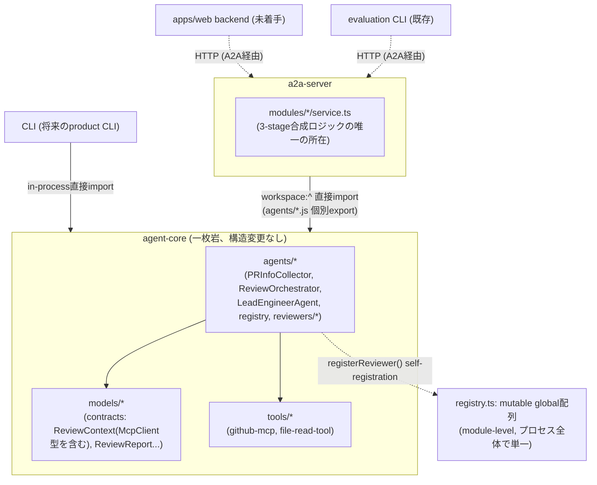
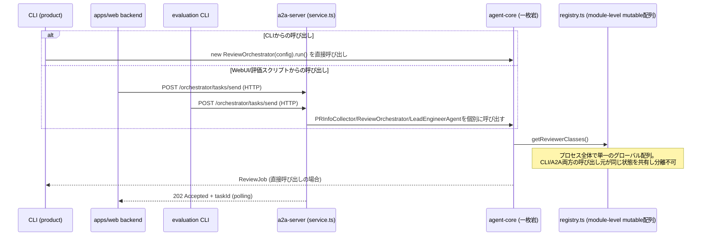
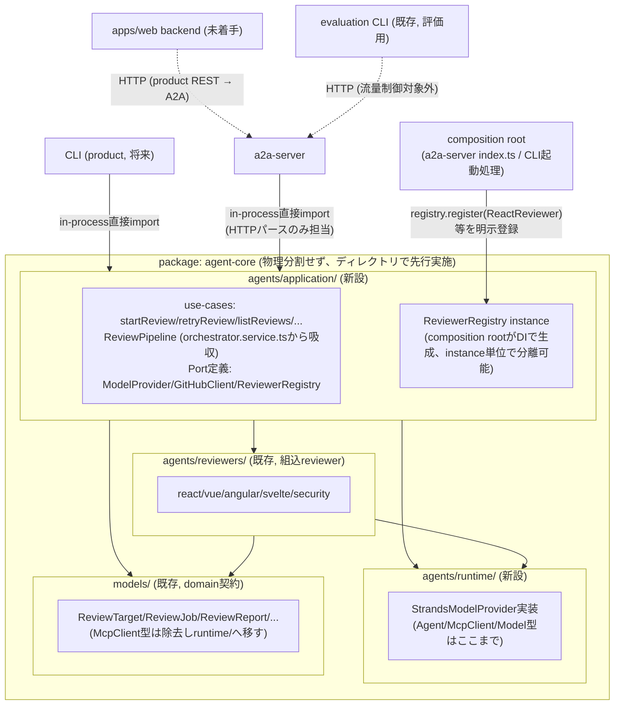
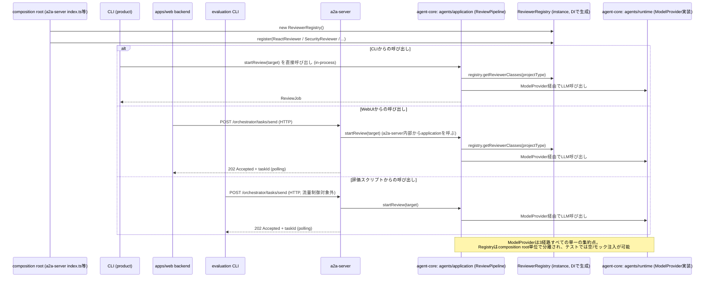
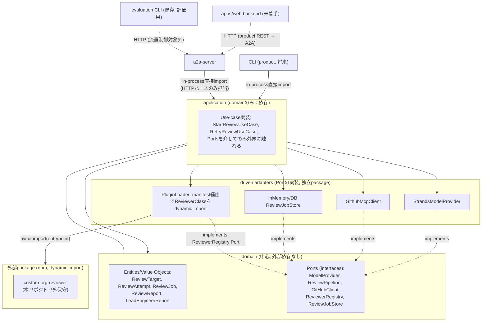
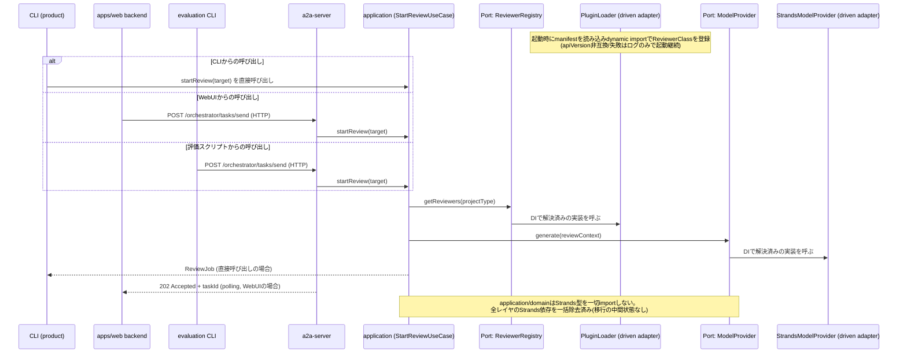

# ADR-0008: コア機能と拡張機能のパッケージ境界・レイヤリングの決定

- Status: Proposed(未実装・レビュー待ち)
- Date: 2026-08-20
- Related: Issue #346, Issue #344, Issue #243, Issue #345, Issue #347,
  [docs/adr/0004-mcp-client-session-sharing.md](0004-mcp-client-session-sharing.md),
  [docs/review-agents-design.md](../review-agents-design.md),
  [docs/a2a-api-design.md](../a2a-api-design.md)

## Context

Issue #243（レビュー対象の登録・レビュー結果確認Web UI）は永続化・product REST
API・Web UIを追加し、将来はCLIや追加reviewer等の拡張も想定する。親Issue #344は、
この機能実装群に着手する前に確定させるべきアーキテクチャ意思決定を3件（#345 流量
制御、#346 本ADRが扱うレイヤ境界、#347 呼び出しインターフェース抽象化）に切り出し
ており、#347は本ADRが定義するapplication層/port境界に直接依存する構造になってい
る。したがって本ADRの決定が遅れると、#347、ひいては#243配下の機能実装Sub-Issue群
（#244〜246, #335〜343）全体がブロックされる。

現行の`@code-review-agent/agent-core`は、名前に反して以下の異なる責務を1つの
packageに同居させている。

- Zodによるdomain/data contracts（`packages/agent-core/src/models/`）
- PR収集・レビュー・最終判定を実行するapplication/orchestrationロジック
- Strands Agentsランタイムへの直接依存
- OpenAI/Ollama model provider生成
- GitHub MCP接続と共有session管理
- 組込reviewerとmutable global registry

`ReviewOrchestrator.run()`自体はHTTP非依存であり、reviewer選択にはregistry seam
がある。一方`registerReviewer`は`packages/agent-core/package.json`のpackage
exportsに公開されず、組込reviewerはside-effect importで登録される
（`packages/agent-core/src/agents/registry.ts:18,104-107`）。そのため現在の拡張
点は内部実装パターンであり、外部から安定して利用できる契約ではない。また
`ReviewContext`はStrandsの`McpClient`型を直接含み（`packages/agent-core/src/
models/review.ts`）、domain契約とruntime frameworkの境界が曖昧である。

3-stageパイプライン（PR情報収集→並列レビュー→最終判定）の合成ロジック自体も
`agent-core`には存在せず、`packages/a2a-server/src/modules/orchestrator/
orchestrator.service.ts:213-249`にのみ実装されている。これはCLI/WebUIを追加す
る際に「同じパイプラインをどう再利用するか」を曖昧にしたまま実装が進むリスクを
生む。さらに`.serena/memories/architecture.md`は「A2A HTTP API経由での呼び出し
を推奨、コアクラス直接呼び出しは避ける」と明記しているが、実際には`a2a-server`
自身の`service.ts`群や`evaluation`パッケージの一部が`agent-core`のクラスを直接
importしており、方針と実装が既に乖離している。

Issue #346は、この状態を解消するために「何を変更しにくいコアとして維持し、何を
交換・追加可能な拡張機能/adapterとするか」を決定することを求めている。制約条件
として、Issue #255完了後のTypeScript構成を基準とすること、#243実装を停止させる
big-bang rewriteを避け段階移行可能性を評価すること、現在の3-stage workflowと既存
A2A契約の動作互換性を維持すること、拡張性のためだけに不要なnetwork/process境界を
導入せずローカル単一プロセス運用を基本とすること、Issue #345で決定するLocalLLM向
け流量制御のresource limiterを追加reviewer/providerが迂回できない境界にすること
が挙げられている。

Issue #345（LocalLLM向け流量制御）は本ADR作成時点でまだADR化されておらず
（`docs/adr/0007-localllm-review-flow-control.md`として予約済み、本ADRは0008を
使用する）、直近の検討でA2Aサーバー内へのin-process queue/semaphore実装をユーザ
ーが却下し、「A2Aサーバー外（呼び出しクライアント側、または専用の中間サービス）
に配置する」方針へ転換した経緯がある。本ADRはこの現時点の転換方針を前提とするが、
#345自体の意思決定を先取りしない（特定の実装方式を断定しない）書き方にする。

また、ユーザーとの事前合意により、driving adapter（呼び出し元）ごとに以下の非対
称な呼び出し経路を採用することが確定している。これは後述する3つのADRレベルの案
（案1/2/3）すべてに共通する前提であり、レイヤ構造の選択とは独立に決定済みである。

- **CLI**（将来のproduct CLI）: application層のuse-caseを**in-processで直接**
  呼び出す。単一ユーザーの逐次手動実行が前提であり、流量制御の主要な対象になり
  にくい。
- **評価スクリプト**（`packages/evaluation`の既存CLI群）: 評価目的であり流量制
  御の対象外として、引き続き**A2A HTTP API経由**で呼び出す（既存メモリの「エー
  ジェント呼び出しは必ずA2A HTTP API経由」というルールを、この範囲に限定して存
  続させる）。
- **WebUI**（`apps/web`、`pnpm-workspace.yaml`でworkspaceパターンのみ予約済み、
  実体は未着手）: 専用のproduct REST APIバックエンドを持つが、そのバックエンド
  はapplication層を直接importせず、**A2A HTTP API経由で間接的に**呼び出す。複数
  リクエストを捌く必要があり、Issue #345が定める「A2Aサーバー外の流量制御」の対
  象にする必要があるため。

## 検討事項

Issue #346が求める決定は、以下5つの論点（軸）にまたがる。個々の論点を独立に決め
るのではなく、5つの論点すべてに一貫して答える**ADR全体としての案**を比較し、その
1つを採用する（後述の「検討案」参照）。

### 論点1: レイヤとpackageの責務境界

**課題**: `agent-core`が抱える複数の責務（domain契約・application制御フロー・
runtime統合・組込reviewer）をどの粒度の境界で分離するか。境界をmodule内規約に留
めるか、package分割まで行うか、さらに厳密なhexagonal構成へ進めるかによって、依存
方向の強制力・循環依存リスク・公開API安定性・既存コードの移行量・テスト容易性・
CLI/Web/A2Aでの再利用性・Strands更新の影響範囲が大きく変わる。

### 論点2: コア機能と拡張機能の分類基準

**課題**: 3-stageワークフロー、各フレームワークreviewer、GitHub MCP/REST、model
provider、persistence/queue、Web/CLI/A2A、prompt/skillsが現状区別なく実装されて
おり、新機能追加のたびに「これはcoreとして扱うべきか、拡張として追加すべきか」の
判断基準が存在しない。基準がないままレイヤを分割しても、将来の変更がどちらの層に
属するか毎回議論になる。**この論点は論点1の3案どれを採用しても同じ基準が成立する
（案間で差が出ない独立の軸）**ため、検討内容では3案共通の結論として1回だけ扱う。

### 論点3: reviewer拡張契約とregistry lifecycle

**課題**: 現状の`registry.ts`はモジュールレベルのmutable配列
（`packages/agent-core/src/agents/registry.ts:18`）で、`registerReviewer()`に
よる自己登録のみをサポートする。DIの余地がなく、テストや複数呼び出し元間での状態
分離ができない。また各reviewer・`LeadEngineerAgent`・`PRInfoCollector`が
`createModelProvider()`を個別に直接呼んでおり、Issue #345で決定される流量制御方
式（in-process/サーバー外いずれであっても）を、reviewer/providerの追加が迂回で
きない境界にする必要がある。

### 論点4: runtime framework依存の隔離範囲・移行順序

**課題**: `ReviewContext.sharedMcpClient`がStrandsの`McpClient`型を直接domain契
約に持ち込んでおり（`packages/agent-core/src/models/review.ts`）、Strandsの
`Agent`/`Model`型も複数のレイヤから直接参照されている。Strandsのバージョンアップ
や将来の差し替えの影響範囲が不明瞭であり、また流量制御を導入する際の単一の差し込
み点も存在しない。この依存をどのレイヤまで許容し、どの順序（一括か段階か）で隔離
するかを決める必要がある。

### 論点5: 公開APIと互換性ポリシー

**課題**: `agent-core`の`package.json`の`exports`は内部クラス7種
（`agents/pr-info-collector.js`等）を公開する一方、拡張の入口である
`registry.ts`は非公開という非対称な状態にある。全workspace packageは
`"private": true`かつ`"version": "0.0.0"`でnpm公開を行わないため、一般的な
semverバージョニングをそのまま適用できない。内部モジュールへの迂回importをどう
防ぎ、互換性をどう管理するかを決める必要がある。**この論点は論点1の帰結に従属す
る**（物理package分割を選ばない限り、pnpm workspaceの依存宣言による機械的強制は
使えない）ため、独立した論点というより論点1の派生として扱う。

### 検討案（ADRとしての3つの案）

論点1〜5すべてに一貫して答える、ADR全体としての代替案を3つ比較する。各案は個々の
論点の選択肢を機械的に組み合わせたものではなく、それぞれ独立した設計思想（テー
ゼ）を持つ。

- **案1: 構造変更なし・規約のみで運用**——`agent-core`を一枚岩のまま維持し、境
  界はコードレビュー時の規約に委ねる。移行コストは最小だが、強制力を持たない。
- **案2: 論理分離を先行させ、物理分割はトリガー条件まで保留（段階移行）**——
  `agent-core`パッケージ内に`agents/application/`・`agents/runtime/`をディレク
  トリレベルで新設し、レイヤ構造を先取りする。reviewer拡張はcomposition root所
  有のDI registryインスタンスへ移行し、Strands依存はstrangler patternで段階的に
  隔離する。物理package分割は`apps/web`がStrands非依存の実行環境を具体的に要求
  する時点まで見送る。
- **案3: 物理package分割とhexagonal化を即時実施**——`contracts`/`application`/
  `runtime-strands`を即座に独立packageへ分割し、domain中心のhexagonal構成へ一
  括移行する。reviewer拡張はmanifest/dynamic importによるplugin discoveryまで
  踏み込み、外部（本リポジトリ外保守）reviewerの追加をコード変更なしで可能にす
  る。

3案が5論点にどう答えるかを一覧にすると以下の通り。

| 論点 | 案1 | 案2 | 案3 |
|---|---|---|---|
| 論点1: レイヤ/package境界 | 現状維持（module内規約のみ） | ディレクトリ分離を先行、物理分割は保留 | 即座にpackage分割・hexagonal化 |
| 論点2: core/拡張分類基準 | （3案共通、検討内容で1回のみ記載） | 同左 | 同左 |
| 論点3: registry lifecycle | mutable global registryのまま | composition root所有のDI instance | manifest駆動のplugin discovery |
| 論点4: runtime隔離順序 | 隔離しない（現状のまま） | strangler pattern（4段階） | 一括移行 |
| 論点5: 公開API方針 | 現状のexportsのまま（強制力なし） | exports中心・biome補助 | package分割による強制が主軸 |

## 検討内容

### 案1: 構造変更なし・規約のみで運用

### 案2: 論理分離を先行させ、物理分割はトリガー条件まで保留（段階移行）

### 案3: 物理package分割とhexagonal化を即時実施

### 観点ごとの検討結果

#### 論点1: レイヤとpackageの責務境界

| 観点 | 案1(現状維持) | 案2(段階移行) | 案3(即時package分割) |
|---|---|---|---|
| 依存方向 | 規約のみで強制力なし。`.serena/memories/architecture.md`の方針と実装（a2a-server/evaluationがagent-coreを直接import）が既に乖離している | `driving adapter → application → {runtime, agent-core内reviewer}`の一方向。ディレクトリ規約＋import-lintで強制 | `driving adapter → application → domain`の一方向。pnpm workspaceの依存宣言で機械的に強制される |
| 循環依存リスク | lintでしか検知できず、形骸化リスクが高い | ディレクトリ境界＋lintで検知。物理境界ほどではないが案1より高い | package境界で機械的に検知される、最小 |
| 公開API安定性 | `exports`が内部クラス7種を無差別公開しており意図した設計になっていない | `agent-core`のexportsは移行完了まで現状維持（過渡的） | `contracts`/`application`のexportsだけを安定させればよい、最も高い |
| 既存コード移行量 | ゼロ（#243実装を止めない） | 中。`orchestrator.service.ts`の合成ロジック移動、`ReviewContext`型変更、`createModelProvider`のport化が必要だが、a2a-server側に既にport相当の型（`PRInfoCollectorClass`等）が存在するためゼロからの設計ではない | 最大。`reviewer-plugins`の独立package化、`InMemory*TaskStore`3実装の統合まで要求され、big-bang rewrite回避の制約に抵触しうる |
| テスト容易性 | Strands/ネットワーク込みでしかテストできない箇所が多い | `application`は`contracts`のみに依存し、Strandsやネットワークなしにユニットテスト可能 | 最高。全Portをモック化できる |
| CLI/Web/A2A再利用性 | 3-stage合成ロジックがa2a-server内にのみあり、CLIが必要とする場合は複製かHTTP越しの利用の二択になる | CLI/A2Aとも`agents/application/`の同一use-caseを呼べる（WebUIはA2A経由に限定する合意のため間接） | 案2と同等 |
| Strands更新影響範囲 | domain契約(`ReviewContext`)にまで及ぶ | `agents/runtime/`に閉じる | 最も厳密に閉じ込められる |
| ローカル単一プロセス運用の制約との整合 | 制約に抵触しない（追加境界なし） | ディレクトリ分離の段階では抵触しない。物理package分割の段階でもnetwork/process境界は増えない | package/ディレクトリ数増加が「ソースレベルの境界」に留まることを明示しないと過剰設計と誤解されるリスク |

案1は移行コストゼロだが、#347がブロックされたままになり、既存の方針
(`architecture.md`)と実装の乖離も放置される。案3はdomain中心の理想形だが、現時点
での移行量が大きく、big-bang回避の制約と抵触する。案2は`orchestrator.service.ts`
が既にport相当の型を持つ事実を活かせ、移行量を最小化できる。

#### 論点2: コア機能と拡張機能の分類基準（3案共通）

分類基準そのものは案1/2/3のどれを採用しても独立に成立する。基準は「application
契約（use-case/port/3-stage構造）への影響度」を主軸とし、「保守主体（本リポジト
リ内保守か、リポジトリ外保守か）」を拡張のサブ分類として併用する。

| 要素 | 分類 | 理由 |
|---|---|---|
| 3-stageワークフロー構造 | core | 変更するとapplication契約が変わる |
| registry選択ロジック(`getReviewerClasses`) | core | reviewer拡張契約を成立させる基盤 |
| detection rule構造(`DETECTION_RULES`の判定アルゴリズム) | core | registryのcore選択ロジックと一体 |
| React/Vue/Angular/Svelte/Security reviewer | 組込拡張 | `ReviewerClass`契約のPort実装の1つ |
| GitHub MCP統合 | core寄りの組込拡張 | 唯一のPR情報源だが`GitHubClient` Port化により差し替え可能にする |
| Model Provider (OpenAI/Ollama) | 組込拡張 | `ModelProvider` Portの実装 |
| persistence(`InMemory*TaskStore`) | 組込拡張 | `ReviewJobStore` Port相当 |
| Web/CLI/A2A（driving adapter） | 組込拡張 | applicationのuse-caseを呼ぶだけで契約を変えない |
| 個別reviewerのdetectionルール追加 | 組込拡張 | 個別ルール追加はcore構造を変えない |
| prompt/skills | 外部拡張候補（実装はスコープ外） | reviewer本体を変えずprompt差し替えのみで挙動を変えられる |

#### 論点3: reviewer拡張契約とregistry lifecycle

| 観点 | 案1(mutable global) | 案2(DI instance) | 案3(plugin discovery) |
|---|---|---|---|
| 実装コスト | 最小（変更不要） | 中（自己登録パターンをcomposition root側の明示登録に置換） | 大（manifest schema, loader, 互換性チェックの新規実装） |
| テスト容易性 | 低（プロセス全体で単一状態、テスト間で分離不可） | 高（instance単位で空/モックregistryを注入可能） | 高（案2と同等だが外部pluginの読み込み自体はテストしにくい） |
| driving adapterごとの有効reviewerの出し分け | 不可 | 可能（CLI/A2Aなど呼び出し元ごとに異なるinstanceを構成できる） | 可能 |
| 将来の流量制御(#345)との整合 | limiter付きModelProviderを経由しないreviewer登録を構造的に防げない | ModelProviderと同じcomposition rootでDIすることで迂回を防ぎやすい | 案2と同等の効果を持ちうるが、pluginロード自体が別の迂回経路になりうる |
| 外部拡張(本リポジトリ外保守)への対応 | 非対応（exports未公開） | 非対応（composition root経由の登録のみ） | 対応（真の外部pluginをコード変更なしに追加可能） |
| 現時点での必要性との釣り合い | 需要には足りるが将来の分離要求に応えられない | 需要と複雑さが釣り合う | 過剰（plugin marketplace等は明示的にスコープ外） |

案2はテスト容易性とdriving adapterごとの状態分離という2観点で明確に優位。案3が
持つ外部拡張対応力は、現時点でスコープ外とされた需要（plugin marketplace等）に
応えるものであり、案2の登録APIの上に将来追加できる関係にあるため排他的ではない。
安定した公開契約は`ReviewerMetadata`（`reviewerId`, `perspective`,
`projectTypes`, `apiVersion`）+ `ReviewerClass`とし、重複登録は例外送出、
unregisterはcomposition root専用API、version compatibilityは`apiVersion`のmajor
不一致で登録拒否とする。

#### 論点4: runtime framework依存の隔離範囲・移行順序

| 観点 | 案1(隔離しない) | 案2(strangler段階移行) | 案3(一括移行) |
|---|---|---|---|
| #243実装への影響 | 影響なし（変更しないため） | 各段階が独立して完結し、実装中の機能追加と並行できる | 実装中の機能追加を一時停止させるリスクが高く、big-bang rewrite回避の制約に抵触しうる |
| リスクの分離 | リスクは顕在化しないが根本課題も解消しない | `ReviewContext`型変更（ADR-0004との整合が必要な変更）を最後に回し、最初にリスクの低いModelProvider化から着手できる | ADR-0004の参照カウント設計への影響とModelProvider化が同時に発生し、問題切り分けが困難 |
| Issue #345との整合 | 流量制御の単一差し込み点が存在しないまま | 第1段階(ModelProvider Port)だけで#345がどちらの方式に決まっても対応できる差し込み点が早期に確立する | 一括移行完了まで流量制御の単一差し込み点が存在しない |
| レビュー・検証の粒度 | 対象外 | 段階ごとに小さくレビュー・検証でき、CONTRIBUTING.mdのTDDサイクル運用と整合する | 変更量が大きく1回のレビューでの検証が困難 |

案2を採用する。段階は次の順序とする。

1. `ModelProvider` Portの導入（`model-provider-factory.ts`をラップし、
   `base-reviewer.ts`/`lead-engineer.ts`/`pr-info-collector.ts`の3箇所をDI経由
   の呼び出しに書き換える。挙動は変えず呼び出し経路のみ変更）
2. `GitHubClient` Portの導入（`tools/github-mcp.ts`をラップ。ADR-0004の参照カウ
   ント方式は実装内部詳細として保持し、Port外には露出しない）
3. `ReviewContext`からの`McpClient`型除去（第2段で確立した`GitHubClient` Portを
   介した抽象型に置き換える。ADR-0004の決定自体は変更しない）
4. `ReviewPipeline` Portの導入（`orchestrator.service.ts`の合成ロジックを
   `agents/application/`へ移し、a2a-serverはHTTPパースのみに縮小する）

許容するトレードオフは、`ReviewContext`からの`McpClient`型除去を後回しにするこ
とで、移行完了までの中間状態で一部レイヤにStrands型が残存し続ける期間が生じる
こと。この「一部レイヤ」とは具体的に`models/review.ts`の`ReviewContext.
sharedMcpClient`を指し、後述する合意事項2の「Agent/McpClient/Model型は
`agents/runtime/`にのみ許容する」という原則に対する、Stage3完了までの明示的な例
外である。この間、biomeのimport制限ルールは`agents/application/**`および組込
reviewer検出ロジックからの`@strands-agents/sdk`直接importを禁止する形で適用し、
`models/review.ts`はStage3完了（`McpClient`型除去）までルール適用除外パスとし
て扱う。

#### 論点5: 公開APIと互換性ポリシー（論点1の帰結）

| 観点 | 案1(現状exports、強制力なし) | 案2(exports中心・biome補助) | 案3(package分割中心) |
|---|---|---|---|
| 強制力の確実性 | 強制力なし（内部クラス7種が無差別公開） | Node/TSのモジュール解決レベルで強制され迂回不可。lintは補助 | pnpm workspaceの依存宣言により物理的に迂回不可、最も強力 |
| 現時点での実装コスト | ゼロ | 低（`exports`とディレクトリ整理のみ） | 高（論点1で即時分割を選ぶ前提が必要） |
| 論点1の選択との整合 | 論点1=案1（構造変更なし）と対応 | 論点1=案2（段階移行）と対応。ディレクトリ分離の段階から適用可能 | 論点1=案3（即時package分割）と対応 |

この論点は独立の意思決定ではなく、論点1でどの案を採るかによって選択肢が決まる
（現状exports維持は案1、exports中心+biome補助は案2、package分割による強制は案3
に、それぞれ一対一で対応する）。`agent-core`のexportsは案2採用時、単に現状維持す
るのではなく、安定入口（`.`）と移行完了まで公開を保つ汎用utility
（`agents/target-file.js`）、移行対象の内部実装（残り6エントリ）に区分し、内部実
装への新規importをbiomeで禁止しつつ既存呼び出し元を許可リスト化する（具体的な運
用はDecision項目6を参照）。バージョニングはexports surfaceの安定性 + reviewer契
約の`apiVersion`フィールドで代替する（全packageが`private:true`のためnpm semver
は使わない）。

## Decision

**案2「論理分離を先行させ、物理分割はトリガー条件まで保留（段階移行）」を採用す
る。**

`agent-core`パッケージは当面維持しつつ、内部を`agents/application/`（use-case・
`ReviewPipeline`合成ロジック・Port定義）と`agents/runtime/`（Strands依存実装）に
ディレクトリレベルで分離する。reviewer拡張はcomposition root所有のDI registry
インスタンス方式へ移行し、driving adapterはCLIのみapplication層に直結、WebUIと
評価スクリプトはA2A HTTP API経由に統一する。Strands依存は
ModelProvider→GitHubClient→ReviewContext型除去→ReviewPipelineの順でruntime層に
隔離し、コア/拡張の分類はapplication契約への影響度を主基準に用いる。公開APIは
exports中心・biome補助の方針で管理する。物理的なpackage分割は、`apps/web`が
Strands非依存の実行環境を具体的に要求する時点まで見送る。

この1つの決定を構成する実装レベルの合意事項は以下の通り。

1. `packages/agent-core/src/agents/application/`を新設し、use-case関数
   （`startReview`, `retryReview`, `listReviews`, `getReview`, `closeReview`,
   `applyCommentDisposition`, `registerReview`）、`ReviewPipeline`（現
   `orchestrator.service.ts:213-249`の合成ロジックを吸収）、Port interface
   （`ModelProvider`, `GitHubClient`, `ReviewerRegistry`）を配置する。
2. `packages/agent-core/src/agents/runtime/`を新設し、`model-provider-factory.ts`
   等のStrands依存実装を配置する。`Agent`/`McpClient`/`Model`型はこのディレクトリ
   にのみ許容し、application/domain/組込reviewerの検出ロジックからは参照しない。
   ただし`models/review.ts`の`ReviewContext.sharedMcpClient`は、合意事項5のStage3
   （`McpClient`型除去）が完了するまでの間、この原則に対する明示的な例外として
   許容する（詳細は論点4の検討内容を参照）。
3. `registry.ts`の`registerReviewer()`による自己登録パターンを廃止し、
   composition root（`a2a-server/src/index.ts`、将来のCLI起動処理）が
   `ReviewerRegistry`インスタンスを生成し明示的に`register()`する方式へ移行す
   る。重複登録は例外送出、unregisterはcomposition root専用APIとする。
4. driving adapterごとの呼び出し経路を次の通り固定する: CLI（将来のproduct
   CLI）は`agents/application/`のuse-caseをin-processで直接呼び出す。
   `a2a-server`は同じuse-caseを内部で呼び出しHTTPパースのみ担当する。`apps/web`
   （未着手）のバックエンドは`application`を直接importせずA2A HTTP API経由で呼
   ぶ。`packages/evaluation`の既存評価CLI群は引き続きA2A HTTP API経由のみとし、
   流量制御の対象外という位置づけを維持する。
5. Strands依存の隔離は`ModelProvider` Port→`GitHubClient` Port→
   `ReviewContext`からの`McpClient`型除去（ADR-0004の参照カウント設計は変更しな
   い）→`ReviewPipeline` Portの順で段階的に行う。
6. `agent-core`の`package.json`の`exports`は、安定した公開入口として`.`
   （`models/index.ts`がre-exportするdomain契約。`ReviewerMetadata.apiVersion`と
   併せて互換性契約の主体とする）を先に固定する。論点3の決定により`ReviewerClass`
   も`ReviewerMetadata`と並ぶ安定した公開契約に含まれるため、型定義を現状の
   `agents/base-reviewer.ts`から`models/`配下のdomain契約へ移設し、`.`
   （`models/index.ts`のre-export）経由で公開する。移設にあたり、`ReviewerClass`
   の構築契約（`new (config: ReviewerConfig): T`）がdomain外へ逆依存しないよう、
   `ReviewerConfig`のうちprovider選択に関わるフィールド（`providerType`等、現状
   `agents/model-provider-factory.ts`の`ProviderType`に依存）は合意事項1/5で定
   義した`ModelProvider` Portの抽象化対象としdomain側の契約には含めない（合意事
   項2のStrands隔離原則を維持するため）。`ReviewerConfig`各フィールドの具体的な
   移行先・型定義の詳細設計はADRの決定粒度を超えるため、DoD項目9に基づき別途
   Sub-Issueで扱う。import pathは`@code-review-agent/agent-core`のルートエント
   リのまま維持し、後述する`agents/base-reviewer.js`（実装側の移行対象entry）の
   削除可否とは独立させる。
   残る公開エントリは性質により3種に区分して扱う。`agents/target-file.js`
   （`isTargetFile`は特定reviewerに紐付かない汎用utilityでありuse-case化の対象
   外）は恒久的に公開を維持する。移行対象エントリ（`agents/pr-info-collector.js`,
   `agents/lead-engineer.js`, `agents/review-orchestrator.js`,
   `agents/base-reviewer.js`, `agents/reviewers/*.js`）は、`agents/application/`
   のuse-case経由呼び出しに置き換わる内部実装であり、移行期間中はbiomeの
   `noRestrictedImports`ルールでこれらのエントリへの**新規import**を
   `agent-core`パッケージ外から禁止しCIで強制する。既存の呼び出し元（`a2a-server`
   の`orchestrator.service.ts`/`lead-engineer.service.ts`/`pr-info.service.ts`/
   `reviewers/*.service.ts`各サービス）は許可リストとして明示するが、削除は
   Stage4（`ReviewPipeline` Port導入）完了時点でこれらを一括削除するのではなく、
   エントリごとに最後の許可コンシューマの移行が完了した時点で個別に
   `@deprecated`注記を経て`exports`から削除する。CI強制の具体的な実装方式（PR
   差分ベースのimport specifier単位検査、allowlist解除条件、移行完了判定基準
   等）はADRの決定粒度を超えるため、DoD項目9に基づき別途Sub-Issueで扱う。
   残る2エントリは、対応する許可コンシューマが利用し続ける限り維持する恒常的な
   安定entryとする。`agents/model-provider-factory.js`は`evaluation`パッケージ
   の`score-evaluation.ts`がLLM-as-judgeスコアリング用途（レビューpipelineでは
   ない）で直接利用するため本移行の対象外とする。合意事項4の「`evaluation`の既
   存評価CLI群はA2A HTTP API経由のみ」という制約は、レビュー実行を要求する呼び
   出し経路を対象としたものであり、生成済み予測に対する事後スコアリングである
   `score-evaluation.ts`はその対象外として扱う。許容するStrands依存範囲は
   `createModelProvider`/`ProviderType`によるモデル呼び出しのみとし、
   `ReviewPipeline`やreviewer実装群への依存は含めない。`score-evaluation.ts`が
   このentryを利用し続ける間`exports`に維持する。新設する`agents/bootstrap.js`
   （組込reviewerクラス群への参照のみを持つ、`registerReviewer()`自己登録廃止後
   の明示登録専用エントリ）は、composition root（`a2a-server/src/index.ts`）が
   合意事項3に基づき組込reviewerを`ReviewerRegistry`へ明示`register()`するため
   に利用し続ける間`exports`に維持する。
7. コア/拡張の分類は「application契約（use-case/port/3-stage構造）への影響度」
   を主基準とし、「本リポジトリ内保守か外部保守か」を拡張のサブ分類として用い
   る。
8. 物理的なpackage分割（`contracts`/`application`/`runtime-strands`の独立
   package化、案3相当への移行）は、`apps/web`がStrands非依存の実行環境（ブラウ
   ザバンドル、別デプロイ単位のサーバー等）を具体的に要求する時点で改めて実施す
   る。

## Consequences

- `orchestrator.service.ts`の合成ロジックが`agent-core`内へ移動することで、将来
  のCLIが3-stageパイプラインをHTTPなしに再利用できるようになる。一方、CLIが
  application層に直結することは、Issue #345が定める「A2Aサーバー外の流量制御」
  の対象外になることを意味する。CLIは単一ユーザーの逐次手動実行が前提のためリス
  クは限定的と判断するが、Issue #345のADR確定時にこの前提が変わらないか再確認す
  る必要がある。
- `.serena/memories/architecture.md`の「A2A HTTP API経由の呼び出しを推奨」という
  記述は、CLI直結の例外を反映して更新が必要になる。同様にユーザーメモリ
  `feedback_a2a_agent_invocation`も、評価スクリプトに限定したルールである旨を明
  記する更新が必要になる。
- `registry.ts`の自己登録パターン廃止により、組込reviewerを追加する際の実装手順
  （現状は`reviewers/`にファイルを追加するだけ）が、composition root側への明示
  登録を含む手順に変わる。既存reviewer実装コード自体（プロンプト・検出ロジッ
  ク）は変更不要。
- Strands隔離の第3段階（`ReviewContext`からの`McpClient`型除去）まで、一部レイ
  ヤにStrands型が残存し続ける。ADR-0004（MCPクライアントのセッション共有）の決
  定自体（並列レビュー内での共有・参照カウント方式）は変更しないため、この段階
  のリファクタリングはADR-0004と矛盾しない。
- 物理package分割（案3相当）を見送ることで、`contracts`/`application`/
  `runtime-strands`という独立したビルド単位・依存関係の恩恵（インストールサイズ
  削減等）は`apps/web`の要件が具体化するまで得られない。
- 本ADRはIssue #346のDefinition of Doneのうち、決定内容を実装タスクへ分割し
  #243配下のSub-Issueへ依存関係を反映する項目（DoD項目9）を満たさない。ADRマー
  ジ後、別途Sub-Issueとして起票する。
- Issue #347（呼び出しインターフェース抽象化）は、本ADRで定義したuse-case関数シ
  グネチャ、4つのPort interface（`ModelProvider`/`GitHubClient`/
  `ReviewerRegistry`/`ReviewPipeline`）、reviewer公開契約
  （`ReviewerClass`/`ReviewerMetadata`/`apiVersion`）、driving adapterごとの呼
  び出し経路規約を前提に着手できる。
