# ADR-0008: コア機能と拡張機能のパッケージ境界・レイヤリングの決定

- Status: Proposed(未実装・レビュー待ち)
- Date: 2026-08-20
- Related: Issue #346, Issue #344, Issue #243, Issue #345, Issue #347,
  [docs/adr/0004-mcp-client-session-sharing.md](0004-mcp-client-session-sharing.md),
  [docs/review-agents-design.md](../review-agents-design.md),
  [docs/a2a-api-design.md](../a2a-api-design.md)

## Context

Issue #243（レビュー対象の登録・レビュー結果確認Web UI）は永続化・product REST
API・Web UIを追加し、将来はCLIや追加reviewer等の拡張も想定する。親Issue #344は、
この機能実装群に着手する前に確定させるべきアーキテクチャ意思決定を3件（#345 流量
制御、#346 本ADRが扱うレイヤ境界、#347 呼び出しインターフェース抽象化）に切り出し
ており、#347は本ADRが定義するapplication層/port境界に直接依存する構造になってい
る。したがって本ADRの決定が遅れると、#347、ひいては#243配下の機能実装Sub-Issue群
（#244〜246, #335〜343）全体がブロックされる。

現行の`@code-review-agent/agent-core`は、名前に反して以下の異なる責務を1つの
packageに同居させている。

- Zodによるdomain/data contracts（`packages/agent-core/src/models/`）
- PR収集・レビュー・最終判定を実行するapplication/orchestrationロジック
- Strands Agentsランタイムへの直接依存
- OpenAI/Ollama model provider生成
- GitHub MCP接続と共有session管理
- 組込reviewerとmutable global registry

`ReviewOrchestrator.run()`自体はHTTP非依存であり、reviewer選択にはregistry seam
がある。一方`registerReviewer`は`packages/agent-core/package.json`のpackage
exportsに公開されず、組込reviewerはside-effect importで登録される
（`packages/agent-core/src/agents/registry.ts:18,104-107`）。そのため現在の拡張
点は内部実装パターンであり、外部から安定して利用できる契約ではない。また
`ReviewContext`はStrandsの`McpClient`型を直接含み（`packages/agent-core/src/
models/review.ts`）、domain契約とruntime frameworkの境界が曖昧である。

3-stageパイプライン（PR情報収集→並列レビュー→最終判定）の合成ロジック自体も
`agent-core`には存在せず、`packages/a2a-server/src/modules/orchestrator/
orchestrator.service.ts:213-249`にのみ実装されている。これはCLI/WebUIを追加す
る際に「同じパイプラインをどう再利用するか」を曖昧にしたまま実装が進むリスクを
生む。さらに`.serena/memories/architecture.md`は「A2A HTTP API経由での呼び出し
を推奨、コアクラス直接呼び出しは避ける」と明記しているが、実際には`a2a-server`
自身の`service.ts`群や`evaluation`パッケージの一部が`agent-core`のクラスを直接
importしており、方針と実装が既に乖離している。

Issue #346は、この状態を解消するために「何を変更しにくいコアとして維持し、何を
交換・追加可能な拡張機能/adapterとするか」を決定することを求めている。制約条件
として、Issue #255完了後のTypeScript構成を基準とすること、#243実装を停止させる
big-bang rewriteを避け段階移行可能性を評価すること、現在の3-stage workflowと既存
A2A契約の動作互換性を維持すること、拡張性のためだけに不要なnetwork/process境界を
導入せずローカル単一プロセス運用を基本とすること、Issue #345で決定するLocalLLM向
け流量制御のresource limiterを追加reviewer/providerが迂回できない境界にすること
が挙げられている。

Issue #345（LocalLLM向け流量制御）は本ADR作成時点でまだADR化されておらず
（`docs/adr/0007-localllm-review-flow-control.md`として予約済み、本ADRは0008を
使用する）、直近の検討でA2Aサーバー内へのin-process queue/semaphore実装をユーザ
ーが却下し、「A2Aサーバー外（呼び出しクライアント側、または専用の中間サービス）
に配置する」方針へ転換した経緯がある。本ADRはこの現時点の転換方針を前提とするが、
#345自体の意思決定を先取りしない（特定の実装方式を断定しない）書き方にする。

また、ユーザーとの事前合意により、driving adapter（呼び出し元）ごとに以下の非対
称な呼び出し経路を採用することが確定している。

- **CLI**（将来のproduct CLI）: application層のuse-caseを**in-processで直接**
  呼び出す。単一ユーザーの逐次手動実行が前提であり、流量制御の主要な対象になり
  にくい。
- **評価スクリプト**（`packages/evaluation`の既存CLI群）: 評価目的であり流量制
  御の対象外として、引き続き**A2A HTTP API経由**で呼び出す（既存メモリの「エー
  ジェント呼び出しは必ずA2A HTTP API経由」というルールを、この範囲に限定して存
  続させる）。
- **WebUI**（`apps/web`、`pnpm-workspace.yaml`でworkspaceパターンのみ予約済み、
  実体は未着手）: 専用のproduct REST APIバックエンドを持つが、そのバックエンド
  はapplication層を直接importせず、**A2A HTTP API経由で間接的に**呼び出す。複数
  リクエストを捌く必要があり、Issue #345が定める「A2Aサーバー外の流量制御」の対
  象にする必要があるため。

## 検討事項

### 検討事項1: レイヤとpackageの責務境界

**課題**: `agent-core`が抱える複数の責務（domain契約・application制御フロー・
runtime統合・組込reviewer）をどの粒度の境界で分離するか。境界をmodule内規約に留
めるか、package分割まで行うか、さらに厳密なhexagonal構成へ進めるかによって、依存
方向の強制力・循環依存リスク・公開API安定性・既存コードの移行量・テスト容易性・
CLI/Web/A2Aでの再利用性・Strands更新の影響範囲が大きく変わる。

**検討案**:
- **案A**: 現状の`agent-core`を維持し、module内規約だけで分離する
- **案B**: contracts / application / runtime-adapters をpackage分割する
- **案C**: domain中心のhexagonal（ports-and-adapters）構成へ段階移行する

### 検討事項2: コア機能と拡張機能の分類基準

**課題**: 3-stageワークフロー、各フレームワークreviewer、GitHub MCP/REST、model
provider、persistence/queue、Web/CLI/A2A、prompt/skillsが現状区別なく実装されて
おり、新機能追加のたびに「これはcoreとして扱うべきか、拡張として追加すべきか」の
判断基準が存在しない。基準がないままレイヤを分割しても、将来の変更がどちらの層に
属するか毎回議論になる。

**検討案**:
- **案A**: 実装が単一か複数かで判定する（1つしか実装がないものはcore）
- **案B**: application契約（use-case/port/3-stage構造）への影響度で判定する
- **案C**: 保守主体（本リポジトリ内保守か、リポジトリ外保守か）で判定する

### 検討事項3: reviewer拡張契約とregistry lifecycle

**課題**: 現状の`registry.ts`はモジュールレベルのmutable配列
（`packages/agent-core/src/agents/registry.ts:18`）で、`registerReviewer()`に
よる自己登録のみをサポートする。DIの余地がなく、テストや複数呼び出し元間での状態
分離ができない。また各reviewer・`LeadEngineerAgent`・`PRInfoCollector`が
`createModelProvider()`を個別に直接呼んでおり、Issue #345で決定される流量制御方
式（in-process/サーバー外いずれであっても）を、reviewer/providerの追加が迂回で
きない境界にする必要がある。

**検討案**:
- **案A**: 現在のmutable global registryをそのままpackage exportする
- **案B**: application（composition root）ごとのregistry instanceをDIする
- **案C**: manifest/dynamic importによるplugin discoveryを導入する

### 検討事項4: runtime framework依存の隔離範囲

**課題**: `ReviewContext.sharedMcpClient`がStrandsの`McpClient`型を直接domain契
約に持ち込んでおり（`packages/agent-core/src/models/review.ts`）、Strandsの
`Agent`/`Model`型も複数のレイヤから直接参照されている。Strandsのバージョンアップ
や将来の差し替えの影響範囲が不明瞭であり、また流量制御を導入する際の単一の差し込
み点も存在しない。この依存をどのレイヤまで許容し、どの順序で隔離するかを決める必
要がある。

**検討案**:
- **案A**: 一括移行（全レイヤのStrands依存を一度に除去しPort化する）
- **案B**: strangler pattern的な段階移行（`ModelProvider`→`GitHubClient`→
  `ReviewContext`からの型除去→`ReviewPipeline`の順に4段階で移行する）

### 検討事項5: 公開APIと互換性ポリシー

**課題**: `agent-core`の`package.json`の`exports`は内部クラス7種
（`agents/pr-info-collector.js`等）を公開する一方、拡張の入口である
`registry.ts`は非公開という非対称な状態にある。全workspace packageは
`"private": true`かつ`"version": "0.0.0"`でnpm公開を行わないため、一般的な
semverバージョニングをそのまま適用できない。内部モジュールへの迂回importをどう
防ぎ、互換性をどう管理するかを決める必要がある。

**検討案**:
- **案A**: `exports`フィールドを第一の強制手段とし、biomeのimport制限ルールを補
  助的に使う
- **案B**: biomeのlintルール（`noRestrictedImports`等）を主軸に強制する
- **案C**: 物理的なpackage分割（依存宣言のないpackageの内部モジュールはpnpm
  workspace上そもそもimportできない）を主軸にする

## 検討内容

### 検討事項1: レイヤとpackageの責務境界

#### 案A: 現状維持（agent-core一枚岩、module内規約のみ）

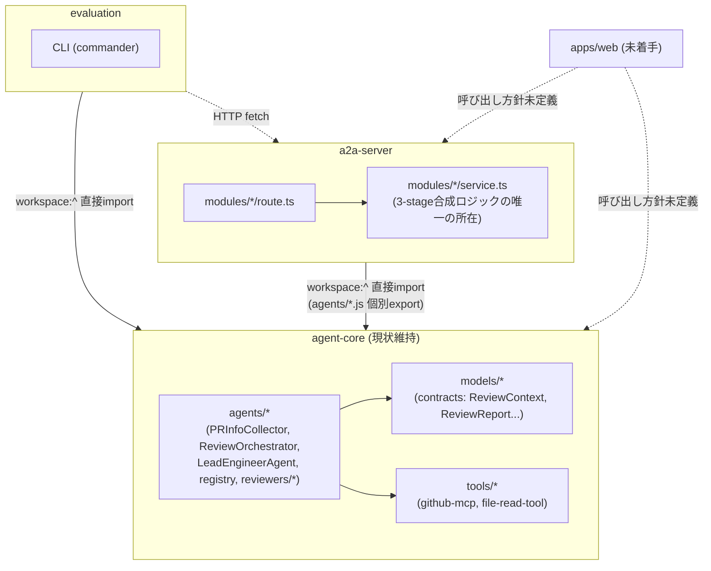

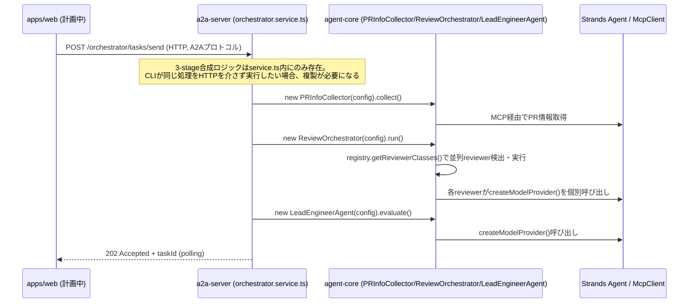

#### 案B: レイヤをpackage分割（contracts / application / runtime-adapters）

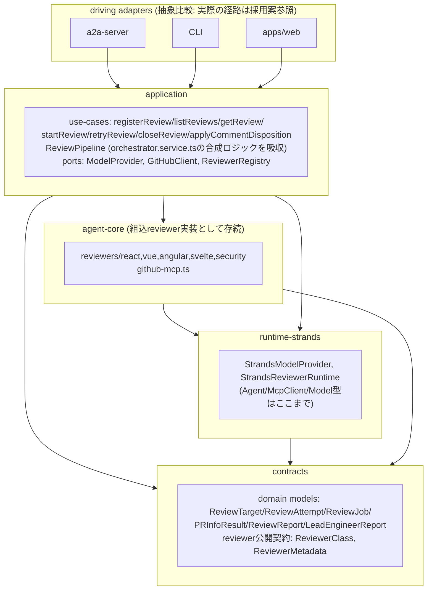

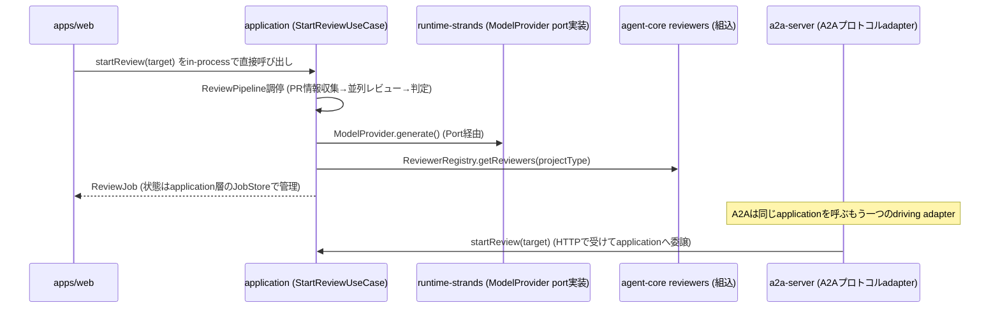

#### 案C: domain中心hexagonal（ports-and-adapters）へ段階移行

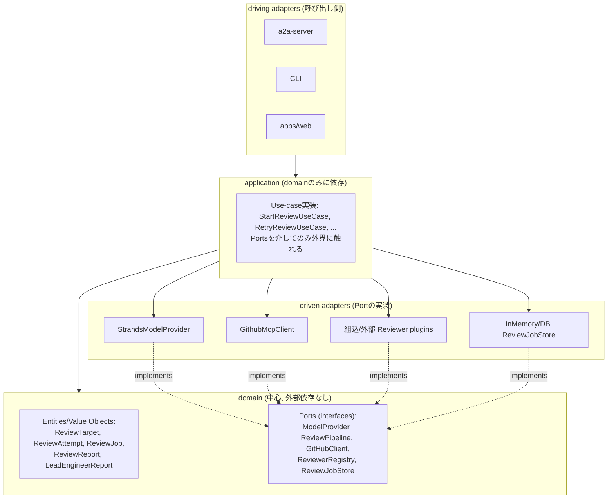

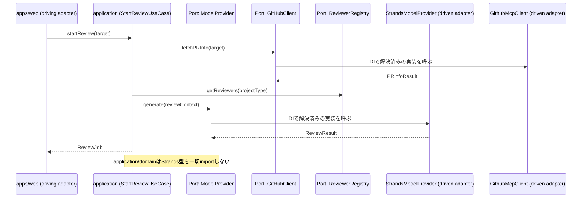

#### 採用する段階移行の中間状態（案Bの先行実施、package分割なし）

上記3案はいずれも「終着点」の比較である。本ADRが実際に採用するのは、案Bの論理構
造を`agent-core`パッケージ内のディレクトリとして先行実施し、Context節で確定した
driving adapterごとの非対称な呼び出し経路を組み込んだ中間状態である。

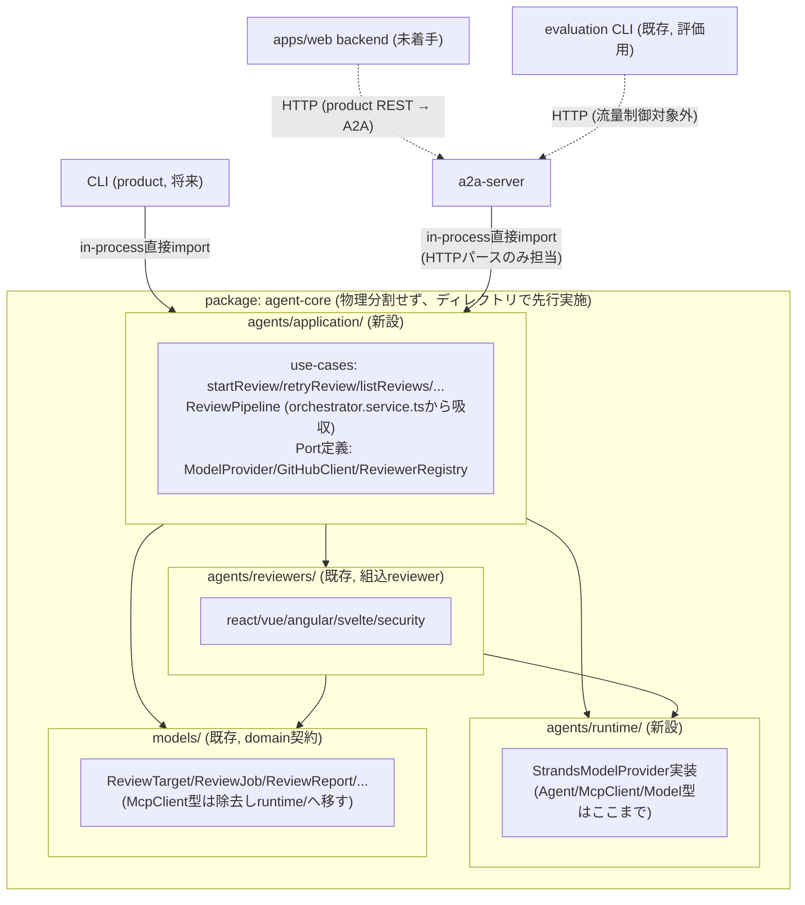

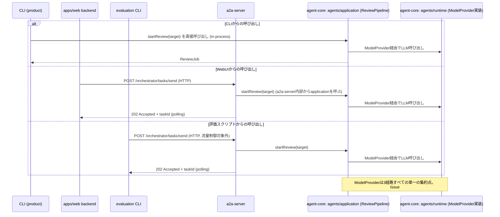

#### 観点ごとの検討結果

| 観点 | 案A(現状維持) | 案B(package分割) | 案C(hexagonal段階移行) |
|---|---|---|---|
| 依存方向 | 規約のみで強制力なし。`.serena/memories/architecture.md`の方針と実装（a2a-server/evaluationがagent-coreを直接import）が既に乖離している | `driving adapter → application → {contracts, runtime-strands, agent-core}`の一方向。pnpm workspaceの依存宣言で強制される | 最も厳格。domainが中心でPort定義もdomain側に置かれ、循環の余地が構造的に存在しない |
| 循環依存リスク | lintでしか検知できず、形骸化リスクが高い | package境界で機械的に検知される | 最小 |
| 公開API安定性 | `exports`が内部クラス7種を無差別公開しており意図した設計になっていない | `contracts`/`application`のexportsだけを安定させればよい | 最も高い |
| 既存コード移行量 | ゼロ（#243実装を止めない） | 中〜大。`orchestrator.service.ts`の合成ロジック移動、`ReviewContext`型変更、`createModelProvider`のport化が必要だが、a2a-server側に既にport相当の型（`PRInfoCollectorClass`等）が存在するためゼロからの設計ではない | 最大。`reviewer-plugins`の独立package化、`InMemory*TaskStore`3実装の統合まで要求され、big-bang rewrite回避の制約に抵触しうる |
| テスト容易性 | Strands/ネットワーク込みでしかテストできない箇所が多い | `application`は`contracts`のみに依存し、Strandsやネットワークなしにユニットテスト可能 | 最高。全Portをモック化できる |
| CLI/Web/A2A再利用性 | 3-stage合成ロジックがa2a-server内にのみあり、CLIが必要とする場合は複製かHTTP越しの利用の二択になる | 3者とも`application`の同一use-caseを呼べる（ただし本ADRの採用構成ではWebUIはA2A経由に限定する） | 案Bと同等 |
| Strands更新影響範囲 | domain契約(`ReviewContext`)にまで及ぶ | `runtime-strands`に閉じる | 最も厳密に閉じ込められる |
| ローカル単一プロセス運用の制約との整合 | 制約に抵触しない（追加境界なし） | ディレクトリ分離の段階では抵触しない。物理package分割の段階でもnetwork/process境界は増えない | package/ディレクトリ数増加が「ソースレベルの境界」に留まることを明示しないと過剰設計と誤解されるリスク |

案Aは移行コストゼロだが、#347がブロックされたままになり、既存の方針(`architecture.md`)と実装の乖離も放置される。案Cはdomain中心の理想形だが、現時点での移行量が大きく、big-bang回避の制約と抵触する。案Bは`orchestrator.service.ts`が既にport相当の型を持つ事実を活かせ、移行量を最小化できる。ここで許容するトレードオフは、(1) 物理package分割を後回しにする分`agent-core`のexportsが広いまま一時的に残ること、(2) CLIがapplication層に直結することで、Issue #345が定める「A2Aサーバー外の流量制御」の対象外になること（CLIは単一ユーザーの逐次手動実行が前提のためリスクは限定的と判断する）。

### 検討事項2: コア機能と拡張機能の分類基準

| 観点 | 案A(単一実装基準) | 案B(application契約基準) | 案C(保守主体基準) |
|---|---|---|---|
| 判定の明確さ | 「今は1実装だが将来複数になりうるもの」の扱いが曖昧（例: GitHub MCPは現状唯一だが将来REST版が増えうる） | 契約変更の有無という構造的事実で判定でき、曖昧さが少ない | 「組込/外部」の二値だけでは「coreかどうか」を判定できない |
| 現行要素への適用しやすさ | reviewer各種など複数実装があるものは拡張と判定しやすいが、GitHub MCP統合の分類で迷う | 3-stageワークフロー構造・registry選択ロジックがcore、reviewer/provider/persistenceが拡張、と一貫して判定できる | 組込reviewer/外部reviewerの区別には有効だが、それだけではcore/拡張の判定にならない |
| 将来の拡張性 | 実装数の増減で分類が変わりうるため不安定 | 検討事項4のPort設計と自然に対応し、安定した基準になる | 「外部拡張」カテゴリの定義に必要（案Bと併用が前提） |

案Bを主軸とし、案Cを拡張のサブ分類（組込/外部）として併用する。現行要素の仕分けは以下の通り。

| 要素 | 分類 | 理由 |
|---|---|---|
| 3-stageワークフロー構造 | core | 変更するとapplication契約が変わる |
| registry選択ロジック(`getReviewerClasses`) | core | reviewer拡張契約を成立させる基盤 |
| detection rule構造(`DETECTION_RULES`の判定アルゴリズム) | core | registryのcore選択ロジックと一体 |
| React/Vue/Angular/Svelte/Security reviewer | 組込拡張 | `ReviewerClass`契約のPort実装の1つ |
| GitHub MCP統合 | core寄りの組込拡張 | 唯一のPR情報源だが`GitHubClient` Port化により差し替え可能にする |
| Model Provider (OpenAI/Ollama) | 組込拡張 | `ModelProvider` Portの実装 |
| persistence(`InMemory*TaskStore`) | 組込拡張 | `ReviewJobStore` Port相当 |
| Web/CLI/A2A（driving adapter） | 組込拡張 | applicationのuse-caseを呼ぶだけで契約を変えない |
| 個別reviewerのdetectionルール追加 | 組込拡張 | 個別ルール追加はcore構造を変えない |
| prompt/skills | 外部拡張候補（実装はスコープ外） | reviewer本体を変えずprompt差し替えのみで挙動を変えられる |

### 検討事項3: reviewer拡張契約とregistry lifecycle

#### 案A: 現状のmutable global registryをpackage export

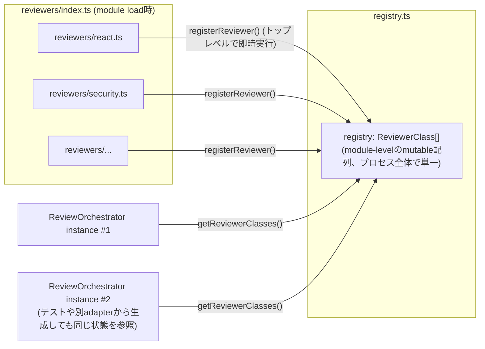

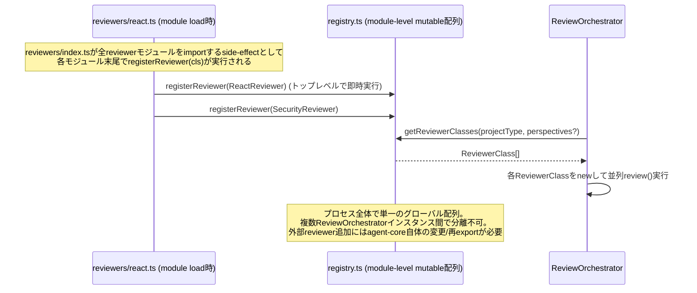

#### 案B: applicationごとのregistry instanceをDI

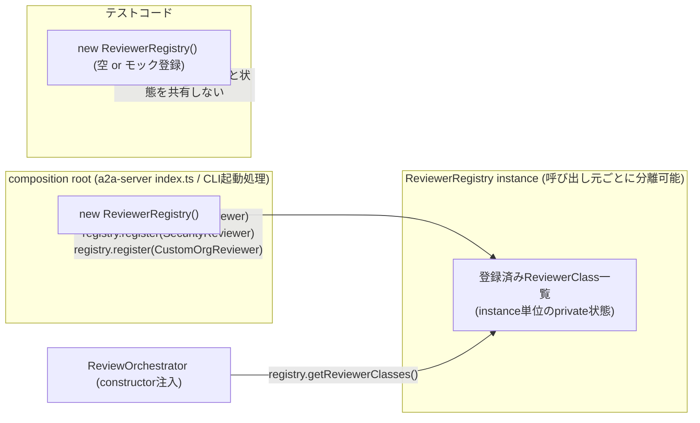

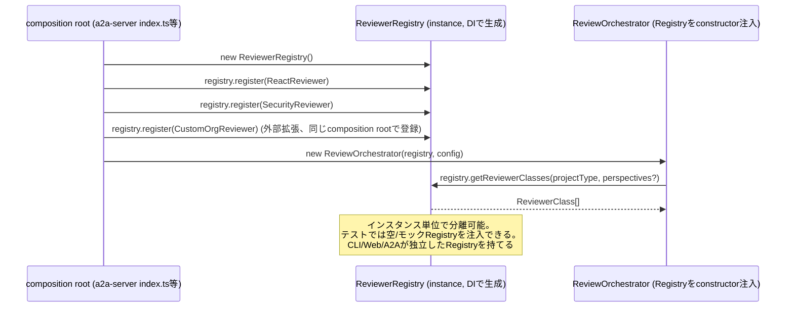

#### 案C: manifest/dynamic importによるplugin discovery

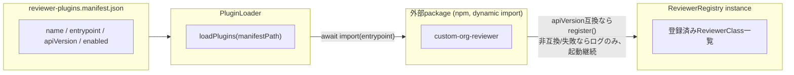

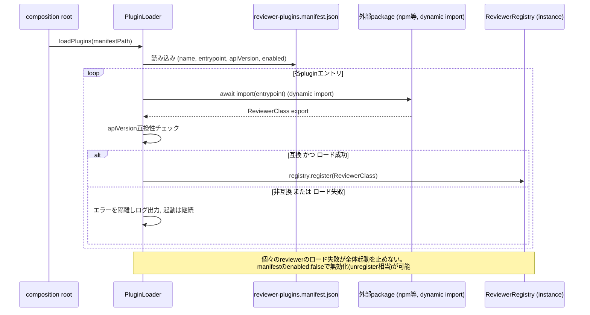

#### 観点ごとの検討結果

| 観点 | 案A | 案B | 案C |
|---|---|---|---|
| 実装コスト | 最小（変更不要） | 中（自己登録パターンをcomposition root側の明示登録に置換） | 大（manifest schema, loader, 互換性チェックの新規実装） |
| テスト容易性 | 低（プロセス全体で単一状態、テスト間で分離不可） | 高（instance単位で空/モックregistryを注入可能） | 高（Bと同等だが外部pluginの読み込み自体はテストしにくい） |
| driving adapterごとの有効reviewerの出し分け | 不可 | 可能（CLI/A2Aなど呼び出し元ごとに異なるinstanceを構成できる） | 可能 |
| 将来の流量制御(#345)との整合 | limiter付きModelProviderを経由しないreviewer登録を構造的に防げない | ModelProviderと同じcomposition rootでDIすることで迂回を防ぎやすい | Bと同等の効果を持ちうるが、pluginロード自体が別の迂回経路になりうる |
| 外部拡張(本リポジトリ外保守)への対応 | 非対応（exports未公開） | 非対応（composition root経由の登録のみ） | 対応（真の外部pluginをコード変更なしに追加可能） |
| 現時点での必要性との釣り合い | 需要には足りるが将来の分離要求に応えられない | 需要と複雑さが釣り合う | 過剰（plugin marketplace等は明示的にスコープ外） |

案Bはテスト容易性とdriving adapterごとの状態分離という2観点で明確に優位。案Cはスコープ外とされた外部拡張需要が具体化するまで見送るが、案Bの登録APIの上に将来追加できる関係にあり、排他的ではない。安定した公開契約は`ReviewerMetadata`（`reviewerId`, `perspective`, `projectTypes`, `apiVersion`）+ `ReviewerClass`とし、重複登録は例外送出、unregisterはcomposition root専用API、version compatibilityは`apiVersion`のmajor不一致で登録拒否とする。

### 検討事項4: runtime framework依存の隔離範囲

| 観点 | 案A(一括移行) | 案B(strangler段階移行) |
|---|---|---|
| #243実装への影響 | 実装中の機能追加を一時停止させるリスクが高く、big-bang rewrite回避の制約に抵触しうる | 各段階が独立して完結し、実装中の機能追加と並行できる |
| リスクの分離 | ADR-0004の参照カウント設計への影響とModelProvider化が同時に発生し、問題切り分けが困難 | `ReviewContext`型変更（ADR-0004との整合が必要な変更）を最後に回し、最初にリスクの低いModelProvider化から着手できる |
| Issue #345との整合 | 一括移行完了まで流量制御の単一差し込み点が存在しない | 第1段階(ModelProvider Port)だけで#345がどちらの方式に決まっても対応できる差し込み点が早期に確立する |
| レビュー・検証の粒度 | 変更量が大きく1回のレビューでの検証が困難 | 段階ごとに小さくレビュー・検証でき、CONTRIBUTING.mdのTDDサイクル運用と整合する |

案Bを採用する。段階は次の順序とする。

1. `ModelProvider` Portの導入（`model-provider-factory.ts`をラップし、`base-reviewer.ts`/`lead-engineer.ts`/`pr-info-collector.ts`の3箇所をDI経由の呼び出しに書き換える。挙動は変えず呼び出し経路のみ変更）
2. `GitHubClient` Portの導入（`tools/github-mcp.ts`をラップ。ADR-0004の参照カウント方式は実装内部詳細として保持し、Port外には露出しない）
3. `ReviewContext`からの`McpClient`型除去（第2段で確立した`GitHubClient` Portを介した抽象型に置き換える。ADR-0004の決定自体は変更しない）
4. `ReviewPipeline` Portの導入（`orchestrator.service.ts`の合成ロジックを`agents/application/`へ移し、a2a-serverはHTTPパースのみに縮小する）

許容するトレードオフは、`ReviewContext`からの`McpClient`型除去を後回しにすることで、移行完了までの中間状態で一部レイヤにStrands型が残存し続ける期間が生じること。

### 検討事項5: 公開APIと互換性ポリシー

| 観点 | 案A(exports中心) | 案B(biome中心) | 案C(package分割中心) |
|---|---|---|---|
| 強制力の確実性 | Node/TSのモジュール解決レベルで強制され迂回不可 | lintの実行漏れ・ルール未整備時は迂回されうる（biome 2.5.6でのglobパターン対応可否も本ADR時点で未検証） | pnpm workspaceの依存宣言により物理的に迂回不可、最も強力 |
| 現時点での実装コスト | 低（`exports`とディレクトリ整理のみ） | 低〜中（biome設定追加） | 高（検討事項1で見送った物理package分割が前提） |
| 検討事項1の段階移行方針との整合 | 段階移行の第1段階（ディレクトリ分離）から適用可能 | 同左、補助的に併用可能 | 物理package分割のトリガー条件が満たされるまで適用できない |

案Aを主軸とし、案Bを補助として併用、案Cは検討事項1のpackage分割トリガー条件成立時に主軸へ移行する。`agent-core`のexportsは段階移行の完了まで現状維持し、完了後にdriving adapterから直接importされていた内部クラス（`pr-info-collector.js`等）を非推奨化する。バージョニングはexports surfaceの安定性 + reviewer契約の`apiVersion`フィールドで代替する（全packageが`private:true`のためnpm semverは使わない）。

## Decision

**5つの検討事項は独立した決定ではなく、以下の1つのアーキテクチャ決定として統合する。**

`agent-core`パッケージは当面維持しつつ、内部を`agents/application/`（use-case・
`ReviewPipeline`合成ロジック・Port定義）と`agents/runtime/`（Strands依存実装）に
ディレクトリレベルで分離し、検討事項1の案Bが示すレイヤ構造を先取りする。reviewer
拡張は検討事項3の案Bに従いcomposition root所有のDI registryインスタンス方式へ移
行し、driving adapterはCLIのみapplication層に直結、WebUIと評価スクリプトはA2A
HTTP API経由に統一する。Strands依存は検討事項4の順序（ModelProvider→
GitHubClient→ReviewContext型除去→ReviewPipeline）でruntime層に隔離し、検討事項2
の分類基準（application契約への影響度）をcore/拡張判定に用いる。公開APIは検討事
項5の方針（exports中心・biome補助）で管理する。物理的なpackage分割は、`apps/web`
がStrands非依存の実行環境を具体的に要求する時点まで見送る。

この1つの決定を構成する実装レベルの合意事項は以下の通り。

1. `packages/agent-core/src/agents/application/`を新設し、use-case関数
   （`startReview`, `retryReview`, `listReviews`, `getReview`, `closeReview`,
   `applyCommentDisposition`, `registerReview`）、`ReviewPipeline`（現
   `orchestrator.service.ts:213-249`の合成ロジックを吸収）、Port interface
   （`ModelProvider`, `GitHubClient`, `ReviewerRegistry`）を配置する。
2. `packages/agent-core/src/agents/runtime/`を新設し、`model-provider-factory.ts`
   等のStrands依存実装を配置する。`Agent`/`McpClient`/`Model`型はこのディレクトリ
   にのみ許容し、application/domain/組込reviewerの検出ロジックからは参照しない。
3. `registry.ts`の`registerReviewer()`による自己登録パターンを廃止し、
   composition root（`a2a-server/src/index.ts`、将来のCLI起動処理）が
   `ReviewerRegistry`インスタンスを生成し明示的に`register()`する方式へ移行す
   る。重複登録は例外送出、unregisterはcomposition root専用APIとする。
4. driving adapterごとの呼び出し経路を次の通り固定する: CLI（将来のproduct
   CLI）は`agents/application/`のuse-caseをin-processで直接呼び出す。
   `a2a-server`は同じuse-caseを内部で呼び出しHTTPパースのみ担当する。`apps/web`
   （未着手）のバックエンドは`application`を直接importせずA2A HTTP API経由で呼
   ぶ。`packages/evaluation`の既存評価CLI群は引き続きA2A HTTP API経由のみとし、
   流量制御の対象外という位置づけを維持する。
5. Strands依存の隔離は`ModelProvider` Port→`GitHubClient` Port→
   `ReviewContext`からの`McpClient`型除去（ADR-0004の参照カウント設計は変更しな
   い）→`ReviewPipeline` Portの順で段階的に行う。
6. `agent-core`の`package.json`の`exports`は移行完了まで現状の7エントリを維持
   し、完了後にdriving adapterから直接importされていたエントリを非推奨化する。
   内部import制限はexportsフィールドを第一の強制手段とし、biomeのimport制限ルー
   ルは補助的に用いる。
7. コア/拡張の分類は「application契約（use-case/port/3-stage構造）への影響度」
   を主基準とし、「本リポジトリ内保守か外部保守か」を拡張のサブ分類として用い
   る。
8. 物理的なpackage分割（`contracts`/`application`/`runtime-strands`の独立
   package化）は、`apps/web`がStrands非依存の実行環境（ブラウザバンドル、別デプ
   ロイ単位のサーバー等）を具体的に要求する時点で改めて実施する。

## Consequences

- `orchestrator.service.ts`の合成ロジックが`agent-core`内へ移動することで、将来
  のCLIが3-stageパイプラインをHTTPなしに再利用できるようになる。一方、CLIが
  application層に直結することは、Issue #345が定める「A2Aサーバー外の流量制御」
  の対象外になることを意味する。CLIは単一ユーザーの逐次手動実行が前提のためリス
  クは限定的と判断するが、Issue #345のADR確定時にこの前提が変わらないか再確認す
  る必要がある。
- `.serena/memories/architecture.md`の「A2A HTTP API経由の呼び出しを推奨」という
  記述は、CLI直結の例外を反映して更新が必要になる。同様にユーザーメモリ
  `feedback_a2a_agent_invocation`も、評価スクリプトに限定したルールである旨を明
  記する更新が必要になる。
- `registry.ts`の自己登録パターン廃止により、組込reviewerを追加する際の実装手順
  （現状は`reviewers/`にファイルを追加するだけ）が、composition root側への明示
  登録を含む手順に変わる。既存reviewer実装コード自体（プロンプト・検出ロジッ
  ク）は変更不要。
- `ReviewContext`から`McpClient`型を除去する段階（検討事項4の第3段階）まで、一部
  レイヤにStrands型が残存し続ける。ADR-0004（MCPクライアントのセッション共有）
  の決定自体（並列レビュー内での共有・参照カウント方式）は変更しないため、この段
  階のリファクタリングはADR-0004と矛盾しない。
- 物理package分割を見送ることで、`contracts`/`application`/`runtime-strands`と
  いう独立したビルド単位・依存関係の恩恵（インストールサイズ削減等）は`apps/web`
  の要件が具体化するまで得られない。
- 本ADRはIssue #346のDefinition of Doneのうち、決定内容を実装タスクへ分割し
  #243配下のSub-Issueへ依存関係を反映する項目（DoD項目9）を満たさない。ADRマー
  ジ後、別途Sub-Issueとして起票する。
- Issue #347（呼び出しインターフェース抽象化）は、本ADRで定義したuse-case関数シ
  グネチャ、4つのPort interface（`ModelProvider`/`GitHubClient`/
  `ReviewerRegistry`/`ReviewPipeline`）、reviewer公開契約
  （`ReviewerClass`/`ReviewerMetadata`/`apiVersion`）、driving adapterごとの呼
  び出し経路規約を前提に着手できる。
