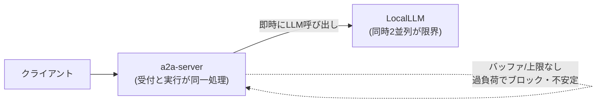
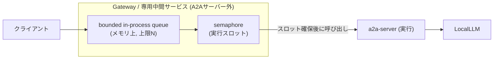
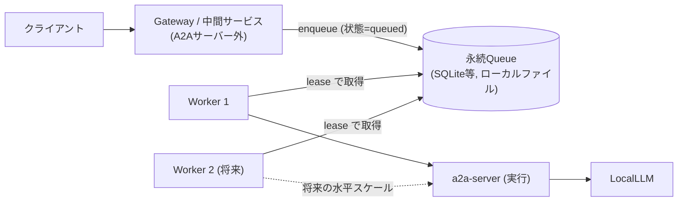

# 0009. LocalLLM流量制御: Queue実装方式・システム全体同時実行上限・障害時配信契約

- ステータス: 提案中 <!-- 提案中 / 承認 / 却下 / 廃止 / 上書き（後継: NNNN） のいずれか -->
- 決定日: 未定（提案日: 2026-08-25）
- 決定者: code-review-agent メンテナ
- 関連: Issue #366（本ADRの「検討事項A: Queue実装方式」が決定する課題）,
  Issue #365（本ファイルへ3件の決定を統合する親Issue）, Issue #345（上位）,
  Issue #367（同時実行上限・timeout/cancellation、後続で追記）,
  Issue #368（配信契約・再起動時回復、後続で追記）, Issue #243（Epic）,
  [docs/adr/0007-Multi-Container-Architecture-for-Scalability.md](0007-Multi-Container-Architecture-for-Scalability.md),
  [docs/adr/0008-core-extension-boundaries.md](0008-core-extension-boundaries.md)

> **本ADRの記載範囲（2026-08-25時点、ステータス: 提案中）**
> 本ファイルは Issue #365 が最終的に「Queue実装方式（#366）」「システム全体の
> LLM同時実行上限とtimeout/cancellation/straggler（#367）」「Workerクラッシュ後
> の配信契約と再起動・状態分離（#368）」の3決定を統合する器である。本提案では
> **#366（Queue実装方式）の検討・採用候補の提示までを記載**し、#367・#368 は後続Issueで
> 追記するためのプレースホルダ節（[検討事項B](#検討事項b-システム全体のllm同時実行上限367後続) /
> [検討事項C](#検討事項c-障害時の配信契約と再起動状態分離368後続)）を確保している。
> 本ADRはレビュー・承認を経て確定するものであり、下記の「採用候補」はレビューで覆りうる。
> #366 の Queue実装方式は #367・#368 の前提となるため、本ADRでは #366 を先に扱う。

## 課題の内容・背景

- 背景:
  - [ADR-0007](0007-Multi-Container-Architecture-for-Scalability.md) は、スケーラビリティと
    流量制御の課題に対し「API Gateway + Worker Queue 構成（案B）」という**コンテナ構成
    （トポロジ）レベルの意思決定のみ**を行った。ADR-0007 は「Queueの実装方式（in-process
    queue/semaphore、DB-backed queue + worker lease、外部broker等）の比較」を明示的に
    スコープ外とし、Issue #345 のフォローアップ（本ファイル `0009`）へ委譲している。
  - Issue #365 は ADR-0007 に対する CodeRabbit レビュー指摘を受け、委譲された詳細設計を
    3件（#366 Queue実装方式 / #367 同時実行上限 / #368 配信契約）の Sub-issue に分割した。
    本ADRは #366 の決定を最初に埋める。
- 現状:
  - LLM 呼び出しは A2A サーバーのリクエスト処理内で**即時実行**されており、同時実行数を
    平滑化・制限するバッファが存在しない。ADR-0007 の記述どおり、現行 WebAPI 構成では
    同時2リクエスト程度が処理上限であり、それを超えるとサービスが不安定になる。
  - ジョブ状態はメモリ／ローカルファイルで保持されており（ADR-0008 が指摘する
    `InMemory*TaskStore`）、プロセス再起動で失われる。
- 課題:
  - 現状のまま Gateway を前段に置いても、受付と実行の分離点（＝Queue）の実装方式を
    決めない限り、ADR-0007 が要求する「受付は同時2リクエスト制約から解放しつつ、実行は
    システム全体で定めた上限に平滑化する」という流量制御を実現できない。
  - Queue上限・過負荷時のAPI応答・再起動耐性といった運用仕様が未定のままだと、#367
    （同時実行上限の実現機構）や #368（配信契約）の設計が土台を持てずブロックされる。
- 制約条件:
  - **配置制約（固定）**: [ADR-0008](0008-core-extension-boundaries.md) の Context に記録の
    とおり、ユーザーは「A2Aサーバー**内**への in-process queue/semaphore 実装」を却下し、
    流量制御を「A2Aサーバー**外**（呼び出しクライアント側、または専用の中間サービス）に
    配置する」方針へ転換済みである。本ADRはこれを**変更不可の前提**として扱う。したがって
    「プロセス内でジョブを待機させる」方式を採る場合でも、その配置先は Gateway/専用中間
    サービスであり、A2Aサーバー本体ではない。
  - **運用形態（既定）**: 単一ユーザーが1台のローカル環境へ配備する**単一ローカル配備**を
    基本とする。これは単一OSプロセスを意味せず、A2Aサーバー外配置の制約を守るため、Gateway
    または専用中間サービスと A2A サーバーを同一ホスト上の別プロセス／別コンテナとして構成
    できる。#366 が求める「単一ユーザーのローカル運用で外部Broker運用が不要となる構成」を
    維持し、拡張性のためだけの不要な外部ネットワーク境界は導入しない。
  - **実行能力の上限**: システム全体の LLM 同時実行数は少数（ADR-0007 の例で2並列程度）で
    あり、Worker の台数によらずシステム全体で上限を持つ（ADR-0007 の決定）。上限の**実現
    機構**そのものは #367 の担当であり、本ADRは「Queueがその上限制御と両立できるか」の
    観点でのみ扱う。
  - **互換性**: 既存の `packages/agent-core`・`packages/a2a-server` のロジックを維持しつつ
    移行する（ADR-0007 の制約を継承）。
- スコープ外:
  - システム全体のLLM同時実行上限の**具体的な実現機構**、ジョブ/reviewer fan-out/provider
    単位の上限と既定値、slot解放条件、timeout/cancellation/straggler の扱い → **Issue #367**。
  - delivery semantics（at-least-once等）、ACK/lease/retry/dead-letter/冪等キー、再起動時
    のジョブ回復、queue/runtime state と review workflow state の分離 → **Issue #368**。
  - Web/CLI クライアント側のポーリング/WebSocket 実装の詳細（ADR-0007 が既にトレードオフ
    として受容済み）。

現状（As-Is）の処理は以下のとおり、受付と実行が同一処理内で密結合している。



この図は、受付と実行を分離するバッファ（Queue）が存在しないため、クライアントの同時要求が
そのまま LLM の同時実行数に流れ込み、上限を超えると不安定化する現状を示している。

## 検討事項A: Queue実装方式（#366）

- 決定する課題: ADR-0007 が採用した「Gateway + Worker Queue」構成における **Queue の実装
  方式**を選定し、あわせて **Queue上限・backpressure・過負荷時のAPIレスポンス**、および
  **単一ユーザーのローカル運用で外部Broker運用を不要にできるか**を決定する。
- 考慮する観点（#366 が指定する比較軸）:
  - backpressure（過負荷時に上流へ抑制をかけられるか）
  - 再起動耐性（プロセス/コンテナ再起動でキュー内ジョブが失われないか）
  - 実装/運用コスト（新規依存・インフラ・保守の負荷）
  - 将来の worker 分離（ADR-0007 が見据える Worker の水平スケールへ発展できるか）
  - job ordering（投入順・公平性の保証度）
  - 可観測性（キュー長・待機時間・滞留ジョブを観測できるか）
  - Queue上限と過負荷時のAPIレスポンス（Queue内部状態 `queued` / A2A外部状態 `submitted` で
    受付後に返す／上限超過で 429・503／caller を待たせる、の比較）
  - 外部Broker不要性（単一ユーザーのローカル運用で追加の常駐ミドルウェアを避けられるか）

> **注**: 本ADRは Queue の「実装方式（＝ジョブをどこに保持し、どう取り出すか）」を決める。
> 同時実行数を**いくつに**するか、その上限を**どの機構で**強制するか（semaphore/共有ロック/
> キュー側の同時取得数制御）は #367 の担当であり、本節では「各Queue方式がその上限制御と
> 両立できるか」という接続可能性のみを評価する。

## 検討内容

前提として、全案で**受付（Gateway が要求を受け取る量）と実行（LLM を呼ぶ並列数）は分離**
できる／できないが評価軸になる。配置は制約により「A2Aサーバー外（Gateway/専用中間サービス）」
に固定されるため、案B以降の in-process/永続化ロジックはすべて A2Aサーバー本体の外側に置く。

### 案A: 即時実行（現状維持 / Do-Nothing）

Queue を導入せず、Gateway は受け取った要求をそのまま下流の実行へ渡し、`Promise` を直ちに
起動する。ADR-0007 採用前の現状構成に相当する比較基準（ベースライン）。

| 観点 | 内容 |
| --- | --- |
| メリット | **実装/運用コストが最小**（追加コンポーネントゼロ、外部Broker不要）。リクエストの開始順は到着順に近く、単一ユーザー・単一ローカル配備の制約に完全適合。 |
| デメリット | **backpressure が存在しない**（過負荷時に上流を抑制できず、LLM 同時実行が上限を超えてサービスが不安定化＝ADR-0007 が挙げた最優先課題そのもの）。**再起動耐性なし**（実行中/待機中の要求は再起動で消失）。**将来の worker 分離が困難**（受付と実行が密結合で分離点がない）。**job ordering を保証できない**（Promise は即時起動され、完了順は処理時間に依存する）。**可観測性が低い**（待機という概念がなくキュー長を測れない）。過負荷時のAPI応答は「ブロックして待たせる／落ちる」に限られ、`queued` 受付や 429/503 の選択肢を持てない。 |

### 案B: bounded in-process queue + semaphore（A2Aサーバー外の Gateway/中間サービス内）

Gateway または専用中間サービスの**プロセス内**に、上限付き（bounded）のジョブキューと
同時実行数を制限する semaphore を持つ。要求受付時にキューへ enqueue し、semaphore の空きに
応じて実行スロットへ払い出す。永続化は行わず、状態はメモリ上に保持する。**配置は制約に従い
A2Aサーバー本体ではなく Gateway/中間サービス側**とする（ADR-0008 の「A2Aサーバー外」を満たす）。



この図は、受付（キューへの enqueue）と実行（semaphore が払い出したスロットでの A2A 呼び出し）
を Gateway 内で分離し、キュー上限とスロット数で流量を制御する構成を示している。

| 観点 | 内容 |
| --- | --- |
| メリット | **backpressure を実現できる**（bounded キューが満杯なら enqueue を拒否＝上流へ抑制がかかる）。**外部Broker不要**（プロセス内で完結し、単一ユーザーのローカル運用に最適）。**実装/運用コストが小〜中**（軽量ライブラリ or 自前実装で足り、常駐ミドルウェア追加なし）。受付と実行が分離され、過負荷時に `queued` 受付／上限超過で 429・503／caller待機のいずれも選択可能。#367 の同時実行上限は semaphore のカウントとして自然に接続できる。job ordering は単一プロセス内 FIFO で保てる。 |
| デメリット | **再起動耐性がない**（メモリ上のキュー内容は再起動で消失。#368 の配信契約で at-least-once 等を担保しようとしても、永続化層がないため保証の土台を欠く）。**worker 分離に発展しにくい**（キューがプロセスローカルのため、別プロセス/コンテナの Worker から取り出せず、水平スケールには別途キューの外出しが必要＝将来の作り直しコスト）。**可観測性はプロセス内メトリクスに限られる**（外部から横断的にキュー状態を観測するには追加実装が要る）。 |

### 案C: worker lease 付き永続 Queue（埋め込みDB / SQLite 等）

ジョブを埋め込み型の永続ストア（SQLite 等）に「状態付きレコード」として書き込み、Worker が
`lease`（可視性タイムアウト付きの取得）で1件ずつ確保して実行する。実行完了で状態を更新、
クラッシュ時は lease 失効により再取得可能になる。**外部の常駐 Broker は使わず**、DB ファイルは
ローカルに置く（A2Aサーバー外の中間サービスが所有）。



この図は、ジョブを永続ストアに保持し、Worker が lease で取り出す構成を示している。永続化に
より再起動をまたいでジョブが残り、Worker を増やしても同一キューから取得できる点が案Bとの差。

| 観点 | 内容 |
| --- | --- |
| メリット | **再起動耐性がある**（ジョブが永続化され、プロセス/コンテナ再起動後も残る。#368 の delivery semantics・lease・retry・dead-letter・冪等キーを載せる**土台になる**）。**将来の worker 分離に発展しやすい**（同一DBを複数 Worker が参照でき、ADR-0007 が見据える水平スケールへ素直に伸ばせる）。**外部Broker不要**（埋め込みDBで完結し、単一ユーザーのローカル運用の制約を満たす）。**可観測性が高い**（キュー状態がテーブルとして永続化され、キュー長・滞留・失敗を SQL で観測できる）。backpressure はキュー上限（行数/未処理件数）で実現し、過負荷時応答も `queued`／429・503／待機を選択可能。#367 の同時実行上限は lease 同時数の制御として接続できる。 |
| デメリット | **実装/運用コストが案Bより高い**（スキーマ設計、lease 失効・可視性タイムアウト、状態遷移、DBファイルの永続ボリューム管理が必要）。**job ordering に注意が要る**（複数 Worker が並行 lease すると厳密な FIFO は崩れうるため、順序保証が要る場合は明示的な設計が必要）。単一DBファイルへの同時書き込みは SQLite の書き込みロック特性の理解を要し、高並列では別RDBへの移行検討が生じうる（ただし現状の同時実行は少数のため実害は小さい）。 |

### 案D: 外部 message broker（Redis / RabbitMQ 等）

Redis や RabbitMQ 等の**独立した常駐ミドルウェア**をキューとして導入し、Gateway が publish、
Worker が subscribe/consume する。ADR-0007 の案B説明図が例示した Redis 構成に相当する。

| 観点 | 内容 |
| --- | --- |
| メリット | **backpressure・再起動耐性・worker 分離・可観測性のいずれも成熟した機能として得られる**（永続化オプション、consumer group、管理UI、メトリクス等）。大規模・マルチユーザー・高スループットへの拡張余地が最も大きい。過負荷時応答・job ordering もミドルウェアの機能で柔軟に選べる。 |
| デメリット | **外部Broker不要という #366 の受け入れ条件・単一ユーザー／単一ローカル配備の基本方針に反する**（常駐ミドルウェアと外部ネットワーク境界の追加、コンテナ・監視対象の増加がローカル運用には過剰）。**実装/運用コストが最大**（ミドルウェアの構築・監視・バージョン管理・障害対応）。現時点の要求（同時2並列程度、単一ユーザー）に対して明確なオーバーエンジニアリング。 |

## 検討結果

- 採用候補案（承認時に確定）: **案C（worker lease 付き永続 Queue、埋め込みDB / SQLite 等）**
- 理由:
  1. **配置制約と外部Broker不要性の両立**: 「A2Aサーバー外配置」「単一ユーザー・単一ローカル
     配備」および #366 の「外部Broker運用が不要」を満たすのは案B・案C。案D は
     外部常駐 Broker を要し受け入れ条件に反するため除外、案A は backpressure を持てず
     ADR-0007 の最優先課題（流量制御の欠如）を解消できないため除外した。
  2. **案B との分岐点は再起動耐性と将来の worker 分離**: 案B は実装が軽い反面、メモリ
     キューゆえ**再起動でジョブが消失し**、後続の #368（配信契約・再起動時回復）が保証を
     載せる**永続化の土台を持てない**。#366 は「#367・#368 の前提」と位置づけられており、
     ここで永続化の土台を欠くと後続2件の設計余地を先に潰してしまう。案C は永続ストアを
     持つため #368 の delivery semantics・lease・retry・dead-letter・冪等キーを自然に載せ
     られ、ADR-0007 が見据える Worker 水平スケール（案C図の「Worker 2（将来）」）へも同一
     キューのまま伸ばせる。
  3. **過剰にならない範囲での永続化**: 埋め込みDB（SQLite 等）に限定することで、案D の
     運用コストを負わずに再起動耐性・可観測性（SQL によるキュー観測）を得られる。現状の
     同時実行は少数のため、SQLite の書き込みロック特性が実害になる可能性は低い。
- Queue上限・backpressure・過負荷時のAPIレスポンス（#366 受け入れ条件に対応）:
  - **Queue上限**: 未処理（`queued`）ジョブ件数に上限 `N_queue` を設ける（既定値は #367 で
    定める同時実行上限とあわせて調整し、本提案では「有限の上限を持つ」方針を採用候補とする）。
  - **backpressure / 過負荷時応答**: 受付処理は「未処理件数が `N_queue` 未満であることの
    確認」と「ジョブレコードの挿入」を**単一トランザクション内で原子的に**行い、同時到来した
    複数リクエストが上限を超えて enqueue されることを防ぐ（容量チェックと挿入の間に競合窓を
    作らない）。**DBレベルの直列化方式**: 初期サポートDBである SQLite では既定の遅延
    （DEFERRED）トランザクションだと両者が同一の件数を観測して上限を超過しうるため、受付
    トランザクションは **`BEGIN IMMEDIATE`（書き込みロックを開始時に取得）** で開始し、容量
    確認から挿入までを直列化する。採用するSQLiteドライバは拡張結果コードを取得できることを
    必須とし、`SQLITE_BUSY` / `SQLITE_LOCKED`（各派生コードを含む）を一時的なロック競合に
    分類する。ロック待機はDBの busy timeout **5秒**を上限とし、Gatewayでの追加再試行は行わない
    （受付レイテンシを有界にするため）。開始時またはcommit時に待機期限が切れた場合は挿入／
    commitが成立していないことを確認して、容量に余裕があっても `503 Service Unavailable` と
    `Retry-After: 1` を返す。非一時的なI/O・破損・制約違反等は再試行可能と偽らず `500` とする。
    別RDBへ移行する場合は、同等の直列化（例: 該当行/カウンタへの排他ロック、または
    `SERIALIZABLE` 相当）と、一時的競合/恒久エラーの分類・待機上限を採用DBごとに定める。
    **トランザクションが commit に成功した後にのみ**、**受付レスポンス（HTTP `202 Accepted` と
    taskId）** を返す。永続化・commit が失敗した場合は成功応答も永続的なジョブ参照も返さず、
    上記分類に従って `503` または `500` として扱う。受付成功後、クライアントは taskId で
    ポーリングして進捗を確認する（ADR-0007 が
    受容済みの非同期化トレードオフに準拠。既存 A2A 契約との対応は後述の「A2A 契約との整合」
    参照）。**上限（`N_queue`）に達している場合はトランザクション内で挿入を行わず `503 Service
    Unavailable` を `Retry-After` 付きで返す**（過負荷を上流へ明示的に伝える backpressure）。
    認可・バリデーション不正など**クライアント起因の拒否は従来どおり 4xx**（429 はレート
    制限を別途導入する場合に用いるが、本ADRでは容量起因の過負荷を 503 で表す）。
  - **受入テスト（実装時に満たすべき観測可能な条件）**: (1) Worker を停止した状態で
    `N_queue + 1` 件を同時投入したとき、commit 済みの `queued` ジョブ件数が `N_queue` を超えず、
    超過分のリクエストのみが `Retry-After` 付き `503` を受け取ること。(2) 容量に余裕があっても
    受付トランザクションが busy timeout を超えるロック競合（`SQLITE_BUSY`/`SQLITE_LOCKED`）や
    commit 失敗に至ったリクエストは、ジョブを永続化せずに `Retry-After` 付き `503` を返すこと
    （commit 済み件数が増えないことを併せて検証）。(3) 非一時的エラーは `500` として分類され
    `Retry-After` を付けないこと。これらの不変条件を実装PRの acceptance テストとして検証する。
  - **Queue と TaskStore の永続化境界・受付原子性**: 受付時点では Queue レコードと TaskStore
    レコードを別々に二重書きせず、**同一の永続ジョブレコードを Queue と TaskStore の共通の
    正規レコード**として扱う。このレコードは最低限 `taskId`、`ownerPrincipalId`、A2A外部状態
    `submitted`、Queue内部状態 `queued` を持つ。前述の SQLite `BEGIN IMMEDIATE` トランザクション
    内で容量確認とこの正規レコードの挿入を行い、commit 後は同じストアに対する
    `TaskStore.get(taskId, ownerPrincipalId)` で直ちに取得可能であることを確認してから `202` を返す。
    したがって「Queueだけcommit済み／TaskStoreには未登録」という中間状態は作らない。#368は
    この共通レコードを前提に、lease/retry/dead-letter等の後続状態遷移とworkflow stateの分離を
    決める（受付時の正規レコードを別ストアへ分割する決定は本契約を上書きする後継ADRを要する）。
  - **A2A 契約との整合と所有者境界**: 既存の A2A `TaskStore` は状態 enum を `submitted /
    working / completed / failed`（`packages/a2a-server/src/modules/a2a/response.model.ts`）で持ち、
    受付時に `submitted` のタスクを生成、`get(taskId, ownerPrincipalId)` で所有者を検証する。
    本ADRの「`queued`」は**Queue 内部のジョブ状態**を指す用語であり、外部 A2A レスポンスの
    状態スキーマへ新たな `queued` 値を追加することは意図しない。外部契約としては、受付は
    既存の `submitted` を返し、Queue 内部状態 `queued` を A2A の `submitted` に対応付ける
    （Worker が lease で実行を開始したら `working` へ遷移）。ジョブ識別子は既存の `taskId` を
    そのまま用い、本文中の「jobId」は taskId の別名として扱う（新規識別子は導入しない）。
    Gateway と取得エンドポイントは、`ownerPrincipalId` を**認証middlewareが検証済みリクエスト
    コンテキストへ設定したprincipalからのみ**取得する。リクエストbody/query、クライアント指定
    headerの値をownerとして採用・上書きしてはならない。クライアントは既存の取得エンドポイント
    を通じて `TaskStore.get(taskId, ownerPrincipalId)` でポーリングし、リクエストごとに認証済み
    principalとの所有者一致を検証する。
  - **A2A契約の受入テスト（実装時）**: (1) `202` 受信直後に、受付時と同じ認証済みprincipalで
    `TaskStore.get(taskId, ownerPrincipalId)` を呼ぶと `submitted` タスクを取得できること、
    (2) 同じtaskIdを別principalでポーリングすると存在を開示せず `404`（storeでは `null`）になる
    こと、(3) body/query/追加headerに別ownerを指定しても認証コンテキストのprincipalだけが
    `TaskStore.get`へ渡ること、(4) 状態マッピングとtaskIdの単一性を、既存状態スキーマを変えずに
    契約テストで確認する。既存実装にはstore単位のowner isolationとrouteのprincipal引き渡しテスト
    があるため、Queue実装PRでは受付から即時ポーリングまでの統合契約を追加する。
- 外部Broker不要構成の可否（#366 受け入れ条件に対応）:
  - **不要にできる**。埋め込みDB（SQLite 等）をローカルファイルとして持つことで、常駐する
    外部 Broker を導入せずに永続キューを実現する。これにより単一ユーザーのローカル運用が
    追加ミドルウェアなしで成立する。
- 許容したトレードオフ:
  - 案B に対して**実装コストが増える**（スキーマ・lease 失効・可視性タイムアウト・永続
    ボリューム管理）。この増分は、#368 が要求する再起動時回復・配信契約の土台として不可欠
    であり、後で案B から案C へ作り直すコストの方が大きいと判断して受け入れる。
  - **厳密な job ordering は既定では保証しない**（複数 Worker の並行 lease で FIFO が崩れうる）。
    現状の要求では投入順の厳密保証は必須でないため許容し、必要になった場合は #367/#368 で
    順序保証の設計を追加する。
  - 高並列時の SQLite 書き込みロックという**将来のスケール上限**を許容する。同時実行が少数の
    現状では実害が小さく、上限に近づいた時点で別RDB / 案D への移行を再検討する（下記トリガー）。
  - **複数 Worker への発展は「同一DBファイルを共有できる範囲」に限られる**。案C図の
    「Worker 2（将来）」は、埋め込みDBファイルを共有ボリュームで参照できる配置（同一ホスト/
    共有ボリューム）でのみ成立し、Worker を別ホストへ分散する段階では埋め込みDBの前提が崩れる。
    その段階では別RDBまたは案Dへの移行が必要になる点を、将来の worker 分離の限界として受け入れる。

採用候補の構成（To-Be）は以下のとおり。承認された場合、受付は Gateway が担い、
永続キューへの commit 成功後にのみ受付レスポンス（A2A `submitted`）を返し、Worker が lease で
実行を平滑化する。図中の状態はQueue内部状態であり、外部A2A契約では `submitted`/`working` に
対応付く。

```mermaid
sequenceDiagram
    participant Client as クライアント
    participant GW as "Gateway / 中間サービス (A2Aサーバー外)"
    participant DB as "永続Queue (SQLite等)"
    participant Worker as "Worker (現状1, 将来複数)"
    participant A2A as "a2a-server (実行)"
    participant LLM as LocalLLM

    Client->>GW: 要求
    GW->>DB: BEGIN IMMEDIATE; 容量確認 + enqueue
    alt N_queue未満かつcommit成功
        DB-->>GW: COMMIT成功 + taskId
        GW-->>Client: 202 Accepted + taskId (状態=submitted)
    else 上限到達
        DB-->>GW: 挿入せず終了
        GW-->>Client: 503 + Retry-After
    else ロック競合(SQLITE_BUSY)/commit失敗
        DB-->>GW: ROLLBACK / error
        GW-->>Client: 503 + Retry-After (または500)
    end
    Worker->>DB: leaseで取得 (queued→working)
    Worker->>A2A: 実行要求
    A2A->>LLM: 同時実行上限は#367で決定
    Client->>GW: taskIdでポーリング
    GW->>GW: 認証contextからownerPrincipalId取得
    GW->>DB: TaskStore.get(taskId, ownerPrincipalId)
```

この図は、採用候補の案C において、容量確認と enqueue の原子性（`BEGIN IMMEDIATE` による
直列化）、commit 成功後の非同期受付応答、永続バッファ、lease による実行を分離し、キュー上限
超過やロック競合を `503` で backpressure として返す全体像を示している。同時実行上限の具体値・
実現機構（#367）と配信契約（#368）は本図の「Worker→A2A→LLM」区間および「永続Queue」の
状態遷移として後続で肉付けする。

## 検討事項B: システム全体のLLM同時実行上限（#367、後続）

> **未決（Issue #367 で追記）**。本節は検討事項A の採用候補（永続Queue + lease）が承認される
> ことを前提に、以下を決定するプレースホルダである。ここが埋まるまで本項目は「未決」とする。
>
> - システム全体の LLM 同時実行上限の**実現機構**（lease 同時取得数 / semaphore / 共有ロック等）
> - ジョブ単位 / reviewer fan-out 単位 / provider 単位の上限と既定値
> - スロット（lease）解放条件、timeout / cancellation / straggler の扱い
>
> 依存関係: 検討事項A の「lease 同時数の制御として接続できる」という接続点を実際の機構へ具体化する。

## 検討事項C: 障害時の配信契約と再起動・状態分離（#368、後続）

> **未決（Issue #368 で追記）**。本節は検討事項A の採用候補（永続Queue）が承認されることを
> 土台に、以下を決定するプレースホルダである。ここが埋まるまで本項目は「未決」とする。
>
> - delivery semantics（at-least-once 等）、ACK / lease / retry / dead-letter / 冪等キー
> - Worker クラッシュ後のジョブ回復、再起動時のリカバリ
> - queue/runtime state と review workflow state の分離
>
> 依存関係: 検討事項A が永続ストアを採用したことで、これらの保証を載せる土台が確保されている。

## 影響・フォローアップ

- **ADR-0007 のフォローアップ項目への対応**: ADR-0007 が「Issue #365 で決定する」とした
  「Queue実装方式の比較／システム全体のLLM同時実行上限の実現方式／timeout・cancellation・
  straggler／配信契約／再起動時のジョブ回復」のうち、**Queue実装方式**を本ADRで扱う（提案中）。
  残りは検討事項B・Cとして本ファイルに追記される。
- **短期的な実装影響**:
  - ADR-0007 の「`a2a-server` を受付役と実行役に分離」に対し、受付役（Gateway/中間サービス）
    が案C の永続キューへ enqueue し、commit成功後に既存A2A契約の `202` + `submitted` +
    taskId を返す構成にする。
  - ADR-0008 が指摘する `InMemory*TaskStore` を、案C の永続Queue へ移行する設計余地が生じる
    （状態管理の永続化は #368 の「state 分離」と整合させる）。ただし ADR-0008 は
    `ReviewJobStore`（review workflow state = Issue #243 の登録/結果保存）を **queue/runtime
    state とは別の関心事**として整理している。本ADRが永続化するのは**キューのジョブ状態**で
    あり、両者を同一ストアに載せるか分離するかは #368 の「state 分離」で決める（本ADRは前者の
    永続化のみを決定する）。
  - `deploy/` の pod 構成に、永続DBファイル用のローカルボリューム（emptyDir ではなく再起動を
    またぐ永続ボリューム）を追加する必要がある。
- **再検討トリガー（前提が変われば本ADRを更新/廃止してよい）**:
  - 同時実行数の要求が単一ユーザー・少数並列を大きく超える、またはマルチユーザー化する場合、
    SQLite の書き込みロックがボトルネックになりうるため、別RDB または案D（外部Broker）への
    移行を再検討する。
  - ADR-0008 の「A2Aサーバー外配置」方針が見直された場合、配置制約が変わるため案の前提を
    再評価する。
- **未解決の懸念事項**:
  - 埋め込みDBの具体的選定（SQLite か、better-sqlite3 等のバインディング、あるいは軽量な
    ジョブキューライブラリの採用可否）は実装タスクで確定する（本ADRは「埋め込み永続ストア」
    という方式レベルまでを決定）。
  - `N_queue`（キュー上限）と同時実行上限の既定値は #367 の決定とあわせて調整する。
