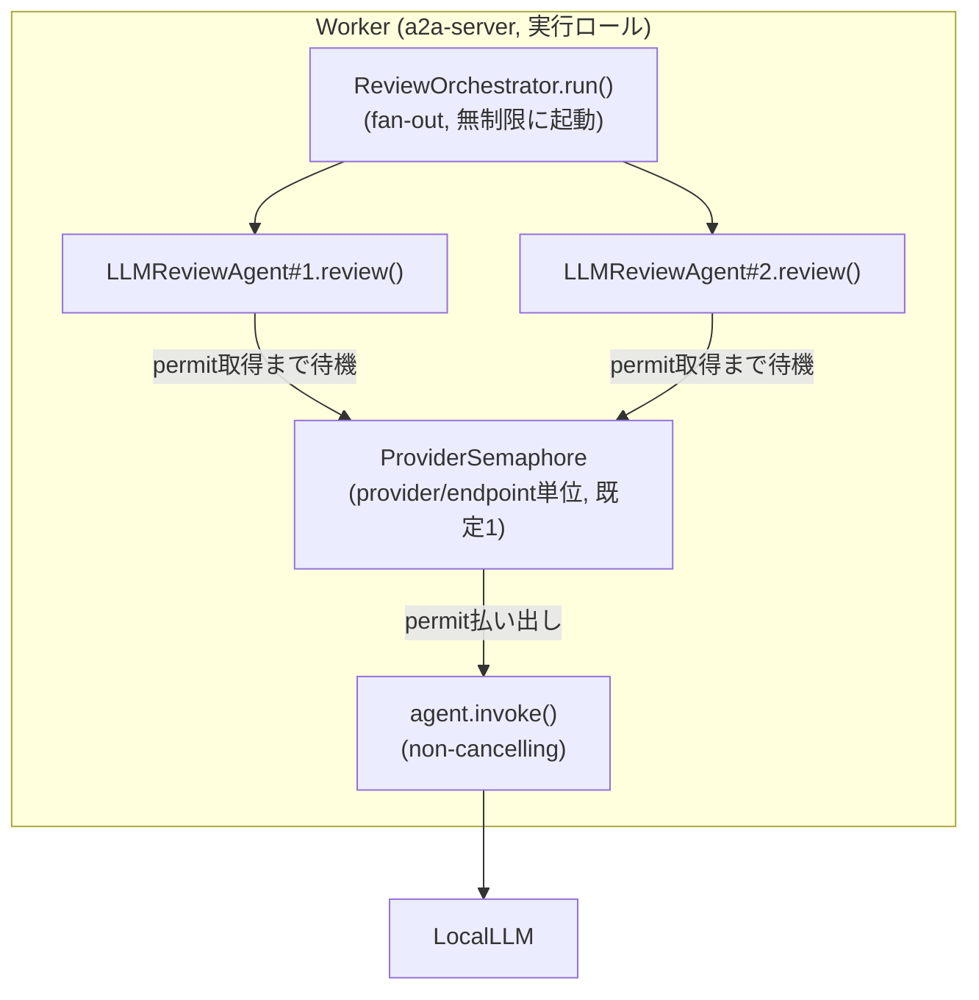
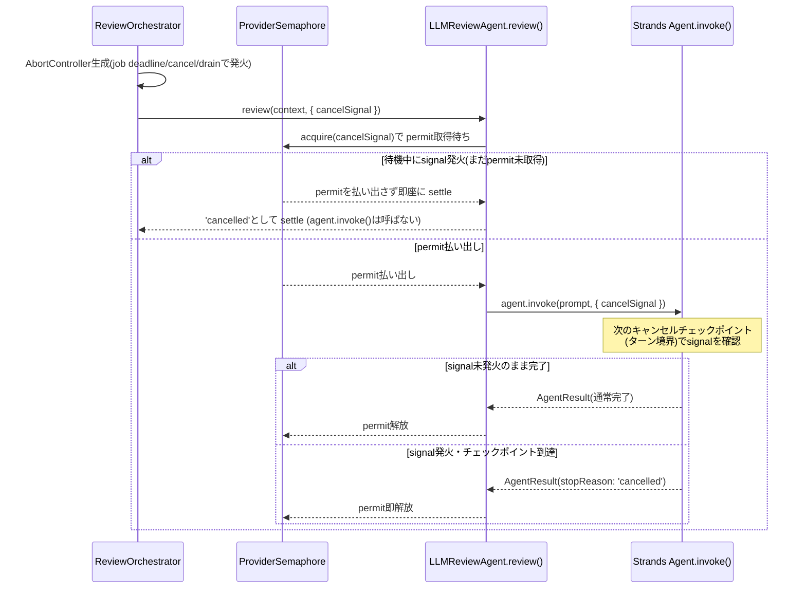
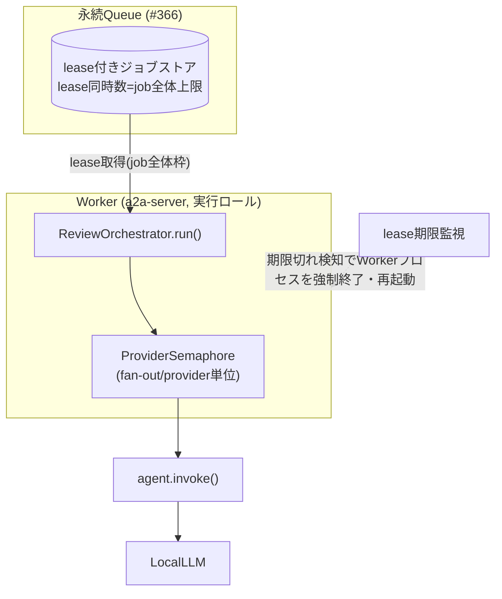

# ADR-0010: LocalLLM流量制御 — システム全体同時実行上限の実現機構とtimeout/cancellation/straggler処理

- Status: Proposed(未実装・レビュー待ち)
- Date: 2026-08-25
- Related: Issue #367(本ADRが扱う課題), Issue #345(上位), Issue #365(#366/#367/#368への分割元),
  Issue #366(Queue実装方式。本ADR作成時点で`docs/adr/0009-localllm-review-flow-control.md`として
  別ブランチで作業中・未マージ), Issue #368(配信契約・再起動時回復、本ADRのスコープ外),
  [docs/adr/0004-mcp-client-session-sharing.md](0004-mcp-client-session-sharing.md),
  [docs/adr/0007-Multi-Container-Architecture-for-Scalability.md](0007-Multi-Container-Architecture-for-Scalability.md),
  [docs/adr/0008-core-extension-boundaries.md](0008-core-extension-boundaries.md)

## Context

[ADR-0007](0007-Multi-Container-Architecture-for-Scalability.md)は、スケーラビリティと流量制御の
課題に対し「API Gateway + Worker Queue構成(案B)」というコンテナ構成(トポロジ)レベルの意思決定
を行い、「最大N並列は、Workerの台数によらずシステム全体でのLLM同時実行数の上限を表す」という
不変条件を明記した(本ADRの各案がこの不変条件をどの範囲まで厳密に満たすかは、Worker水平
スケール時の扱いとして[検討内容](#検討内容)の観点別比較・[Decision](#decision)の合意事項2で
それぞれ扱う)。一方で、この上限を**どの機構で実現するか**、およびtimeout・cancellation・
stragglerが並列slotに与える影響は、CodeRabbitのレビュー指摘を受けてIssue #345のフォローアップ
(Issue #365)へ明示的に委譲されている。Issue #365は決定粒度が大きすぎるとして、これをさらに3件の
Sub-Issueへ分割した。

- Issue #366: Queue実装方式そのものの選定(即時実行/bounded in-process queue・semaphore/
  worker lease付き永続Queue/外部broker)。本ADR作成時点で並行して別ブランチ
  (`.claude/worktrees/issue--366--queue--adr`)にて作業中であり、`docs/adr/0009-
  localllm-review-flow-control.md`として下書きが存在するが未マージである。その下書きは
  「案C(worker lease付き永続Queue、埋め込みDB)」を採用案として検討結果まで書き上げている。
- **Issue #367(本ADR)**: システム全体同時実行上限の実現機構、上限の適用粒度(job全体/reviewer
  fan-out/provider・endpoint単位)と既定値・設定方法、全caller共通化、GitHub MCP等I/O処理との
  分離、timeout・cancellation・stragglerの扱いとスロット解放条件。
- Issue #368: Workerクラッシュ後の配信契約(delivery semantics、ACK/lease/retry/dead-letter/
  冪等キー)と再起動時のジョブ回復。

### 番号の扱いについて

Issue #365は当初、#366/#367/#368の決定を`docs/adr/0009-localllm-review-flow-control.md`という
1つの統合ファイルにまとめる想定だった。実際に#366側の下書きはこの想定に沿って作成されており、
本ADR(#367)の内容を書き込むための「検討事項B(後続)」というプレースホルダ節まで確保している。
検討の結果、ADR = 1つの独立した意思決定という原則を優先し、**本ADRは#367単体の決定として
`0010`番で独立に採番する**方針を採用した。この結果、`0009`側のプレースホルダ節は本ADRのマージ後
に不要となるため、#366の担当者へ削除または本ADRへのリンクに置き換えるよう申し送る必要がある
(詳細は[Consequences](#consequences)参照)。

### 現状のコードの挙動

- **受付・実行の分離(Queue)は現状存在しない**: `packages/a2a-server/src/modules/orchestrator/
  orchestrator.service.ts`の`sendTask()`は`enqueue()`経由で`runTask()`を即座にバックグラウンド
  起動するのみで、同時実行数を制御する仕組みは皆無である(226-249行目、276-279行目)。この
  Queueの実装方式自体はIssue #366が決定する。
- **reviewer fan-outは無制限**: `packages/agent-core/src/agents/review-orchestrator.ts`の
  `ReviewOrchestrator.run()`は、選択された全reviewerの`review()`をPromiseとして一斉に起動し
  (88-118行目)、同時実行数を絞る仕組みを持たない。
- **timeoutは意図的にnon-cancelling**: 同ファイルの125-135行目は`Promise.race(Promise.all(
  settlers), timeoutPromise)`で待機を打ち切るのみであり、reviewerの`review()`呼び出し自体は
  キャンセルされずバックグラウンドで動き続ける(コード中のコメントに設計意図として明記)。
  straggler化した呼び出しは、真に完了するまで`SharedMcpClient`(ADR-0004の参照カウント方式)の
  consumer参照を保持し続ける。
- **実際のLLM呼び出し箇所**: `packages/agent-core/src/agents/base-reviewer.ts`の
  `LLMReviewAgent.review()`(287-362行目)が`createModelProvider()`(`model-provider-factory.ts`)
  で`Model`を生成し、`agent.invoke(prompt, { structuredOutputSchema, limits: { turns } })`
  (339行目)を呼ぶ。並列上限を差し込む自然な候補地点はここであり、`PRInfoCollector`・
  `LeadEngineerAgent`も同じ`createModelProvider()`を個別に呼んでいる。
- **Strands SDKは協調キャンセルを第一級機能として持つ(要検証事項の解消)**: 本プロジェクトが
  依存する`@strands-agents/sdk`の型定義(`InvokeOptions.cancelSignal?: AbortSignal`、
  `dist/src/types/agent.d.ts`)により、`Agent.invoke()`は外部`AbortSignal`による協調キャンセルを
  標準サポートする。シグナルはAgent内部のcontrollerと合成され、発火すると「次のキャンセル
  チェックポイントで停止し`stopReason: 'cancelled'`を返す」——ただし即時打ち切りではなく
  チェックポイント単位(ターン境界)である。現状の`base-reviewer.ts`はこのオプションを一切
  渡していない。
- **provider単位の共有・プール機構は存在しない**: `model-provider-factory.ts`の
  `createModelProvider()`は呼び出しごとに新しい`Model`インスタンスを生成する。GitHub MCPには
  `SharedMcpClient`(ADR-0004、参照カウント方式)という同種の共有機構が既にあるが、LLM呼び出し
  には相当するものがない。
- **設定値の既存パターン**: `packages/a2a-server/src/config.ts`の`loadServerSettingsFromEnv()`
  が`CODE_REVIEW_`プレフィックスの環境変数(`CODE_REVIEW_PROVIDER_TYPE`,
  `CODE_REVIEW_MAX_TOKENS`等)を`ServerSettings`へパースし、`ReviewerConfig`まで伝播する。
- **評価CLIの`concurrency`(既定2)はクライアント側のみ**: `packages/evaluation/src/
  run-agent-evaluation.ts`のオプションはA2Aタスク送信の呼び出し側の並列数を絞るだけで、サーバー
  側の全体制御にはならず、将来のWeb UIやCLIなど他のcallerからは制御できない。

### 過去の意思決定との整合

ユーザーは以前、a2a-serverが受付・実行未分離の単一プロセスだった時点で、その内部へin-process
queue/semaphoreを実装する案を明確に却下し、「A2Aサーバー外(呼び出しクライアント側、または専用の
中間サービス)に配置する」方針へ転換した経緯がある。その後ADR-0007がこの方針を発展させ、
a2a-serverを「受付役(Gateway)」と「実行役(Worker)」に正式分離することを決定した。したがって
本ADRが後述する各案で検討する「Worker内のローカルsemaphore」は、この却下された提案の再燃では
なく、ADR-0007が確立した新しいトポロジ上で初めて意味を持つ実装場所として扱う。

### スコープ境界

本ADRはシステム全体のLLM同時実行上限の実現機構と、timeout・cancellation・straggler処理に
限定する。以下は対象外とし、決定を先取りしない。

- **Queueの実装方式そのもの**(Issue #366): 即時実行/bounded in-process queue/永続Queue/外部
  brokerのいずれを採るかは`docs/adr/0009-localllm-review-flow-control.md`が決定する。本ADRの
  各案は、#366がどの方式を採ってもなるべく成立するよう設計するが、一部の案は#366の特定の
  選択に依存する(該当箇所に明記する)。
- **Workerクラッシュ後の配信契約・再起動時のジョブ回復**(Issue #368): delivery semantics、
  ACK/lease/retry/dead-letter、冪等キー、queue/runtime stateとreview workflow stateの分離は
  対象外とする。ただし本ADRが採用する「Workerプロセス再起動によるslot回収」という手段は
  #368が定義する配信契約と接続点を持つため、その接続点のみ[Consequences](#consequences)
  に明記する。

## 検討事項

以下5つの論点にまたがるが、個々の論点を独立に決めるのではなく、論点すべてに一貫して答える
**ADR全体としての案**を比較し、その1つを採用する(検討内容参照)。

### 論点1: システム全体同時実行上限の実現機構

**課題**: 上限をどのレイヤ・どの機構で強制するか。候補はIssue #367自身が挙げる「Worker側の
合算設定」「共有ロック/semaphore」「キュー側の同時取得数制御」であり、それぞれWorkerの水平
スケール耐性・実装コスト・外部依存の有無が大きく異なる。

### 論点2: 上限の適用粒度・既定値・設定方法

**課題**: job全体・reviewer fan-out・provider/endpoint単位のどの粒度で上限を持つか、既定値
(1または2)をどう定め、環境差にどう対応するか。既存の`CODE_REVIEW_`環境変数パターン
(`config.ts`)との整合も必要。

### 論点3: 全callerの制御面統一とI/O分離

**課題**: Web/A2A/将来CLIのどの経路から呼ばれても同じ上限が適用される必要がある。また
GitHub MCP等のI/O処理はLLM呼び出しとは性質が異なるリソースであり、同じ枠で制限すべきかを
判断する必要がある。

### 論点4: timeout・cancellation・stragglerの扱い

**課題**: 現状のnon-cancelling timeoutを維持するか、`cancelSignal`による協調キャンセルを
導入するか、Worker/プロセス分離による強制終了を使うか。job deadlineと個別model call timeout
の関係、ユーザーによるcancel、shutdown時のdrainも合わせて決める必要がある。

### 論点5: スロット解放条件(論点1・4の帰結として従属的に扱う)

**課題**: cancel不能、またはキャンセルチェックポイントに到達できない呼び出しが上限枠を専有し
続けないための設計。この論点は独立の意思決定ではなく、論点1で選んだ実現機構と論点4で選んだ
timeout/cancel方式の組み合わせによって答えが決まる派生論点であるため、検討内容では論点1・4の
比較の中で扱い、単独の結論は立てない。

## 検討内容

論点1〜4すべてに一貫して答える、ADR全体としての代替案を3つ比較する。各案は個々の論点の選択肢を
機械的に組み合わせたものではなく、それぞれ独立した設計思想(テーゼ)を持つ。

- **案1: 最小実装・現状踏襲**——Worker内のアプリケーションコードにローカルsemaphoreを1つ追加
  するだけに留め、timeout/cancelの挙動は変えない。
- **案2: 協調キャンセル導入**——案1と同じsemaphoreに加え、SDKが標準提供する`cancelSignal`を
  使い切ることでstraggler問題そのものを緩和する。
- **案3: インフラ層への委譲**——上限をアプリケーションコードのsemaphoreだけに頼らず、
  Queueのlease機構とコンテナのライフサイクル(プロセス再起動)というインフラ層の機能に委ねる。

| 論点 | 案1(最小実装) | 案2(協調キャンセル) | 案3(インフラ層委譲) |
|---|---|---|---|
| 論点1: 実現機構 | Worker内ローカルsemaphore(provider/endpoint単位) | 案1と同じsemaphore | job全体はQueueのlease同時数、fan-out/provider単位はWorker内ローカルsemaphoreの2階層 |
| 論点4: timeout/cancel | 現状のnon-cancelling維持 | `cancelSignal`による協調キャンセル | lease期限切れ時のWorkerプロセス再起動(強制終了) |

### 案1: 最小実装・現状踏襲

Worker(a2a-serverのWorkerロール)プロセス内に、provider/endpoint単位のbounded semaphore
(permit pool)を1つ実装する。`SharedMcpClient`(ADR-0004)と同系統の「参照カウント的」パターンを
LLM呼び出し粒度に適用する。timeout/cancelの挙動は変更しない。

この図は、fan-outで一斉起動されたreviewerの`review()`が、実際のモデル呼び出し直前で
semaphoreのpermitを待ち、job全体・fan-outの並列度がsemaphoreを通じて間接的に絞られる構成を
示す。timeoutで待機を諦めても、stragglerはpermitを保持したまま動き続ける。

### 案2: 協調キャンセル導入

機構は案1と同じsemaphoreだが、job deadline(`reviewerTimeoutSeconds`)・ユーザーcancel・
shutdown drainのいずれかが発火した時点で`AbortController`を発火させ、`agent.invoke(prompt,
{ ..., cancelSignal })`へ伝播する。

この図は、timeout/cancel/drainのいずれもが単一の`AbortSignal`に合流し、`ProviderSemaphore`の
permit取得待ち中(=まだ`agent.invoke()`を開始していない段階)とagent.invoke()実行中の両方で
permitの解放・不要な取得の回避を行う経路を示す。ただし`agent.invoke()`開始後にチェックポイント
に到達できない(単一の長いmodel呼び出しの最中、あるいはモデルサーバーのハング等)場合は案1と
同じ挙動になる点に注意。

### 案3: インフラ層への委譲

job全体粒度の上限を、#366が採用見込みのworker lease付き永続Queueのlease同時取得数に委ねる
(#366の下書きが「lease同時数の制御として接続できる」と既に接続点を明記している)。fan-out・
provider単位は案1と同じくWorker内ローカルsemaphoreで別途持つ2階層構成とする。timeoutは
lease期限切れとして扱い、期限切れ後もWorkerプロセス内で動き続ける呼び出しに対しては、
ADR-0007がWorkerをコンテナ単位で分離した事実を活かし、**Workerプロセスごと強制終了・再起動**
することをslot回収の主手段とする(Issue #345が挙げた「worker/process分離による強制終了可能な
境界」に相当)。

この図は、job全体の上限をQueue側のleaseで、fan-out/provider単位の上限をWorker内semaphoreで
それぞれ制御する2階層構成と、lease期限切れをトリガーにWorkerプロセスごと回収する経路を示す。
**この案は#366がworker lease付き永続Queueを採用することに強く依存する**——#366の下書き
(0009)は既に案C(worker lease付き永続Queue)を検討結果として採用しているが、本ADR作成時点で
未マージであり、仮に#366が即時実行やbounded in-process queueを採用した場合、job全体粒度の
この接続点は成立せず、案1・案2と同じくprovider単位のsemaphoreのみに収束する。

### 観点ごとの検討結果

#### 論点1: 実現機構

| 観点 | 案1(最小実装) | 案2(協調キャンセル) | 案3(インフラ層委譲) |
|---|---|---|---|
| Worker水平スケール時の正確性 | 不正確(レプリカ数で手動按分する「合算設定」に頼る) | 案1と同じ(semaphore部分は変わらない) | job全体粒度はQueueのlease数で正確に保証される(レプリカ数によらない)。fan-out/provider粒度は案1と同じ弱点を持つ |
| #366への依存 | なし(#366がどの方式でも成立) | なし | job全体粒度がworker lease付き永続Queueの採用に強く依存する。#366が未確定の現時点では前提を仮定することになる |
| 実装コスト | 最小(semaphore 1種類の新規実装) | 案1と同じ(semaphoreは共通) | 中〜大(semaphoreに加えてlease監視・プロセス再起動のオーケストレーションが必要) |
| 既存パターンとの一貫性 | `SharedMcpClient`(ADR-0004)の参照カウント方式と同系統で理解しやすい | 案1と同じ | semaphore部分は同じだが、lease監視・プロセス再起動は新規の運用機構であり既存パターンの延長にはない |

#### 論点2: 適用粒度・既定値・設定方法

| 観点 | 案1・案2(共通) | 案3 |
|---|---|---|
| 粒度 | provider/endpoint単位のみを明示的に持ち、job全体・fan-outはこのsemaphoreへの待機によって間接的に絞られる | job全体(Queueのlease数)とfan-out/provider単位(Worker内semaphore)を独立した2つの設定面として持つ |
| 既定値 | provider単位semaphoreの既定値は`1`(単一LocalLLMインスタンスを前提とする保守的な既定)。環境に応じて`2`まで許容 | 案1・案2のprovider単位既定値に加え、job全体側の既定値は#366が定める`N_queue`/lease同時数設定に従う(本ADRの決定範囲外) |
| 設定方法 | 既存の`CODE_REVIEW_`プレフィックス環境変数パターン(`packages/a2a-server/src/config.ts`)に`CODE_REVIEW_MAX_CONCURRENT_LLM_CALLS`を追加し、`loadServerSettingsFromEnv()`→`ServerSettings`→`ReviewerConfig`の既存の伝播経路に乗せる | 案1・案2と同じprovider単位設定に加え、job全体側は#366が定める設定面(本ADRでは規定しない)が別途必要になり、運用者が2箇所を意識する必要がある |

#### 論点3: 全caller共通化・I/O分離

3案とも、`createModelProvider()`を呼ぶ全経路(`LLMReviewAgent.review()`・`PRInfoCollector`・
`LeadEngineerAgent`)がsemaphoreラッパーを通る限り、Web/A2A/将来CLIのどのdriving adapterから
呼ばれても同じ上限が適用される点、およびGitHub MCP呼び出し(ADR-0004の対象)をこの枠から除外する
点で差は出ない。挿入点は、ADR-0008が段階移行の第一段階として定義した`ModelProvider` Portと
一致させるのが自然である(ADR-0008未完了の間は`createModelProvider()`呼び出し箇所への暫定的な
直接ラップで代替できる)。ただし案3のみ、job全体粒度の枠は#366のQueue経由の受付を通る呼び出しに
限られる。ADR-0008が定めるCLIのin-process直結経路(将来のproduct CLI)はQueueを経由しないため、
案3のjob全体粒度枠はCLI直結呼び出しに対しては効かない(fan-out/provider単位のWorker内
semaphoreは経路によらず効く)。

#### 論点4: timeout・cancellation・straggler

| 観点 | 案1(現状維持) | 案2(協調キャンセル) | 案3(プロセス再起動) |
|---|---|---|---|
| straggler発生時の挙動 | timeout後もバックグラウンドで動き続け、真に完了するまでpermitを保持する(現状のまま) | job deadline発火でcancelSignalが伝播し、次のチェックポイント(ターン境界)で停止してpermitを解放する | lease期限切れをトリガーにWorkerプロセスごと再起動し、そのWorkerが保持する全permitを一括で回収する |
| 実装コスト | ゼロ(変更なし) | 中(`AbortController`の生成・伝播、`review-orchestrator.ts`から`base-reviewer.ts`の`agent.invoke()`呼び出しまでの配線が必要) | 中〜大(lease期限監視とプロセス再起動のオーケストレーションが必要。コンテナのヘルスチェック・再起動設定と統合する) |
| 効果が及ばない異常系 | 全異常系でstragglerが残り続ける | チェックポイントに到達できないハング(単一の長いmodel呼び出し中、モデルサーバー無応答等)には無力 | チェックポイントの有無によらず効く(プロセスごと強制終了するため)が、同一Worker上で並行実行中の他のジョブも巻き込む副作用がある |
| ユーザーcancel・shutdown drainとの統合 | 統合の仕組みがない | 同一`AbortSignal`に合流させることで自然に統合できる | shutdown drainはWorkerプロセスの正常終了手順として別途必要(強制終了とは別の経路) |

案1はstraggler問題を一切解消しない。案2はSDKが既に持つ機能を使い切ることでstraggler問題を
大きく緩和できるが、チェックポイント到達を前提とするためハング系異常には無力という限界を持つ。
案3はハング系異常にも対応できる最終手段だが、実装コストが高く、かつ#366のworker lease付き
永続Queue採用という前提に強く依存し、依存が崩れた場合job全体粒度の恩恵は失われる。

## Decision

**案2「協調キャンセル導入」を採用する。**

Worker(a2a-serverの実行ロール)内に、provider/endpoint単位のbounded semaphoreを実装し、
job deadline・ユーザーcancel・shutdown drainを単一の`AbortSignal`に合流させて`agent.invoke()`
の`cancelSignal`オプションへ伝播する。この1つの決定を構成する実装レベルの合意事項は以下の
通り。

1. `createModelProvider()`を呼ぶ全経路(`LLMReviewAgent.review()`、`PRInfoCollector`、
   `LeadEngineerAgent`)が経由する単一の挿入点として、provider/endpoint単位の
   `ProviderSemaphore`(bounded permit pool)を実装する。挿入点はADR-0008が定義する
   `ModelProvider` Portと一致させ、ADR-0008の段階移行が未完了の間は`createModelProvider()`
   呼び出し箇所への暫定的な直接ラップで代替する。**「挿入点」は`Model`インスタンスを組み立てる
   コード上の位置を指すのみであり、permitの保持期間とは別である**: `createModelProvider()`
   自体はネットワーク呼び出しを伴わない軽量な処理のためpermitを要求しない。permitは
   `agent.invoke()`を呼ぶ直前に取得し、`agent.invoke()`の呼び出しが完了する(settleする)まで
   保持する(具体的な取得・解放のタイミングは合意事項5を参照)。
2. 粒度はprovider/endpoint単位を基本とし、job全体・reviewer fan-outはこのsemaphoreへの
   待機を通じて間接的に絞る(別途の明示的なカウンタは持たない)。**この上限は各Workerプロセス
   内でのみ有効なローカルな上限である。** 現状の想定運用形態(ADR-0007が前提とする、水平
   スケールしていない単一Workerインスタンスでの運用)では、Workerローカルの上限がそのまま
   システム全体の上限と一致するため、論点1が求める「システム全体同時実行上限」を満たす。
   Workerが複数レプリカへ水平スケールした場合は、この一致が崩れ複数レプリカにまたがる
   分散的な保証ではなくなる(その場合の扱いは[Consequences](#consequences)参照)。既定値は`1`とし、
   `packages/a2a-server/src/config.ts`の既存パターンに`CODE_REVIEW_MAX_CONCURRENT_LLM_CALLS`
   環境変数を追加して上書き可能にする(`loadServerSettingsFromEnv()`→`ServerSettings`→
   `ReviewerConfig`の既存の伝播経路に乗せる)。検証は同ファイルの`parseOptionalNumber()`の
   「非数値はstartup時にエラーとする」という方針を踏襲しつつ、`parseOptionalNumber()`自体は
   現状NaNしか弾いておらず範囲チェックを行わない点に注意し、本項目は独自に「1以上の整数」
   という追加の範囲検証を持つ(0以下・非整数はエラーとして扱い、実行時にsilentフォール
   バックしない)。未設定時は既定値`1`を用いる。
3. GitHub MCP呼び出し(ADR-0004の対象)はこの枠から除外し、ADR-0004の参照カウント方式は変更
   しない。
4. job deadline(既存の`reviewerTimeoutSeconds`)、将来実装されるユーザーcancel、shutdown時の
   drainのいずれかが発火した時点で単一の`AbortController`を発火させ、
   `review-orchestrator.ts`から`base-reviewer.ts`の`agent.invoke(prompt, { ...,
   cancelSignal })`まで伝播する。`cancelSignal`が発火してもSDKは「次のキャンセルチェック
   ポイント(ターン境界)」まで停止しないため、即時打ち切りではないことを利用側の前提とする。
   **shutdown drainとjob deadline/ユーザーcancelは、発火タイミングが異なる2段階として扱う**:
   shutdownシグナル受信時点ではまず新規`enqueue`/新規`ProviderSemaphore.acquire()`の受付のみ
   停止し(新規ジョブ・新規permit取得待ちを拒否)、既に実行中の呼び出しは猶予期間
   (grace period、具体的な長さは実装時に決定)の間は継続を許す。猶予期間を過ぎても
   settleしない呼び出しに対して初めて、job deadline/ユーザーcancelと同じ`cancelSignal`を
   発火させ強制的にキャンセルへ倒す。
5. `ProviderSemaphore`のpermitは、対応する`review()`呼び出しのPromiseが(通常完了・
   `stopReason: 'cancelled'`によるキャンセル完了のいずれであっても)真に settle した時点で
   `finally`により解放する。この解放条件自体は案1と変わらないが、cancelSignalの導入により
   settleが早まる分だけ実効的な待機時間が短くなる。**`ProviderSemaphore.acquire()`自体も
   `cancelSignal`を受け取り、これを観測する契約とする**: 既にabort済みのsignalを渡した
   `acquire()`はpermitを一切払い出さずに即座に拒否し、permit払い出し待ちでキュー内にある
   `acquire()`呼び出しは、待機中にsignalが発火した時点でpermitを得ないまま即座に settle
   する。これにより、まだ`agent.invoke()`を開始していない(=semaphore待機中の)reviewerも、
   job deadlineやユーザーcancelの発火を無駄なく反映できる。
6. `cancelSignal`が機能しない異常系(モデルサーバーの無応答等、チェックポイントに到達しない
   ハング)への備えとして、ADR-0007が確立したWorkerのコンテナ境界を用いた強制終了を
   **最終手段のフォールバック**として残す。この監視・強制終了は**有界(bounded)な待機時間で
   必ず判定が確定する**ことをADRレベルの要件とし、**強制終了は当該Workerプロセス単位に限定
   され、他のWorkerプロセスで実行中の並行ジョブには影響しない**(同一Worker上で並行実行中の
   他ジョブは巻き込まれ再試行対象になる、という副作用は許容する)。具体的なトリガー条件
   (ヘルスチェック閾値・有界時間の具体値等)・オーケストレーション手順・強制終了後の
   ジョブ再試行の扱いは、本ADRの決定粒度を超えるため、Issue #368(配信契約・再起動時回復)の
   スコープとして扱う([Consequences](#consequences)に記載の、#368が設計する delivery
   semanticsとの接続点を参照)。

## Consequences

- provider/endpoint単位のsemaphoreは、Workerが複数コンテナへ水平スケールした場合に
  システム全体の真の上限を機械的には保証しない(各Workerのローカル上限の合算に運用者が
  頼ることになる)。この限界は許容するトレードオフとして受け入れるが、#366が
  worker lease付き永続Queueを採用した場合、job全体粒度の上限をQueueのlease同時数に委ねる
  拡張(検討内容の案3が示した接続点)を、本Decisionと矛盾しない**追加のレイヤ**として
  将来のADR更新で検討できる。
- `cancelSignal`の伝播実装(`review-orchestrator.ts`から`base-reviewer.ts`までの配線、
  `AbortController`の生成・合流ロジック)は本ADRの決定粒度を超えるため、別途実装Issueとして
  切り出す。
- `docs/adr/0009-localllm-review-flow-control.md`(Issue #366)には、本ADRの内容を書き込む
  ためのプレースホルダ節「検討事項B: システム全体のLLM同時実行上限(#367、後続)」が既に
  存在する。本ADRのマージ後、#366の担当者はこのプレースホルダを削除し、本ADR
  (`docs/adr/0010-localllm-concurrency-limit-and-cancellation.md`)へのリンクに置き換える
  必要がある。
- Issue #368は、本ADRが合意事項6で決定した「Workerプロセス強制終了」というslot回収の最終
  手段を前提として、その際のジョブの delivery semantics(再試行するか、失敗として扱うか等)
  を設計する必要がある。
- ADR-0004(MCPクライアントのセッション共有)の決定は変更しない。GitHub MCPの輻輳対策と
  LocalLLMの並列上限は引き続き別々の仕組みとして扱う。
- ADR-0008が定める`ModelProvider` Portの段階移行が完了するまでの間、本ADRの`ProviderSemaphore`
  挿入点は`createModelProvider()`呼び出し箇所への暫定的な直接ラップとなる。Port完成後は
  Port実装の内部にsemaphoreを移設する形で自然に統合できる。
