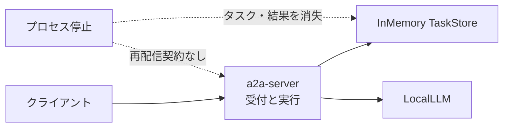
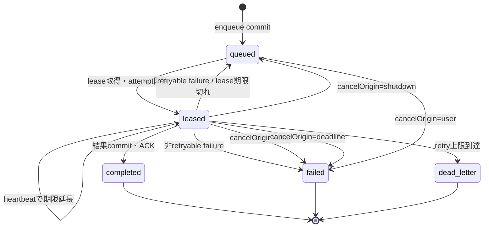
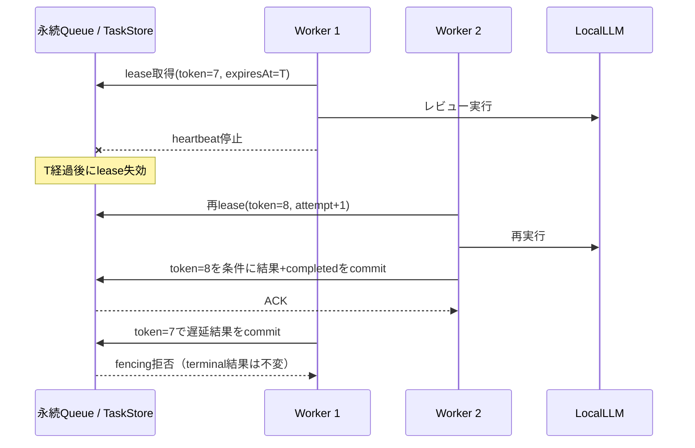

# 0011. LocalLLM配信契約: Worker障害後の再配信・再起動回復・状態分離

- ステータス: 提案中
- 決定日: 未定（提案日: 2026-08-26）
- 決定者: code-review-agent メンテナ
- 関連: Issue #368（本ADRが扱う課題）, Issue #365（分割元）, Issue #345（上位）,
  Issue #243（Epic）,
  [ADR-0007](0007-Multi-Container-Architecture-for-Scalability.md),
  [ADR-0009](0009-localllm-review-flow-control.md),
  [ADR-0010](0010-localllm-concurrency-limit-and-cancellation.md),
  [ADR-0008](0008-core-extension-boundaries.md)

## 課題の内容・背景

- 背景:
  - ADR-0007 は API Gateway + Worker Queue 構成を採用し、受付と実行を分離した。Worker障害後の
    delivery semantics、ACK、retry、dead-letter、冪等性、再起動回復は後続決定へ委譲した。
  - ADR-0009 は A2Aサーバー外の埋め込み永続Queueを採用候補とし、QueueとTaskStoreが共有する
    単一の正規ジョブレコード、enqueue時の冪等性、`taskId`と所有者境界を決定した。ただし、永続化
    だけではWorkerが取得した後のジョブを再配信できるとは限らない。
  - ADR-0010 は協調キャンセルを採用し、応答しない処理の最終的なslot回収手段としてWorker単位の
    強制終了を残した。その接続条件として、監視の判定時間を有界にすること、他Workerを終了しない
    こと、同一Worker上で巻き込まれたジョブを再試行対象にすることを本ADRへ引き継いだ。
- 現状:
  - A2Aタスクは `submitted / working / completed / failed` の外部状態を持つが、TaskStoreは
    プロセスメモリ上にあり、再起動するとタスクと結果を失う。
  - 現行の実行はfire-and-forgetであり、productionのshutdown drain、Worker lease、heartbeat、
    retry、dead-letter、再起動時recoveryは存在しない。
  - レビューパイプラインはGitHub MCPのread-only endpointを利用し、GitHubへのコメント投稿等の
    外部更新を行わない。現在の重複実行による副作用は、主にLLM計算コストと最終結果書き込みである。
  - レビュー結果はall-or-nothingで保存され、途中段階の部分結果を再開するcheckpointはない。
- 課題:
  - ACKを早く確定すると、Workerが結果保存前に停止したジョブを失う。ACKを遅らせるだけでは、
    結果保存後の応答消失やlease期限切れにより、同じジョブが複数Workerで重複実行されうる。
  - `queued`または実行中のまま残ったジョブを起動時にどう回復するか決めなければ、永続Queueが
    あっても停止ジョブと実行中ジョブを安全に区別できない。
  - 配送都合の状態とユーザーが管理するレビューworkflow状態を混ぜると、再試行やWorker再起動が
    `closed`等のユーザー判断を巻き戻すおそれがある。
- 制約条件:
  - ADR-0007のGateway + Worker Queueというトポロジを変更しない。
  - ADR-0009の埋め込み永続Queue、enqueue冪等性、QueueとA2A TaskStoreの単一正規レコード、
    `taskId`の単一性、認証済みprincipalによる所有者分離、厳密なFIFO非保証を継承する。
  - Queue内部状態のために外部A2A状態enumへ`queued`等を追加しない。
  - ADR-0010の協調キャンセル、bounded shutdown grace period、Worker単位の強制終了条件を継承する。
  - 単一ユーザー・単一ローカル配備を基本とし、外部message brokerや分散transaction coordinatorを
    必須にしない。
- スコープ外:
  - Queue実装方式、enqueueのHTTP応答と冪等キー契約、LocalLLM同時実行上限の再決定。
  - レビュー途中から再開するcheckpoint、厳密なjob ordering、GitHubへの書き込み機能の設計。
  - SQLiteドライバ、テーブル名、SQL文、監視製品等の実装ライブラリ選定。

現状は実行状態と結果がWorkerプロセスの生存期間に結びついており、再起動後に未完了ジョブを
識別して再配信できない。

## 検討事項

- 決定する課題: ADR-0009の永続Queue上で、Worker障害・shutdown・再起動をまたいでも受付済み
  ジョブを失わず、重複実行時にも外部へ一貫した結果を公開する配信契約と状態境界を定める。
- 考慮する観点:
  - delivery semantics（at-most-once / at-least-once / exactly-once志向）
  - ACK時点、worker lease / visibility timeout、heartbeat
  - 自動retry対象、最大回数、backoff、dead-letterと手動再実行
  - Worker再配信と重複実行に対する結果確定の冪等性
  - 起動時に残った待機中・実行中ジョブの回復
  - ADR-0010の協調キャンセル、shutdown drain、Worker強制終了との接続
  - queue/runtime state、外部A2A task state、ユーザー管理review workflow stateの分離
  - 障害・滞留・再試行を判断できる可観測性

## 検討内容

### 案A: at-most-once（取得時ACK、障害後は再配信しない）

Workerがジョブを取得した時点で配送済みとして確定する。取得後にWorkerが停止した場合はジョブを
`failed`にし、自動再配信しない。起動時には待機中ジョブだけを実行し、実行中の残留ジョブは失敗へ
遷移させる。

| 観点 | 内容 |
| --- | --- |
| delivery / ACK | 取得時ACKにより各ジョブの実行開始は最大1回となる。結果保存前の停止では結果を失う。 |
| lease / heartbeat | 再配信しないため不要。Workerの生存確認だけを別途監視する。 |
| retry / dead-letter | 自動retryを行わず、失敗をterminal `failed`として記録する。再実行は新規タスクとして手動受付する。 |
| 重複実行 | Queue起因の重複は避けやすいが、結果未保存による欠落を防げない。 |
| 再起動回復 | `queued`は維持し、実行中の残留ジョブは失敗にするため単純。 |
| 状態分離 | delivery状態とworkflow状態は分離できるが、配送失敗をユーザー向け失敗へ即時反映する。 |
| 可観測性 | 失敗件数は観測しやすい一方、再試行による自己回復率は測れない。 |
| メリット | 実装と運用が最も単純で、重複するLLM計算を抑制できる。 |
| デメリット | 結果保存前のWorker障害で受付済みジョブを失う。ADR-0007が意図した耐障害性と、ADR-0010が要求する強制終了巻き込みジョブの再試行に適合しない。 |

### 案B: at-least-once（lease + heartbeat + bounded retry + fencing）

Workerは期限付きleaseを原子的に取得して実行し、正規ジョブレコードへterminal結果をcommitできた
時点をACKとする。leaseをheartbeatで更新し、期限切れまたはretryable failureは上限付きで再配信する。
重複実行は許容する一方、lease世代を表すfencing tokenで古い試行の結果commitを拒否する。

この図はQueue内部の配送状態を示す。外部A2A状態は`deliveryPhase = accepted`の`queued`を
`submitted`、`deliveryPhase = running`（lease中またはretry待機中の`queued`）を`working`、terminal
状態を`completed`または`failed`へ写像し、`working`から`submitted`へは戻さない。

| 観点 | 内容 |
| --- | --- |
| delivery / ACK | 少なくとも1回の実行を保証する。結果とterminal状態を同一transactionでcommitした時点をACKとし、取得時やLLM完了時にはACKしない。 |
| lease / heartbeat | 有限のvisibility timeoutを持つleaseと定期heartbeatを必須にする。期限切れleaseだけを再取得可能にし、生存中Workerのジョブを起動時に奪わない。 |
| retry / dead-letter | Worker消失、lease更新不能、ADR-0010の強制終了、shutdown grace period後の中断、一時的なLLM・I/O障害だけを自動retryする。入力不正、認可拒否、ユーザーcancel、job deadline、決定的なworkflow失敗はretryしない。自動実行は初回を含む最大3 attempt、retry間隔は1秒を起点とする指数backoff（1秒、2秒、上限30秒）にjitterを加える。3回目も失敗したジョブは`dead_letter`とする。 |
| 重複実行 | 各leaseに単調増加するfencing tokenを付け、現在のtokenを持つWorkerだけがheartbeatと結果commitを行える。terminal結果のcommitは条件付きで1回だけ成功し、期限切れ試行の遅延結果は破棄する。 |
| 再起動回復 | `queued`はそのまま実行対象とする。有効期限内のleaseは待ち、期限切れ後にretry対象へ戻す。起動したプロセスが全レコードを一律`queued`へ戻す処理は行わない。 |
| 状態分離 | QueueとA2A TaskStoreはADR-0009の単一正規レコードを共有する。一方、delivery runtime状態とユーザー管理review workflow状態は別の論理レコード・別Portとし、retryで`closed`等を変更しない。 |
| 可観測性 | queue深度、最古待機時間、有効lease数、lease期限切れ、retry理由・回数、dead-letter数、heartbeat失敗、fencing拒否、起動時回復、shutdown drain結果を記録する。 |
| メリット | Worker停止後も受付済みジョブを回復でき、永続QueueとADR-0010の強制終了境界を活用できる。現在は外部書き込み副作用がないため、重複実行の影響を計算コストと結果commitへ限定できる。 |
| デメリット | lease・heartbeat・retry分類・fencing・dead-letterという状態機械が必要になる。重複LLM実行を完全には防げず、visibility timeoutやbackoffの運用調整も必要になる。 |

### 案C: exactly-once志向（実行と全副作用を強整合transactionで確定）

ジョブ取得、LLM実行結果、将来の外部副作用を一意な実行transactionへ束ね、重複実行も重複公開も
発生しない契約を目指す。外部システムがtransactionに参加できない場合は、分散transactionまたは
各副作用先とのdeduplication protocolを必須にする。

| 観点 | 内容 |
| --- | --- |
| delivery / ACK | 全結果と外部副作用のcommit後にACKし、実行全体のexactly-onceを契約する。 |
| lease / heartbeat | 長時間transactionの所有権維持と障害検出にleaseまたはtransaction coordinatorが必要になる。 |
| retry / dead-letter | transaction結果が未確定の試行を照合してからretryする。in-doubt状態の解消手順とdead-letterが必要になる。 |
| 重複実行 | transaction参加者または全副作用先が同じ冪等キーを永続化できれば重複公開を防げる。LocalLLM内部の計算開始そのものはtransaction化できない。 |
| 再起動回復 | transaction logからcommit / rollback / in-doubtを復元する。単純なQueue回復より状態が増える。 |
| 状態分離 | deliveryとworkflowを分離できるが、両者を同時確定する場合は分散transaction境界が必要になる。 |
| 可観測性 | transaction logによる監査性は高いが、coordinatorと各参加者の監視が増える。 |
| メリット | 将来GitHubへの書き込み等が追加されても、理論上は重複副作用を最小化できる。 |
| デメリット | LocalLLM呼び出しやGitHub等を単一transactionへ参加させられず、厳密なexactly-once実行は成立しない。単一ローカル配備に対して実装・運用コストが過大である。 |

## 検討結果

- 採用案: **案B（at-least-once: lease + heartbeat + bounded retry + fencing）**
- 理由:
  1. 案Aは単純だが、結果保存前のWorker停止で受付済みジョブを失い、ADR-0010から引き継いだ
     「強制終了で巻き込まれたジョブを再試行対象にする」という制約を満たさない。
  2. 案BはADR-0009が採用候補とした永続Queueをそのまま利用し、ACKをterminal commitまで遅らせる
     ことでWorker停止後の回復を可能にする。外部書き込みがない現在の実体では、重複実行の影響を
     LLM計算コストと結果commitへ限定でき、fencingで外部へ見えるterminal結果を1回に収束できる。
  3. 案Cが要求する全参加者のtransactionまたはdeduplication protocolはLocalLLM呼び出しに適用
     できず、厳密なexactly-once実行を保証できない。現時点の単一ローカル配備には過剰である。
- 許容したトレードオフ:
  - lease期限切れと古いWorkerの遅延により、同一ジョブのLLM計算が重複する可能性を受け入れる。
    ただしterminal結果はfencing付き条件commitで1つに収束させる。
  - 自動retryを最大3 attemptへ制限するため、一時障害が長引けば`dead_letter`になる。無限retryで
    QueueとLLM枠を占有し続けるより、失敗を可視化して明示的な再実行を要求する方を優先する。
  - heartbeatとlease監視の実装・運用コストを受け入れる。処理時間が変動するLocalLLMでは固定の
    visibility timeoutだけで正常な長時間処理とWorker消失を区別できないためである。

### 配信契約

1. **delivery semantics**:
   - QueueからWorkerへの配送はat-least-onceとする。実行開始が複数回になりうることを契約に含める。
   - 外部へ見えるterminal結果は、現在のleaseのfencing tokenを条件とする原子的commitにより
     effectively-onceとする。これは実行自体のexactly-onceを意味しない。
2. **leaseとACK**:
   - Workerがleaseできるのは`queued`かつ`availableAt`到達済みのジョブに限る。lease取得は単一
     transactionで行い、`attemptCount`と単調増加する`fencingToken`を更新し、`leaseOwner`と
     `leaseExpiresAt`を記録して`deliveryPhase`を`running`へ単調遷移させる。
   - **期限切れleaseは直接再leaseしない**。まず「重複実行と結果確定」の**期限切れleaseの回収**
     契約に従って`queued`（再lease可能）またはterminal（`failed` / `dead_letter`）へ遷移させ、
     `queued`へ戻ったジョブだけを次のlease対象とする。回収とleaseを別transactionに分けることで、
     `attemptCount`と`fencingToken`の更新回数、cancelとの競合結果を一意にする。
   - visibility timeoutの既定値は60秒、heartbeat間隔の既定値は20秒とする。いずれも設定可能に
     するが、両値は有限の正数（1以上の整数秒）でなければならず、かつheartbeat間隔は
     visibility timeout未満でなければならない。`visibilityTimeout <= 0`（即時lease期限切れ）や
     `heartbeatInterval <= 0`（heartbeatのbusy loop）を含め、いずれの条件違反も起動時エラーとし、
     実行時のsilentフォールバックを行わない。
   - heartbeatは同一の`taskId / leaseOwner / fencingToken`が現在も有効な場合だけ期限を延長する。
     単発の一時的な更新失敗だけでは所有権喪失とせず、現在時刻が`leaseExpiresAt`へ達するまで
     再試行する。期限までに更新できない、またはtoken不一致が判明したWorkerは結果をcommitせず
     協調キャンセルへ移り、停止不能ならADR-0010のbounded watchdogがそのWorkerプロセスを終了する。
   - ACKは、結果、外部A2A terminal状態、Queue terminal状態、lease解放を同一transactionで
     commitできた時点とする。LLM処理の完了だけではACKしない。
3. **retryとdead-letter**:
   - 自動retry対象はWorkerクラッシュ、lease期限切れ、heartbeat継続不能、ADR-0010によるWorker
     強制終了、shutdown grace period後の運用中断、一時的なLocalLLM・ネットワーク・I/O障害とする。
   - 同じWorkerの強制終了に巻き込まれた他ジョブも、他Workerのジョブを変更せずretry対象にする。
   - 入力・認可不正、設定不正、決定的なworkflow失敗は自動retryせず`failed`にする。
     ADR-0010の`rejected`のうち、**Queue lease取得前**の拒否は新規受付前の拒否であり、配送attempt
     として記録しない。一方、**Queue lease取得後**にshutdownで発生する`rejected`
     （`ReviewerRejectedError`）は配送attempt開始後の中断であり、下記の`cancelOrigin = shutdown`
     経路でretry対象とする。
   - **キャンセル原因の永続化**: ADR-0010の`ReviewerCancelledError`と`stopReason: 'cancelled'`は
     ユーザーcancel、job deadline、shutdown中断を同一結果として扱うため、Workerだけでは原因を
     判別できない。そこで`cancelSignal`の発火前に、正規ジョブレコードへ有限の`cancelOrigin`
     （`user` / `deadline` / `shutdown`）を永続化する。`cancelOrigin = user`と
     `cancelOrigin = deadline`はretryせず`failed`にし、`cancelOrigin = shutdown`は運用中断として
     retry対象にする。job deadlineでは、現在の`leaseOwner / fencingToken`を条件に
     `cancelOrigin = deadline`を永続化してから`cancelSignal`を発火し、その伝播先で
     `ReviewerCancelledError`へ変換された後も永続値に基づいて`failed`へ遷移する。
     **job deadlineの起点はlease取得後（`leased`）のattemptに限る**。ADR-0010のjob
     deadline（`reviewerTimeoutSeconds`または合意事項4のjob全体deadline）はLLM実行時間を
     有界化する合図であり、`cancelSignal`は実行中の`agent.invoke()`へ伝播する。leaseを持たない
     `queued`レコード（初回lease前・retry待機中のいずれも）はattempt実行中でないため
     deadline判定の対象とせず、`cancelOrigin = deadline`を永続化しない。したがって
     `queued --> failed: cancelOrigin=deadline`遷移は定義せず、待機時間の上限はADR-0009の
     `N_queue` backpressureと最古待機時間alertで扱う。retryで`queued`へ戻ったジョブのdeadlineは、
     次の再leaseで新しいattemptが`leased`になった時点から改めて起算する。
     **shutdown起因のretry遷移は`ReviewerCancelledError(shutdown)`だけでなく、lease取得後の
     `ReviewerRejectedError(shutdown)`も含む**。いずれの場合も、現在の`leaseOwner / fencingToken`を
     条件に`cancelOrigin = shutdown`を永続化してから同一のretry経路へ合流させる（Workerローカルの
     `accepting=false`による拒否か、`cancelSignal`によるキャンセルかを配送層で区別せず、lease後
     shutdown中断として一様に扱う）。`cancelOrigin`はキャンセル・拒否からretryまたはterminal遷移が
     確定するまで同じ値を保持し、Workerはこの永続値だけを根拠にretry判定する（キャンセル発火時の
     揮発的な文脈に依存しない）。
   - 最大3 attempt（初回1回 + retry最大2回）とする。retryは1秒を起点に2倍する指数backoff、
     上限30秒、jitter付きで`availableAt`を設定する。上限到達時は`dead_letter`へ遷移し、外部A2A
     状態はサニタイズ済み理由を持つ`failed`とする。
   - dead-letterからの手動再実行は元タスクを再オープンしない。監査可能性とterminal状態の不変性を
     保つため、新しい`Idempotency-Key`と`taskId`を持つ新規ジョブとして受付し、元`taskId`を
     `replayedFromTaskId`として関連付ける。
4. **重複実行と結果確定**:
   - heartbeat、terminal commit、および有効lease中の自発的なretry遷移は、現在のfencing tokenを
     保持するWorkerだけが行える。lease期限切れ後に古いWorkerが返した結果は保存せず、fencing拒否
     として記録する。
   - **期限切れleaseの回収**は、現在のtokenを持たない別Worker（起動時recoveryを含む）も行える。
     回収は`taskId`、直前の`fencingToken`、状態=`leased`、`leaseExpiresAt <= now`を条件とする単一
     transactionで行い、その中で`attemptCount`の評価、`cancelOrigin`の判定、`leaseOwner`と期限の
     クリア、`queued`（再lease可能）または`dead_letter`または`failed`への遷移を一度だけ確定する。
     **回収時にはfencing tokenとattemptCountを増やさない**。`queued`から次のWorkerがleaseする
     transactionでだけ両者を1回増やす。停止したWorkerのジョブが`leased`のまま残らないことを
     保証し、回収と次leaseの間に別Workerが先にleaseしても通常のQueue競合として1 Workerだけが
     成功する。
   - **cancelとの競合順序**: retry遷移・terminal commit・期限切れ回収はいずれも、`taskId`、現在の
     状態、`fencingToken`、`cancelOrigin`を条件に含む単一の原子transactionで勝者を1つに確定する。
     通常の成功・失敗terminal commitは`cancelOrigin IS NULL`の場合だけ許可する。
     `cancelOrigin = user`または`cancelOrigin = deadline`が永続化されている場合は、その後にWorkerが
     停止して期限切れ回収が走ってもretryせずterminal `failed`を優先する。
     `cancelOrigin = shutdown`が永続化された後にLLM結果が
     到着しても通常terminal commitを拒否し、運用中断として`queued`へのretry遷移またはlease期限
     切れ回収だけを許可する。retryを実際に開始（再lease）する時点で`cancelOrigin`をクリアし、
     次のattemptへ持ち越さない。
   - terminal状態は不変とし、完了済みまたは失敗済みタスクを遅延結果で上書きしない。
   - 現在はGitHubへの書き込み副作用がないことを前提とする。将来コメント投稿等を追加する場合、
     各外部副作用に`taskId`と操作種別からなるdeduplication keyを導入するまでは自動retry対象に
     含めず、本ADRを再検討する。

### 再起動・shutdown回復契約

1. **起動時recovery**:
   - `queued`ジョブは`availableAt`到達後に通常どおりleaseできる。初回受付の`queued`と、一度
     leaseした後にretryで戻った`queued`を区別するため、正規ジョブレコードへ永続の
     `deliveryPhase`（`accepted` / `running`）を持つ。enqueue時は`accepted`、初回lease取得時に
     `running`へ単調遷移し、retryで`queued`へ戻っても`running`のまま戻さない。外部A2A状態は
     この`deliveryPhase`だけを根拠に写像し（`accepted`→`submitted`、`running`→`working`）、
     `attemptCount`やlease有効性で写像を切り替えない。
   - 有効なleaseは別Workerが実行中である可能性があるため、起動処理だけを理由に解放しない。
   - 期限切れleaseは「重複実行と結果確定」の**期限切れleaseの回収**契約に従い、`taskId`・直前の
     `fencingToken`・状態=`leased`・`leaseExpiresAt <= now`を条件とする単一transactionで回収する。
     その中で`attemptCount`と`cancelOrigin`を評価し、lease所有情報をクリアして`queued`に戻すか
     `dead_letter`または`failed`にする。回収時にtokenとattemptを増やさず、次の`queued` lease時に
     だけ増やす。この判定と状態遷移を原子的に行い、複数Workerの同時回復を許容する（勝者は1つに
     確定する）。
   - retry待機中ジョブは独立状態を増やさず、`queued`と将来の`availableAt`で表現する。
2. **heartbeat**:
   - LocalLLM処理時間はvisibility timeoutを超えうるためheartbeatを必須とする。heartbeatの成功は
     Workerの処理成功を意味せず、lease所有権の延長だけを意味する。
3. **shutdown**:
   - shutdownの停止範囲は**終了対象のWorkerプロセス単位**とする。そのWorkerは自身による新規lease
     取得を停止するが、別Workerのlease取得・heartbeat・実行は継続し、別Workerのleaseを解放・
     cancelしない。Gatewayプロセスも終了対象である全体shutdownの場合に限り、新規enqueueを停止
     する。Workerだけのrolling restartではGatewayのenqueueを止めず、`N_queue`でbackpressureする。
   - ADR-0010に従い、終了対象Workerはまず新規lease取得を停止する。全体shutdownではGatewayの新規
     enqueueも同時に停止する。grace period中は終了対象Workerが保持する実行中ジョブのheartbeatを
     継続し、自然に完了した結果を通常どおりcommitする。
   - grace period終了後は、終了対象Workerが**自身で現在も所有するジョブだけ**について、`taskId`、
     現在の`leaseOwner`、現在の`fencingToken`、非terminal状態を条件とする単一transactionで
     `cancelOrigin = shutdown`を永続化してから`cancelSignal`を発火する。lease期限切れ・再lease・
     terminal遷移により条件が一致しない場合、旧WorkerはcancelSignal発火、結果commit、retry遷移を
     継続しない。永続化に成功してsettleしたジョブは運用中断としてretryへ遷移し、settleしない
     ジョブは有界時間のwatchdog判定後に当該Workerだけを強制終了する。最終的な回復はlease期限切れ
     によって行い、他Workerのleaseを変更しない。
   - graceful shutdownが完了したと報告できるのは、終了対象Workerの実行中ジョブがterminal commit
     またはretry可能な状態へ移った場合に限る。強制終了後の回復は永続Queue上のlease期限に依存する。
4. **Queue上限との関係**:
   - ADR-0009の`N_queue`は「受付済みかつ非terminalのジョブ総数（`queued` + `leased`）」への
     上限である。ジョブは受付commit時にこの容量を1つ占有し、terminal（`completed` / `failed` /
     `dead_letter`）へ遷移するまで占有し続ける。
   - `leased`から`queued`へのretry往復はいずれも非terminalであり総数を変えないため、retryは容量を
     追加消費せず、超過も生まない。retryで戻るジョブは新規容量判定なしで`queued`へ戻す。
   - このためlease中に空いたように見える枠へ新規受付が滑り込み、retryで超過するという競合は起きず、
     ADR-0009の「commit済み非terminal件数は`N_queue`を超えない」という受入テスト契約と一致する。
   - 新規受付は非terminal件数が`N_queue`未満のときだけ成功し、上限到達時はADR-0009の`503`契約に従う。

### 状態の分離

| 状態面 | 所有する情報 | 遷移主体 | 他状態面との関係 |
| --- | --- | --- | --- |
| Queue / delivery runtime | `queued / leased / completed / failed / dead_letter`、`deliveryPhase`、lease、fencing token、attempt、`availableAt`、`cancelOrigin`、障害理由 | GatewayとWorker | ADR-0009の正規ジョブレコード内でA2A TaskStoreと共有する。 |
| 外部A2A task | `submitted / working / completed / failed`、結果、サニタイズ済みエラー | GatewayとWorker | 非terminalは`deliveryPhase = accepted`を`submitted`、`running`をretry待機を含め`working`へ写像する。terminalはQueue `completed`をA2A `completed`、Queue `failed / dead_letter`をA2A `failed`へ写像する。fencing拒否は外部状態を変更せず、`working`から`submitted`へ戻さず、新しい外部enumも追加しない。 |
| Review workflow | ユーザー管理の登録状態、`closed`等の業務状態、成果物への参照 | ユーザー操作とworkflow use case | deliveryとは別の論理レコード・別Portとする。retry、lease期限切れ、再起動で変更しない。 |

QueueとA2A TaskStoreの共有は「受付レコードの二重書きをしない」というADR-0009の原子性を維持する
ためである。一方、review workflowは配送の成功・失敗とは寿命と変更主体が異なるため、同じSQLiteを
利用しても別テーブルまたは同等の独立した永続化境界を持つ。配送完了とworkflow更新を常に同一
transactionへ束ねることは要求しない。

このシーケンスはat-least-onceにより計算が重複しても、現行leaseのtokenを持つ試行だけが結果を
確定し、クライアントから見えるterminal結果を1つに保つ流れを示す。

### Queueと実行アダプタの所有境界

- **永続状態の所有者**: ADR-0009に従い、QueueとA2A TaskStoreの単一正規ジョブレコード、および
  そのSQLite接続・schemaは、A2Aサーバー外のGatewayまたは専用中間サービス（以下、Queue owner）
  が所有する。`packages/a2a-server`の実行プロセス内へQueue durability境界を複製しない。
- **実行アダプタ**: `packages/a2a-server`のWorkerロールは、Queue ownerが公開するPortを介して
  lease取得、heartbeat、cancel origin記録、retry/期限切れ回収、terminal commitを要求し、
  LocalLLMレビューを実行するアダプタである。Workerは正規レコードを独自に保持・直接二重書きせず、
  状態遷移の成否と最新fencing tokenをQueue ownerの応答から判断する。
- **状態遷移の責任**: Gatewayはenqueue、所有者検証、ポーリング読取を担う。Queue ownerは容量判定、
  lease・heartbeat・fencing条件、attempt/cancel判定、retry/dead-letter、A2A状態写像、terminal状態の
  不変性を原子的に強制する。Workerは現在の`leaseOwner / fencingToken`を添えて遷移を要求し、
  条件不一致時は実行・cancel・結果commitを継続しない。
- **transactionとatomic ACKの境界**: lease取得、heartbeat、期限切れ回収、cancel記録、retry遷移は
  それぞれQueue ownerの単一DB transaction内で完結する。terminal ACKは、レビュー結果、Queue
  terminal状態、外部A2A terminal状態、lease解放を**同じQueue ownerの単一transaction**でcommit
  した場合だけ成立する。Gateway・Worker・A2A実行アダプタをまたぐ分散transactionや、Queueと
  TaskStoreへの二重commitを導入しない。

この境界により、ADR-0009の「A2Aサーバー外配置」と単一正規レコードを維持しつつ、Workerの役割を
実行と条件付き状態遷移要求に限定し、atomic ACKとfencingを複数サービスへ分割しない。

### 可観測性

- 最低限、queued件数、最古の待機秒数、有効lease数、lease期限切れ総数、retry総数と理由、
  dead-letter件数、heartbeat更新失敗、fencing拒否、起動時回復件数、shutdown時の完了・retry・
  強制終了件数をmetricsとして公開する。
- ログは`taskId`、attempt、fencing token、遷移前後状態、分類済み理由を相関可能にする。ただし
  認証token、レビューpayload、LLM promptをmetrics labelや通常ログへ含めない。
- taskId等の高cardinality値をmetrics labelに使わず、個別調査は構造化ログまたは管理用照会で行う。
- dead-letterが1件以上、最古待機時間が運用閾値超過、heartbeat失敗またはlease期限切れが継続する
  状態をalert可能にする。具体的な閾値と監視製品は実装・運用仕様で定める。

## 影響・フォローアップ

- A2Aサーバー外のQueue ownerは、ADR-0009の正規ジョブレコードにlease、heartbeat、attempt、
  fencing、terminal commitの原子性を実装する。`packages/a2a-server`のWorkerロールはそのPortを呼ぶ
  実行アダプタとして実装し、現行の`InMemory*TaskStore`をdurability境界として使わない。
- 正規ジョブレコードを含むSQLiteファイルには、コンテナ再起動をまたぐ永続volume、schema migration、
  backup / corruption検知が必要になる。`emptyDir`だけでは本ADRの再起動回復を満たさない。
- 実装時の受入テストには、少なくとも次を含める。
  1. 結果commit前にWorkerを停止すると、lease期限後に別Workerが同じtaskIdを再実行できる。
  2. 結果commit後にWorker応答を失っても再実行されず、同じterminal結果を取得できる。
  3. 期限切れWorkerの遅延commitをfencingで拒否し、現在の結果を上書きしない。
  4. 最大3 attempt後にdead-letterとなり、外部状態がサニタイズ済み`failed`になる。
  5. 起動時にqueued、有効lease、期限切れleaseを混在させても、本契約どおり回復する。
  6. shutdown grace period中の自然完了を保存し、強制終了で巻き込まれた同一Worker上ジョブだけを
     retry対象にし、他Workerのleaseへ影響しない。
  7. retryや再起動でreview workflowのユーザー管理状態が変わらない。
  8. 同じ`ReviewerCancelledError`でも、永続`cancelOrigin = user`と`cancelOrigin = deadline`は
     terminal `failed`、`cancelOrigin = shutdown`はretryとなり、遷移完了まで原因値が変わらない。
     job deadlineはlease取得後のattempt開始時に起算し、初回lease前およびretry待機中の`queued`では
     deadline判定も`cancelOrigin = deadline`の永続化も行わない。retry後の次回leaseでは新しい
     attemptのdeadlineを再起算する。deadline到達時は現在の`leaseOwner / fencingToken`を条件に
     `cancelOrigin = deadline`を永続化してから`cancelSignal`を発火し、`ReviewerCancelledError`へ
     変換された後も永続値だけに基づいて`failed`へ遷移する。Queue lease取得後に終了対象Workerの`ProviderSemaphore.acquire()`がshutdownで
     `ReviewerRejectedError`を返す場合も`cancelOrigin = shutdown`を永続化してretryへ遷移し、lease
     取得前の`rejected`は配送attemptにならず新規受付拒否のままであることを区別して検証する。
  9. 初回受付はA2A `submitted`、初回lease後はretry待機中も`working`のままで、外部状態が
     `working`から`submitted`へ逆行しない。
  10. `N_queue`件の非terminalジョブに`queued`と`leased`を混在させても新規受付は`503`となり、
      `leased`から`queued`へretryしても非terminal総数が`N_queue`を超えない。
  11. visibility timeoutとheartbeat間隔の0、負数、非整数、非有限値、およびheartbeat間隔がtimeout
      以上の設定をすべて起動時に拒否する。
  12. 期限切れleaseを2 Workerが同時回収しても、旧token・`leased`状態・期限を条件に1 Workerだけが
      lease情報をクリアして`queued`またはterminal状態をcommitする。回収時にはtoken/attemptが
      増えず、次の`queued` leaseで1回だけ増え、停止Workerのジョブが`leased`に残らない。
  13. `cancelOrigin = user`の永続化直後にWorkerを停止しても期限切れ回収はretryせず`failed`を
      優先し、retry/terminal commitとcancelの競合は1つのtransactionだけが成功する。
      `cancelOrigin = shutdown`の永続化後に遅着したLLM結果の通常terminal commitは拒否され、retry
      だけが成功する。shutdown retryを再leaseした時点では`cancelOrigin`が消去される。
  14. 2 Workerのうち1つだけをshutdownすると、対象Workerは新規leaseを停止して自身のジョブだけを
      drainし、他Workerのlease取得・heartbeat・結果commitは継続する。全体shutdownの場合だけ
      Gatewayが新規enqueueを停止する。対象Workerのlease期限切れと別Workerの再leaseをshutdown
      cancelと競合させ、旧`leaseOwner / fencingToken`による`cancelOrigin = shutdown`の保存が失敗し、
      旧WorkerがcancelSignal発火・結果commit・retry遷移を継続しないことも検証する。
- ADR-0009の検討事項Cプレースホルダは本ADRへの参照に置き換え済みである。ADR-0010が本ADRへ
  引き継いだWorker強制終了後の3条件は、本ADRのretry・shutdown契約で具体化した。いずれの
  クロス参照も、本ADRが承認されるまでは提案中の契約として扱う。
- 再検討トリガー:
  - GitHubコメント投稿等の外部書き込み副作用を追加する場合。
  - Workerを共有SQLiteへ安全に接続できない別ホストへ分散する場合。
  - 重複LLM計算コストが許容できず、checkpointまたはprovider側request deduplicationが必要な場合。
  - retry分類、3 attempt、60秒lease、20秒heartbeatが実測の処理時間・障害復旧目標に適合しない場合。
