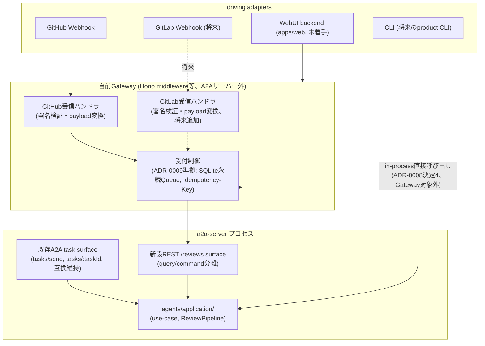
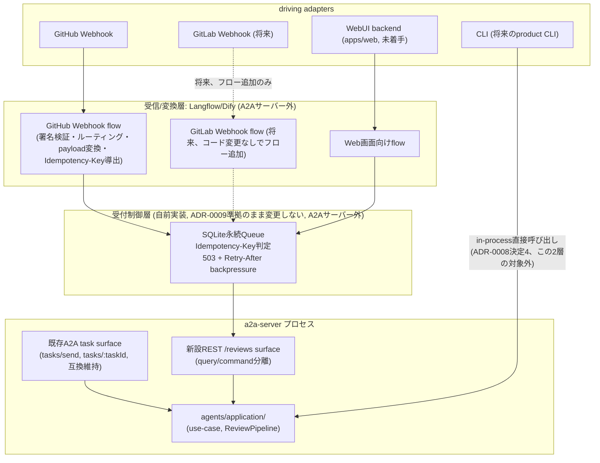
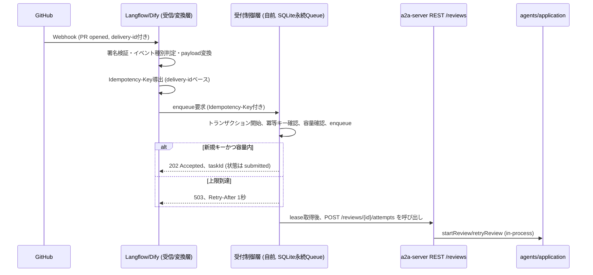
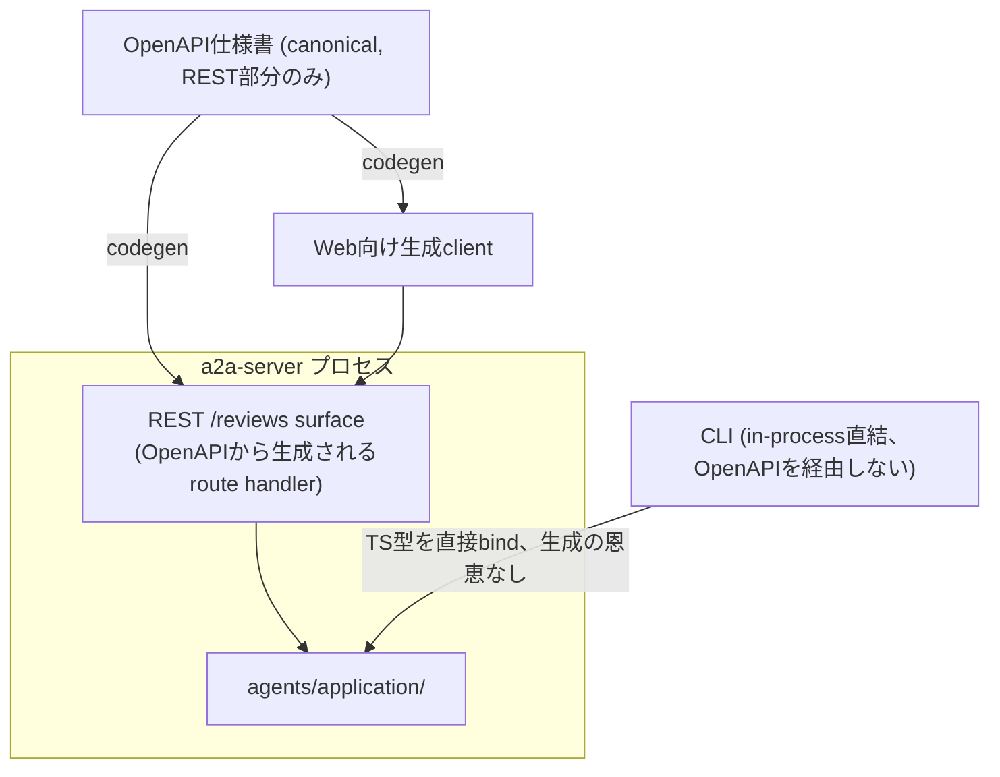

# ADR-0012: 呼び出しインターフェース抽象化（Web/CLI/A2A共有）方針の決定

- Status: Proposed(未実装・レビュー待ち)
- Date: 2026-08-27
- Related: Issue #347（本ADRが扱う課題）, Issue #346（前提, ADR-0008）,
  Issue #344（親トラッキング）, Issue #345（流量制御, ADR-0009/0010/0011の親, サブIssue #365-#368）,
  [docs/adr/0002-workflow-externalization-langflow-dify.md](0002-workflow-externalization-langflow-dify.md),
  [docs/adr/0007-Multi-Container-Architecture-for-Scalability.md](0007-Multi-Container-Architecture-for-Scalability.md),
  [docs/adr/0008-core-extension-boundaries.md](0008-core-extension-boundaries.md),
  [docs/adr/0009-localllm-review-flow-control.md](0009-localllm-review-flow-control.md),
  [docs/adr/0010-localllm-concurrency-limit-and-cancellation.md](0010-localllm-concurrency-limit-and-cancellation.md),
  [docs/a2a-api-design.md](../a2a-api-design.md)

## Context

Issue #243（レビュー対象の登録・レビュー結果確認Web UI）とその機能実装Sub-Issue群（#244-246, #335-343）を安全に進めるには、実装着手前にアーキテクチャレベルの意思決定を確定させる必要がある。親Issue #344は、この意思決定を3件（#345流量制御、#346レイヤ境界、#347本ADRが扱う呼び出しインターフェース抽象化）に切り出しており、#347は#346が定めるapplication層/port境界に直接依存する構造になっている。

#346はADR-0008としてマージ済みであり、以下を確定させている。

- `agent-core`パッケージ内に`agents/application/`（use-case関数: `startReview`, `retryReview`, `listReviews`, `getReview`, `closeReview`, `applyCommentDisposition`, `registerReview`、`ReviewPipeline`合成ロジック、Port定義: `ModelProvider`/`GitHubClient`/`ReviewerRegistry`）と`agents/runtime/`（Strands依存実装）をディレクトリレベルで新設する方針（段階移行）。
- driving adapterごとの非対称な呼び出し経路: **CLI**（将来のproduct CLI）は`agents/application/`のuse-caseをin-processで直接呼び出す。**評価スクリプト**（`packages/evaluation`）は引き続きA2A HTTP API経由（流量制御対象外の位置づけを維持）。**WebUI**（`apps/web`、未着手）は専用backendを持つが、`application`を直接importせずA2A HTTP API経由で間接的に呼び出す。

ただし本ADR作成にあたり現状のコードを確認した結果、以下の事実が判明した。

- ADR-0008が定めた`agents/application/`/`agents/runtime/`ディレクトリ分離は**コード上まだ未着手**である。`agent-core/src/agents/`は依然としてフラットな既存ファイル群（`base-reviewer.ts`, `lead-engineer.ts`, `pr-info-collector.ts`, `review-orchestrator.ts`, `registry.ts`, `model-provider-factory.ts`等）のままであり、`application/`・`runtime/`ディレクトリは存在しない。
- a2a-server側には、ADR-0008が言及した「Port相当の型」が`orchestrator.service.ts`（`PRInfoCollectorClass`/`OrchestratorAgentClass`/`LeadEngineerAgentClass`）、`lead-engineer.service.ts`（独自の`LeadEngineerAgentClass`、前者と重複定義）、`reviewer-runtime.ts`（`ReviewerClass`）の3箇所に自然発生的に重複実装されている。agent-core側への一元化はまだ行われていない。
- `Review`・`ReviewAttempt`・`ReviewJob`という永続リソース概念は、コード上に実装が一切存在しない。ADR-0008・ADR-0009内に将来設計案として言及されているのみである。
- `apps/web`ディレクトリは実体がなく、`pnpm-workspace.yaml`のワークスペースパターン（`packages/*`, `apps/*`）としての予約のみ。`packages/cli`のようなCLIパッケージも存在しない。
- `packages/a2a-server/src/modules/orchestrator/orchestrator.service.ts`の`runTask()`が、`PRInfoCollector.collect()`→`ReviewOrchestrator.run()`→`LeadEngineerAgent.evaluate()`という3-stage合成をin-processで直列実行している。taskIdは`crypto.randomUUID()`で生成され、status（`submitted`/`working`/`completed`/`failed`）はモジュールごとに独立したインメモリ`Map`で管理される。TTLは完了/失敗到達後1800秒の`setTimeout`による自動削除で、永続化はなくプロセス再起動で消失する。同種のTTL付きインメモリストアが、orchestrator/pr-info/lead-engineer/reviewer-runtimeの4モジュールにそれぞれ個別実装として重複している。
- `packages/evaluation/src/run-agent-evaluation.ts`（393行の単一ファイル）内の`sendTask()`/`pollTask()`が、A2A HTTPクライアントとして唯一の実装である。`Authorization: Bearer <githubToken>`の直書き、`LeadEngineerReportSchema`という単一タスク種別専用レスポンス型への強結合など、評価専用の作り込みを含んだまま孤立しており、product CLIが依存すべき安定したclient/libraryにはなっていない。

この現状を踏まえ、本ADRは「まだ存在しないapplication境界」の呼び出しインターフェース仕様を具体的に確定させる役割を持つ。

並行して、流量制御に関するアーキテクチャ決定（Issue #345→#365→#366/#367/#368）がADR-0009・ADR-0010としてほぼ固まりつつある（いずれもStatus: Proposed）。

- ADR-0009: Queue実装方式は永続Queue（SQLite等、Worker lease方式）を採用候補とする。受付は「Gateway/専用中間サービス（A2Aサーバー外）」が担い、`BEGIN IMMEDIATE`によるトランザクション制御で容量確認とenqueueを直列化し、`Idempotency-Key`必須で`UNIQUE(ownerPrincipalId, idempotencyKey)`により冪等性を担保する。**新規識別子は導入せず、既存A2Aの`taskId`をそのままjob識別子として使う。** Queue内部状態`queued`はA2Aの`submitted`に対応付け、lease取得で`working`へ遷移する。Queueレコード（flow control用）と`ReviewJobStore`（review workflow state用）は別関心事として扱う方針が既に示されている。
- ADR-0010: システム全体の同時実行上限は、Worker（a2a-server実行ロール）内のprovider/endpoint単位`ProviderSemaphore`（`providerType`＋正規化済み`llmBaseUrl`をキーとする共有レジストリ、既定値1）＋Strands SDKの`cancelSignal`による協調キャンセルで実現する。

ADR-0007・ADR-0009を確認したところ、**Gateway自体の実装手段（Hono等の自前実装か、他のツールか）は明示的に決定されておらず、本ADRのスコープで扱ってよい未決事項である**。ただしADR-0009は「外部Broker不要」「単一ユーザーのローカル運用に最適」「軽量ライブラリ or 自前実装で足り、常駐ミドルウェア追加なし」という設計原則を明確に述べており、Gatewayに新たな常駐サービスを追加する選択には、この原則との緊張関係が伴う点を事実として押さえておく必要がある。

さらに、ユーザーから「LangflowやDifyを使用することも問題ない」という追加指示があり、検討の結果「LangflowやDifyのWebhook機能を、GitHub/GitLab/Web画面からのイベントを受け付ける統一入口（ADR-0007が定めるAPI Gateway相当）として活用する」という具体的な方向性に収斂した。これはADR-0002が扱う「3-stageワークフローのオーケストレーション自体をLangFlow/Difyへ委譲するか」という論点とは異なる。ADR-0002は現時点で「検討継続、採否未確定」のステータスのままであり、本ADRはこの判断を変更しない。

## 検討事項

### 論点1: 呼び出し境界の残差（canonical契約の所在、query/commandの分離）

A2Aプロトコルは`tasks/send`と`tasks/:taskId`のみを持つtask（コマンド）プロトコルであり、resource（クエリ）プロトコルではない。ADR-0008が列挙したuse-caseのうち`listReviews`/`getReview`/`closeReview`/`applyCommentDisposition`/`registerReview`はA2Aに対応するエンドポイントを持たず、この経路がADR-0008では未確定のまま残っている。ADR-0008決定4の原文は「WebUI backendは`application`を直接importせずA2A HTTP API経由で呼ぶ」であり、これをどう解釈し、query（一覧・取得・レポート参照）とcommand（登録・開始・再試行・クローズ・コメント処理・キャンセル）をどう公開するかが本ADRの中心課題である。

### 論点2: domain resourceとA2A taskの関係（identity・lifecycle）

`Review`（永続、ユーザー管理対象）、`ReviewAttempt`、`ReviewJob`、transport-level `A2ATask`の識別子・ライフサイクルを分離する必要がある。ADR-0009が既に「新規識別子は導入せず、既存A2Aの`taskId`をそのままjob識別子として使う」「Queueレコードと`ReviewJobStore`は別関心事」という制約を課しており、本ADRはこの制約と矛盾しない形で4概念の関係とstatus mappingを具体化する必要がある。既存A2A taskのTTL（1800秒・in-memory・プロセス再起動で消失）と、永続すべきレビュー結果の関係も決定する必要がある。

### 論点3: 共有contracts/clientパッケージの範囲

`agent-core/src/models/`にはZod schemasが存在するが、REST用のrequest/response envelope、error model、pagination/filter、versioning、polling/wait/cancellation helperは未定義である。評価パッケージの`sendTask`/`pollTask`は評価専用の作り込みを含んだまま孤立している。これを共有可能な形へ抽出するかどうかが論点になる。

### 論点4: model provider/runtimeの呼び出しport

ADR-0008は`ModelProvider` Port導入を、ADR-0010は`ProviderSemaphore`のキーを`providerType`＋正規化済み`llmBaseUrl`とすることを既に決定済みである。**この論点は3案のいずれを採っても同じ結論になるため、案間の比較軸としては使わず「検討内容」で1回だけ記載する。** 残る論点は、Web/CLI/A2A/Gatewayのどのフィールドをクライアントが指定してよいかという resource key 露出ポリシーのみである。

### 論点5: エラー・進捗・cancel契約

現状のA2Aエラーは`{detail: string}`（422のみFastAPI形状の残骸`{detail:[{type,loc,msg}]}`）に統一されているが、REST/CLIを含めた共通error taxonomy、sync受付+async追跡の契約、CLI exit code、idempotencyの扱いが未定義である。

### 論点6: 互換性と段階移行（他論点の帰結）

見かけ上は独立した論点だが、実体は「どの案を採るか」と「ADR-0008のStrands隔離段階（特にStage4=`ReviewPipeline` Port導入）がいつ完了するか」に従属して機械的に決まる。独立した比較軸にはならないため、検討内容では1回だけ扱う。

### 論点7: Gateway/イベント受信層の実装手段

ADR-0007が採用した「API Gateway + Worker Queue」構成における、Gateway自体（WebUI/CLI/GitHub・GitLab Webhook等からのリクエストを最初に受ける層）を何で実装するかは、ADR-0007・ADR-0009のいずれにおいても明示的に決定されていない。ユーザーの追加指示（LangflowやDifyの活用）を受け、この論点を本ADRで扱う。GitHub/GitLabのようなVCSごとのWebhookを将来複数対応する場合、イベントソースが増えるたびにa2a-server側へ専用の受信ハンドラを実装するコストが発生する点が背景の課題である。

## 検討内容

3案は共通して、**canonical契約は`agents/application/`のuse-case関数シグネチャとし、`a2a-server`プロセスが既存A2A task surface（互換維持）と新設REST `/reviews` resource surface（query/command分離）の2つのthin adapter surfaceをホストする**という土台を前提とする。3案の分岐点は論点7（Gateway/イベント受信層の実装手段）である。

### 案1: 自前Gateway実装

イベントソースが増えるたびに（GitLab対応等）、自前Gateway内に専用の受信ハンドラ（署名検証・payload変換）を実装する。

### 案2: Langflow/Difyを受信/変換層としたGateway（採用）

Gatewayを「受信/変換層」と「受付制御層」の2層に分離する。GitHub/GitLab Webhook・Web画面からのイベントはLangflow/Difyが受信し、イベント種別のルーティング・payload変換・Idempotency-Keyの導出（GitHub delivery IDやPR番号+headSHA等から導出）を行った上で、ADR-0009が定める受付制御層（`BEGIN IMMEDIATE`によるSQLiteトランザクション制御、`UNIQUE(ownerPrincipalId, idempotencyKey)`、503+`Retry-After`等）を経由してcanonical command surfaceを呼び出す。**ADR-0009が定めた受付制御の実装そのものは変更しない。** CLIはADR-0008決定4により引き続きin-process直結とし、このGatewayの対象外とする。

### 案3: Contract-First（OpenAPI/codegen canonical）

REST部分のみOpenAPI等のIDL文書をcanonicalとし、そこからroute handler・生成clientを追従させる。Gateway/受信層の実装手段は案1・案2いずれとも独立に選べる直交軸のため、ここでは案1（自前Gateway）と組み合わせた場合のみを比較対象とし、契約管理パイプラインとversioning規律の差分に焦点を当てる。

### 論点ごとの比較表

| 論点 | 案1（自前Gateway） | 案2（Langflow/Dify受信層、採用） | 案3（Contract-First） |
|---|---|---|---|
| 呼び出し境界の残差（query/command分離） | a2a-server内でREST GET=query／POST・PATCH=command、A2A `tasks/send`はstart系互換入口として維持 | 案1と同じcommand surfaceを、Langflow/Dify経由のWebhookトリガーからも呼べるようにする | 案1と同じ分離をOpenAPI上で明示 |
| 新しいイベントソース追加コスト | a2a-server手前の自前Gatewayに、VCSごとの受信ハンドラ（署名検証・payload変換）を都度実装 | **Langflow/Dify上でフロー追加するだけで、a2a-server側のコード変更は不要**。ただし軽減されるのは受信層のみであり、PR/MR情報を実際に取得する層（`GitHubClient` Port、ADR-0008が「唯一のPR情報源だが差し替え可能にする」と分類済み）のコストは別途発生する。GitLab対応時は、Langflow/Dify上のフロー追加に加え`GitHubClient` Portの別実装（`GitLabClient`相当）が必要になる | 案1と同じ（コストの本体はGatewayの実装手段では変わらない） |
| domain resource / A2A task identity | `taskId=attemptId`、`ReviewJob`は永続識別子ではなくruntime投影 | 同左（Langflow/Difyが受付制御層を経由してcommand surfaceを1回呼ぶ限り、他のdriving adapterと同じ1:1:1関係が保たれる） | 同左 |
| 共有contracts/client | Zod schemas共有＋手書きclient、評価の`sendTask`/`pollTask`抽出 | 同左＋Langflow/DifyのIdempotency-Key生成規約をcontracts側にドキュメント化 | OpenAPI codegen中心。CLIはin-process直結のため生成の恩恵は限定的で、二重契約管理コストに見合わない |
| model provider port | 差が出ない（3案共通、後述） | 同左 | 同左 |
| error/progress/cancel契約 | REST/A2A/CLI共通taxonomy | 同左＋`webhook_validation_error`（署名検証失敗等）を追加 | 案1と同じ＋OpenAPI error schema |
| 互換性・移行 | 他論点の帰結（A2A面は無変更、REST面は追加のみ） | 同左。既存A2A/REST面は無変更で、Langflow/Difyは呼び出し元として追加されるのみ | 同左 |
| 外部Broker不要というADR-0009の設計原則との整合 | 完全に整合（追加ミドルウェアなし） | **緊張あり**: Langflow/Difyという常駐サービスを追加する。ただし受付制御（SQLite Queue、Idempotency-Key判定）自体は自前実装のまま変えないため、ADR-0009の決定内容そのものは変更しない。緊張は「受信/変換層に外部ツールを使うかどうか」に限定される | 完全に整合 |

model provider port（差が出ない論点）: ADR-0008が`ModelProvider` Port導入を、ADR-0010が`ProviderSemaphore`のキーを`providerType`＋正規化済み`llmBaseUrl`と既に決定済みである。3案共通で、`providerType`/`llmBaseUrl`はサーバー管理設定のみとしクライアント指定不可、`modelId`はクライアントがオーバーライド可能だがサーバー側allowlistで検証する、という結論になり案間で差が出ない。

## Decision

**案2「Langflow/Difyを受信/変換層としたGateway」を採用する。** canonical契約（`agents/application/`のuse-case、REST/A2A 2 surface構成）は3案共通の土台とし、その手前に立つイベント受信・変換層としてLangflow/Difyを採用する。

採用理由: (1) ADR-0009が定めた受付制御層（SQLite永続Queue、Idempotency-Key）を一切変更せずに済む二層構成が成立する、(2) GitHub/GitLab/Web画面という複数のイベントソースに対して、a2a-server側のコード変更なしにルーティング・変換ロジックを追加できる、(3) CLIはADR-0008決定4のまま維持しGatewayの対象外とすることで既存決定と矛盾しない。

以下、実装レベルの合意事項（案の名前で参照する）。

1. `a2a-server`に`modules/reviews/`（仮称）を新設しREST resource surfaceを追加する。query（`GET /reviews`, `GET /reviews/{id}`, `GET /reviews/{id}/attempts/{attemptId}`, `GET /reviews/{id}/report`）とcommand（`POST /reviews`(register), `POST /reviews/{id}/attempts`(start/retry), `POST /reviews/{id}/close`, `POST /reviews/{id}/attempts/{attemptId}/disposition`, `POST /reviews/{id}/attempts/{attemptId}/cancel`）を分離する。既存A2A `tasks/send`/`tasks/:taskId`はstart系コマンドの互換入口として維持し、評価パイプラインの呼び出し先は変えない。

   > **決定4の解釈拡張について**: ADR-0008決定4の原文は「WebUI backendは`application`を直接importせずA2A HTTP API経由で呼ぶ」であり、本合意事項が新設する「同一プロセスがホストする別REST surface」への拡張は、決定4の文言をそのまま満たすものではなく解釈の拡張である。a2a-serverプロセス自身はADR-0008で既に`application`をin-process呼び出す主体と位置づけられているため、プロセス内に2つ目のthin surfaceを追加するだけであり、`application`をimportする主体を増やすわけではない、という論拠でこの拡張を正当化する。ADR-0008自体の文言更新が必要かは次回整理する。

2. Gatewayを受信/変換層（Langflow/Dify、GitHub/GitLab Webhook・Web画面からのイベントを受ける）と受付制御層（自前実装、ADR-0009準拠のSQLite永続Queue・Idempotency-Key判定を変更せず踏襲）の二層で構成する。**CLIはADR-0008決定4によりin-process直結のまま、この二層の対象外とする。**

   > **CLIのflow-control前提**: CLIはa2a-serverとは別プロセスで動作するため、Worker内`ProviderSemaphore`（ADR-0010、provider/endpoint単位のプロセス内共有レジストリ）による同時実行上限にも、Gatewayの`Idempotency-Key`重複排除にも掛からない（ADR-0010が指摘する通り、`run-agent-evaluation.ts`の並列数オプションと同様に「呼び出し側の並列数を絞るだけで、サーバー側の全体制御にはならず、Web UIやCLIなど他のcallerからは制御できない」構造がCLIにもそのまま当てはまる）。したがって単一ユーザーがCLIを逐次実行する運用を前提とし、CLIから同時に複数の`startReview`/`retryReview`を実行しないことを利用者側の運用条件とする。この条件をCLI自体で強制する仕組み（ロックファイル等、queue-aware化）を設けるかどうかは、CLI thin adapter実装Sub-Issue（後述Consequences項番6）で決定する。

3. identity階層は次の通りとする。

   - `Review`（永続、ユーザー管理対象、id=`reviewId`）: 1つのPR/対象に対応する登録単位。1..N個の`ReviewAttempt`を持つ。
   - `ReviewAttempt`（永続、id=`attemptId`）: 1回の実行（初回登録時のstartまたは各retry）に対応する。
   - `A2ATask`（transport-level、`taskId`）: `taskId := attemptId`とし、新規識別子を導入しない。ADR-0009が定めるQueue job idも同じ`taskId`を流用する。
   - `ReviewJob`: 永続識別子としては導入しない。実行中の`ReviewAttempt`のruntime/queue側投影（`taskId`をキーにQueueとA2Aの現在状態を参照するための呼び名）として扱う。

   status mapping:

   | A2A `status` | Queue内部状態(ADR-0009) | `ReviewAttempt.status` | 備考 |
   |---|---|---|---|
   | （enqueue後・lease前） | `queued`（lease未取得） | `queued` | Gatewayが`202`を返した直後 |
   | `submitted` | `queued`→lease取得後`working`へ遷移 | `queued`→`running` | ADR-0009の遷移をそのまま反映 |
   | `working` | `working` | `running` | |
   | `completed` | （worker側で完了） | `succeeded` | reportは`ReviewJobStore`へ永続化 |
   | `failed` | （worker側で失敗） | `failed` | error taxonomy（後述）のcodeを付与 |
   | （cancelSignal発火, ADR-0010） | — | `canceled` | A2Aの4状態には存在しない追加状態。REST/CLI向けにのみ`canceled`として表現し、外部A2A statusは変更しない——既存A2Aクライアント（`packages/evaluation/src/run-agent-evaluation.ts`の`pollTask`を含む）はcancelを示す専用状態を持たないため、cancel後も直前のA2A `status`（多くは`working`）を観測し続け、既存のdeadlineベースのtimeoutで初めてpollingを終了する。この挙動は項番7の「既存A2Aエンドポイントと評価パイプラインは無変更」という決定から導かれる帰結であり、変更しない。cancelを既存4状態のいずれかに投影して即時に終端化するかどうかは、互換性への影響が大きいため本ADRでは決めず実装Sub-Issueに委ねる |

   `Review.status`は最新`ReviewAttempt.status`から導出する派生状態（`draft`/`reviewing`/`reviewed`/`failed`/`closed`/`canceled`）とし、`ReviewAttempt.status = canceled`の場合は`Review.status`にも`canceled`を投影する。`closeReview`による`closed`（Review側の管理操作）と`canceled`（Attempt側の実行結果）は独立した軸であり優先順位の問題ではない——同一`Review`が`closed`かつ最新`ReviewAttempt`が`canceled`という組み合わせも許容する。comment dispositionは`ReviewAttempt`の結果（finding単位）に対する別軸の属性であり、status machineの一部にはしない。

   **Queueレコードと`ReviewJobStore`のストア統合可否は#368の検討事項として明示的に残し、本ADRでは決めない**（ADR-0009が既に切り出した論点であるため先取りしない）。

4. 共有契約は`agent-core`（配置の最終判断は実装Sub-Issueに委ねる）にZod schemasとして拡張し、REST request/response envelope・error taxonomy・pagination/filterを追加する。Langflow/Difyが生成するIdempotency-Keyの導出規約（イベントソースごとのkey生成ルール）もこの契約層にドキュメント化する。評価パッケージの`sendTask`/`pollTask`（`run-agent-evaluation.ts` L54-141）をこの共有契約層に依存する汎用A2A clientとして抽出し、`LeadEngineerReportSchema`への強結合と`Bearer <githubToken>`直書きを取り除く。ただしCLIはin-process直結のためこのHTTP clientには依存しない。バージョニングはADR-0008合意事項6が公開APIについて定めた方針（全workspace packageが`private:true`のためnpm semverは使わず、exports surfaceの安定性＋`apiVersion`相当のフィールドで代替する）を踏襲し、REST `/reviews` surfaceは当面単一バージョン（無署名の`/reviews`パス）のみを公開し、破壊的変更が必要になった時点でパスバージョニング（`/v2/reviews`等）を検討する。

5. `providerType`/`llmBaseUrl`はサーバー管理設定のみとし、Web/CLI/A2A/Gatewayいずれのリクエストからも指定不可とする。`modelId`は呼び出し元がオーバーライド可能だが、サーバー側allowlistで検証する。

6. error taxonomyは以下の通りとし、REST/A2A/CLIそれぞれの表現とCLI exit codeへマッピングする。

   | taxonomy code | 発生源 | REST | A2A(既存) | CLI exit code |
   |---|---|---|---|---|
   | `validation_error` | 入力検証失敗 | 400/422 | 422（既存`{detail:...}`形状を維持） | 1 |
   | `webhook_validation_error` | Langflow/Dify受信層での署名検証失敗等 | 400（Langflow/Dify側でハンドリング、a2a-serverには到達しない） | 対応なし | 対応なし（Gateway段階のためCLI無関係） |
   | `not_found` | Review/Attempt不存在、TTL失効後のtaskId等 | 404 | 404 | 2 |
   | `conflict` | 同一Idempotency-Keyで異なるpayload、close済みへのstart等 | 409 | （A2Aには対応なし、REST/CLI固有） | 3 |
   | `queue_overload` | Gateway受付超過(ADR-0009) | 503 + Retry-After | 503（既存） | 4 |
   | `upstream_github_failure` | GitHub MCP/REST失敗 | 502（受付前の同期検証で失敗した場合のみ。ただし本ADRの契約は常にsync受付(202)+async追跡のため受付前検証自体を定義しておらず、通常は発生しない）。受付後(`202`)の失敗はpollingが返す終端`failed`状態（`GET`応答自体は200）+ error code/detailとして表現する | `failed`終端状態＋detail | 5 |
   | `upstream_model_failure` | LLM呼び出し失敗 | 上記`upstream_github_failure`と同じ契約（502は受付前限定、受付後はpolling終端`failed`） | `failed`終端状態＋detail | 5 |
   | `timeout` | job deadline到達 | `failed`終端状態（pollingで返却、`GET`応答自体は200）。項番6が定める通り本ADRの契約は常にsync受付(202)+async追跡(polling)のため`504`は使用しない | `failed`終端状態 | 6 |
   | `canceled` | cancelSignal発火(ADR-0010) | 200（terminal, エラー扱いしない） | A2Aの4値には存在しないためREST/CLI限定の終端状態として表現 | 0（意図的キャンセルは失敗ではない） |

   sync受付+async追跡は既存のADR-0009 Gateway 202契約をそのまま踏襲し、pollingを基準とする。SSE/streamingは将来拡張として予約し今回は実装しない。idempotencyはコマンドレベル（`registerReview`/`startReview`/`retryReview`の呼び出し。`POST /reviews/{id}/attempts`は初回attempt作成なら`startReview`、既存attemptへのretryなら`retryReview`を指すが、どちらも同一エンドポイントであり同じidempotency契約に従う）に適用する。**同一Idempotency-Keyかつ同一payloadでの再送は新規作成せず、同一`attemptId`（`taskId`も同じ）の既存`ReviewAttempt`を、その時点の現在の`ReviewAttempt.status`/A2A `status`とともに返す**——ADR-0009（L248-249）が定める「同一taskIdと現在のA2A状態を返す」契約をそのまま踏襲し、開始時点のstatusを凍結して返すことはしない。同一Idempotency-Keyで異なるpayloadを送った場合のみ上記`conflict`（409）とする。この振る舞いは`upstream_github_failure`/`upstream_model_failure`/`timeout`いずれについても、クライアントが受付後の失敗をpollingで正しく終端`failed`として観測できる限り、コマンドを再送して`ReviewAttempt`を重複作成する必要がないことを意味する。

   **idempotency replayとclose後startの優先順位**: `registerReview`/`startReview`/`retryReview`呼び出し後に対象`Review`が`closeReview`されてから、同一Idempotency-Keyかつ同一payloadで同じコマンドが再送された場合、**idempotency replayを状態競合より先に評価し、既存`ReviewAttempt`を同一identityのまま、その時点の現在のstatus（`closed`の影響を受けていれば`Review.status`側にそれが反映された状態）で返す（`closed`後であっても`conflict`の409にはしない）**。Idempotency-Keyは同一論理リクエストの再送に対して同一`ReviewAttempt`（同一`attemptId`/`taskId`）を返す契約であり、close自体を「再送だから拒否すべき状態変化」として扱わないため。一方、**同一Idempotency-Keyで異なるpayload**を`closed`後に送った場合は、通常の`conflict`（409、close済みへのstartとして）を返す。REST/CLIとも同じ優先順位で統一する。

7. 移行順序: 既存A2Aエンドポイントと評価パイプラインは無変更、REST surfaceは追加のみとする。ADR-0008 Stage4（`ReviewPipeline` Port導入）完了前は、REST command handlerの一部が`agents/application/`ではなく現行`orchestrator.service.ts`への直接呼び出しに暫定フォールバックする過渡期間が生じることを明示する（隠さず、経過状態として扱う）。**この暫定フォールバック期間中、`orchestrator.service.ts`は独自に`crypto.randomUUID()`でtaskIdを生成する（Context節参照）ため、項番3が定める`taskId := attemptId`の不変条件をこの経路だけは満たせない。**この不整合の解消方法（`attemptId`を`orchestrator.service.ts`へ引き渡すshimを追加する、または新設REST commandをフォールバック対象から除外する、のいずれか）は本ADRでは決めず、実装Sub-Issue（後述Consequences項番2）で決定する。Langflow/Dify受信層の導入自体は既存経路に影響しない追加レイヤであるため、他の移行と独立して段階導入できる。

## Consequences

- ADR-0008決定4の「A2A HTTP API経由」という文言を、同一プロセス内の別surfaceへも拡張解釈する判断を行った。ADR-0008自体の文言更新が必要か次回整理する。
- Queueレコードと`ReviewJobStore`の統合可否は#368待ちのまま未決事項として残る。
- Langflow/Difyという常駐サービスの追加は、ADR-0009の「外部Broker不要」という設計原則と部分的に緊張する。受付制御層（Queue実装）自体は変更しないため許容範囲と判断するが、将来Langflow/Dify自体の運用コスト（デプロイ・バージョン管理・可用性）が問題になった場合は、受信層のみを自前Webhookハンドラに差し戻す選択肢を残す（受信層と受付制御層を分離した設計であるため、この差し戻しはcanonical契約やQueue実装に影響しない）。
- GitLab等の追加VCS対応時、Langflow/Dify側のフロー追加に加えて`GitHubClient` Portの別実装が必要であり、案2は受信層のコストしか軽減しない。
- ADR-0002の「ワークフロー外部化は検討継続」という判断は変更されない。案2はオーケストレーション（3-stage合成）自体をLangflow/Difyに委ねるものではなく、受信/変換層のみを委ねるものであるため、ADR-0002とは異なる論点として扱う。
- `.serena/memories/architecture.md`および`feedback_a2a_agent_invocation`は、CLI直結の例外・REST surfaceの追加・Langflow/Dify受信層の存在を反映して更新が必要になる。
- 本ADRはIssue #347のDefinition of Doneのうち「決定内容を実装タスクへ分割し#243配下のSub-Issueへ依存関係を反映する」項目を満たさない。ADRマージ後、別途Sub-Issueとして起票する。実装Sub-Issue分割の見通しは以下の通り。

  1. 共有contracts/error taxonomy module（前提）
  2. REST `/reviews` command routes（(1)依存、Stage4前フォールバック許容を明記）
  3. REST `/reviews` query routes＋`ReviewJobStore`永続化（(1)・identity設計に依存）
  4. 評価パッケージの`sendTask`/`pollTask`抽出（(1)依存）
  5. provider config lockdown（`providerType`/`llmBaseUrl`サーバー管理化、ADR-0010実装群と調整）
  6. CLI thin adapter（(1)(2)(3)依存）
  7. Idempotency-Key適用（ADR-0009 Gateway実装群 #366等と依存）
  8. Langflow/Dify受信/変換層のフロー構築（GitHub Webhook対応を第一弾、(1)(2)(7)依存）
  9. ドキュメント更新（`docs/a2a-api-design.md`、`.serena/memories/architecture.md`）
