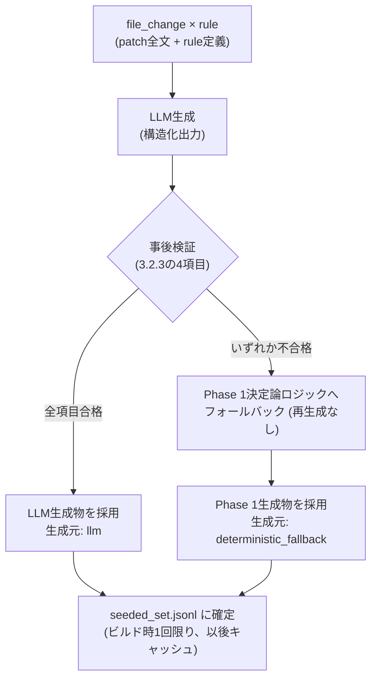

# Seeded set生成: mutation注入ロジック 要件と設計ドキュメント

2026-07-08評価 (`evaluation/data/report_*.md`; `evaluation/data/` は `.gitignore` の
`evaluation/data/` エントリで除外される生成物のためリポジトリには含まれず、
`bash evaluation/tools/run_evaluation_pipeline.sh` 等の再実行で再現できる) で
Critical Miss Rate = 1.000 となった要因分析 (5whys) の結果、
Seeded set側の見逃し (`js_eval_injection` ×2件) の真因は
個別ルールの不備ではなく、`evaluation/tools/build_seeded_set.py` の mutation 注入ロジック
(`inject_patch()` / `get_snippet_for_lang()`) が持つ構造的な限界であることが分かった。
本ドキュメントはこの注入ロジックが満たすべき要件と、決定論的アプローチ・LLM推論的アプローチを
組み合わせたハイブリッド設計を定義する。

**実装ステータス**: Issue #110 (親) / #111 (Phase1) / #112 (Phase2) で管理。
Phase1 (3.1節: `language_snippets`必須化、挿入位置ヒューリスティック改善、行番号再計算) は
実装済み。Phase2 (3.2節: LLM推論 + 決定論的事後検証) はIssue #112で実装着手。

---

## 1. 背景と問題

**注記**: 本節 (1.1〜1.4) は2026-07-08評価で発覚した根本原因分析であり、
Phase1着手前の状態を記述している。1.2の挿入位置ロジックの問題、および1.3の
`language_snippets`未定義・`window.location`混入は、いずれもPhase1実装
(Issue #111、3.1節参照) で解消済み。以下は「なぜPhase1が必要だったか」の
記録として現在時制のまま残す。

### 1.1 発覚した事象

`evaluation/data/seeded_set.jsonl` の `js_eval_injection` (severity: critical) 2件について、
Agentが対象ファイルの脆弱性注入行を一度も指摘できなかった。

- `seeded::hoppscotch/hoppscotch#6171::js_eval_injection::.../published-docs.resolver.ts`:
  Agentは17件のfindingsを返したが、全て mutation 対象外のファイル (`infra-config.service.ts`
  等、元PR本来の変更) に関するものだった。
- `seeded::vuetifyjs/vuetify#22788::js_eval_injection::.../VDataTableFooter.tsx`:
  Agentは対象ファイル自体には言及したが、注入行 (13行目) とは異なる行 (74/120/26/36/92等)
  を指摘し、severityも全てlowだった。

両者はいずれも7/7評価の同一パターンと一致しており、単発の失敗ではなく再現性のある問題である。

### 1.2 直接原因: `inject_patch()` の挿入位置ロジック

`evaluation/tools/build_seeded_set.py:78-103`

```python
def inject_patch(
    original_patch: str,
    line_snippet: str,
    context_lines: list[str] | None = None,
) -> tuple[str, int]:
    patch_lines = original_patch.splitlines()
    if not patch_lines:
        return original_patch, 1

    # Find a reasonable injection point after first hunk header.
    insert_idx = 1 if patch_lines[0].startswith("@@") else 0
    ...
```

挿入位置 (`insert_idx`) は、パッチの先頭行がhunkヘッダー (`@@` 始まり) であればその直後
(`insert_idx=1`)、そうでなければパッチの先頭 (`insert_idx=0`) に固定されている。実データ
(`gold_pr_set.jsonl` の全31 file_changes) ではpatchは常に `@@` 始まりであるため実質的に
前者のケースのみが発生するが、実装上はこの条件分岐が存在する。いずれの場合も多くは
import文の並びであり、コードの意味的文脈 (関数本体・条件分岐・実際に到達可能な処理フロー) を
一切考慮しない。実データで確認すると、`published-docs.resolver.ts` では import文の途中に
割り込む形で構文的に浮いたコードとして挿入されている。

このロジックは `js_eval_injection` 専用ではなく、`seeded_mutations.json` の5ルール
(`js_eval_injection` / `frontend_innerhtml_xss` / `react_useeffect_missing_dep` /
`frontend_n_plus_one_api` / `b2b2c_idor_hint`) すべてが `render_seeded_item()` 経由で共有して
いる (`b2b2c_idor_hint` も `language_snippets` の有無に関わらず挿入位置は同じ `inject_patch()`
に従うため対象から除外できない)。つまり今回可視化されたのは氷山の一角であり、
**mutation注入パイプライン全体が抱える構造的限界**として扱う必要がある。

### 1.3 副次的原因: `language_snippets` 未定義によるランタイム不整合

`evaluation/config/seeded_mutations.json` の `js_eval_injection` ルールには
`language_snippets` が定義されておらず、`get_snippet_for_lang()`
(`evaluation/tools/build_seeded_set.py:106-108`) は対象言語を問わず単一の `line_snippet` を
流用する。

```json
{
  "context_lines": ["const userInput = new URLSearchParams(window.location.search).get('q');"],
  "line_snippet": "const result = eval(userInput);"
}
```

`window.location` はブラウザのグローバルオブジェクトであり、NestJS (Node.jsサーバーサイド) の
`published-docs.resolver.ts` には存在し得ない。5ルール中 `b2b2c_idor_hint` のみ
`language_snippets` を定義済みで、残り4ルール (`js_eval_injection` 含む) は未定義のままである。

### 1.4 制約: 入力はunified diff patchのみ

`evaluation/data/gold_pr_set.jsonl` の `file_changes` は `path` と `patch` (unified diff) のみを
持ち、full file content・ASTは持たない。

```python
>>> list(file_changes[0].keys())
['path', 'patch']
```

このため、決定論的ロジック単体では「関数境界」「実行パス上の到達可能性」を正確に判定する情報が
原理的に不足する。これは後述の設計方針 (決定論だけで完全解決は困難、LLM推論の併用が必要) の
直接的な根拠になる。

---

## 2. 要件: mutation注入ロジックが満たすべき性質

| # | 性質 | 説明 | 現状 |
|---|---|---|---|
| R1 | 到達可能性 | 注入コードが実行されうる制御フロー上に存在すること。未使用の孤立文であってはならない | 不充足 (1.2) |
| R2 | 意味的整合性 | 変数・スコープ・対象言語のランタイム (ブラウザ/Node.js/等) に矛盾がないこと | 不充足 (1.3) |
| R3 | 文脈的自然さ | PRが実際に触れている変更ブロックの一部として現れ、唐突なグローバルAPI呼び出しの浮遊行にならないこと | 不充足 (1.2) |
| R4 | must_find行番号の正確性 | 挿入位置がどこであっても、挿入後patchにおける行番号を機械的に再計算できること | **不充足** (下記注参照) |
| R5 | 検出難易度の妥当性 | 実際の脆弱性が持つ「見つけやすさ」の分布に近いこと。過度な埋没・過度な露出のどちらも評価の妥当性を損なう | 未評価 (指標なし) |
| R6 | 再現性 | 同じ `--seed` で同じ結果になること | 充足 (現行の `rnd.shuffle` ベース、LLM併用時は別途担保が必要) |
| R7 | カタログ完全性 | 全ルールが対象言語ごとの妥当なsnippetを持つこと | 不充足 (1.3、5ルール中1のみ定義。ただし後述の注釈参照) |

R1〜R3は1.4の制約により決定論的ヒューリスティックのみでは限界がある。R7は決定論のみで解決可能。
R5は今回の分析で発見された新規の観点であり、既存の評価指標体系 (`EVALUATION_PLAN.md`) には
含まれていないため、本設計のスコープ外だが将来的な指標追加候補として記録する。

**R4に関する注 (レビューで発見)**: 現行の行番号計算式

```python
injected_line = base_line + len(context_lines or [])
```

は `insert_idx` が常に「hunkヘッダー直後」(`insert_idx=1`) に固定されていることを暗黙の前提と
している。実際に手計算で検証すると、挿入点がhunkヘッダーからN行離れた位置に動く場合、この式は
破綻する。正しくは、ヘッダーから挿入点までの新ファイル側の行数
(コンテキスト行 `" "` と追加行 `"+"` の合計。削除行 `"-"` は新ファイルの行番号を消費しないため
数えない) を積算した上で `base_line` に加算する必要がある。3.1.2 (挿入位置ヒューリスティック
改善) を導入する場合、この行番号再計算ロジックの書き換えが**必須の一部**であり、独立した改善では
ない。3.1.2で改めて扱う。

**R7に関する注 (レビューで発見)**: 唯一 `language_snippets` を定義済みの `b2b2c_idor_hint` は、
実際には全言語 (js/jsx/ts/tsx/vue/svelte) に同一文字列を複製しているだけで、ランタイム別に
内容を分岐させた実例にはなっていない。「既存の良い先例」として扱うのは誤りであり、Phase 1
実装時にゼロから設計する必要がある。

---

## 3. ハイブリッド設計

決定論的アプローチだけでは R1-R3 を十分に満たせない (1.4) 一方、LLM推論のみに依存すると
再現性 (R6) とコスト・レイテンシの問題が生じる。そのため2フェーズに分割し、
決定論的処理をLLM生成物の**事後検証・安全網**として使う構成とする。

### 3.1 Phase 1: 決定論的改善 (即座に着手可能) — 実装済み (Issue #111)

`evaluation/tools/build_seeded_set.py` に `split_hunks` / `select_target_hunk` /
`find_insertion_point` / `parse_hunk_new_start` / `count_new_lines_before` /
`validate_catalog` を追加し、`inject_patch()` を書き換えた。
`evaluation/config/seeded_mutations.json` の全5ルールに `language_snippets` /
`runtime` を追加し、`window.` / `document.` 参照を排除した (`b2b2c_idor_hint` は
フレームワーク別イディオムでゼロから再設計)。`tests/evaluation/tools/test_build_seeded_set.py`
に回帰テスト (hoppscotch#6171 published-docs.resolver.ts 相当の2hunkサンプル、
`must_find` 行番号の手検算一致を含む) を追加済み。

#### 3.1.1 `language_snippets` の必須化 (R7)

- `seeded_mutations.json` の全ルールに `language_snippets` を必須項目とする。
- ルールに `runtime: "browser" | "node" | "universal"` メタデータを追加し、
  対象言語ごとにランタイムに矛盾しないsnippetを用意する
  (例: `js_eval_injection` のNode向けは `window.location` の代わりに
  `req.query.q` 相当のNode.js的な入力源を使う)。
- `build_seeded_set.py` に起動時バリデーションを追加し、`languages` に含まれる言語のうち
  `language_snippets` が欠けているものがあれば生成をエラー終了させる
  (現状のように黙って `line_snippet` にフォールバックしない)。

#### 3.1.2 挿入位置ヒューリスティックの改善 (R1・R3の部分対応)

- **hunk選択**: 実データで確認した通り、gold PRのfile_changesの21ファイルは複数hunk構成
  (例: `hoppscotch/hoppscotch#6171` の `onboarding.dto.ts` は4hunk)。現行 `inject_patch()` は
  `patch_lines[0]` のみを見て常に最初のhunkに注入しているが、これは「importの変更だけの
  hunk」を選んでしまう可能性がある。改善後は、各hunkの追加行 (`+`) 数が最も多いもの
  (= 実質的な変更が集中しているhunk) を優先的に選択する。
- **hunk内の挿入位置**: 選んだhunk内で追加された (`+`) 行のうち、文の終端パターン
  (`;` 終わりの式文、`{` 直後など) にマッチする行の直後に注入する簡易構文チェックに置き換える。
- **行番号再計算 (R4対応、必須)**: 挿入位置が変わることで、上記「R4に関する注」の通り
  現行の `base_line + len(context_lines)` は使えなくなる。選択したhunkのヘッダーから挿入点
  までを走査し、コンテキスト行 (`" "`) と追加行 (`"+"`) の数を積算して新ファイル側の行番号を
  求める処理に置き換える。複数hunkパッチの場合は、選択したhunk自身のヘッダー
  (`@@ -a,b +c,d @@`) の `c` を起点にする。
- 実行パスの正確な到達可能性までは保証できないが、「import文の合間に浮く」という
  最も分かりやすい異常は解消できる。

#### 3.1.3 限界

full ASTがない制約 (1.4) により、Phase 1はあくまで「明らかな異常の除去」に留まる。
R1 (到達可能性) と R3 (文脈的自然さ) の本質的な改善にはPhase 2が必要、というのが
本分析の結論である。

### 3.2 Phase 2: LLM推論 + 決定論的事後検証

#### 3.2.1 生成フロー

1. **入力**: 対象file_changeのpatch全文、rule定義 (`rule_id` / `summary` / 脅威パターンの意図)。
2. **LLMへの指示**: 「このdiffのhunk内に脆弱性パターンを自然に挿入せよ。ただし
   (a) 既存の実行フローに組み込み孤立文にしない、
   (b) 対象言語のランタイムに矛盾しないAPIを使う、
   (c) 周辺コードと変数名・スコープを整合させる、
   (d) unified diff形式 (追加行のみ) を厳密に守る」。
3. **出力**: 構造化出力 (Pydanticスキーマ) で「変更後patch全文」「挿入行番号」
   「到達可能と判断した根拠」を返させる (フィールド定義は3.2.2)。
4. **事後検証**: 3.2.3の4項目を機械的にチェックし、不合格ならPhase 1ロジックへ
   フォールバックする (3.2.3)。
5. **確定**: 合格したLLM生成物、またはフォールバックしたPhase 1生成物を
   `seeded_set.jsonl` に書き出す。どちらの経路で生成されたかはitemごとに
   メタデータとして残す (3.2.7)。

以下は上記フローの俯瞰図である。



#### 3.2.2 構造化出力スキーマ (フィールド定義)

LLMには以下の3フィールドを持つ構造化出力を返させる (Pydanticモデルとしての実装は
実装フェーズで行うため、本節ではフィールドの意味・型・制約のみを定義する)。

| フィールド | 型 | 意味 | 生成時の制約 |
|---|---|---|---|
| `mutated_patch` | 文字列 (unified diff全文) | 脆弱性パターンを注入した後のpatch全文 | 元patchの各hunkに対する変更は追加行 (`+`) の挿入のみであること (hunkヘッダー `@@ ... @@` 自体は挿入位置に応じて書き換わってよい)。既存の削除行・コンテキスト行の書き換えを含んではならない (3.2.3で機械検証) |
| `injected_line` | 整数 (新ファイル側の1始まり行番号) | 注入したコードが新ファイル上で位置する行番号 | `must_find` の算出に用いるため、`mutated_patch` 中の実際の追加行位置と一致すること |
| `reachability_rationale` | 文字列 (自由記述、簡潔な説明) | なぜその挿入位置が実行パス上到達可能と判断したか | 空文字列を許容しない。事後検証では機械的に真偽判定しない (人手レビュー・ログ用途の記録項目) |

`reachability_rationale` は事後検証の合否判定には使わない (自由記述をルールベースで
検証するのは非現実的なため)。到達可能性 (R1) の担保は「LLMへの指示」と
「事後検証で明らかな異常を排除すること」の組み合わせで行い、本フィールドは
生成過程の説明可能性を残すための記録に留める。

#### 3.2.3 決定論的事後検証 (安全網、必須)

LLM生成物はそのまま採用せず、以下4項目を機械的に検証する。**いずれか1つでも不合格なら
Phase 1の決定論ロジックにフォールバックする**(再生成のリトライは行わない。系統Aで確認済みの
「モデル依存の不安定さ」を評価データセット生成側に持ち込まないため)。

| # | 検証項目 | 入力 | 合格条件 | 不合格時 |
|---|---|---|---|---|
| V1 | diff構文パース可否 | `mutated_patch` | hunkヘッダー・追加/削除/コンテキスト行として構文的に解釈できる (3.1.2で導入済みの `split_hunks` 系ロジックを再利用、後述) | フォールバック |
| V2 | 追加行以外の非改変 | `mutated_patch` と元patchの差分 | 元patchに存在した削除行・コンテキスト行がそのまま残っており、新規追加行 (`+`) 以外に変更がない | フォールバック |
| V3 | 必須トークン含有 | `mutated_patch` の追加行、ruleの `line_snippet` 相当の必須トークン (例: `eval(`) | 追加行のいずれかに必須トークンが含まれる | フォールバック |
| V4 | ランタイム整合性 | `mutated_patch` の追加行、対象ファイルの `runtime` (`browser`/`node`/`universal`、3.1.1参照) | 禁止APIリスト (例: Node向けファイルへの `window.`/`document.` 系API) に抵触しない | フォールバック |

**V1の実装方針 (未決定事項の解消)**: 元設計では「diffパースライブラリ (`unidiff` 等) を
新規導入するか、自前実装するか」を未決定事項としていたが、3.1.2で `split_hunks` /
`find_insertion_point` / `parse_hunk_new_start` / `count_new_lines_before` を既に自前実装済み
(Phase1、Issue #111) であるため、これらをV1の検証にもそのまま再利用する方針とする。
新規外部依存 (`unidiff` 等) は追加しない。理由は次の比較表の通り。

| 案 | 採用/却下 | 理由 |
|---|---|---|
| (A) Phase1の自前hunk走査ロジックを再利用 | **採用** | 3.1.2で実装済みの行番号走査ロジックと実質的に同じ処理であり、車輪の再発明を避けられる。新規依存が増えないためpyproject.tomlの依存管理・脆弱性スキャン対象も増えない |
| (B) `unidiff` 等の外部ライブラリを新規導入 | 却下 | Phase1で既に同等機能を実装済みであり、追加のメリットが薄い。新規依存はCVEスキャン対象を増やし、コンテナイメージの脆弱性管理方針とも整合しない |

#### 3.2.4 再現性の担保 (R6)

- 生成はビルド時の1回限りのオフライン処理とし、結果を `seeded_set.jsonl` として
  固定する (gold PRが更新されない限り再生成しない)。評価実行のたびにLLMを呼び出さない。
  ここで言う「固定」は生成物の内容を確定させキャッシュとして扱うことを指し、それを
  Git管理対象にするか (現状 `.gitignore` の `evaluation/data/` エントリによりコミット対象外)
  は別の論点である。
  Git管理対象にするかどうかの判断は4節「対象外」を参照。
- `--seed` は「どの (file, rule) ペアを選ぶか」(`enumerate_combo_pool` → `rnd.shuffle`) の
  決定論性にのみ使用する。snippet生成 (LLM呼び出し) 自体の再現性は、生成物を
  固定した成果物として扱うことで担保する。
- **モデル構成を変更した場合の扱い**: 3.2.6で導入する生成用モデル (`--model-id`/`--llm-base-url`)
  を変更した場合、同じ (file, rule, seed) の組でも生成結果が変わりうるため、既存の
  `seeded_set.jsonl` キャッシュはモデル変更前の生成物のままでは整合しない。

  | 案 | 採用/却下 | 理由 |
  |---|---|---|
  | (A) キャッシュキーに生成モデルIDを含めない。モデル変更時は運用者が手動で `seeded_set.jsonl` を削除・再生成する | **採用** | 生成はビルド時1回限りのオフライン処理という前提 (3.2.4冒頭) と整合する。モデル切替は頻繁に起きる操作ではなく、自動キャッシュ無効化の仕組みを持ち込むと再現性 (R6) の担保ロジック自体が複雑化する |
  | (B) `seeded_set.jsonl` の各itemにモデルIDを埋め込み、実行時に現在の設定と突合して自動再生成する | 却下 | 実装複雑度に見合うメリットが薄い。3.2.6のモデル分離はバイアス低減が目的であり、頻繁なモデル切替を前提とした運用ではない |

  採用した(A)のもとでは、生成モデルを変更した場合は運用者が明示的に再生成する必要がある旨を
  `evaluation/RUNBOOK.md` (実装時) に明記する。

#### 3.2.5 コストとレイテンシ

file_changes数 × rule数のオーダーでLLM呼び出しが発生するため、`build_seeded_set.py` の
実行時間は増加する。オフライン・オンデマンド生成であり評価実行の都度発生しないため許容するが、
新規gold item追加時の差分再生成 (既存seeded itemの再生成をスキップする仕組み) は
実装時に検討する。

#### 3.2.6 モデル構成: 生成モデルと評価モデルの分離

**背景**: Issue #112本文には明記されていないが、Seeded注入を生成するLLMと、生成物を
間接的に評価する側のLLM (レビュー対象Agent自身、および `score_evaluation.py` の
semantic-judge) が同一モデルに固定されると、そのモデル固有の「書き方の癖」と
「検出の癖」が相関し、評価にモデル依存のバイアスが混入する恐れがある。例えば、
あるモデルが注入する脆弱性コードのスタイルが、そのモデル自身がレビュアーとして
見逃しやすいスタイルと (何らかの理由で) 相関していた場合、評価結果はそのモデルにとって
不当に有利/不利になりうる。このバイアスを避けるため、生成モデルとその他のモデルを
独立して設定可能にする。

現状、本リポジトリには以下3系統のモデル設定が (今回新設する(c)を除き) 存在する。

| # | 用途 | 設定箇所 | 環境変数/引数 | 既定値 |
|---|---|---|---|---|
| (a) | レビュー対象Agent自身 (評価される側) | `src/code_review_agent/api/config.py` (Pydantic Settings, `env_prefix="CODE_REVIEW_"`) | `CODE_REVIEW_MODEL_ID` / `CODE_REVIEW_LLM_BASE_URL` | `gpt-4o` |
| (b) | `score_evaluation.py --semantic-judge` のjudgeモデル | `evaluation/tools/score_evaluation.py` の argparse | `--model-id` / `--llm-base-url` | `gpt-4o` |
| (c) (新設) | Seeded注入生成モデル (Phase2) | `evaluation/tools/build_seeded_set.py` の argparse (新設) | `--model-id` / `--llm-base-url` (CLI優先)、未指定時は `.env` の `SEEDED_GEN_MODEL_ID` / `SEEDED_GEN_LLM_BASE_URL` | 未設定時はエラー終了 (3.1.1のバリデーション方針に倣い、暗黙の既定モデルへのフォールバックはしない) |

**インターフェース案**: `build_seeded_set.py` に `score_evaluation.py` と同じ命名パターンの
`--model-id` / `--llm-base-url` を追加する。CLI引数が明示された場合はそれを優先し、
省略時のみ `.env` の `SEEDED_GEN_MODEL_ID` / `SEEDED_GEN_LLM_BASE_URL` を読む
(`load_dotenv()` は既に `build_seeded_set.py` の `main()` 冒頭で呼ばれている)。

**選択肢比較表 + 採用/却下理由**:

| 案 | 採用/却下 | 理由 |
|---|---|---|
| (A) 生成専用の環境変数/CLI引数を新設し、(a)(b)から完全に独立させる | **採用** | モデル依存バイアスの分離という目的そのものに直接応える。(a)(b)を一切変更せずに済み、既存の設定体系への影響がない |
| (B) 既存 `CODE_REVIEW_MODEL_ID` を生成モデルとしても流用する | 却下 | レビュー対象Agentのモデルを切り替えるたびにSeeded生成モデルも連動して変わってしまい、「生成モデル固定・レビュー対象モデルのみ変える」比較実験ができない。バイアス分離という目的に反する |
| (C) `score_evaluation.py` の semantic-judge 用 `--model-id` を共用する | 却下 | judgeモデルは評価スコアリング側の設定であり、生成モデルと結合すると「同じモデルが注入し、同じモデルが(間接的に)判定を補助する」経路が残る。判定は最終的にjudgeモデルのsummary類似度計算を経由するため、(A)と比べてバイアス分離の効果が弱い |

**運用上の推奨 (強制はしない)**: 生成モデル (c) とレビュー対象/judgeモデル (a)(b) には
異なるプロバイダまたは異なるモデルファミリを設定することを推奨する。強制しない理由は、
コスト・可用性の制約 (オフライン環境やAPIクォータの都合) で同一モデルしか使えない
運用も現実には存在するため。

#### 3.2.7 生成メタデータの記録

事後検証 (3.2.3) を経て確定したitemには、`seeded_set.jsonl` の各行に生成元を示す
メタデータ (例: `generation_source: "llm" | "deterministic_fallback"`) を付与する設計とする。
理由: 事後検証がどの程度の頻度でLLM生成物を不合格としフォールバックしているかを
後から追跡できないと、「LLM推論が実際にR1/R3をどれだけ改善しているか」を評価できない
(3.1.3で述べた「明らかな異常の除去止まり」というPhase1の限界に対し、Phase2がどこまで
前進したかを測る手段が必要)。この項目は5節の検証観点にも追加する。

---

## 4. 対象外

- 本ドキュメントは要件と設計方針の合意を目的とし、実装そのものは含まない。
- R5 (検出難易度の妥当性) の定量指標化は本設計のスコープ外。将来的に
  `evaluation/EVALUATION_PLAN.md` への指標追加を検討する候補として記録するに留める。
- 系統A (モデルの構造化出力信頼性、`StructuredOutputMissingError`) への対応は本ドキュメントの
  対象外。別途 `docs/granite-structured-output-failure-spec.md` の延長で扱う。
- `evaluation/data/seeded_set.jsonl` は生成物であり `.gitignore` の `evaluation/data/`
  エントリによりコミット対象外となっている
  (ディレクトリの役割分担自体は `docs/evaluation-pipeline-design.md` #2参照)。
  Phase 2導入後はLLM生成物を含むため、再現性確保の観点からコミット対象に変更するか
  どうかは実装時に別途判断するが、変更する場合は `.gitignore` 側の除外解除
  (例外パターンの追加、あるいは `evaluation/data/` からの退避) も併せて必要になる。

---

## 5. 検証観点 (実装時のテスト方針)

`tests/evaluation/tools/test_build_seeded_set.py` への追加を想定。

- **Phase 1**:
  - カタログバリデーション: `language_snippets` 欠落ルールがある場合に生成がエラー終了すること。
  - 挿入位置ヒューリスティック: 既知のhunkサンプルに対し、注入行が「文の終端パターン」の
    直後に配置され、import文ブロックの中間に挿入されないこと (回帰テストとして
    `published-docs.resolver.ts` の実データを固定サンプル化)。
  - `must_find` の行番号が新しい挿入位置に対して正しく再計算されること (R4)。
- **Phase 2**:
  - 決定論的事後検証の各チェック (diff構文・追加行のみ・必須トークン・ランタイム整合性) が
    単体で不正なLLM出力を検出できること (モックしたLLM応答で異常系を再現)。
  - 事後検証不合格時にPhase 1へフォールバックし、生成が失敗しないこと
    (seeded setがゼロ件にならないことの保証)。
  - 同一入力 (gold item, rule, seed) に対し、生成物をキャッシュ済みファイルから
    再現できること (LLM呼び出しをモックし、キャッシュヒット時にLLMが呼ばれないことを検証)。
  - 生成元メタデータ (`generation_source`) が、LLM生成物採用時は `"llm"`、
    フォールバック時は `"deterministic_fallback"` として正しく記録されること (3.2.7)。
  - Seeded生成モデル (`--model-id`/`--llm-base-url`、3.2.6) が未指定かつ
    `SEEDED_GEN_MODEL_ID` も未設定の場合にエラー終了すること (暗黙の既定モデルへ
    フォールバックしないことの確認)。
- **回帰**: 過去の見逃し2件 (hoppscotch#6171 / vuetify#22788) を新ロジックで再生成し、
  注入位置が意味のある場所になっていることを確認するゴールデンテストを追加する。

---

## 6. 今後の進め方

CONTRIBUTING.md のSpec-Driven + TDDフローに従い、以下の順で進めることを提案する。

1. 本ドキュメントの内容についてIssue化 (Phase 1 / Phase 2 を別Issueに分割することを推奨。
   Phase 1は決定論のみで完結し着手コストが低く、Phase 2はLLM呼び出し基盤の設計が別途必要なため)。
2. Phase 1をTDDで実装し、既存の `seeded_set.jsonl` を再生成して回帰確認。
3. Phase 2は事後検証ロジックを先に実装 (Red/Green容易) してから、LLM生成部を追加する。
