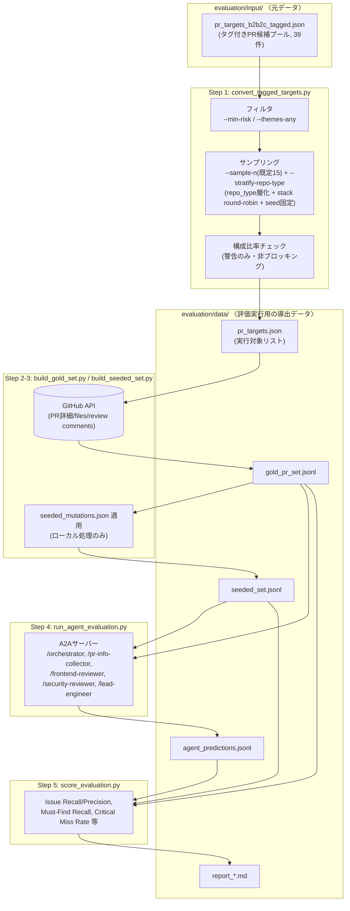
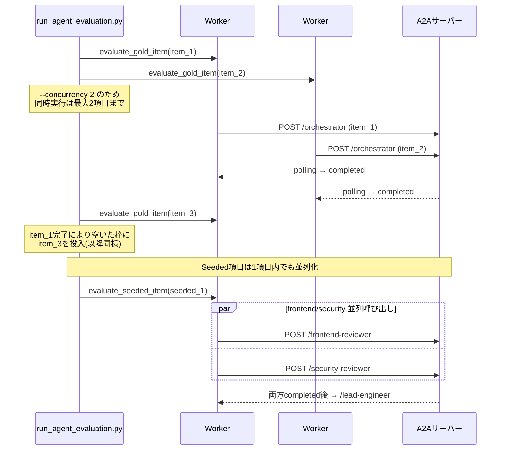

# 評価パイプライン設計: データ生成から実行まで

本ドキュメントは、Code Review Agent の性能評価に使うデータ(Gold-set / Seeded-set)が
どこで生成され、どこに置かれ、どう実行に使われるかを一枚で見渡せるようにするための構造説明である。
「何を測るか・合否基準は何か」は [evaluation/EVALUATION_PLAN.md](../evaluation/EVALUATION_PLAN.md) が扱う。
本ドキュメントは扱わない。

---

## 1. 背景と狙い

タグ付けされたPR候補プール(`pr_targets_b2b2c_tagged.json`、39件)から全件を対象に評価を実行すると、
Gold-set/Seeded-setの生成そのものよりも、生成後にレビューエージェントを実際に走らせる**評価実行フェーズ
(`run_agent_evaluation.py`)**の所要時間が支配的になる。この実行フェーズは各項目についてPR収集→並列レビュー
→Lead Engineer評価という多段のLLM呼び出しを伴うため、項目数に対してほぼ線形に時間がかかる。

これに対して次の2つの対策を取る。

- **母数(N)を減らす**: 全39件ではなくランダムにn件(既定15件)を抽出して評価する。ただし精度評価の
  妥当性を保つため、`repo_type`(UI Component Library / Application)で層化しつつ抽出し、抽出後の構成比率を
  可視化する。
- **実行を並列化する**: 項目単位・レビュアー単位で本来並列実行可能な処理を、実際に並列で実行する。

---

## 2. ディレクトリの役割分担: `evaluation/input/` と `evaluation/data/`

| ディレクトリ | 役割 | 例 |
|---|---|---|
| `evaluation/input/` | 評価の**元データ**。人手でキュレーションし、パイプラインが書き換えない | `pr_targets_b2b2c_tagged.json`, `pr_candidates_raw.json`, `repo_candidates.json` |
| `evaluation/data/` | パイプラインが**生成する導出データ**。実行のたびに再生成されうる | `pr_targets.json`, `gold_pr_set.jsonl`, `seeded_set.jsonl`, `agent_predictions.jsonl`, `report_*.md` |

`pr_targets.json`(実行対象PRのリスト)は`convert_tagged_targets.py`が元データから生成する導出データであり、
`evaluation/data/`に置く。以前は`evaluation/input/pr_targets.json`に出力していたが、ディレクトリの意味論に
反するため`evaluation/data/pr_targets.json`に変更した。

---

## 3. 全体データフロー

### Step別の要約

| Step | スクリプト | 入力 | 出力 | 備考 |
|---|---|---|---|---|
| 1 | `convert_tagged_targets.py` | `pr_targets_b2b2c_tagged.json` | `data/pr_targets.json` | フィルタ・サンプリング・構成比率警告 |
| 2 | `build_gold_set.py` | `data/pr_targets.json` | `data/gold_pr_set.jsonl` | GitHub APIでPR詳細・files・review commentsを取得 |
| 3 | `build_seeded_set.py` | `data/gold_pr_set.jsonl` | `data/seeded_set.jsonl` | ローカルでmutationカタログを適用(外部通信なし) |
| 4 | `run_agent_evaluation.py` | `data/gold_pr_set.jsonl`, `data/seeded_set.jsonl` | `data/agent_predictions.jsonl`, `data/report_*.md` | A2Aサーバー経由でレビューエージェントを実行 |
| 5 | `score_evaluation.py` | 上記3ファイル | スコアJSON | `run_agent_evaluation.py`内から呼び出される |

Step 1-3は`evaluation/tools/run_evaluation_pipeline.sh`が一括実行する。Step 4-5は`run_agent_evaluation.py`が
担う(A2Aサーバーの起動・停止を含む一連の流れは`.claude/skills/run-evaluation/SKILL.md`がオーケストレーションする)。

---

## 4. サンプリングと構成比率の可視化

`convert_tagged_targets.py`は`--sample-n <n>`(既定15、`run_evaluation_pipeline.sh`経由)または`--limit`で
件数を絞り込む。既定の`--sample-n`パスでは`--stratify-repo-type`が有効になり、`repo_type`
(ui-library/application)でほぼ50/50に層化しつつ、層内は既存のstack round-robin(`select_balanced`)と
固定シード(`--seed`、既定42)によるランダム選択を組み合わせる。`--limit`を明示指定した場合は既存の
決定的選択(risk降順)パスをそのまま使う(後方互換)。

抽出後、`summarize()`が`repo_type_distribution` / `stack_distribution_by_repo_type` /
`theme_category_distribution`を出力し、`EVALUATION_PLAN.md` §2.0 の下限比率と比較した警告
(`[COVERAGE-WARN]`)をstderrに出す。**この警告は非ブロッキングであり、パイプラインは停止しない。**
タグ付けプール自体の絶対数制約(Angular/Svelteの母数不足、performance/maintainability系タグの実質0件)
により、どのようにサンプリングしても構造的に警告が出続ける項目があることが分かっている
(詳細は `EVALUATION_PLAN.md` §2.0.3)。

N削減は生成フェーズの時間だけでなく、Step 4(`run_agent_evaluation.py`)が処理する項目数そのものを
減らすため、実行フェーズの所要時間短縮に直接効いてくる。

---

## 5. 実行フェーズの並行実行モデル

`run_agent_evaluation.py`は`--concurrency <n>`(既定2)で、Gold項目・Seeded項目それぞれのフェーズ内で
複数項目を並行評価する。A2Aサーバー(`uv run code-review-agent`)はシングルプロセス・シングルワーカーの
uvicornだが、各エンドポイントはリクエストを`BackgroundTasks`に登録して即座に応答し、実処理は
`asyncio.to_thread`でワーカースレッドにオフロードされる設計になっている。そのため、複数のPR評価を
同時に受け付けて実際に並行処理できる。

### なぜ既定を2並列にするか

並列度はローカル実行環境のハードウェア(CPU/メモリ)や、外部LLM API・GitHub MCP側の同時接続数上限に
強く依存する。現実的な上限は2並列程度と想定されるため、既定値は安全側に倒して2とする。並列度を
上げる場合、各タスクのポーリングタイムアウト(`--timeout`、既定1800秒)に達するリスクが高まるため、
`--concurrency`を上げる際は`--timeout`も合わせて見直すこと。

Seeded項目内のfrontend-reviewer/security-reviewer呼び出しの並列化は、`--concurrency`の値とは独立に
常に行われる。両者は互いの結果に依存しない独立処理であり、並列化しても精度(検出内容)には影響しない。

---

## 6. 関連ドキュメント

- [evaluation/EVALUATION_PLAN.md](../evaluation/EVALUATION_PLAN.md) — 何を測るか・合否基準・データセット戦略
- [evaluation/RUNBOOK.md](../evaluation/RUNBOOK.md) — 評価実行の具体的な手順
- [.claude/skills/run-evaluation/SKILL.md](../.claude/skills/run-evaluation/SKILL.md) — 本パイプラインをオーケストレーションするスキル
