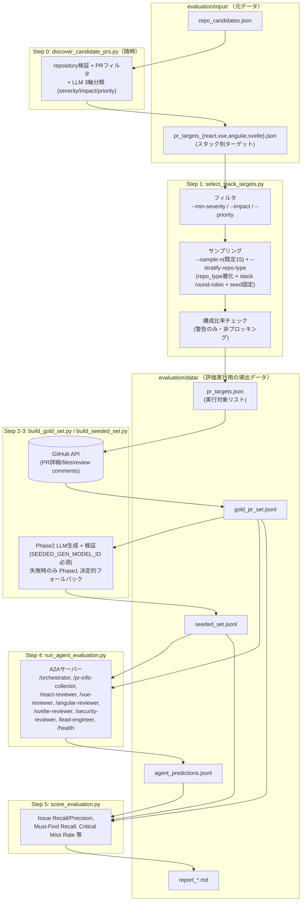
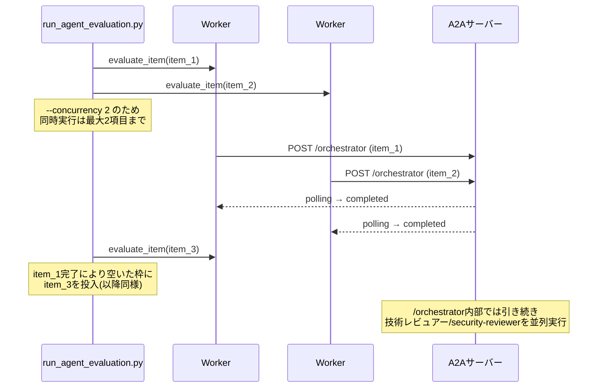

# 評価パイプライン設計: データ生成から実行まで

本ドキュメントは、Code Review Agent の性能評価に使うデータ(Gold-set / Seeded-set)が
どこで生成され、どこに置かれ、どう実行に使われるかを一枚で見渡せるようにするための構造説明である。
「何を測るか・合否基準は何か」は [evaluation/EVALUATION_PLAN.md](../evaluation/EVALUATION_PLAN.md) が扱う。
本ドキュメントは扱わない。ターゲット選定そのものの仕様は
[docs/goldset-per-stack-spec.md](goldset-per-stack-spec.md) が扱う。

---

## 1. 背景と狙い

スタック別ターゲットプール(`pr_targets_{stack}.json`)から全件を対象に評価を実行すると、
Gold-set/Seeded-setの生成そのものよりも、生成後にレビューエージェントを実際に走らせる**評価実行フェーズ
(`run_agent_evaluation.py`)**の所要時間が支配的になる。この実行フェーズは各項目についてPR収集→並列レビュー
→Lead Engineer評価という多段のLLM呼び出しを伴うため、項目数に対してほぼ線形に時間がかかる。

これに対して次の2つの対策を取る。

- **母数(N)を減らす**: 全件ではなくランダムにn件(既定15件)を抽出して評価する。ただし精度評価の
  妥当性を保つため、`repo_type`(UI Component Library / Application)で層化しつつ抽出し、抽出後の構成比率を
  可視化する。
- **実行を並列化する**: 項目単位・レビュアー単位で本来並列実行可能な処理を、実際に並列で実行する。

---

## 2. ディレクトリの役割分担: `evaluation/input/` と `evaluation/data/`

| ディレクトリ | 役割 | 例 |
|---|---|---|
| `evaluation/input/` | 評価の**元データ**。`discover_candidate_prs.py`が生成/更新し、後段パイプラインは書き換えない | `repo_candidates.json`, `pr_targets_react.json`, `pr_targets_vue.json`, `pr_targets_angular.json`, `pr_targets_svelte.json` |
| `evaluation/data/` | パイプラインが**生成する導出データ**。実行のたびに再生成されうる | `pr_targets.json`, `gold_pr_set.jsonl`, `seeded_set.jsonl`, `agent_predictions.jsonl`, `report_*.md` |

`pr_targets_{stack}.json`は`discover_candidate_prs.py`がGitHubとLLMを使って生成する元データであり、
`evaluation/input/`に置く。`pr_targets.json`(実行対象PRのリスト)は`select_stack_targets.py`が
その元データから抽出する導出データであり、`evaluation/data/`に置く。

---

## 3. 全体データフロー

```mermaid
flowchart TD
    subgraph INPUT["evaluation/input/ 〈元データ〉"]
        REPOS["repo_candidates.json"]
        PERSTACK["pr_targets_{react,vue,angular,svelte}.json<br/>(スタック別ターゲット)"]
    end

    subgraph STEP0["Step 0: discover_candidate_prs.py（随時）"]
        DISCOVER["repository検証 + PRフィルタ<br/>+ LLM 3軸分類 (severity/impact/priority)"]
    end

    subgraph STEP1["Step 1: select_stack_targets.py"]
        FILTER["フィルタ<br/>--min-severity / --impact / --priority"]
        SAMPLE["サンプリング<br/>--sample-n(既定15) + --stratify-repo-type<br/>(repo_type層化 + stack round-robin + seed固定)"]
        WARN["構成比率チェック<br/>(警告のみ・非ブロッキング)"]
    end

    subgraph DATA["evaluation/data/ 〈評価実行用の導出データ〉"]
        TARGETS["pr_targets.json<br/>(実行対象リスト)"]
        GOLD["gold_pr_set.jsonl"]
        SEEDED["seeded_set.jsonl"]
        PRED["agent_predictions.jsonl"]
        REPORT["report_*.md"]
    end

    subgraph STEP23["Step 2-3: build_gold_set.py / build_seeded_set.py"]
        GHAPI[("GitHub API<br/>(PR詳細/files/review comments)")]
        MUTATE["Phase2 LLM生成 + 検証<br/>(SEEDED_GEN_MODEL_ID 必須)<br/>失敗時のみ Phase1 決定的フォールバック"]
    end

    subgraph STEP4["Step 4: run_agent_evaluation.py<br/>--concurrency 2(既定)"]
        A2A["A2Aサーバー<br/>/orchestrator, /pr-info-collector,<br/>/react-reviewer, /vue-reviewer, /angular-reviewer,<br/>/svelte-reviewer, /security-reviewer, /lead-engineer, /health"]
    end

    subgraph STEP5["Step 5: score_evaluation.py"]
        SCORE["Issue Recall/Precision,<br/>Must-Find Recall, Critical Miss Rate 等"]
    end

    REPOS --> DISCOVER --> PERSTACK
    PERSTACK --> FILTER --> SAMPLE --> WARN --> TARGETS
    TARGETS --> GHAPI --> GOLD
    GOLD --> MUTATE --> SEEDED
    GOLD --> A2A
    SEEDED --> A2A
    A2A --> PRED
    GOLD --> SCORE
    SEEDED --> SCORE
    PRED --> SCORE
    SCORE --> REPORT
```

### Step別の要約

| Step | スクリプト | 入力 | 出力 | 備考 |
|---|---|---|---|---|
| 0 | `discover_candidate_prs.py` | `repo_candidates.json` | `input/pr_targets_{stack}.json` | GitHubとLLMで随時生成。`GITHUB_TOKEN`と生成モデルが必要 |
| 1 | `select_stack_targets.py` | `input/pr_targets_{stack}.json` | `data/pr_targets.json` | フィルタ・サンプリング・構成比率警告 |
| 2 | `build_gold_set.py` | `data/pr_targets.json` | `data/gold_pr_set.jsonl` | GitHub APIでPR詳細・files・review commentsを取得 |
| 3 | `build_seeded_set.py` | `data/gold_pr_set.jsonl` | `data/seeded_set.jsonl` | Phase2 LLM生成（`SEEDED_GEN_MODEL_ID` 必須）→検証→失敗時のみPhase1決定的フォールバック |
| 4 | `run_agent_evaluation.py` | `data/gold_pr_set.jsonl`, `data/seeded_set.jsonl` | `data/agent_predictions.jsonl`, `data/report_*.md` | A2Aサーバー経由でレビューエージェントを実行 |
| 5 | `score_evaluation.py` | 上記3ファイル | スコアJSON | `run_agent_evaluation.py`内から呼び出される |

Step 1-3は`evaluation/tools/run_evaluation_pipeline.sh`が一括実行する。Step 0はターゲットプールの
更新が必要なときにのみ個別実行する。Step 4-5は`run_agent_evaluation.py`が担う(A2Aサーバーの起動・停止を
含む一連の流れは`.claude/skills/run-evaluation/SKILL.md`がオーケストレーションする)。

`build_seeded_set.py`は生成モデルが未設定のとき(`SEEDED_GEN_MODEL_ID`未設定かつ`--model-id`未指定)、
exit code 1 で停止する。詳細は [evaluation/RUNBOOK.md](../evaluation/RUNBOOK.md) §3 と
[docs/eval-seeded-mutation-injection-design.md](eval-seeded-mutation-injection-design.md) を参照。

---

## 4. サンプリングと構成比率の可視化

`--sample-n <n>`は`run_evaluation_pipeline.sh`だけが受け付けるoptionで、既定値は15である。
スクリプトはこの値を`--limit <n> --shuffle --stratify-repo-type`へ変換して
`select_stack_targets.py`を呼び出す。これにより`repo_type`(ui-library/application)を
ほぼ50/50に層化しつつ、層内はstack round-robin(`select_balanced`)と固定シード
(`--seed`、既定42)によるランダム選択を組み合わせる。

`select_stack_targets.py`自体が件数指定として受け付けるのは`--limit`だけである。
`run_evaluation_pipeline.sh`へ`--limit`を明示指定した場合はshuffleと層化を付けずに渡し、
severity/priority降順の決定的選択パスを使う。

抽出後、`summarize()`が`repo_type_distribution` / `stack_distribution_by_repo_type` /
`severity_distribution` / `impact_distribution` / `priority_distribution`を出力し、
`EVALUATION_PLAN.md` §2.0 の下限比率と比較した警告(`[COVERAGE-WARN]`)をstderrに出す。
**この警告は非ブロッキングであり、パイプラインは停止しない。** ターゲットプール自体の
絶対数制約により、どのようにサンプリングしても構造的に警告が出続ける項目がありうる。

N削減は生成フェーズの時間だけでなく、Step 4(`run_agent_evaluation.py`)が処理する項目数そのものを
減らすため、実行フェーズの所要時間短縮に直接効いてくる。

---

## 5. 実行フェーズの並行実行モデル

`run_agent_evaluation.py`は`--concurrency <n>`(既定2)で、Gold項目・Seeded項目それぞれのフェーズ内で
複数項目を並行評価する。A2Aサーバー(`uv run code-review-agent`)はシングルプロセス・シングルワーカーの
uvicornだが、各エンドポイントはリクエストを`BackgroundTasks`に登録して即座に応答し、実処理は
`asyncio.to_thread`でワーカースレッドにオフロードされる設計になっている。そのため、複数のPR評価を
同時に受け付けて実際に並行処理できる。

A2Aサーバーが公開するエンドポイントは
`/orchestrator`, `/pr-info-collector`, `/react-reviewer`, `/vue-reviewer`, `/angular-reviewer`,
`/svelte-reviewer`, `/security-reviewer`, `/lead-engineer`, `/health` である。

```mermaid
sequenceDiagram
    participant Runner as run_agent_evaluation.py
    participant W1 as Worker#1
    participant W2 as Worker#2
    participant A2A as A2Aサーバー

    Runner->>W1: evaluate_item(item_1)
    Runner->>W2: evaluate_item(item_2)
    Note over Runner: --concurrency 2 のため<br/>同時実行は最大2項目まで
    W1->>A2A: POST /orchestrator (item_1)
    W2->>A2A: POST /orchestrator (item_2)
    A2A-->>W1: polling → completed
    A2A-->>W2: polling → completed
    Runner->>W1: evaluate_item(item_3)
    Note over Runner: item_1完了により空いた枠に<br/>item_3を投入(以降同様)

    Note over A2A: /orchestrator内部では引き続き<br/>技術レビュアー/security-reviewerを並列実行
```

`evaluate_item()`はGold/Seeded項目を区別せず、いずれも`/orchestrator`への単一POSTのみを行う
(Issue #237)。以前存在した「Seeded項目内でのみクライアント側が技術レビュアー+
security-reviewerを個別に並列呼び出しする」という枝分かれは廃止された。

### Gold と Seeded のレビュアー選択

Gold・Seeded項目とも`/orchestrator`経由で評価され、`ReviewOrchestrator._select_reviewers`が
`detect_project_types()`によるproject-type自動検出に基づいてレビュアーを選ぶ(例: Svelte項目には
`SvelteReviewer`)。以前Seeded項目は項目の`stack`ラベルから技術レビュアーのendpointを明示的に
解決していたが(Issue #181)、Issue #237でこのクライアント側ルーティングは廃止され、Gold同様の
自動検出に一本化された。ただし`detect_project_types`は`svelte-seeded#8`・`#9`、
`vue-seeded#16`・`#20`の4件を`ReactReviewer`に誤ルーティングする既知の制限があり、
[Issue #238](https://github.com/kuju63/code-review-agents/issues/238)で追跡中。詳細は
[Seeded評価のスタック別レビュアールーティング仕様](seeded-reviewer-stack-routing-spec.md)(supersededの記録)、
[docs/eval-seeded-orchestrator-unification-spec.md](eval-seeded-orchestrator-unification-spec.md)を参照。

### なぜ既定を2並列にするか

並列度はローカル実行環境のハードウェア(CPU/メモリ)や、外部LLM API・GitHub MCP側の同時接続数上限に
強く依存する。現実的な上限は2並列程度と想定されるため、既定値は安全側に倒して2とする。並列度を
上げる場合、各タスクのポーリングタイムアウト(`--timeout`、既定1800秒)に達するリスクが高まるため、
`--concurrency`を上げる際は`--timeout`も合わせて見直すこと。

技術レビュアー/security-reviewer呼び出しの並列化は`/orchestrator`内部(`ReviewOrchestrator`)で
Gold・Seeded問わず常に行われる。両者は互いの結果に依存しない独立処理であり、並列化しても
精度(検出内容)には影響しない。Issue #237以前はSeeded項目に限りこの並列化がクライアント側
(`run_agent_evaluation.py`)の責務だったが、現在はGold同様サーバ側の責務である。

---

## 6. 完了通知（Discord Webhook）

評価対象PR数が多いほど`run_agent_evaluation.py`の実行時間は長くなるため、完了を能動的に知らせる
仕組みとして Discord Webhook 通知（`evaluation/tools/discord_notify.py`）を用意している。

- **発火タイミング**: `_run_evaluation()`内でレポート(`report_*.md`)を書き込んだ直後、関数の返り値
  （exit code）確定前。Gold/Seededの全アイテム評価とスコアリングが完了し、Hard Gate判定
  （Critical Miss Rate = 0 かつ Must-Find Recall ≥ 0.95）が確定したタイミングであり、成功・失敗
  （Hard Gate PASS/FAIL）を問わず通知する。
- **通知しないケース**: `GITHUB_TOKEN`未設定・A2Aサーバー無応答・スコアリング失敗など、評価そのもの
  が完了に至らない致命的エラーでは通知しない（これらは長時間実行の完了を意味しないため）。
- **オプトイン**: `.env`の`DISCORD_WEBHOOK_URL`が未設定の場合は何もせず即returnする。設定必須では
  ない。
- **ベストエフォート**: Webhook送信は`httpx.post(...)`を素朴に呼ぶのみで、リトライは行わない。
  例外は全て`logging.warning`に留め、評価パイプライン自体のexit codeには一切影響しない
  （通知の失敗が、長時間かけた評価結果そのものを失敗扱いにしてはならないため）。

## 7. 関連ドキュメント

- [docs/goldset-per-stack-spec.md](goldset-per-stack-spec.md) — スタック別ターゲット選定の仕様
- [docs/seeded-reviewer-stack-routing-spec.md](seeded-reviewer-stack-routing-spec.md) — Seeded評価のスタック別レビュアールーティング仕様(一部superseded)
- [docs/eval-seeded-orchestrator-unification-spec.md](eval-seeded-orchestrator-unification-spec.md) — Seeded評価を`/orchestrator`単一呼び出しへ統合した仕様
- [docs/adr/0005-per-stack-evaluation-target-pipeline.md](adr/0005-per-stack-evaluation-target-pipeline.md) — 正規経路化の設計判断
- [evaluation/EVALUATION_PLAN.md](../evaluation/EVALUATION_PLAN.md) — 何を測るか・合否基準・データセット戦略
- [evaluation/RUNBOOK.md](../evaluation/RUNBOOK.md) — 評価実行の具体的な手順
- [.claude/skills/run-evaluation/SKILL.md](../.claude/skills/run-evaluation/SKILL.md) — 本パイプラインをオーケストレーションするスキル
