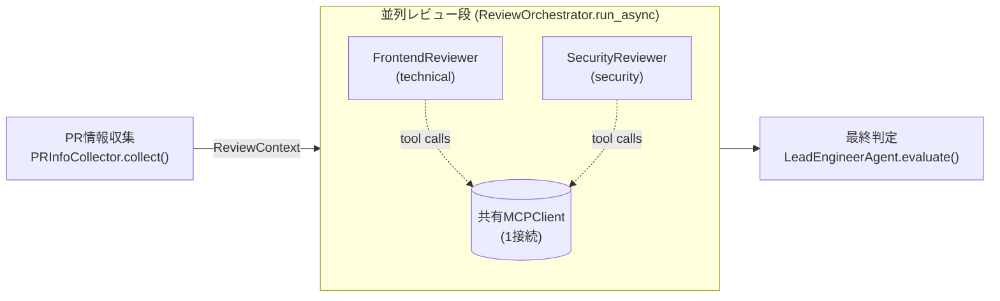
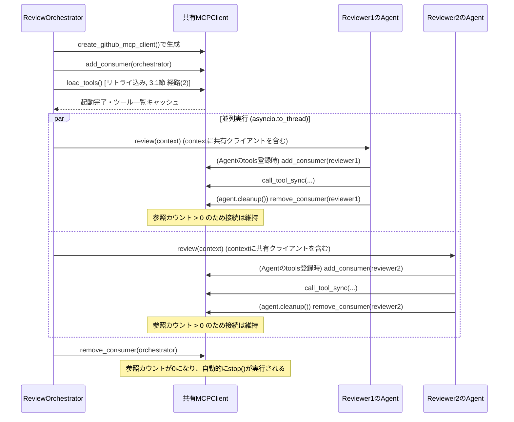

# MCP接続の安定化 設計ドキュメント (Issue #115)

評価パイプライン実行中に多発したMCP接続エラー(起動タイムアウト・接続断・空ボディ応答)への対応として合意された2方針
「1. 起動リトライ」「2. MCPクライアントのセッション共有」について、
[ADR-0003](adr/0003-github-mcp-startup-retry-strategy.md)・[ADR-0004](adr/0004-mcp-client-session-sharing.md)
が提案する**方式**を、TDD実装にそのまま着手できる粒度まで落とし込む外部設計ドキュメントである。
両ADRは現時点で `Status: Proposed`(未実装・レビュー待ち)であり、まだ正式に承認された決定事項ではない。
ただし各ADR自体は「何を選ぶか・なぜか」という比較検討と結論(採用する方式)をすでに確定させており、
本ドキュメントはその結論を前提として、「誰が・どの順番で・どの責務を持って動くか」という
コンポーネント間のインターフェース・処理シーケンス・エラー方針を確定させる。ADRのステータスが
レビューの結果`Rejected`等に変わった場合は本ドキュメントも見直しが必要になる。

## 適用範囲についての位置づけ

[ADR-0003](adr/0003-github-mcp-startup-retry-strategy.md)が明記する通り、起動リトライ・セッション共有は
いずれも strands の `MCPClient`(`ToolProvider`実装)一般に適用できる設計である。本プロジェクトが現時点で
利用するMCP統合は GitHub MCP(`create_github_mcp_client`、[github-mcp-streamable-http-migration-spec.md](github-mcp-streamable-http-migration-spec.md))
のみであるため、以降の変更対象ファイル・具体例は結果的に GitHub MCP 関連ファイルのみになるが、これは
「現状GitHub MCPしか無いから」であって「GitHub MCP専用の設計」ではない。以降、リトライ対象・共有対象は
「`MCPClient`/`ToolProvider`の起動処理」という一般的な語彙で記述し、GitHub MCPはその唯一の具体例として
扱う。将来他のMCPサーバー統合が追加された場合も、そのクライアントが `ToolProvider` として `Agent` の
`tools` に渡される限り、本ドキュメントの設計がそのまま適用できることを意図する。

---

## 1. 背景と問題

[Issue #115](https://github.com/kuju63/code-review-agents/issues/115) の原因分析(ADR-0003 Context節に要約あり)によれば、
1件のPRレビューは「PR情報収集 -> 並列レビュー -> 最終判定」の3段階を順に実行する構成であり、各段階・各レビュアーが
それぞれ独立に `MCPClient` を生成・起動・破棄している。並列レビュー段では複数レビュアーが同時に接続を試みるため
同時多重の輻輳が発生し、`startup_timeout`(既定30秒)超過・接続断・空ボディ応答が発生していた。加えてリトライが
一切実装されていないため、一過性の失敗がそのままレビュー全体の失敗に直結していた。

対応方針は2つ:

1. **起動リトライ**: 一過性エラーに対して指数バックオフ+ジッターでリトライする([ADR-0003](adr/0003-github-mcp-startup-retry-strategy.md))。
2. **セッション共有**: 並列レビュー段で同時に開かれる接続数そのものを減らす([ADR-0004](adr/0004-mcp-client-session-sharing.md))。

この2方針は独立ではない。ADR-0004により接続の**起動主体**がレビュアー個々からオーケストレータへ移るため、
ADR-0003が対象とする「起動呼び出し箇所」自体が変わる。本ドキュメントは両ADRを1つの設計として統合し、
この相互作用を含めて確定させる。

---

## 2. 全体設計

### 2.1 処理フロー



PR情報収集は**セッション共有**の対象外であり、現状通り独立した1接続を自前で起動・終了する
([ADR-0004](adr/0004-mcp-client-session-sharing.md) Decision 1)。ただし後述の**起動リトライ**
(3章)はこの個別接続にも他の経路と同様に適用される([ADR-0003](adr/0003-github-mcp-startup-retry-strategy.md))。
セッション共有と起動リトライは別々のADRに由来する独立した変更であり、適用範囲が一致しない点に注意する
(セッション共有は並列レビュー段のみが対象、起動リトライは3経路すべてが対象)。並列レビュー段のみ、
選択されたレビュアーが GitHub MCP を使う場合に限り、オーケストレータが起動する1本の共有接続を
レビュアー間で使い回す。

### 2.2 接続数の変化

| 処理段階 | 現状 | 変更後 |
|---|---|---|
| PR情報収集 | 1接続(個別) | 1接続(個別、変更なし) |
| 並列レビュー(レビュアー2体を想定) | 最大2接続(レビュアーごとに個別) | 1接続(共有) |
| 1PRレビューあたり合計 | 最大3接続 | 最大2接続 |

輻輳の当事者は並列レビュー段のみ([ADR-0004](adr/0004-mcp-client-session-sharing.md) Context節)であるため、
この段の同時接続数を2本から1本に減らすことが今回の変更の主眼である。

---

## 3. 起動リトライ設計 (ADR-0003の運用化)

### 3.1 対象となる起動呼び出し箇所(ADR-0004後の構成)

ADR-0004によりセッション共有を導入すると、`MCPClient`の起動処理(=`start()`または`load_tools()`の呼び出し)は
次の3経路に整理される。いずれも対象は特定のMCPサーバー向けクライアントではなく、`MCPClient`の起動処理一般である。

| 経路 | 起動呼び出し | 呼び出し元 |
|---|---|---|
| (1) PR情報収集の個別接続 | `MCPClient.start()`(同期・直接) | `PRInfoCollector.collect()`(`src/code_review_agent/agents/pr_info_collector.py`) |
| (2) 並列レビュー段の共有接続・初回起動 | `MCPClient.load_tools()`(非同期・`ToolProvider`インターフェース経由) | `ReviewOrchestrator.run_async()`(`src/code_review_agent/agents/review_orchestrator.py`)、全レビュアーの並列実行を開始する前 |
| (3) 並列レビュー段のフォールバック(共有接続が使えない単体利用時) | `MCPClient.start()`(strands `Agent.load_tools()`が内部で呼ぶ) | `LLMReviewAgent.review()`(`src/code_review_agent/agents/base_reviewer.py`)、共有接続が渡されなかった場合 |

(2)が本ドキュメントで新たに追加される経路である。(2)は**低レベルの`start()`を直接呼んではならない**という
制約がある: strandsの`MCPClient`は「起動済みかどうか」を示す内部状態を`load_tools()`の呼び出し時にのみ
更新する。仮にオーケストレータが低レベルの`start()`だけを呼んで済ませると、後から各レビュアーの`Agent`が
自分の`load_tools()`を呼んだ際にこの状態を「未起動」と判定し、二重に起動を試みて競合する
(`MCPClientInitializationError("the client session is currently running")`)。これはまさに
[ADR-0004](adr/0004-mcp-client-session-sharing.md) Contextが懸念する「起動処理の競合」そのものであり、
これを避けるために(2)は必ず`ToolProvider`インターフェースの公開メソッドである`load_tools()`を経由する。
これは「オーケストレータがどの入口メソッドを呼ぶか」という制約であり、後述するリトライの実装位置とは
別の話である点に注意する。

### 3.2 バックオフ戦略・実装位置

[ADR-0003](adr/0003-github-mcp-startup-retry-strategy.md) の決定をそのまま踏襲する:

- 指数バックオフ+ジッター、最大試行回数3回(初回含む)、基準待機1秒程度。
- 実装手段は `tenacity`(`strands-agents`の既存間接依存を直接依存へ昇格)。

strandsの`MCPClient.load_tools()`は、まだ起動していなければ内部で`self.start()`を呼び出す実装になっている
(strands `mcp_client.py`)。したがってリトライは**`MCPClient.start()`という1箇所にのみ実装すればよい**
([ADR-0003](adr/0003-github-mcp-startup-retry-strategy.md)が「`create_github_mcp_client`が返す`MCPClient`の
`start()`をリトライ機構でラップする形で実装する想定」と述べている通り)。(1)(3)のように`start()`を直接
呼ぶ経路はもちろん、(2)のように`load_tools()`を経由する経路も、その内部呼び出しが同じ(リトライ機構で
ラップ済みの)`start()`である以上、自動的にリトライの恩恵を受ける。経路ごとに個別の実装は不要であり、
呼び出し元(`PRInfoCollector`・`ReviewOrchestrator`・`LLMReviewAgent`のいずれも)は無変更で済む。
具体的には`create_github_mcp_client`(`src/code_review_agent/tools/github_mcp.py`)が返す`MCPClient`の
`start`メソッドをリトライ機構でラップする(またはリトライ付き`start()`を持つ薄いサブクラスを返す)形で
実装する想定である。(1)から(3)までの3経路すべてに同じバックオフパラメータが適用され、経路によって
挙動が変わることはない。

### 3.3 リトライと`ToolProviderException`ラップの関係

リトライ機構自体が捕捉すべき例外は`MCPClientInitializationError`のみである。これは`MCPClient.start()`が
失敗時に常にこの型で例外を送出する設計であり(3.2節)、リトライは`start()`単体をラップするだけで済むため、
`ToolProviderException`をリトライ側で意識する必要はない。

一方、`MCPClient.load_tools()`は内部で`start()`を呼び、リトライを尽くしてなお失敗した場合、その原因例外を
`ToolProviderException`でラップし直してから送出する(strands `mcp_client.py`)。そのため、**リトライを尽くした
後に最終的に呼び出し元へ届く例外の型は経路によって異なる**:

| 経路 | 最終的に届く例外(リトライを尽くした後) |
|---|---|
| (1)(直接`start()`) | `MCPClientInitializationError` |
| (2)(`load_tools()`経由) | `ToolProviderException`(原因は`__cause__`に`MCPClientInitializationError`等を保持) |
| (3)(`Agent`経由の`load_tools()`) | `ToolProviderException`((2)と同様) |

これはリトライの実装方法とは独立した、strands側の既存の例外ラップ仕様である。呼び出し元(3.4節の
`INFRA_EXCEPTIONS`)はこの2つの型の両方を認識しておく必要がある。原因種別(一過性/非一過性)による
リトライ対象の分岐は[ADR-0003](adr/0003-github-mcp-startup-retry-strategy.md)の決定通り行わず、最大試行
回数を小さく抑えることで検知遅延を許容範囲にとどめる方針を維持する。

### 3.4 `INFRA_EXCEPTIONS`への追加

[ADR-0003](adr/0003-github-mcp-startup-retry-strategy.md) Decision 5の通り、`ToolProviderException`を
`src/code_review_agent/agents/exceptions.py`の`INFRA_EXCEPTIONS`に追加する。これによりリトライを尽くした
最終失敗が(2)(3)のどちらの経路でも正しく再送出され、`api/agents/*.py`のタスク境界(`except Exception`)まで
インフラ障害として届く。

### 3.5 設定項目

`src/code_review_agent/api/config.py`の`Settings`に、既存の`CODE_REVIEW_`命名規則(`max_agent_turns`等)に
揃えて以下を追加する:

| フィールド名 | 型 | 既定値 | 説明 |
|---|---|---|---|
| `mcp_startup_retry_attempts` | `int` | `3` | 初回試行を含む最大試行回数 |
| `mcp_startup_retry_backoff_seconds` | `float` | `1.0` | 指数バックオフの基準待機秒数 |

### 3.6 依存関係

`tenacity` を `pyproject.toml` の直接依存として追加する(`uv.lock`には既に間接依存として解決済みのため、
通常はバージョン変更を伴わない見込み)。

---

## 4. MCPクライアントのセッション共有設計 (ADR-0004の運用化)

### 4.1 責務分担

| コンポーネント | 責務(変更後) |
|---|---|
| `ReviewOrchestrator`(`review_orchestrator.py`) | 選択したレビュアーの中に GitHub MCP を使うものが1つでもあれば、共有`MCPClient`を生成し、`load_tools()`(3.1節の経路(2)、リトライ込み)で初回起動する。起動後、自らも参照カウントの利用者として`add_consumer`で登録する。全レビュアーの実行完了後、自身の参照を`remove_consumer`で解放する。 |
| `LLMReviewAgent`(`base_reviewer.py`) | 共有クライアントが渡されていればそれを`Agent`の`tools`に渡して使う。渡されていなければ(単体利用・共有対象外の場合)従来通り自分で`create_github_mcp_client`する。**終了処理を`mcp_client.stop()`の直接呼び出しから`agent.cleanup()`に変更する**(4.3節)。 |
| `PRInfoCollector`(`pr_info_collector.py`) | **セッション共有の対象外**。引き続き自分専用の接続を個別に起動・終了する([ADR-0004](adr/0004-mcp-client-session-sharing.md) Decision 1の通り)。ただし**起動リトライは適用される**(3.1節 経路(1)、[ADR-0003](adr/0003-github-mcp-startup-retry-strategy.md))。 |

### 4.2 設計判断A: 共有クライアントの受け渡し方法

[ADR-0004](adr/0004-mcp-client-session-sharing.md)は共有範囲とライフサイクル管理方式(参照カウント)までは
決定しているが、オーケストレータから各レビュアーへ共有クライアントをどう渡すかは未決定である。

| 選択肢 | メリット | デメリット |
|---|---|---|
| A. `ReviewContext`に拡張フィールドを追加し、オーケストレータが生成したインスタンスを注入する | [review-agents-design.md §3.1](review-agents-design.md#31-入力境界--reviewcontext)が既に「`ReviewContext`は入力を後から足せる拡張点」であると明言しており、その前例通りの拡張になる。`ReviewAgent.review()`の抽象メソッドのシグネチャは変更不要で、既存のテスト用フェイクレビュアーにも影響しない | `ReviewContext`は本来PR情報という「入力」の境界であり、実行時インフラ資源(MCP接続)を持たせることは責務の混在という見方もできる |
| B. `ReviewAgent.review()`のシグネチャに新規引数を追加する | 「共有クライアントを渡している」ことが呼び出し側から明示的に見える | `review()`は全レビュアーサブクラス・全テスト用フェイクレビュアーが実装/呼び出す抽象メソッドであり、シグネチャ変更の影響範囲が広い |
| C. レビュアーインスタンス生成後にsetterメソッドで注入する | 生成とMCP注入を分離できる | ミュータブルな2段階初期化になり、「setterを呼び忘れると自動的にMCPなしで動いてしまう」という暗黙の前提が生まれ、事故りやすい |

**採用: A。** `ReviewContext`は設計時点で既に将来の入力拡張(`spec_documents`等)を見込んだ構造になっており、
今回の拡張もその延長線上にある。B・Cが抱える「広範囲への影響」「暗黙の前提」という代償に対し、Aの
デメリット(責務の混在という見方)は`ReviewContext`が既に「PR情報**以外**の実行時コンテキストを持ちうる」
という前提で設計されている以上、許容できると判断する。

### 4.3 設計判断B: 終了処理の統一(`stop()`直接呼び出しから`agent.cleanup()`へ)

現状の`LLMReviewAgent.review()`は`finally`で`mcp_client.stop(None, None, None)`を直接呼んでおり、
strandsの`ToolRegistry`が備える参照カウント(`add_consumer`/`remove_consumer`)を一切経由していない。
共有クライアントを扱うには、この終了処理を`agent.cleanup()`(内部で`tool_registry.cleanup()`が
`provider.remove_consumer(registry_id)`を呼ぶ)に置き換える必要がある。

この置き換えは、共有時・単体利用時のどちらでも**同じコードで正しく動く**という性質を持つ:

- 単体利用(共有クライアントなし)の場合: そのレビュアーの`Agent`だけが唯一の利用者であるため、
  `agent.cleanup()`による参照解放で即座に参照カウントが0になり、実質的に現状と同じタイミングで
  接続が終了する。
- 共有時の場合: オーケストレータおよび他の並行実行中レビュアーがまだ参照を保持していれば、
  そのレビュアーの`agent.cleanup()`は参照カウントを1つ減らすだけで、実際の`stop()`は最後の利用者が
  解放したときに初めて走る。

したがって`LLMReviewAgent`自身は「自分が共有クライアントを使っているか単体クライアントを使っているか」
「自分が最後の利用者かどうか」を一切意識する必要がない。分岐ロジックはオーケストレータ側(共有クライアントを
作るかどうかの判断、4.4節)だけに閉じる。

### 4.4 設計判断C: 共有クライアントの生成条件

オーケストレータは、選択されたレビュアーの中に`uses_github_mcp=True`のものが1つも無い場合(将来的に
MCP不使用のレビュアーのみが選択されるケース)は共有クライアントを生成しない。無駄な接続確立を避けるため。

### 4.5 参照カウントのライフサイクル



### 4.6 タイムアウトしたレビュアーとの相互作用

`ReviewOrchestrator.run_async()`は`asyncio.wait(..., timeout=...)`でタイムアウトしたレビュアーのスレッドを
キャンセルせずバックグラウンドで走らせ続ける既存の設計を持つ(タイムアウト分は`ReviewError`として記録し、
他のレビュアーの結果は正常に返す)。この既存の挙動と参照カウント方式は次のように整合する:

オーケストレータが`asyncio.wait`から復帰した時点で自身の参照(`remove_consumer(orchestrator)`)を解放しても、
タイムアウトして`pending`のまま残っているレビュアーの`Agent`はまだ`agent.cleanup()`を呼んでおらず、
参照カウントに登録されたままである。したがって共有接続は「オーケストレータが抜けた」だけでは終了せず、
バックグラウンドで走り続けるレビュアーがツール呼び出しを続けられる。これは参照カウント方式が意図通りに
安全側(早すぎる切断を起こさない側)に働く例であり、追加の特別扱いは不要である。

### 4.7 対象外

[ADR-0004](adr/0004-mcp-client-session-sharing.md) Decision 1の通り、PR情報収集は対象外。共有範囲は
並列レビュー段の内部のみとする。

---

## 5. 変更対象ファイル

| ファイル | 変更の性質 |
|---|---|
| [src/code_review_agent/tools/github_mcp.py](../src/code_review_agent/tools/github_mcp.py) | `create_github_mcp_client`が返す`MCPClient`の`start()`にリトライ機構(3.2節)を追加。3経路すべてがここを通るため、これが唯一のリトライ実装箇所となる |
| [src/code_review_agent/agents/review_orchestrator.py](../src/code_review_agent/agents/review_orchestrator.py) | 共有クライアントの生成・初回起動・参照登録/解放を追加(起動自体のリトライは`github_mcp.py`側で一元化されるため、ここでの実装は不要) |
| [src/code_review_agent/agents/base_reviewer.py](../src/code_review_agent/agents/base_reviewer.py) | 共有クライアント使用時のフォールバック分岐、終了処理を`agent.cleanup()`に変更 |
| [src/code_review_agent/agents/pr_info_collector.py](../src/code_review_agent/agents/pr_info_collector.py) | 変更なし(起動処理は経路(1)のまま`MCPClient.start()`を直接呼ぶが、リトライは`github_mcp.py`側で一元化されるため呼び出し元の変更は不要) |
| [src/code_review_agent/agents/exceptions.py](../src/code_review_agent/agents/exceptions.py) | `INFRA_EXCEPTIONS`に`ToolProviderException`を追加 |
| [src/code_review_agent/api/config.py](../src/code_review_agent/api/config.py) | `mcp_startup_retry_attempts`・`mcp_startup_retry_backoff_seconds`を追加 |
| [pyproject.toml](../pyproject.toml) | `tenacity`を直接依存として追加 |
| [src/code_review_agent/models/review.py](../src/code_review_agent/models/review.py)(`ReviewContext`定義箇所) | 共有MCPクライアントを保持する拡張フィールドを追加(4.2節 設計判断A) |

(このドキュメント自体は`docs/`直下に配置されており、上記の相対パスは`docs/`からの相対パスである。)

---

## 6. スコープ外の明示

- **ツール呼び出し単位のリトライ**: 起動ハンドシェイクのリトライのみを対象とし、`call_tool_sync`等の
  個別呼び出しのリトライは見送る([ADR-0003](adr/0003-github-mcp-startup-retry-strategy.md)の決定通り)。
- **PR情報収集の接続共有**: 対象外([ADR-0004](adr/0004-mcp-client-session-sharing.md) Decision 1)。
- **評価パイプライン側のコード変更**: `evaluation/tools/run_agent_evaluation.py`はA2A HTTP経由でエージェント
  プロセスを呼び出しており、エージェント側の例外はタスクの`failed`状態としてHTTP越しに伝わる。本設計による
  変更はエージェント側の失敗率低減という結果のみをもたらし、評価ランナー自体のコード変更は不要と判断した。

---

## 7. テスト方針

具体的なテストコードは実装(TDD)フェーズで確定するが、少なくとも次の観点をカバーする:

- 起動リトライがバックオフを伴って動作し、最大試行回数で打ち切られること(3経路それぞれ)。
- 経路(2)(3)それぞれで、リトライを尽くした後の最終失敗が`ToolProviderException`として`INFRA_EXCEPTIONS`に
  分類され、`ReviewOrchestrator.run_async()`から再送出されること。
- 並列レビュー実行時、複数レビュアー間でMCPクライアントのインスタンスが共有されること(生成回数が1回に
  なること)。
- オーケストレータ・複数レビュアーが参照カウントの利用者として正しく登録・解放され、全利用者が解放された
  時点でのみ接続が終了すること。
- 共有クライアントが渡されない場合(単体利用・MCP不使用レビュアー)は現状と同じ挙動(個別生成・個別終了)を
  維持すること(既存テストの回帰確認)。

---

## 8. 検証手順

```bash
uv run pytest
uv run ruff check
uv run ruff format --check
```

実装完了後、必要に応じて評価パイプライン([evaluation/RUNBOOK.md](../evaluation/RUNBOOK.md))を再実行し、
Issue #115の受け入れ基準(MCP接続起因の失敗が0件または大幅減)を確認する。

---

## 9. 関連ドキュメント

- [ADR-0003: MCP起動リトライ戦略](adr/0003-github-mcp-startup-retry-strategy.md)
- [ADR-0004: MCPクライアントのセッション共有(レビュアー間)](adr/0004-mcp-client-session-sharing.md)
- [並列レビュー段 拡張アーキテクチャ設計](review-agents-design.md)
- [インフラ例外の握りつぶし修正 設計ドキュメント (Issue #56)](review-orchestrator-infra-exception-propagation-spec.md)
- [GitHub MCP Streamable HTTP移行仕様](github-mcp-streamable-http-migration-spec.md)
- [evaluation/EVALUATION_PLAN.md](../evaluation/EVALUATION_PLAN.md)
- [evaluation/RUNBOOK.md](../evaluation/RUNBOOK.md)
