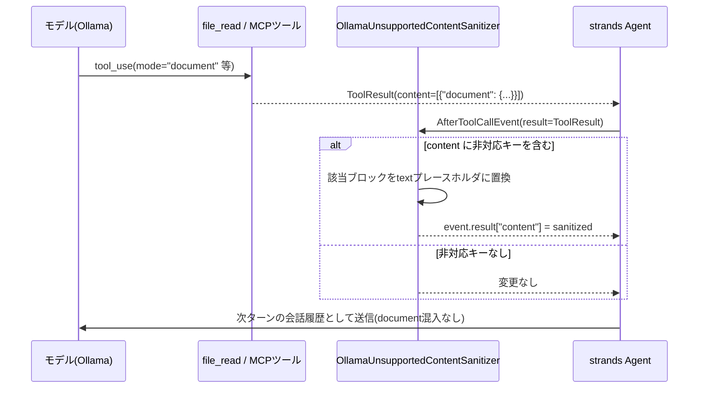

# Ollamaバックエンドが処理できないツール結果コンテンツ型の除去 設計ドキュメント

Seeded評価(`angular-seeded#10`, `#22`)で `TypeError: content_type=<document> | unsupported type` によりレビュー全体が失敗する不具合への対応。個別ツールの特定モードを潰す場当たり的な対応ではなく、どのツール(既存の`file_read`・GitHub MCP・将来追加される任意のMCP)が原因でも一律に効く汎用の防御機構を導入する。

---

## 1. 背景と問題

### 1.1 発生した事象

`bash .claude/skills/run-evaluation/scripts/start_a2a_container.sh` 経由のSeeded評価(2026-08-08実行, Ollamaバックエンド `hf.co/deepreinforce-ai/Ornith-1.0-35B-GGUF:Q4_K_M`)で、Angularスタックの2件(`angular-seeded#10`, `#22`)が次のエラーで失敗した。

```
Task ... failed: content_type=<document> | unsupported type
```

### 1.2 根本原因

- `strands_tools.file_read`(`strands_tools/file_read.py`)は複数の読み取りモードを持ち、その一つ`mode="document"`は「Bedrock document block生成」用に設計されている。呼び出すと`{"document": {...}}`形式の`ToolResultContent`を返す。**どのモードで呼ぶかはモデル自身がツール呼び出しパラメータとして選択する**。
- `file_read`は`LLMReviewAgent.review()`(`src/code_review_agent/agents/base_reviewer.py`)で、スキルバンドルを持つレビュアー(`skill_type != AgentSkillType.NONE`、具体的にはReact/Angular/Svelte/Vue/Securityの各技術・セキュリティレビュアー)全員に自動付与される。Angularレビュアーは`angular-developer`スキル配下に多数の参考資料(`.md`群、`LICENSE`)を持ち、モデルがそれらを探索する過程でたまたま`mode="document"`を選んだと見られる。
- `strands.models.ollama.OllamaModel._format_request_message_contents`(`strands/models/ollama.py`)は`text`/`image`/`toolUse`/`toolResult`しか処理せず、`document`キーを持つコンテンツに遭遇すると即座に`TypeError`を送出する。
- 対して`strands.models.openai.OpenAIModel.format_request_message_content`(`strands/models/openai.py`)は`document`をbase64ファイル添付に明示的に変換して処理できる。つまりこれは**Ollamaバックエンド固有の欠落**であり、OpenAI互換バックエンドでは発生しない。

### 1.3 「特定PRでだけ起きる」理由

PRの差分内容(`.ts`/`.spec.ts`のみ)には`document`化すべき要素は含まれていない。トリガーは常にスキル参照ファイル側であり、`file_read`を`mode="document"`で呼ぶかどうかはそのレビューセッション内でモデルがどうツールループを進めるかという**非決定的な振る舞い**に依存する。したがって同じAngular PRでも再実行のたびに発生したりしなかったりし、原理的にはReact/Svelte/Vue/セキュリティレビュアーでも起こり得る(スキルバンドルを持つ全レビュアーが対象)。

### 1.4 将来の拡張との関係

本プロジェクトは今後GitHub MCP以外のMCPサーバーを追加していく計画がある。新しいMCPツールが同様に「現在のバックエンドが処理できないコンテンツ型」を返すリスクは、MCPサーバーを追加するたびに繰り返し発生しうる。個別ツールを都度パッチする対応では、MCP追加のたびに同じ調査・同じ修正を繰り返すことになり、スケールしない。

---

## 2. 却下した設計

### 2.1 `file_read`のTOOL_SPECをラップして`mode="document"`の選択肢を消す

`file_read`は`TOOL_SPEC`(モジュールレベル辞書)+同名関数という「モジュール形式ツール」であるため、`mode`のenumから`"document"`を除いた薄いラッパーモジュールを自前で用意し差し替える、という案を最初に検討した。`strands_tools`自体には触れずに実現できる利点はあるが、**`file_read`という特定ツールの特定パラメータにのみ効く場当たり的な対応**であり、GitHub MCPや将来追加されるMCPツールが同種の問題を起こした場合には無力(1.4節)。今回は不採用。

### 2.2 `BeforeModelCallEvent`で会話履歴(`messages`)を書き換える

モデル呼び出し直前の一点でサニタイズできれば、ツールの出所を問わず汎用的に効くと考え検討したが、`strands.hooks.events.BeforeModelCallEvent`/`AfterModelCallEvent`(`strands/hooks/events.py`)は`invocation_state`/`projected_input_tokens`/`cancel`(および`retry`)のみを保持し、**`messages`フィールド自体が存在しない**。両イベントの`_can_write`もこれらのフィールド以外への書き込みを許可しない(`HookEvent.__setattr__`が許可外の属性代入を`AttributeError`にする)。

`event.agent.messages`(Agentが保持する実体のlist)を直接インプレース変更すれば動作はし得るが、これは公式にサポートされたAPI経路ではなく実装詳細への依存であるため不採用とした。実際、同じライブラリに同梱される`strands.vended_plugins.context_offloader.plugin.ContextOffloader`も`_on_before_model_call`(`BeforeModelCallEvent`ハンドラ)では`messages`に一切触れておらず、コンテンツブロックの書き換えは別のイベント(`AfterToolCallEvent`)で行っている。これはフレームワーク自身が「`BeforeModelCallEvent`はmessages変換に使う設計ではない」ことを前提にしている実例であり、採用する設計(3章)の裏付けとなる。

---

## 3. 採用する設計: `AfterToolCallEvent`で`event.result`を書き換える

### 3.1 なぜこのイベントか

`strands.hooks.events.AfterToolCallEvent`は`result: ToolResult`を保持し、`_can_write`が明示的に`"result"`への書き込みを許可している(公式にサポートされた書き換え経路)。**どのツール名で呼ばれたかを問わず**ツール実行完了直後に必ず発火するため、`file_read`由来かGitHub MCP由来か将来の新規MCP由来かに関わらず単一のフックで捕捉できる。

同一ライブラリの`context_offloader/plugin.py`の`_handle_tool_result`(`AfterToolCallEvent`ハンドラ)が、まさに同じ`event.result["content"]`を書き換えて`document`ブロックを含む各種コンテンツをプレースホルダに置換するパターンを実装しており、設計の妥当性を裏付ける実例になっている。

### 3.2 処理フロー



### 3.3 実装

新規ファイル `src/code_review_agent/tools/tool_result_sanitizer.py`(`github_mcp.py`と同じ「ツール周りのインフラ」という位置づけで`tools/`配下に置く)。

```python
import logging

from strands.hooks import HookProvider, HookRegistry
from strands.hooks.events import AfterToolCallEvent
from strands.types.tools import ToolResultContent

logger = logging.getLogger(__name__)

# 現時点で Ollama backend (OllamaModel._format_request_message_contents) が
# ToolResultContent 側で処理できないと確認済みのキー。
# 将来 strands 側が対応した場合は不要になるが、対応可否は都度ソースで確認して
# ここを更新する方針(未検証のキーを憶測で足さない)。
_OLLAMA_UNSUPPORTED_CONTENT_KEYS = frozenset({"document"})


class OllamaUnsupportedContentSanitizer(HookProvider):
    """Strip ToolResultContent blocks the active Ollama backend cannot serialize.

    Hooks ``AfterToolCallEvent``, which fires for every tool call regardless
    of which tool produced the result, so no per-tool special-casing is
    needed when new MCP integrations are added later (see
    docs/ollama-tool-result-content-sanitizer-spec.md).
    """

    def register_hooks(self, registry: HookRegistry, **kwargs) -> None:
        registry.add_callback(AfterToolCallEvent, self._sanitize)

    def _sanitize(self, event: AfterToolCallEvent) -> None:
        content = event.result.get("content")
        if not content:
            return

        sanitized: list[ToolResultContent] = []
        changed = False
        for block in content:
            unsupported = _OLLAMA_UNSUPPORTED_CONTENT_KEYS.intersection(block)
            if unsupported:
                changed = True
                logger.warning(
                    "Stripping unsupported content type(s) %s from tool "
                    "'%s' result (Ollama backend cannot serialize them)",
                    sorted(unsupported),
                    event.tool_use.get("name"),
                )
                sanitized.append(
                    {"text": f"[omitted: unsupported content type {sorted(unsupported)}]"}
                )
            else:
                sanitized.append(block)

        if changed:
            event.result["content"] = sanitized
```

### 3.4 `base_reviewer.py`での配線

`LLMReviewAgent.review()`の`Agent(...)`構築箇所(`base_reviewer.py:314-319`)で、`provider_type == ProviderType.OLLAMA`のときだけhooksを渡す。OpenAI経路は`document`を正しく処理できることを確認済みのため変更しない。

```python
hooks: list = []
if self._config.provider_type == ProviderType.OLLAMA:
    hooks.append(OllamaUnsupportedContentSanitizer())

agent = Agent(
    model=model,
    system_prompt=compose_system_prompt(self.system_prompt),
    tools=tools,
    plugins=plugins,
    hooks=hooks,
)
```

`pr_info_collector.py`・`lead_engineer.py`は`tools=[]`でツールを一切使わないため、この経路で`document`ブロックが混入することは原理的になく、変更不要。

### 3.5 設定フラグは追加しない

過剰な作り込みを避けるため、on/offの設定項目は追加しない。Ollama利用時は常に有効化する単純な条件分岐のみとする。

---

## 4. スコープ外の明示

- **Ollama以外のバックエンドの新規欠落への対応**: 今回確認できたのは`document`キーのみ。将来strandsのモデルフォーマッタが新たなコンテンツ型を追加し、それがOllama側で未対応のまま残るケースが出てきた場合は、その時点で改めてソースを確認し`_OLLAMA_UNSUPPORTED_CONTENT_KEYS`に追記する。未検証のキーを憶測で先回りして追加することはしない。
- **OpenAI以外の新規プロバイダ追加時の同種欠落**: 現状`ProviderType`は`OPENAI`/`OLLAMA`の2値のみ。3つ目のプロバイダが追加され、それが`document`等を未対応のまま持つ場合は、本設計と同じ判定条件分岐パターンをその時点で拡張する。
- **`file_read`の`mode="document"`自体を無効化すること**: 2.1節の理由により見送り。ツール自体の入力を制限する対応ではなく、出力側で一括吸収する。

---

## 5. テスト方針(TDD)

1. `OllamaUnsupportedContentSanitizer`単体テスト(`tests/tools/test_tool_result_sanitizer.py`):
   - `document`キーを含む`ToolResultContent`がtextプレースホルダに置換されること
   - `document`を含まない結果は変更されないこと
   - 複数ブロック中の一部だけが`document`の場合、該当ブロックのみ置換されること
   - warningログが出ること(`caplog`で検証)
2. `base_reviewer.py`側(`tests/agents/test_base_reviewer.py`):
   - `provider_type=ProviderType.OLLAMA`のとき`Agent(...)`呼び出しに`hooks`が渡ること
   - `provider_type=ProviderType.OPENAI`のとき`hooks`が渡らない(または空)こと

---

## 6. 検証手順

```bash
uv run pytest tests/tools/test_tool_result_sanitizer.py tests/agents/test_base_reviewer.py
uv run ruff check
uv run ruff format --check
```

`mode="document"`を選ぶかどうか自体がモデルの非決定的な判断に依存するため、評価パイプラインの単発再実行で「発生しなかった」ことは無罪証明にならない。単体テストでの担保を主とし、評価パイプラインでの再現待ちはしない。

---

## 7. 関連ドキュメント

- [MCP接続の安定化 設計ドキュメント (Issue #115)](mcp-connection-stabilization-spec.md) — 同じくGitHub MCP周りの信頼性向上を扱うが、対象は接続断・起動リトライであり本ドキュメントの対象(コンテンツ型の非互換)とは独立
- [ModelProviderFactory によるOllamaネイティブ対応 設計ドキュメント (Issue #214)](model-provider-factory-spec.md) — `ProviderType`/`create_model_provider`の設計根拠
- [Reactスタック向け Agent Skills 導入 設計ドキュメント](react-angular-agent-skills-spec.md) — `file_read`がスキル参照ファイル読み取りに使われる経緯
