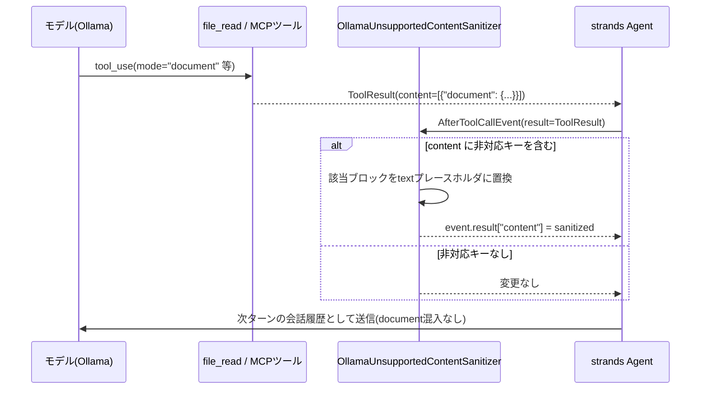

# Ollamaバックエンドが処理できないツール結果コンテンツ型の除去 設計ドキュメント

> TS版実装: `packages/agent-core/src/tools/tool-result-sanitizer.ts`。設計思想（対象イベント・
> フェイルセーフな置換・型一覧の運用方針）はそのまま踏襲しているが、配線方式は異なる。
> Python版のAgentは`hooks=[...]`のコンストラクタ引数でHookProviderを直接渡せたのに対し、
> TS版のAgent設定にはhooksフィールドが無いため、このサニタイザーはPluginとして実装し、
> Agent初期化時に自分自身でフックを登録する形を取る（詳細は
> [docs/typescript-agents-tools-migration-spec.md](typescript-agents-tools-migration-spec.md) §2.4）。
> テスト方針・検証手順は
> [docs/plan/ollama-tool-result-content-sanitizer-spec.md](plan/ollama-tool-result-content-sanitizer-spec.md)。

Seeded評価(`angular-seeded#10`, `#22`)で `TypeError: content_type=<document> | unsupported type` によりレビュー全体が失敗する不具合への対応。個別ツールの特定モードを潰す場当たり的な対応ではなく、どのツール(既存の`file_read`・GitHub MCP・将来追加される任意のMCP)が原因でも一律に効く汎用の防御機構を導入する。

---

## 1. 背景と問題

### 1.1 発生した事象

`bash .claude/skills/run-evaluation/scripts/start_a2a_container.sh` 経由のSeeded評価(2026-08-08実行, Ollamaバックエンド `hf.co/deepreinforce-ai/Ornith-1.0-35B-GGUF:Q4_K_M`)で、Angularスタックの2件(`angular-seeded#10`, `#22`)が次のエラーで失敗した。

```text
Task ... failed: content_type=<document> | unsupported type
```

### 1.2 根本原因

- `strands_tools.file_read`(`strands_tools/file_read.py`)は複数の読み取りモードを持ち、その一つ`mode="document"`は「Bedrock document block生成」用に設計されている。呼び出すと`{"document": {...}}`形式の`ToolResultContent`を返す。**どのモードで呼ぶかはモデル自身がツール呼び出しパラメータとして選択する**。
- `file_read`は`LLMReviewAgent.review()`(`src/code_review_agent/agents/base_reviewer.py`)で、スキルバンドルを持つレビュアー(`skill_type != AgentSkillType.NONE`、具体的にはReact/Angular/Svelte/Vue/Securityの各技術・セキュリティレビュアー)全員に自動付与される。Angularレビュアーは`angular-developer`スキル配下に多数の参考資料(`.md`群、`LICENSE`)を持ち、モデルがそれらを探索する過程でたまたま`mode="document"`を選んだと見られる。
- `strands.models.ollama.OllamaModel._format_request_message_contents`(`strands/models/ollama.py`)は`text`/`image`/`toolUse`/`toolResult`しか処理せず、`document`キーを持つコンテンツに遭遇すると即座に`TypeError`を送出する。
- 対して`strands.models.openai.OpenAIModel.format_request_message_content`(`strands/models/openai.py`)は`document`をbase64ファイル添付に明示的に変換して処理できる。つまりこれは**Ollamaバックエンド固有の欠落**であり、OpenAI互換バックエンドでは発生しない。

### 1.3 「特定PRでだけ起きる」理由

PRの差分内容(`.ts`/`.spec.ts`のみ)には`document`化すべき要素は含まれていない。トリガーは常にスキル参照ファイル側であり、`file_read`を`mode="document"`で呼ぶかどうかはそのレビューセッション内でモデルがどうツールループを進めるかという**非決定的な振る舞い**に依存する。したがって同じAngular PRでも再実行のたびに発生したりしなかったりし、原理的にはReact/Svelte/Vue/セキュリティレビュアーでも起こり得る(スキルバンドルを持つ全レビュアーが対象)。

### 1.4 将来の拡張との関係

本プロジェクトは今後GitHub MCP以外のMCPサーバーを追加していく計画がある。新しいMCPツールが同様に「現在のバックエンドが処理できないコンテンツ型」を返すリスクは、MCPサーバーを追加するたびに繰り返し発生しうる。個別ツールを都度パッチする対応では、MCP追加のたびに同じ調査・同じ修正を繰り返すことになり、スケールしない。

---

## 2. 却下した設計

### 2.1 `file_read`のTOOL_SPECをラップして`mode="document"`の選択肢を消す

`file_read`は`TOOL_SPEC`(モジュールレベル辞書)+同名関数という「モジュール形式ツール」であるため、`mode`のenumから`"document"`を除いた薄いラッパーモジュールを自前で用意し差し替える、という案を最初に検討した。`strands_tools`自体には触れずに実現できる利点はあるが、**`file_read`という特定ツールの特定パラメータにのみ効く場当たり的な対応**であり、GitHub MCPや将来追加されるMCPツールが同種の問題を起こした場合には無力(1.4節)。今回は不採用。

### 2.2 `BeforeModelCallEvent`で会話履歴(`messages`)を書き換える

モデル呼び出し直前の一点でサニタイズできれば、ツールの出所を問わず汎用的に効くと考え検討したが、`strands.hooks.events.BeforeModelCallEvent`/`AfterModelCallEvent`(`strands/hooks/events.py`)は`invocation_state`/`projected_input_tokens`/`cancel`(および`retry`)のみを保持し、**`messages`フィールド自体が存在しない**。両イベントの`_can_write`もこれらのフィールド以外への書き込みを許可しない(`HookEvent.__setattr__`が許可外の属性代入を`AttributeError`にする)。

`event.agent.messages`(Agentが保持する実体のlist)を直接インプレース変更すれば動作はし得るが、これは公式にサポートされたAPI経路ではなく実装詳細への依存であるため不採用とした。実際、同じライブラリに同梱される`strands.vended_plugins.context_offloader.plugin.ContextOffloader`も`_on_before_model_call`(`BeforeModelCallEvent`ハンドラ)では`messages`に一切触れておらず、コンテンツブロックの書き換えは別のイベント(`AfterToolCallEvent`)で行っている。これはフレームワーク自身が「`BeforeModelCallEvent`はmessages変換に使う設計ではない」ことを前提にしている実例であり、採用する設計(3章)の裏付けとなる。

---

## 3. 採用する設計: `AfterToolCallEvent`で`event.result`を書き換える

### 3.1 なぜこのイベントか

`strands.hooks.events.AfterToolCallEvent`は`result: ToolResult`を保持し、`_can_write`が明示的に`"result"`への書き込みを許可している(公式にサポートされた書き換え経路)。**どのツール名で呼ばれたかを問わず**ツール実行完了直後に必ず発火するため、`file_read`由来かGitHub MCP由来か将来の新規MCP由来かに関わらず単一のフックで捕捉できる。

同一ライブラリの`context_offloader/plugin.py`の`_handle_tool_result`(`AfterToolCallEvent`ハンドラ)が、まさに同じ`event.result["content"]`を書き換えて`document`ブロックを含む各種コンテンツをプレースホルダに置換するパターンを実装しており、設計の妥当性を裏付ける実例になっている。

### 3.2 処理フロー



### 3.3 実装

`OllamaUnsupportedContentSanitizer`という名前のコンポーネントを、ツール周りのインフラと同じ
位置づけで配置する。非対応と確認済みのコンテンツ型の一覧を定数として持ち、`AfterToolCallEvent`
発火時にツール結果の各コンテンツブロックをこの一覧と照合する。該当するブロックが1つでもあれば、
そのブロックだけを「非対応コンテンツ型を省略した」旨のテキストプレースホルダに置換し、
WARNINGログでツール名と省略した型を通知する。該当ブロックがなければ何もしない
（変更なし・ログなし）。

現時点で確認済みの非対応コンテンツ型は`document`のみ。将来SDK側が対応した場合は不要になるが、
対応可否は都度ソースで確認してこの一覧を更新する方針であり、未検証の型を憶測で先回りして
追加することはしない。

### 3.4 レビュアーへの配線

`provider_type`がOllamaのときだけ、レビュアーが構築するAgentにこのサニタイザーを渡す。
OpenAI経路は`document`を正しく処理できることを確認済みのため変更しない。位置情報を持たない
`PRInfoCollector`・`LeadEngineerAgent`はツールを一切使わないため、この経路で`document`ブロックが
混入することは原理的になく、変更不要。

### 3.5 設定フラグは追加しない

過剰な作り込みを避けるため、on/offの設定項目は追加しない。Ollama利用時は常に有効化する単純な条件分岐のみとする。

---

## 4. スコープ外の明示

- **Ollama以外のバックエンドの新規欠落への対応**: 今回確認できたのは`document`キーのみ。将来strandsのモデルフォーマッタが新たなコンテンツ型を追加し、それがOllama側で未対応のまま残るケースが出てきた場合は、その時点で改めてソースを確認し`_OLLAMA_UNSUPPORTED_CONTENT_KEYS`に追記する。未検証のキーを憶測で先回りして追加することはしない。
- **OpenAI以外の新規プロバイダ追加時の同種欠落**: 現状`ProviderType`は`OPENAI`/`OLLAMA`の2値のみ。3つ目のプロバイダが追加され、それが`document`等を未対応のまま持つ場合は、本設計と同じ判定条件分岐パターンをその時点で拡張する。
- **`file_read`の`mode="document"`自体を無効化すること**: 2.1節の理由により見送り。ツール自体の入力を制限する対応ではなく、出力側で一括吸収する。

---

## 5. 関連ドキュメント

- [MCP接続の安定化 設計ドキュメント (Issue #115)](mcp-connection-stabilization-spec.md) — 同じくGitHub MCP周りの信頼性向上を扱うが、対象は接続断・起動リトライであり本ドキュメントの対象(コンテンツ型の非互換)とは独立
- [ModelProviderFactory によるOllamaネイティブ対応 設計ドキュメント (Issue #214)](model-provider-factory-spec.md) — `ProviderType`/`create_model_provider`の設計根拠
- [Reactスタック向け Agent Skills 導入 設計ドキュメント](react-angular-agent-skills-spec.md) — `file_read`がスキル参照ファイル読み取りに使われる経緯
