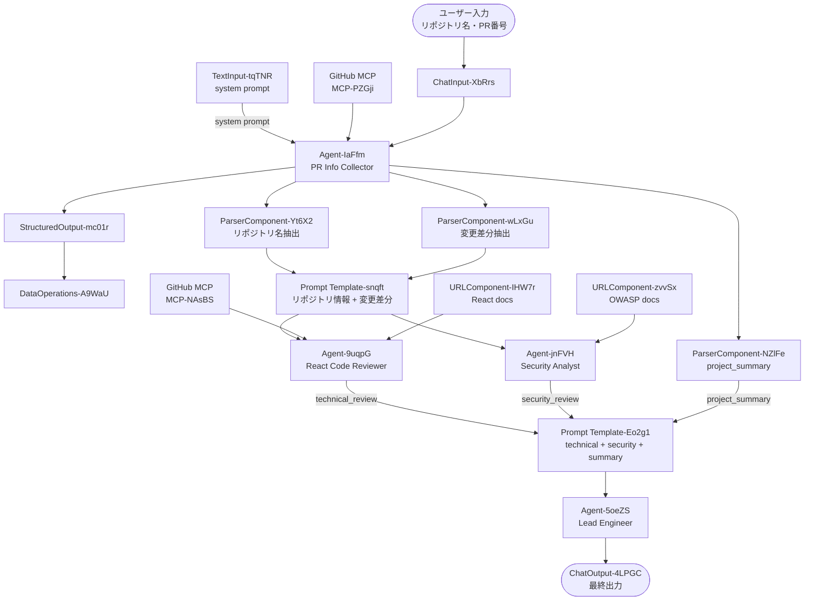

# Review-Agent ワークフロー仕様

LangFlow ワークフロー `Review-Agent.json` から抽出したAgent仕様書です。

---

## 1. システム概要

コードレビューを複数の専門エージェントが協調して実行するマルチエージェントワークフローです。  
技術レビュー・セキュリティレビューを並列実行し、リードエンジニアが最終判断を下す3段階構成をとります。

**ワークフローパターン**: Sequential Multi-Agent with Parallel Review Stage

---

## 2. Agent 一覧

| ID          | 名称                | 役割                                     | 使用モデル          |
| ----------- | ------------------- | ---------------------------------------- | ------------------- |
| Agent-IaFfm | PR Info Collector   | GitHubからPR情報を収集し構造化JSONを生成 | デフォルト          |
| Agent-9uqpG | React Code Reviewer | React/TypeScript 技術レビュー            | gemma4:e4b (Ollama) |
| Agent-jnFVH | Security Analyst    | セキュリティ観点のレビュー               | gemma4:e4b (Ollama) |
| Agent-5oeZS | Lead Engineer       | レビュー結果の評価・修正方針の決定       | gemma4:e4b (Ollama) |

---

## 3. 各 Agent の詳細仕様

### 3.1 Agent-IaFfm — PR Info Collector

**役割**: ユーザーが指定したリポジトリとPR番号をもとに、GitHub MCP を使ってPR情報を収集し、後続エージェントが利用する構造化JSONを生成する。

**System Prompt** (TextInput-tqTNR に設定された内容):

```text
Please generate summary information from GitHub based on the repository and PR number specified by the user,
and output it in a structured JSON format.

The output results will be used in subsequent code reviews by multiple agents,
so please do not include any guesswork.
The information used by subsequent agents includes `repository information` (owner, repository name),
`project summary` (generated based on the README.md file in the repository root),
and `PR information` (PR title, body, labels, file changes).
File changes are limited to TypeScript/JavaScript files, CSS/SCSS files, HTML files, and package.json files.
All changed lines and details must be comprehensively covered for each file.
You must use a tool to retrieve information from GitHub.
```

**出力フォーマット**:

```json
{
    "repository_info": {
        "owner": "owner",
        "repository": "repository"
    },
    "project_summary": "Project Summary",
    "pr_info": {
        "title": "PR Title",
        "pr_number": "PR Number",
        "body": "PR Body",
        "labels": [
            "Label 1",
            "Label 2"
        ],
        "file_changes": [
            {
                "filePath": "src/sample.ts",
                "patch": "@@ -132,7 +132,7 @@ module Test ..."
            }
        ]
    }
}
```

**対象ファイル種別**:

- TypeScript / JavaScript ファイル
- CSS / SCSS ファイル
- HTML ファイル
- `package.json`

**接続ツール**:

- GitHub MCP (MCP-PZGji) — read-only API

**入力元**: ChatInput-XbRrs（ユーザー入力: リポジトリ名・PR番号）  
**出力先**: StructuredOutput-mc01r → DataOperations-A9WaU → 後続エージェントへ

---

### 3.2 Agent-9uqpG — React Code Reviewer

**役割**: シニアフロントエンドエンジニアとして React/TypeScript コードを技術レビューする。

**System Prompt**:

```text
You are a senior front-end engineer. Please conduct a code review as a colleague of the user.
Review the code to ensure it follows React best practices and does not misuse the APIs of other relevant libraries.
To obtain information about the libraries being used, retrieve and parse the `package.json` file from GitHub,
and use Context7 to fetch the documentation.
Since the user will only provide the modified sections, please retrieve the files from GitHub as needed.
The review criteria are component/Hook design, performance, and security.
Please document your feedback in a way that clearly indicates the priority, the context of the issue,
and, if necessary, a proposed fix.

Rules:
[React Best Practices](https://github.com/vercel-labs/agent-skills/blob/main/skills/react-best-practices/AGENTS.md)
[React Composition Pattern](https://github.com/vercel-labs/agent-skills/blob/main/skills/composition-patterns/AGENTS.md)
```

**レビュー観点**:

- コンポーネント / Hook 設計
- パフォーマンス
- セキュリティ

**参照ルール**:

- React Best Practices (vercel-labs/agent-skills)
- React Composition Pattern (vercel-labs/agent-skills)

**接続ツール**:

- GitHub MCP (MCP-NAsBS) — リポジトリファイル取得
- URLComponent-IHW7r — React ドキュメント取得（Markdown形式、最大深度1）
- Context7 — ライブラリドキュメント取得（プロンプト内指示）

**入力元**: Prompt Template-snqft（リポジトリ情報 + 変更差分）  
**出力先**: Prompt Template-Eo2g1 の `technical_review` フィールド

---

### 3.3 Agent-jnFVH — Security Analyst

**役割**: セキュリティアナリストとして、フロントエンドアプリケーションの脆弱性をレビューする。

**System Prompt**:

```text
You are a security analyst. As a colleague of the user, please conduct a code review from a security perspective.
Base your review on attack methods common in front-end applications,
such as those listed in the OWASP Top 10, XSS, and session hijacking.
To gather information about the libraries being used, retrieve and analyze the `package.json` file from GitHub,
and use Context7 to retrieve the documentation.
Since the user will only provide you with the modified sections, please retrieve the files from GitHub as needed.
When reporting issues, include the priority, the context of the issue, and, if necessary, a proposed fix.

Reference:
[OWASP Top 10: 2025](https://owasp.org/Top10/2025/)
```

**レビュー観点**:

- OWASP Top 10 (2025)
- XSS（クロスサイトスクリプティング）
- セッションハイジャック
- フロントエンドアプリケーション固有の攻撃手法

**接続ツール**:

- URLComponent-zvvSx — セキュリティドキュメント取得（Text形式、最大深度1）
- Context7 — ライブラリドキュメント取得（プロンプト内指示）

**入力元**: Prompt Template-snqft（React Code Reviewer と並列）  
**出力先**: Prompt Template-Eo2g1 の `security_review` フィールド

---

### 3.4 Agent-5oeZS — Lead Engineer

**役割**: 技術レビューとセキュリティレビューの結果を評価し、実装すべき修正の優先リストを作成する意思決定者。

**System Prompt**:

```text
You are the Lead Engineer. Please review the feedback provided by the security engineer and senior developers,
carefully consider the validity, severity, and impact on the project of each proposed fix,
and decide whether to implement each one.
Your mission is to create a list of proposed fixes that you have decided to implement.
In this list, please include the target (file name, line number), the specific review comments,
the proposed fix, and the priority.
Your role is limited to evaluating the reported review results and compiling the list.
Under no circumstances should you create review results based on speculation.
```

**出力フォーマット** (各修正エントリに含める内容):

| 項目             | 内容               |
| ---------------- | ------------------ |
| 対象             | ファイル名、行番号 |
| レビューコメント | 具体的な指摘内容   |
| 修正提案         | 具体的な修正方法   |
| 優先度           | 実装優先度         |

**重要な制約**: 推測に基づくレビュー結果の生成は禁止。報告されたレビュー結果の評価・集約のみ担当。

**接続ツール**: なし（純粋な分析・合成ロール）

**入力元**: Prompt Template-Eo2g1（technical_review + security_review + project_summary を集約）  
**出力先**: ChatOutput-4LPGC（ユーザー向け最終出力）

---

## 4. ワークフロー全体図



---

## 5. ツール・外部サービス一覧

### 5.1 GitHub MCP

| インスタンス | 接続先 Agent | エンドポイント                                | 用途                   |
| ------------ | ------------ | --------------------------------------------- | ---------------------- |
| MCP-PZGji    | Agent-IaFfm  | <https://api.githubcopilot.com/mcp/read-only>  | PR情報・ファイル収集   |
| MCP-NAsBS    | Agent-9uqpG  | <https://api.githubcopilot.com/mcp/read-only>  | リポジトリファイル取得 |

**利用可能な主要ツール（40+）**:

- `get_file_contents` — ファイル内容取得
- `create_pull_request` / `merge_pull_request` / `update_pull_request` — PR操作
- `search_code` / `search_issues` / `search_repositories` — 検索
- `issue_read` / `issue_write` — Issue操作
- `create_or_update_file` / `delete_file` — ファイル操作

### 5.2 URL フェッチコンポーネント

| インスタンス       | 接続先 Agent | フォーマット | 用途                            |
| ------------------ | ------------ | ------------ | ------------------------------- |
| URLComponent-IHW7r | Agent-9uqpG  | Markdown     | React ドキュメント取得          |
| URLComponent-zvvSx | Agent-jnFVH  | Text         | OWASP等セキュリティ参考資料取得 |

### 5.3 Context7（プロンプト経由）

Agent-9uqpG・Agent-jnFVH の両方がプロンプト指示でContext7を使用し、使用ライブラリのドキュメントを取得する。

### 5.4 参照外部リソース

| リソース                                | 参照 Agent  | 目的                     |
| --------------------------------------- | ----------- | ------------------------ |
| OWASP Top 10: 2025                      | Agent-jnFVH | セキュリティレビュー基準 |
| React Best Practices (vercel-labs)      | Agent-9uqpG | React レビュー基準       |
| React Composition Pattern (vercel-labs) | Agent-9uqpG | コンポーネント設計基準   |

---

## 6. LLM 設定

全エージェント共通設定（Agent-IaFfm を除く）:

| 設定項目           | 値                 |
| ------------------ | ------------------ |
| プロバイダー       | Ollama（ローカル） |
| モデル             | gemma4:e4b         |
| チャット履歴保持数 | 100 メッセージ     |
| 出力スキーマ       | なし（自由形式）   |
| Verboseログ        | 有効               |

---

## 7. 入力・出力の設計

### 入力

| コンポーネント        | 内容                               |
| --------------------- | ---------------------------------- |
| ChatInput-XbRrs       | ユーザーからのリポジトリ名・PR番号 |
| ParserComponent-Yt6X2 | リポジトリ名（抽出済み）           |
| ParserComponent-wLxGu | 変更箇所（差分、抽出済み）         |
| ParserComponent-NZlFe | プロジェクトサマリー               |

### 出力

| コンポーネント         | 内容                         |
| ---------------------- | ---------------------------- |
| ChatOutput-4LPGC       | ユーザー向け最終レビュー結果 |
| StructuredOutput-mc01r | 構造化JSON形式の出力         |
| DataOperations-A9WaU   | データ変換・エクスポート先   |

---

## 8. アーキテクチャ上の特徴・留意点

### 強み

- **並列レビュー**: 技術レビューとセキュリティレビューが同時実行されるため処理時間を短縮
- **関心の分離**: 各エージェントが明確に異なる専門性を持つ
- **段階的決定**: Lead Engineer が投機的な判断を行わないよう明示的に制約されている
- **推測排除**: PR Info Collector から「guesswork禁止」を明示しており、後続エージェントへの情報品質を保証

### 留意点

- モデルに `gemma4:e4b` (Ollama) を使用しており、ローカル環境でのサービス稼働が前提
- GitHub MCP は read-only エンドポイントを使用（書き込み操作は行わない設計）
- Context7 はプロンプト指示でのみ参照されており、MCP接続ではない点に注意
- PR Info Collector の出力スキーマ（JSON構造）が後続エージェントのプロンプトテンプレートと密結合

---

## 生成情報

生成日: 2026-05-30 / ソースファイル: Review-Agent.json
